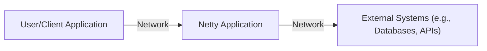
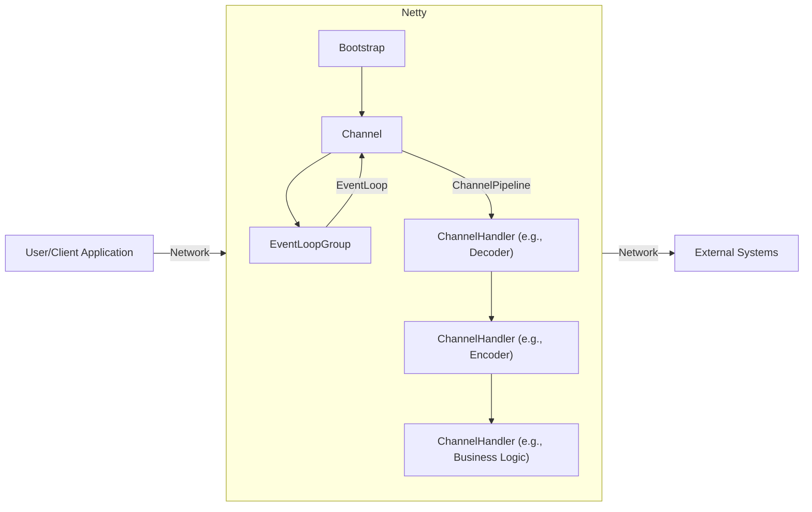
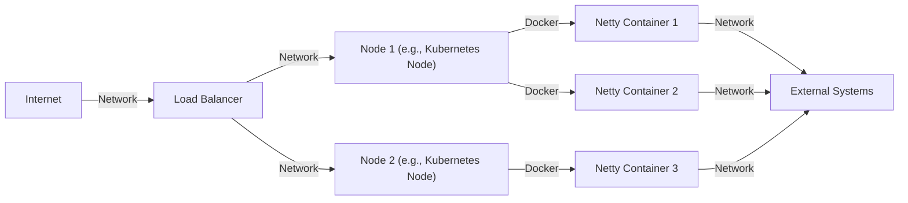

Okay, let's create a design document for the Netty project, keeping in mind its purpose and potential security considerations.

# BUSINESS POSTURE

Netty is a widely-used, asynchronous event-driven network application framework.  It's designed for rapid development of maintainable high-performance protocol servers and clients.  Given its nature, the business priorities revolve around:

*   Performance and Scalability:  Netty's primary value proposition is handling a massive number of concurrent connections with minimal overhead.  Any design decision must prioritize this.
*   Maintainability and Extensibility:  The framework should be easy to understand, modify, and extend with new protocols and features.  A clean, modular design is crucial.
*   Reliability and Stability:  As a foundational network library, Netty must be exceptionally reliable.  Crashes or unexpected behavior can have cascading effects on applications built upon it.
*   Ease of Use:  While powerful, Netty should be relatively easy to use for common networking tasks, abstracting away much of the complexity of low-level network programming.
*   Broad Protocol Support:  Supporting a wide range of protocols (HTTP, WebSockets, TLS/SSL, etc.) and allowing for custom protocol implementations is essential.

Business Risks:

*   Performance Degradation:  Changes that negatively impact performance or scalability could render Netty less competitive.
*   Security Vulnerabilities:  Exploitable vulnerabilities in Netty could compromise any application using it, leading to data breaches, denial-of-service, or other attacks. This is the most significant risk.
*   Complexity and Learning Curve:  If Netty becomes too complex, it may deter adoption and make it harder for developers to use correctly, potentially introducing bugs.
*   Lack of Protocol Support:  Failure to support emerging protocols or adapt to changing network standards could limit Netty's applicability.
*   Community and Ecosystem:  A decline in community engagement or a lack of third-party libraries and tools could weaken Netty's position.

# SECURITY POSTURE

Netty, being a low-level networking library, has a significant responsibility in ensuring the security of applications built upon it.

Existing Security Controls:

*   security control: TLS/SSL Support: Netty provides built-in support for Transport Layer Security (TLS) and Secure Sockets Layer (SSL), enabling encrypted communication. Implemented in `io.netty.handler.ssl`.
*   security control: Codecs for Common Protocols:  Netty includes codecs for various protocols (HTTP, WebSockets, etc.) that handle parsing and serialization, reducing the risk of vulnerabilities related to protocol handling. Implemented in `io.netty.handler.codec`.
*   security control: ByteBuf Management:  Netty's `ByteBuf` system provides efficient buffer management, reducing the risk of buffer overflows and related vulnerabilities. Implemented in `io.netty.buffer`.
*   security control: Event-Driven Architecture:  The non-blocking, event-driven nature of Netty helps mitigate denial-of-service (DoS) attacks by efficiently handling many connections without dedicating a thread to each.
*   security control: Community Scrutiny:  Being a popular open-source project, Netty benefits from scrutiny by a large community of developers, increasing the likelihood of identifying and fixing vulnerabilities.
*   security control: Regular Updates and Patching: The Netty project actively releases updates and patches to address security vulnerabilities and bugs.

Accepted Risks:

*   accepted risk:  Reliance on Underlying Platform Security: Netty relies on the security of the underlying operating system and Java Virtual Machine (JVM).  Vulnerabilities in these components could impact Netty's security.
*   accepted risk:  Potential for Misconfiguration:  While Netty provides secure components, developers can still misconfigure them (e.g., weak ciphers, improper certificate validation), leading to vulnerabilities.
*   accepted risk:  Third-Party Dependencies:  Netty depends on some third-party libraries, which could introduce their own security risks.
*   accepted risk:  Complexity of Network Programming:  Network programming is inherently complex, and even with Netty's abstractions, developers can still introduce security flaws in their application logic.

Recommended Security Controls:

*   security control:  Integration with Static Analysis Tools:  Encourage and facilitate the use of static analysis tools (e.g., FindBugs, SpotBugs, SonarQube) to identify potential vulnerabilities during development.
*   security control:  Fuzz Testing:  Implement regular fuzz testing to identify unexpected behavior and vulnerabilities when handling malformed input.
*   security control:  Dependency Scanning:  Automate dependency scanning to detect and address known vulnerabilities in third-party libraries.
*   security control:  Security Hardening Guide:  Provide a comprehensive security hardening guide for developers, outlining best practices for configuring and using Netty securely.

Security Requirements:

*   Authentication: While Netty itself doesn't handle application-level authentication, it should provide mechanisms (e.g., pipeline handlers) to easily integrate with authentication systems.  It should support secure transport for authentication credentials (e.g., via TLS).
*   Authorization:  Similar to authentication, Netty should facilitate the integration of authorization mechanisms.  It should not inherently restrict access control models.
*   Input Validation:  Netty's codecs should perform robust input validation to prevent common attacks like injection vulnerabilities.  Developers should be encouraged to validate all data received from the network.
*   Cryptography:  Netty should provide strong, up-to-date cryptographic implementations (TLS/SSL) and allow for customization of cipher suites and protocols.  It should adhere to cryptographic best practices.

# DESIGN

## C4 CONTEXT

Element Descriptions:

*   Element:
    *   Name: User/Client Application
    *   Type: External Entity (User or another system)
    *   Description: Represents any entity that interacts with a Netty-based application. This could be a user's web browser, a mobile app, or another server.
    *   Responsibilities: Initiates connections, sends requests, and receives responses.
    *   Security Controls: Relies on the security of the client application and the network connection (e.g., TLS provided by Netty).

*   Element:
    *   Name: Netty Application
    *   Type: Software System
    *   Description: The application built using the Netty framework. This is the core of the diagram.
    *   Responsibilities: Handles network connections, processes requests, interacts with external systems, and sends responses.
    *   Security Controls: TLS/SSL, Codecs, ByteBuf management, event-driven architecture, community scrutiny, regular updates.

*   Element:
    *   Name: External Systems (e.g., Databases, APIs)
    *   Type: External System
    *   Description: Represents any external systems that the Netty application interacts with, such as databases, message queues, or other APIs.
    *   Responsibilities: Varies depending on the specific system.
    *   Security Controls: Relies on the security of the external system and the network connection (e.g., TLS provided by Netty or the external system).

## C4 CONTAINER

Element Descriptions:

*   Element:
    *   Name: Bootstrap
    *   Type: Component
    *   Description:  The starting point for creating Netty clients and servers.  Configures the `EventLoopGroup`, `Channel`, and `ChannelPipeline`.
    *   Responsibilities:  Sets up the Netty application, binds to ports (for servers), and initiates connections (for clients).
    *   Security Controls:  Configuration of TLS/SSL settings, selection of secure protocols and ciphers.

*   Element:
    *   Name: Channel
    *   Type: Component
    *   Description:  Represents a network connection (e.g., a socket).  Provides methods for reading and writing data.
    *   Responsibilities:  Manages the lifecycle of a network connection, handles I/O operations.
    *   Security Controls:  Implementation of TLS/SSL encryption, buffer management (using `ByteBuf`).

*   Element:
    *   Name: EventLoopGroup
    *   Type: Component
    *   Description:  Manages a group of `EventLoop`s, which are responsible for handling I/O events.
    *   Responsibilities:  Distributes I/O events to the appropriate `EventLoop`s.
    *   Security Controls:  Efficient handling of many connections, mitigating DoS attacks.

*   Element:
    *   Name: EventLoop
    *   Type: Component
    *   Description:  A single-threaded event loop that processes I/O events for a set of `Channel`s.
    *   Responsibilities:  Handles all I/O operations for its assigned `Channel`s in a non-blocking manner.
    *   Security Controls:  Non-blocking I/O helps prevent resource exhaustion.

*   Element:
    *   Name: ChannelPipeline
    *   Type: Component
    *   Description:  A chain of `ChannelHandler`s that process inbound and outbound data.
    *   Responsibilities:  Provides a flexible and extensible way to handle network events and data transformations.
    *   Security Controls:  Allows for the implementation of security-related handlers (e.g., TLS/SSL handlers, authentication handlers, input validation handlers).

*   Element:
    *   Name: ChannelHandler (e.g., Decoder)
    *   Type: Component
    *   Description:  A component that handles specific network events or data transformations.  Decoders transform raw byte data into higher-level objects.
    *   Responsibilities:  Parsing and validating inbound data.
    *   Security Controls:  Input validation, protection against malformed data.

*   Element:
    *   Name: ChannelHandler (e.g., Encoder)
    *   Type: Component
    *   Description:  Encoders transform higher-level objects into raw byte data for transmission.
    *   Responsibilities:  Serializing outbound data.
    *   Security Controls:  Ensuring data is properly formatted for transmission.

*   Element:
    *   Name: ChannelHandler (e.g., Business Logic)
    *   Type: Component
    *   Description:  Handles the application-specific logic.
    *   Responsibilities:  Processing requests, interacting with external systems, generating responses.
    *   Security Controls:  Implementation of application-level security logic (e.g., authorization).

## DEPLOYMENT

Netty applications can be deployed in various ways, depending on the specific application and infrastructure. Common deployment models include:

1.  Standalone Application: The Netty application is packaged as an executable JAR and run directly on a server (physical or virtual).
2.  Embedded in a Container: The Netty application is embedded within a larger application or framework (e.g., a Spring Boot application) and deployed as part of that application.
3.  Containerized (Docker): The Netty application is packaged as a Docker container and deployed to a container orchestration platform (e.g., Kubernetes, Docker Swarm).
4.  Serverless (AWS Lambda, Azure Functions, etc.):  While less common for long-lived connections, Netty can be used in serverless environments for short-lived interactions.

We'll describe the Containerized (Docker) deployment model in detail:

Element Descriptions:

*   Element:
    *   Name: Internet
    *   Type: External Entity
    *   Description: The public internet.
    *   Responsibilities: Source of client requests.
    *   Security Controls: Relies on network-level security (e.g., firewalls, DDoS protection).

*   Element:
    *   Name: Load Balancer
    *   Type: Infrastructure
    *   Description: Distributes incoming traffic across multiple instances of the Netty application.
    *   Responsibilities: Health checks, traffic routing.
    *   Security Controls: TLS termination, DDoS protection, Web Application Firewall (WAF).

*   Element:
    *   Name: Node 1 (e.g., Kubernetes Node)
    *   Type: Infrastructure
    *   Description: A physical or virtual machine that hosts Docker containers.
    *   Responsibilities: Running containers.
    *   Security Controls: Operating system security, network security, container isolation.

*   Element:
    *   Name: Node 2 (e.g., Kubernetes Node)
    *   Type: Infrastructure
    *   Description: A physical or virtual machine that hosts Docker containers.
    *   Responsibilities: Running containers.
    *   Security Controls: Operating system security, network security, container isolation.

*   Element:
    *   Name: Netty Container 1
    *   Type: Container
    *   Description: A Docker container running an instance of the Netty application.
    *   Responsibilities: Handling network connections, processing requests.
    *   Security Controls: All security controls within the Netty application itself (TLS/SSL, codecs, etc.), container isolation.

*   Element:
    *   Name: Netty Container 2
    *   Type: Container
    *   Description: A Docker container running an instance of the Netty application.
    *   Responsibilities: Handling network connections, processing requests.
    *   Security Controls: All security controls within the Netty application itself (TLS/SSL, codecs, etc.), container isolation.

*   Element:
    *   Name: Netty Container 3
    *   Type: Container
    *   Description: A Docker container running an instance of the Netty application.
    *   Responsibilities: Handling network connections, processing requests.
    *   Security Controls: All security controls within the Netty application itself (TLS/SSL, codecs, etc.), container isolation.
* Element:
    *   Name: External Systems
    *   Type: External System
    *   Description: External services that application is communicating with.
    *   Responsibilities: Varies depending on the specific system.
    *   Security Controls: Relies on the security of the external system and the network connection (e.g., TLS provided by Netty or the external system).

## BUILD

The Netty build process is automated using Maven. The process involves compiling the code, running tests, and packaging the artifacts. Security is a key consideration throughout the build process.

```mermaid
graph LR
    Developer["Developer"] -- Git --> GitHub["GitHub Repository"]
    GitHub -- Webhook --> BuildServer["Build Server (e.g., Jenkins, GitHub Actions)"]
    BuildServer -- Maven --> Compile["Compile Code"]
    Compile --> Tests["Run Tests (Unit, Integration)"]
    Tests --> SAST["Run SAST (e.g., SpotBugs)"]
    SAST --> SCA["Run SCA (e.g., Dependency-Check)"]
    SCA --> Package["Package Artifacts (JARs)"]
    Package --> ArtifactRepo["Artifact Repository (e.g., Maven Central)"]

```

Security Controls in the Build Process:

*   Source Code Management (GitHub):  Uses Git for version control, providing an audit trail of all code changes.
*   Build Automation (Maven):  Automates the build process, ensuring consistency and reproducibility.
*   Unit and Integration Tests:  Includes a comprehensive suite of tests to verify the correctness of the code.
*   Static Application Security Testing (SAST):  Integrates with static analysis tools (e.g., SpotBugs) to identify potential vulnerabilities in the code.
*   Software Composition Analysis (SCA): Uses dependency scanning tools (e.g., OWASP Dependency-Check) to identify known vulnerabilities in third-party libraries.
*   Artifact Repository (Maven Central):  Publishes artifacts to a trusted repository, ensuring the integrity of the released code.
*   Continuous Integration (GitHub Actions/Jenkins): Build process is automated using CI tools.

# RISK ASSESSMENT

*   Critical Business Process: The critical business process is providing a reliable and high-performance networking framework for building network applications. This includes handling a large number of concurrent connections, processing data efficiently, and supporting various network protocols.
*   Data Sensitivity:
    *   Network Traffic: The primary data Netty handles is network traffic, which can range from highly sensitive (e.g., financial transactions, personal data) to non-sensitive (e.g., public data). The sensitivity depends entirely on the application using Netty. Netty itself must treat all data as potentially sensitive and provide mechanisms for secure handling.
    *   Configuration Data: Netty configuration data (e.g., cipher suites, port numbers) is generally not sensitive, but incorrect configuration can lead to security vulnerabilities.
    *   Internal Buffers: Netty's internal buffers (`ByteBuf`) temporarily store data in memory.  While not directly exposed, vulnerabilities in buffer management could lead to data leaks or corruption.

# QUESTIONS & ASSUMPTIONS

*   Questions:
    *   What specific compliance requirements (e.g., PCI DSS, HIPAA) must applications built with Netty adhere to? This will influence the necessary security controls and configurations.
    *   What is the expected threat model for typical Netty applications?  Understanding the likely attackers and their motivations will help prioritize security efforts.
    *   What level of security expertise is assumed for developers using Netty? This will impact the design of the API and the documentation.
    *   Are there any specific performance requirements or limitations that need to be considered?
    *   What are the plans for supporting emerging network protocols and technologies?

*   Assumptions:
    *   Developers using Netty have a basic understanding of network security principles.
    *   The underlying operating system and JVM are properly secured.
    *   The Netty project will continue to actively address security vulnerabilities.
    *   Applications built with Netty will implement appropriate application-level security controls.
    *   The primary use case for Netty is building server-side applications, although it can also be used for clients.
    *   Deployment environments will have basic network security measures in place (e.g., firewalls).