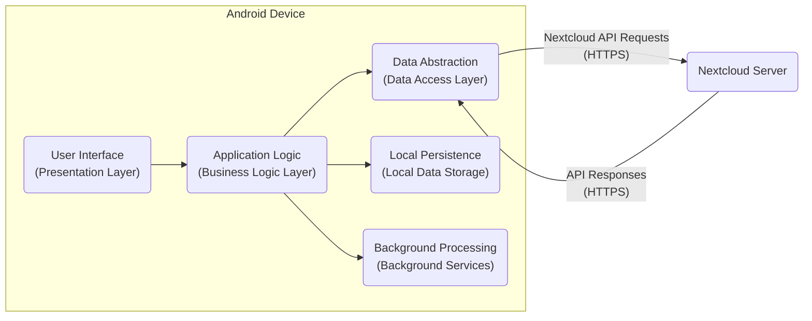
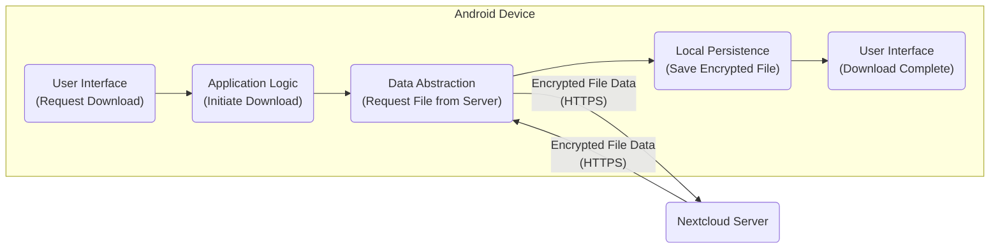
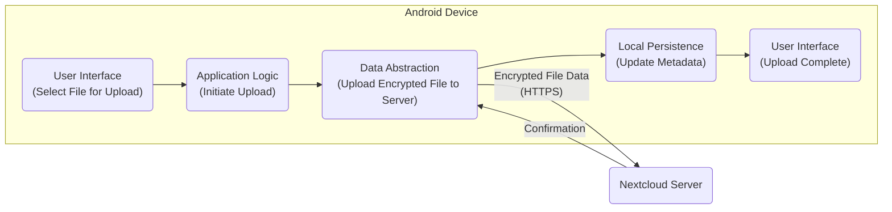
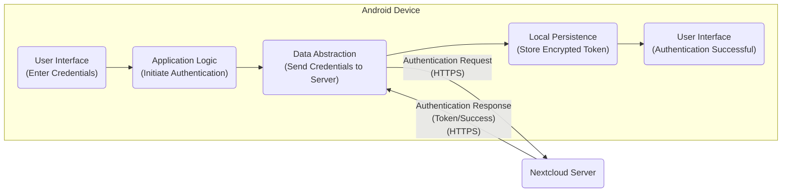
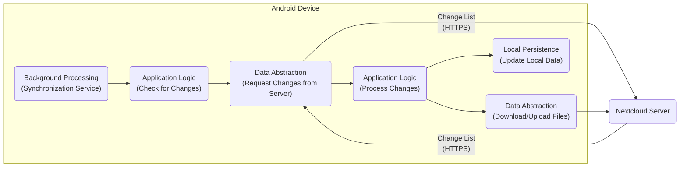

# Project Design Document: Nextcloud Android Application

**Version:** 1.1
**Date:** October 26, 2023
**Author:** AI Software Architect

## 1. Project Overview

This document details the design of the Nextcloud Android application, a mobile client enabling users to interact with their self-hosted Nextcloud platform. The application provides access to core Nextcloud functionalities such as file storage, synchronization, and sharing, directly from Android devices. This design document serves as a blueprint for understanding the application's architecture and is specifically intended to facilitate subsequent threat modeling activities.

## 2. Goals

* Provide a secure and intuitive interface for users to access and manage their Nextcloud files and data on Android devices.
* Implement robust automatic synchronization of files and folders between the Android device and the designated Nextcloud server.
* Enable seamless uploading of files and folders from the Android device to the user's Nextcloud instance.
* Facilitate secure sharing of files and folders directly from the Android application, respecting server-side sharing permissions.
* Offer access to other integrated Nextcloud applications and features (e.g., Calendar, Contacts) where applicable through dedicated interfaces or web views.
* Maintain a strong security posture to protect user data confidentiality, integrity, and availability.

## 3. Non-Goals

* The design of the Nextcloud server infrastructure, its APIs, and its security mechanisms are explicitly outside the scope of this document.
* Detailed implementation specifics of individual features, such as the exact algorithms used for synchronization, are not included.
* The internal design and security of third-party libraries integrated within the application are not covered in detail.
* Performance benchmarking data and optimization strategies are not within the scope of this document.

## 4. Target Audience

This document is primarily intended for:

* Security engineers and architects responsible for conducting threat modeling and security assessments of the Nextcloud Android application.
* Software developers involved in the development, maintenance, and enhancement of the Nextcloud Android application.
* DevOps engineers responsible for the deployment, configuration, and monitoring of the application and related infrastructure.
* Product owners and stakeholders who require a comprehensive understanding of the application's architecture from a design and security perspective.

## 5. Architectural Overview

The Nextcloud Android application adheres to a client-server architecture. The Android application functions as the client, initiating communication with a designated Nextcloud server instance. The application's core components can be broadly categorized as follows, emphasizing their roles in data handling and security:

* **Presentation Layer (User Interface):** Responsible for rendering information to the user and capturing user interactions. This layer must be designed to prevent UI-based attacks (e.g., tapjacking).
* **Application Logic Layer (Business Logic):** Contains the core application logic, including synchronization management, data processing, and interaction orchestration with the data access layer. This layer enforces business rules and security policies.
* **Data Abstraction Layer (Data Access Layer):** Manages communication with the Nextcloud server via its APIs, abstracting away the underlying network protocols and data formats. This layer is crucial for implementing secure communication practices.
* **Local Persistence Layer (Local Data Storage):** Handles the storage of data locally on the Android device, including cached files and application settings. Secure storage mechanisms are paramount in this layer.
* **Background Processing Layer (Background Services):** Executes tasks in the background, such as periodic synchronization and handling push notifications. These services require careful management of permissions and data access.

## 6. Component Details

This section provides a more granular description of the key components within the Android application, highlighting their functionalities and security considerations.

* **Presentation Layer (User Interface):**
    * **Activities and Fragments:** Manage the lifecycle and presentation logic of different screens (e.g., file browser, settings, upload screen). Security considerations include preventing information leakage through activity transitions and ensuring proper input sanitization.
    * **View Models:** Hold and manage UI-related data, decoupling the UI from the business logic. This helps in maintaining a clear separation of concerns and improves testability.
    * **Adapters:** Bridge the gap between data sources and UI elements (e.g., displaying lists of files). Security considerations involve preventing injection of malicious data into UI elements.
    * **Custom Views and UI Components:** Provide specialized functionalities and visual elements. These components should be carefully reviewed for potential vulnerabilities.

* **Application Logic Layer (Business Logic):**
    * **Account Management:** Handles user authentication, session management, and secure storage of authentication tokens. This component is critical for overall security.
    * **Synchronization Engine:** Manages the complex process of synchronizing files and folders, including conflict resolution, change tracking, and background synchronization scheduling. Security considerations include ensuring data integrity during sync and preventing unauthorized data modification.
    * **File Management:** Implements operations related to files and folders (e.g., upload, download, delete, rename, share). This component must enforce access controls and prevent unauthorized file access.
    * **Download and Upload Managers:** Handle the efficient and reliable transfer of files, including handling interruptions and retries. Security considerations involve verifying the integrity of downloaded files and preventing malicious uploads.
    * **Content Providers:** Allow controlled sharing of application data with other applications. Security considerations include carefully defining permissions and preventing unauthorized data access.
    * **Notification Manager:** Handles the display of notifications to the user (e.g., sync status, new shares). Security considerations involve preventing the leakage of sensitive information through notifications.
    * **Sharing Logic:** Manages the creation and handling of shares, respecting server-side permissions and ensuring secure sharing links.

* **Data Abstraction Layer (Data Access Layer):**
    * **HTTP Client:** Responsible for making secure network requests to the Nextcloud server, typically using HTTPS. Configuration of the HTTP client (e.g., TLS settings, certificate pinning) is crucial for security.
    * **API Wrappers:** Provide an abstraction layer over the Nextcloud server APIs, simplifying communication and handling API-specific details. This layer should implement error handling and security checks.
    * **Authentication Handlers:** Manage the authentication flow with the Nextcloud server, including handling OAuth 2.0 flows or other authentication mechanisms. Secure storage and handling of authentication credentials are paramount.
    * **Error Handling and Logging:** Manages and logs errors encountered during API communication. Logging should be done securely, avoiding the logging of sensitive information.

* **Local Persistence Layer (Local Data Storage):**
    * **SQLite Database:** Used to store metadata about synchronized files, account information, application settings, and potentially encrypted file metadata. Proper encryption of the database is essential.
    * **File System Cache:** Stores downloaded files and temporary data. This data should be encrypted at rest and access should be restricted.
    * **Preferences:** Stores user preferences and application settings. Sensitive settings should be protected.
    * **Key Management:**  Handles the secure generation, storage, and retrieval of encryption keys, potentially leveraging the Android Keystore system.

* **Background Processing Layer (Background Services):**
    * **Synchronization Service:** Runs periodically in the background to synchronize data with the Nextcloud server. This service requires appropriate permissions and secure handling of data.
    * **Notification Listener Service:** Listens for push notifications from the Nextcloud server (if enabled). Security considerations involve verifying the source and integrity of push notifications.
    * **Account Sync Service:** Manages background account synchronization tasks. This service needs to handle credentials securely.

## 7. Data Flow Diagrams

This section illustrates the flow of data during key operations within the application, highlighting potential security touchpoints.

### 7.1. File Download

### 7.2. File Upload

### 7.3. User Authentication

### 7.4. Background Synchronization

## 8. Security Considerations

This section details key security considerations for the Nextcloud Android application, providing a basis for threat modeling.

* **Authentication and Authorization:**
    * Secure storage of user credentials or authentication tokens using the Android Keystore or similar secure storage mechanisms.
    * Mandatory use of HTTPS for all communication with the Nextcloud server, enforcing TLS 1.2 or higher.
    * Implementation of robust session management with appropriate timeouts and invalidation mechanisms.
    * Protection against brute-force attacks on login attempts, potentially through rate limiting.
* **Data Storage:**
    * Encryption of sensitive data at rest, including the SQLite database and downloaded files, using strong encryption algorithms (e.g., AES-256).
    * Secure handling of encryption keys, leveraging hardware-backed keystores where available.
    * Prevention of unauthorized access to local data through proper file system permissions.
    * Secure deletion of temporary files and cached data.
* **Data Transmission:**
    * Strict enforcement of HTTPS for all communication to protect data in transit from eavesdropping and tampering.
    * Implementation of certificate pinning to prevent man-in-the-middle attacks by verifying the server's SSL certificate.
* **Input Validation:**
    * Thorough validation of all user inputs to prevent injection attacks (e.g., SQL injection, cross-site scripting if using web views).
    * Sanitization of data received from the Nextcloud server to prevent vulnerabilities within the application.
* **Permissions:**
    * Requesting only the necessary Android permissions required for the application's functionality.
    * Clearly explaining the purpose of each requested permission to the user.
    * Minimizing the use of sensitive permissions.
* **Code Security:**
    * Regular security audits and code reviews to identify and address potential vulnerabilities.
    * Adherence to secure coding practices to prevent common vulnerabilities (e.g., buffer overflows, insecure randomness).
    * Implementation of measures to protect against reverse engineering and tampering (e.g., obfuscation, root detection).
* **Third-Party Libraries:**
    * Careful selection and vetting of third-party libraries, considering their security posture and update frequency.
    * Keeping third-party libraries up-to-date to patch known vulnerabilities.
    * Implementing Software Composition Analysis (SCA) to monitor for vulnerabilities in dependencies.
* **Push Notifications:**
    * Secure handling of push notification data, ensuring that sensitive information is not exposed.
    * Verification of the source of push notifications to prevent malicious notifications.
* **Deep Links and Intents:**
    * Secure handling of deep links and intents to prevent malicious applications from triggering unintended actions or accessing sensitive data.
    * Proper validation of data received through intents.
* **Memory Management:**
    * Secure handling of sensitive data in memory to prevent information leakage through memory dumps or other attacks.

## 9. Technologies Used

* **Programming Language:** Kotlin
* **Android SDK Version:** (Specify the target and minimum SDK versions)
* **Networking Library:** Retrofit, OkHttp (Specify versions if critical for security analysis)
* **Database:** SQLite (via Room Persistence Library)
* **Dependency Injection:** Dagger/Hilt (Specify version if relevant for security)
* **Background Task Management:** WorkManager
* **UI Framework:** Android Jetpack Compose and/or traditional Android Views
* **Authentication Protocols:** OAuth 2.0, Basic Authentication
* **Communication Protocols:** HTTPS
* **Push Notifications:** Firebase Cloud Messaging (FCM)
* **Encryption Libraries:** (Specify any specific encryption libraries used, e.g., Tink)

## 10. Deployment Considerations

* **Distribution Channels:** Google Play Store, F-Droid, direct APK download. Security considerations vary depending on the distribution channel.
* **Signing Key Management:** Secure storage and management of the application signing key is crucial to prevent unauthorized updates.
* **Update Mechanism:** Utilizing the platform's update mechanisms for timely delivery of security patches.
* **Compatibility:** Ensuring compatibility with supported Android versions and devices, while also considering the security implications of supporting older, potentially vulnerable Android versions.

## 11. Future Considerations

* **Enhanced Offline Capabilities:** Further improving the ability to work with files offline securely, including more granular control over offline access.
* **Integration with Android Security Features:** Leveraging more advanced Android security features, such as biometric authentication for app access.
* **Improved Key Management:** Exploring more robust key management strategies.
* **Regular Penetration Testing:** Conducting regular penetration testing to identify and address potential vulnerabilities.

This document provides a detailed design overview of the Nextcloud Android application, emphasizing architectural components and security considerations. It serves as a foundational resource for conducting thorough threat modeling and security assessments.