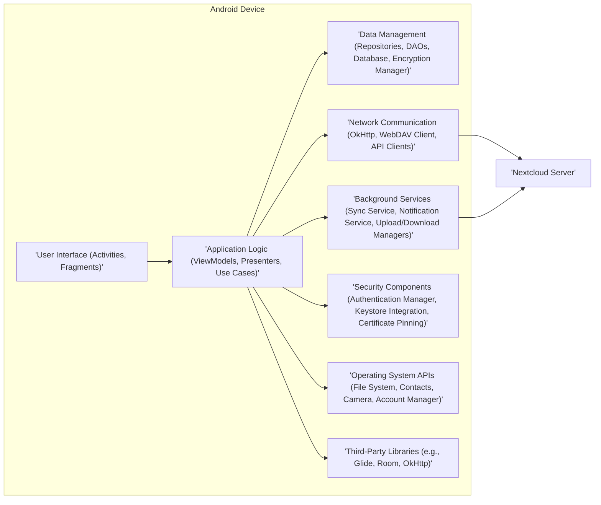
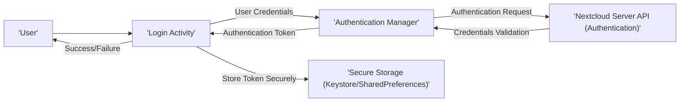
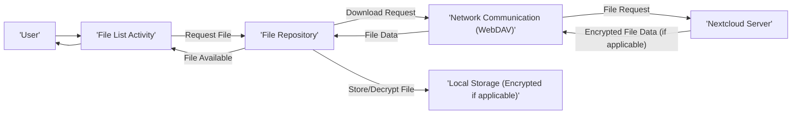
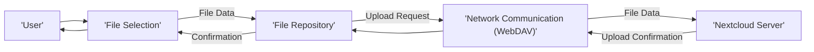
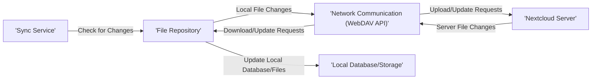

# Project Design Document: Nextcloud Android Application

**Version:** 1.1
**Date:** October 26, 2023
**Author:** AI Software Architect

## 1. Introduction

This document provides a detailed architectural overview of the Nextcloud Android application. Its primary purpose is to serve as a foundation for threat modeling activities, enabling the identification of potential security vulnerabilities and risks. This document outlines key components, data flows, and security considerations relevant to the application's design.

## 2. Goals and Objectives

* To provide a clear and comprehensive architectural description of the Nextcloud Android application, specifically for security analysis.
* To identify and describe the key components, their functionalities, and interactions, focusing on elements relevant to security.
* To illustrate the flow of data within the application and between the application and the Nextcloud server, highlighting sensitive data paths.
* To explicitly outline security-relevant design choices and mechanisms implemented within the application.
* To serve as a definitive reference point for subsequent threat modeling sessions and security assessments.

## 3. Scope

This document encompasses the design of the Nextcloud Android application and its interactions with a remote Nextcloud server instance from a security perspective. It includes:

* The application's user interface components involved in authentication and data access.
* Local data storage mechanisms and their security implementations.
* Network communication protocols and their security configurations.
* Authentication and authorization processes within the application.
* Background processes that handle sensitive data or interact with the server.
* Integration points with the Android operating system and external services that have security implications.
* Key third-party libraries and SDKs that handle sensitive data or perform security-related functions.

This document explicitly excludes:

* The internal design and implementation details of the Nextcloud server.
* Line-by-line code analysis or specific implementation details of individual classes.
* Detailed UI/UX specifications that do not directly impact security.

## 4. High-Level Architecture

The Nextcloud Android application employs a layered architecture to interact with a remote Nextcloud server. The following diagram illustrates the main components and their relationships:

## 5. Component Details

This section provides a detailed description of the key components, highlighting their functionalities and security relevance.

### 5.1 User Interface Layer

* **Activities:**  Represent distinct user workflows, such as logging in, browsing files, viewing settings, and managing shares. These are the primary entry points for user interaction and require careful handling of user input and sensitive data display.
* **Fragments:** Reusable UI components within Activities, responsible for displaying and interacting with specific data sets. Security considerations include preventing data leaks between fragments and ensuring proper data sanitization.
* **Adapters:** Manage the presentation of data in lists and grids. Security concerns involve preventing the display of unauthorized data and handling user interactions securely.
* **Custom Views:** Specialized UI elements that may handle sensitive data or user interactions. These require careful design to prevent vulnerabilities.

### 5.2 Application Logic Layer

* **ViewModels/Presenters:** Handle UI-related logic, data preparation, and communication between the UI and data layers. They play a crucial role in ensuring data displayed to the user is correctly fetched and secured.
* **Use Cases/Interactors:** Encapsulate specific business logic and user interactions, such as file upload, download, sharing, and synchronization. These components often handle sensitive data and require robust security measures.
* **Managers:** Coordinate the operations of different components, for example, a `SyncManager` managing the synchronization process. Security considerations involve ensuring these managers operate with appropriate privileges and handle errors securely.

### 5.3 Data Management Layer

* **Repositories:** Provide an abstraction layer for accessing data from various sources (local database, network). They enforce data access policies and can implement caching mechanisms.
* **Data Access Objects (DAOs):** Interface with the local SQLite database (likely using Room). Security considerations include preventing SQL injection vulnerabilities and ensuring data integrity.
* **Local Database:** Stores application data, including file metadata, account information, settings, and potentially encrypted file content. Secure storage and encryption are paramount.
* **Encryption Manager:** Responsible for encrypting and decrypting sensitive data stored locally, leveraging the Android Keystore for secure key management. This component is critical for protecting data at rest. It likely uses algorithms like AES.
* **Content Providers:** May be used to share data with other applications. Security implications involve carefully controlling access permissions and preventing unauthorized data access.

### 5.4 Network Communication Layer

* **OkHttp:**  The primary HTTP client library for making secure network requests to the Nextcloud server over HTTPS. Proper configuration of TLS/SSL is crucial.
* **WebDAV Client:** Implements the WebDAV protocol for file access and manipulation. Security considerations include secure handling of WebDAV credentials and preventing vulnerabilities in the WebDAV implementation.
* **API Clients:** Specific classes or interfaces for interacting with various Nextcloud server APIs (e.g., Files API, Sharing API, Notifications API). These clients must enforce proper authentication and authorization for API calls.
* **SSL/TLS:** Ensures secure communication over HTTPS, protecting data in transit. Certificate pinning may be implemented to prevent man-in-the-middle attacks.

### 5.5 Background Services

* **Sync Service:** Manages the synchronization of files and folders between the device and the server. This involves handling sensitive data transfers and potential conflict resolution, requiring secure and reliable implementation.
* **Notification Service:** Handles push notifications from the Nextcloud server. Security considerations include verifying the source of notifications and preventing malicious notifications.
* **Background Upload/Download Managers:** Manage long-running file transfers. Security involves ensuring the integrity of transferred files and handling interruptions securely.
* **Account Sync Adapter:** Integrates with the Android Account Manager for managing Nextcloud accounts. Secure storage and management of account credentials are vital.

### 5.6 Security Components

* **Authentication Manager:** Handles user authentication with the Nextcloud server, potentially supporting various methods like username/password, OAuth 2.0, or app passwords. Secure credential handling and protection against brute-force attacks are key.
* **Keystore Integration:** Leverages the Android Keystore system to securely store cryptographic keys used for encryption and authentication. This prevents unauthorized access to sensitive keys.
* **Certificate Pinning:** Enforces that the application only trusts specific certificates for the Nextcloud server, mitigating the risk of man-in-the-middle attacks.
* **Secure Credential Storage:** Implements secure methods for storing user credentials, avoiding storing them in plain text.

### 5.7 Operating System APIs

* **File System Access:** Used for accessing and managing files on the device's storage. Proper permission handling is crucial to prevent unauthorized access.
* **Contacts API:** Used for sharing files with contacts. Security considerations involve ensuring users only share with intended recipients.
* **Camera API:** Used for uploading photos and videos. Secure handling of captured media is important.
* **Location Services:** May be used for features like geotagging. User privacy and secure handling of location data are essential.
* **Notification APIs:** Used for displaying system notifications. Security considerations involve preventing malicious notifications.
* **Account Manager:** Used for managing user accounts. Secure integration and handling of account credentials are important.

### 5.8 Third-Party Libraries

* **Glide/Picasso:** For image loading and caching. Security considerations involve preventing the loading of malicious images and ensuring proper caching mechanisms.
* **Room Persistence Library:** For database management. Security considerations involve preventing SQL injection vulnerabilities.
* **OkHttp/Retrofit:** For network communication. Security considerations involve ensuring proper TLS/SSL configuration and handling of network errors.
* **[Other Libraries as identified in the project]:** Each library should be evaluated for potential security vulnerabilities and kept up-to-date.

## 6. Data Flow Diagrams

This section illustrates the flow of data for key functionalities, highlighting potential security touchpoints.

### 6.1 User Login

### 6.2 File Download

### 6.3 File Upload

### 6.4 Synchronization

## 7. Security Considerations

This section outlines key security considerations embedded in the application's design.

* **Secure Communication (TLS/SSL):** All communication with the Nextcloud server MUST be conducted over HTTPS to ensure confidentiality and integrity of data in transit. Certificate pinning is recommended to prevent MITM attacks.
* **Authentication and Authorization:** Robust authentication mechanisms (e.g., OAuth 2.0) should be used to verify user identity. Access to server resources must be based on proper authorization checks.
* **Data Encryption at Rest:** Sensitive data stored locally, including file contents and metadata, MUST be encrypted using strong encryption algorithms (e.g., AES) and securely managed keys via the Android Keystore.
* **Input Validation and Sanitization:** All user inputs, including file names and metadata, must be thoroughly validated and sanitized to prevent injection attacks (e.g., cross-site scripting, SQL injection).
* **Secure Credential Storage:** User credentials (passwords, tokens) MUST NOT be stored in plain text. Utilize secure storage mechanisms provided by the Android OS (e.g., Keystore, Credential Manager).
* **Permissions Management:** The application should request only the necessary permissions required for its functionality, following the principle of least privilege. Users should be clearly informed about the purpose of each permission.
* **Protection Against Reverse Engineering:** Employ code obfuscation techniques to make it more difficult for attackers to reverse engineer the application and understand its logic.
* **Regular Security Audits and Penetration Testing:** Periodic security assessments should be conducted to identify and address potential vulnerabilities.
* **Third-Party Library Security:** Regularly update and monitor third-party libraries for known vulnerabilities. Implement Software Composition Analysis (SCA) to manage dependencies.
* **Secure Sharing Mechanisms:** When sharing files, ensure appropriate permissions and access controls are enforced on the server and reflected in the application.
* **Protection Against Data Leaks:** Implement measures to prevent unintentional data leaks, such as secure handling of clipboard data and preventing sensitive information from being logged unnecessarily.
* **Handling of Personally Identifiable Information (PII):**  Ensure compliance with privacy regulations when handling PII. Minimize the collection and storage of PII, and implement appropriate security measures to protect it.

## 8. Assumptions and Constraints

* The Nextcloud server is assumed to be a trusted and securely configured entity.
* Users are expected to have valid and secure Nextcloud accounts.
* The underlying Android operating system provides a baseline level of security.
* Users are responsible for maintaining the security of their Android devices.
* Network connectivity is required for most of the application's core functionalities.

## 9. Future Considerations

* **End-to-End Encryption (E2EE):** Implementing E2EE would significantly enhance data security by ensuring that only the sender and receiver can decrypt the content.
* **Hardware Security Module (HSM) Integration:** For enhanced key management and protection.
* **Improved Two-Factor Authentication (2FA) Support:** Offering a wider range of 2FA options.
* **Vulnerability Scanning Integration:** Incorporating automated vulnerability scanning tools into the development pipeline.
* **Enhanced Monitoring and Logging:** Implementing more comprehensive logging and monitoring of security-related events within the application.

This document serves as a comprehensive security-focused design overview of the Nextcloud Android application, providing a solid foundation for effective threat modeling and security analysis. By understanding the application's architecture, data flows, and security mechanisms, potential vulnerabilities can be proactively identified and mitigated.