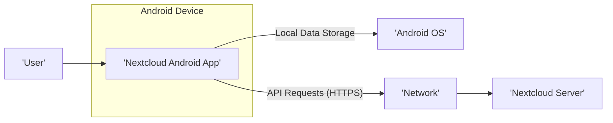
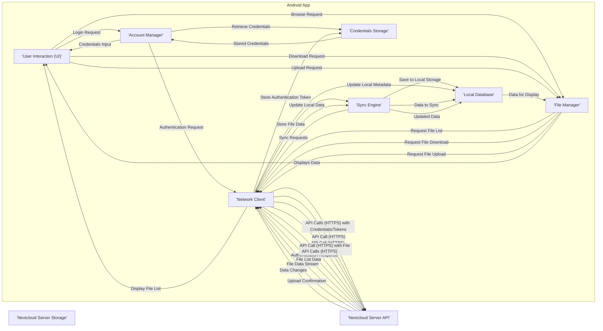

## Project Design Document: Nextcloud Android Application

**Version:** 1.1
**Date:** October 26, 2023
**Author:** AI Software Architect

### 1. Introduction

This document provides an enhanced design overview of the Nextcloud Android application, as found in the GitHub repository [https://github.com/nextcloud/android](https://github.com/nextcloud/android). This revised document aims to provide a more detailed and precise understanding of the application's architecture, components, and data flow, specifically tailored for subsequent threat modeling activities. The enhancements focus on clarifying component interactions and highlighting potential security-relevant aspects.

### 2. Project Overview

The Nextcloud Android application is the official mobile client for the Nextcloud platform. It empowers users to securely access, manage, and synchronize their files, contacts, calendars, and other data hosted on a Nextcloud server directly from their Android devices. The application offers a user-centric interface for interacting with the Nextcloud ecosystem, facilitating a smooth and integrated experience between mobile devices and the Nextcloud server.

### 3. Goals and Objectives

*   Provide users with secure and convenient mobile access to their comprehensive Nextcloud data.
*   Enable robust and reliable synchronization of files and diverse data types between the Android device and the designated Nextcloud server.
*   Offer a secure and dependable mechanism for managing Nextcloud data effectively on mobile devices, safeguarding user information.
*   Support a wide array of Nextcloud features, encompassing file management, automated photo and video uploads, and collaborative functionalities.
*   Maintain broad compatibility with various versions of the Nextcloud server to ensure consistent functionality across different deployments.

### 4. Target Audience

*   Individual users who rely on Nextcloud as their personal cloud storage and data management solution.
*   Organizations of varying sizes that leverage Nextcloud for secure file sharing, collaborative workflows, and data centralization among their teams.
*   Users who necessitate on-the-go mobile access to their Nextcloud data, ensuring productivity and accessibility regardless of location.

### 5. High-Level Architecture

The Nextcloud Android application adheres to a classic client-server architecture. The Android application functions as the client, initiating communication and interacting with a designated Nextcloud server instance.

*   **'Nextcloud Android App'**: The application installed on the user's Android device. It manages user interaction, data presentation, and secure communication with the Nextcloud server.
*   **'Nextcloud Server'**: The backend server hosting the Nextcloud instance. It is responsible for secure storage and management of user data, robust authentication processes, and processing API requests originating from clients.
*   **'User'**: The individual directly interacting with the Android application to access and manage their Nextcloud data.
*   **'Android OS'**: The operating system environment on the user's device, providing the necessary resources and APIs for the application to execute and access device functionalities.
*   **'Network'**: The communication channel (e.g., Wi-Fi, mobile data network) facilitating secure data exchange between the Android app and the Nextcloud server.

### 6. Component Design

This section provides a more detailed breakdown of the key components within the Nextcloud Android application, emphasizing their roles and potential security implications.

*   **User Interface (UI) Components:**
    *   Activities: Represent distinct screens or functional areas within the app, such as the file browsing interface, settings panel, or login screen.
    *   Fragments: Reusable and modular UI components embedded within activities, like the file grid view, navigation drawer, or individual file viewers.
    *   Adapters: Manage the efficient display of dynamic data collections (e.g., file lists, contact lists) within UI elements like RecyclerViews or ListViews.
    *   Custom Views: Specialized UI elements tailored for specific functionalities or data presentation needs within the application.

*   **Account Management:**
    *   AccountAuthenticator: Manages the secure process of adding, authenticating, and managing Nextcloud accounts on the Android device, leveraging the Android AccountManager framework.
    *   Credentials Storage: Securely stores sensitive user credentials (e.g., username, password, OAuth tokens, refresh tokens) using Android's secure storage mechanisms, potentially including the Keystore system for enhanced protection.
    *   Server Configuration: Allows users to input and securely store the URL of their specific Nextcloud server instance, enabling connection to the correct backend.

*   **File Management:**
    *   File List View: Presents a navigable view of files and folders residing on the Nextcloud server, allowing users to browse their remote data.
    *   File Download Manager: Handles the asynchronous downloading of files from the Nextcloud server to the device's local storage, managing download progress and potential interruptions.
    *   File Upload Manager: Manages the asynchronous uploading of files from the device's local storage to the Nextcloud server, handling upload progress and potential network issues.
    *   File Operations: Implements core file manipulation actions such as creating new folders, renaming existing files or folders, moving items between directories, and deleting files or folders.
    *   Offline Access: Manages a local cache of frequently accessed or explicitly marked files, enabling users to access these files even without an active network connection.

*   **Synchronization Engine:**
    *   Sync Adapters: Android framework components responsible for orchestrating background data synchronization between the local device and the Nextcloud server, ensuring data consistency.
    *   Conflict Resolution: Implements logic to detect and resolve conflicts that arise when both local and server versions of a file have been modified since the last synchronization.
    *   Background Sync Service: A persistent service running in the background to periodically initiate and manage data synchronization processes, ensuring up-to-date data.
    *   Instant Upload: Functionality to automatically upload newly captured photos and videos from the device to a designated folder on the Nextcloud server, often triggered by file system events.

*   **Camera Upload:**
    *   Background Service: Continuously monitors the device's media storage for newly added photos and videos, triggering the upload process.
    *   Upload Queue: Manages a queue of files awaiting upload, handling retries and prioritization based on network conditions and user preferences.
    *   Settings: Provides users with options to configure the destination folder for uploaded media, upload quality settings, and whether to upload only over Wi-Fi.

*   **Notifications:**
    *   Push Notifications: Receives real-time notifications from the Nextcloud server (e.g., file shares, comments, mentions) via a push notification service (e.g., Firebase Cloud Messaging).
    *   Local Notifications: Displays notifications within the Android system's notification shade to inform users of events or updates related to their Nextcloud account.

*   **Settings and Preferences:**
    *   Application Settings: Allows users to customize various aspects of the app's behavior, such as the user interface theme, preferred language, and default storage locations.
    *   Account Settings: Provides specific configuration options for each configured Nextcloud account, including sync frequency, enabled features, and storage quotas.

*   **Background Services:**
    *   Synchronization Service: Dedicated service responsible for executing the core data synchronization logic.
    *   Upload Service: Handles the background processing of file uploads to the Nextcloud server.
    *   Notification Listener: Continuously listens for and processes incoming push notifications from the Nextcloud server.

*   **Local Database:**
    *   SQLite Database: Used for persistent storage of local application data, including file metadata (names, paths, timestamps), account information, synchronization status, and potentially cached data.
    *   Data Access Objects (DAOs): Provide an abstraction layer for interacting with the local SQLite database, simplifying data access and manipulation.

*   **Cryptographic Modules:**
    *   Encryption Libraries: Utilizes cryptographic libraries (e.g., Android Keystore, standard Java cryptography APIs) for encrypting sensitive data at rest (if server-side encryption is enabled and potentially for local caching) and ensuring secure communication with the server via HTTPS/TLS.
    *   Key Management: Implements mechanisms for securely generating, storing, and accessing cryptographic keys used for encryption and decryption operations.

*   **Network Communication:**
    *   HTTP Client: Employs a robust HTTP client library (e.g., OkHttp, Retrofit) to make secure API requests to the Nextcloud server over HTTPS.
    *   WebDAV Client: Potentially utilizes a WebDAV client library for direct file transfer operations, adhering to the WebDAV protocol.
    *   WebSockets (potentially): May incorporate WebSocket communication for real-time features, such as collaborative editing or instant notifications.

*   **Third-Party Libraries:**
    *   Includes various external libraries for UI enhancements, networking functionalities, image loading and caching, background task management, and other utilities.

### 7. Data Flow

This section provides a more granular description of the typical flow of data within the application, highlighting sensitive data paths.

*   **User Login:**
    *   The 'User' enters their server URL, username, and password in the 'User Interaction (UI)'.
    *   The 'Account Manager' receives the login request.
    *   The 'Account Manager' may retrieve existing credentials from 'Credentials Storage'.
    *   The 'Account Manager' uses the provided credentials to initiate an authentication request via the 'Network Client'.
    *   The 'Network Client' sends an HTTPS request containing the credentials to the 'Nextcloud Server API'.
    *   The 'Nextcloud Server API' authenticates the user and returns an authentication token.
    *   The 'Network Client' receives the token and the 'Account Manager' securely stores it in 'Credentials Storage'.

*   **File Browsing:**
    *   The 'User' navigates through folders in the 'User Interaction (UI)'.
    *   The 'File Manager' receives the browse request.
    *   The 'File Manager' requests the file list from the 'Network Client'.
    *   The 'Network Client' makes an authenticated API call (HTTPS) to the 'Nextcloud Server API'.
    *   The 'Nextcloud Server API' retrieves the file list from 'Nextcloud Server Storage'.
    *   The 'Nextcloud Server API' sends the file list data back to the 'Network Client'.
    *   The 'Network Client' passes the data to the 'File Manager', which updates the 'User Interaction (UI)'.

*   **File Download:**
    *   The 'User' selects a file to download in the 'User Interaction (UI)'.
    *   The 'File Manager' receives the download request.
    *   The 'File Manager' requests the file download from the 'Network Client'.
    *   The 'Network Client' makes an authenticated API call (HTTPS) to the 'Nextcloud Server API'.
    *   The 'Nextcloud Server API' retrieves the file data from 'Nextcloud Server Storage'.
    *   The 'Nextcloud Server API' streams the file data to the 'Network Client'.
    *   The 'Network Client' passes the file data to the 'Sync Engine'.
    *   The 'Sync Engine' saves the file data to the device's local storage and updates metadata in the 'Local Database'.

*   **File Upload:**
    *   The 'User' selects a file to upload in the 'User Interaction (UI)'.
    *   The 'File Manager' receives the upload request.
    *   The 'File Manager' requests the file upload from the 'Network Client'.
    *   The 'Network Client' makes an authenticated API call (HTTPS) to the 'Nextcloud Server API', including the file data.
    *   The 'Nextcloud Server API' stores the file data in 'Nextcloud Server Storage'.
    *   The 'Nextcloud Server API' sends an upload confirmation to the 'Network Client'.
    *   The 'Network Client' informs the 'File Manager', which updates metadata in the 'Local Database'.

*   **Synchronization:**
    *   The 'Sync Engine' periodically initiates synchronization requests.
    *   The 'Sync Engine' requests data changes from the 'Network Client'.
    *   The 'Network Client' makes authenticated API calls (HTTPS) to the 'Nextcloud Server API'.
    *   The 'Nextcloud Server API' provides data changes.
    *   The 'Network Client' passes the changes to the 'Sync Engine'.
    *   The 'Sync Engine' updates local data and metadata in the 'Local Database'.

### 8. Security Considerations (Enhanced)

This section expands on the initial security considerations, providing more specific concerns relevant to each component and data flow.

*   **Authentication and Authorization:**
    *   Secure storage of user credentials and authentication tokens in 'Credentials Storage', protecting against unauthorized access.
    *   Robust implementation of authentication protocols (e.g., OAuth 2.0) to prevent credential compromise.
    *   Proper authorization checks on the 'Nextcloud Server API' to ensure users can only access data they are permitted to.
    *   Protection against brute-force attacks on login attempts.

*   **Data Transmission Security:**
    *   Enforcement of HTTPS/TLS for all communication between the 'Android App' and the 'Nextcloud Server API' to protect data in transit from eavesdropping and tampering.
    *   Proper certificate validation to prevent man-in-the-middle attacks.

*   **Data Storage Security:**
    *   Secure storage of sensitive data in the 'Local Database', potentially using encryption at rest.
    *   Protection of locally cached files from unauthorized access.
    *   Proper handling of temporary files to prevent data leakage.

*   **Input Validation:**
    *   Thorough validation of user input in the 'User Interaction (UI)' to prevent injection attacks (e.g., SQL injection, cross-site scripting).
    *   Server-side validation on the 'Nextcloud Server API' to further protect against malicious input.

*   **Session Management:**
    *   Secure management of user sessions to prevent session hijacking.
    *   Appropriate session timeouts and invalidation mechanisms.

*   **Permissions:**
    *   Requesting only necessary Android permissions and explaining their purpose to the user.
    *   Minimizing the scope of requested permissions.

*   **Third-Party Library Security:**
    *   Regularly auditing and updating third-party libraries to address known vulnerabilities.
    *   Careful selection of reputable and well-maintained libraries.

*   **Code Security:**
    *   Following secure coding practices to prevent common vulnerabilities (e.g., buffer overflows, insecure randomness).
    *   Regular security code reviews and static analysis.

*   **Privacy:**
    *   Handling user data responsibly and transparently, adhering to privacy regulations.
    *   Providing users with control over their data and privacy settings.

*   **API Security:**
    *   Protection of the 'Nextcloud Server API' against common web application vulnerabilities (e.g., CSRF, injection attacks).
    *   Rate limiting to prevent denial-of-service attacks.

### 9. Technologies Used

*   **Programming Languages:** Kotlin, Java
*   **Android SDK:** For building the Android application and accessing Android-specific APIs.
*   **Networking Libraries:** OkHttp, Retrofit (for efficient and robust network communication).
*   **Database:** SQLite (for local data persistence).
*   **UI Framework:** Android UI Toolkit (for building the user interface).
*   **Background Task Management:** Android Services, WorkManager (for managing background tasks and ensuring reliable execution).
*   **Dependency Injection:** (Likely Dagger or Hilt) (for managing dependencies and improving code maintainability).
*   **Image Loading:** (Likely Glide or Picasso) (for efficient loading and caching of images).
*   **Testing Frameworks:** JUnit, Mockito, Espresso (for unit, integration, and UI testing).
*   **Push Notifications:** Firebase Cloud Messaging (FCM) (for receiving push notifications from the server).

### 10. Deployment Model

The Nextcloud Android application is typically distributed through:

*   **Google Play Store:** The primary and official distribution channel for Android applications, providing a wide reach to users.
*   **F-Droid:** A reputable repository of free and open-source Android applications, catering to users who prioritize open-source software.
*   **Sideloading:** Users have the option to download the APK file directly and install it manually, bypassing official app stores.

### 11. Future Considerations

*   Deeper integration with other Nextcloud apps and functionalities (e.g., Talk, Deck).
*   Enhanced offline capabilities, allowing for more extensive offline work.
*   Implementation of end-to-end encryption for enhanced data privacy and security.
*   Performance optimizations to improve responsiveness and battery efficiency.
*   Accessibility improvements to cater to a wider range of users.

This enhanced document provides a more detailed and security-focused design overview of the Nextcloud Android application. It serves as a more robust foundation for understanding the application's architecture and will be instrumental in conducting thorough threat modeling activities to identify and mitigate potential security risks effectively.