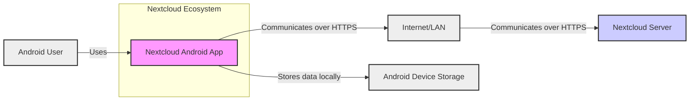
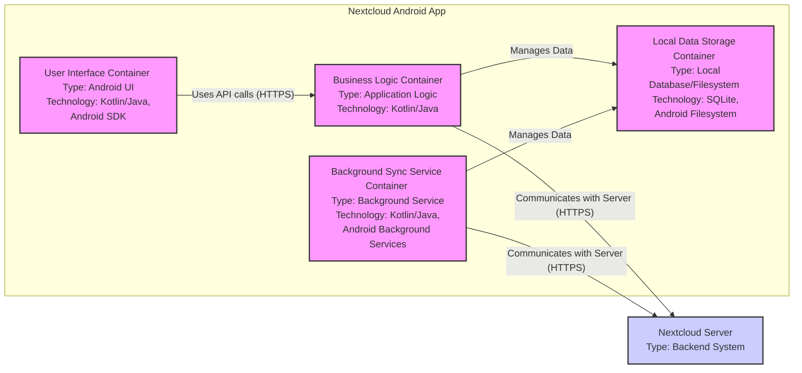
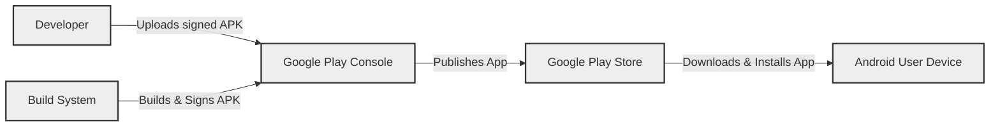
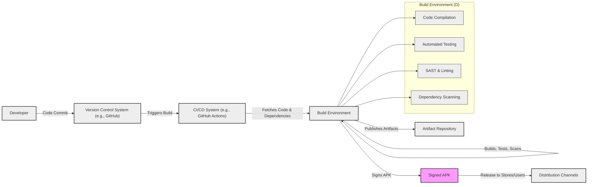

# BUSINESS POSTURE

- Business Priorities and Goals:
 - Provide users with a mobile application to access, manage, and synchronize their files stored on a Nextcloud server.
 - Enable users to collaborate on files and folders from their Android devices.
 - Offer a secure and private alternative to public cloud storage providers.
 - Extend the functionality of a Nextcloud server to Android mobile devices.
 - Support a wide range of Android devices and Nextcloud server versions.
- Business Risks:
 - Data breaches or unauthorized access to user files stored within the application or during transmission.
 - Data loss due to application malfunction, synchronization errors, or device loss.
 - Privacy violations through insecure data handling or unintended data exposure.
 - Reputational damage due to security vulnerabilities or negative user experiences.
 - Compatibility issues with different Android versions and devices leading to user dissatisfaction.

# SECURITY POSTURE

- Existing Security Controls:
 - security control: HTTPS encryption for communication between the app and the Nextcloud server. Implemented by using HTTPS protocol for all network requests.
 - security control: Nextcloud server authentication. Implemented by leveraging Nextcloud server's authentication mechanisms (username/password, OAuth, etc.).
 - security control: Android operating system security features. Implemented by relying on Android's permission system, sandboxing, and device encryption.
 - security control: Code signing of the application. Implemented during the build and release process to ensure application integrity and authenticity.
 - security control: Regular updates of the application. Implemented through app store releases and update mechanisms to address security vulnerabilities and bugs.
- Accepted Risks:
 - accepted risk: Reliance on the security of the user's Android device, including device encryption and screen lock.
 - accepted risk: Potential vulnerabilities in third-party libraries used by the application.
 - accepted risk: User mishandling of credentials or insecure device usage.
- Recommended Security Controls:
 - security control: Implement client-side encryption for sensitive data stored locally within the application.
 - security control: Integrate with Android Keystore system for secure storage of cryptographic keys.
 - security control: Implement robust input validation and sanitization to prevent injection attacks.
 - security control: Conduct regular static and dynamic code analysis to identify potential security vulnerabilities.
 - security control: Implement a comprehensive security testing strategy, including penetration testing and vulnerability scanning.
 - security control: Implement a secure software development lifecycle (SSDLC) incorporating security considerations at each stage.
 - security control: Dependency scanning and management to identify and mitigate risks from vulnerable dependencies.
 - security control: Implement Mobile Application Management (MAM) or Mobile Device Management (MDM) support for enterprise deployments.
- Security Requirements:
 - Authentication:
  - Requirement: The application MUST securely authenticate users against the configured Nextcloud server.
  - Requirement: Support various authentication methods offered by Nextcloud servers, including username/password, OAuth, and potentially others.
  - Requirement: Securely store and manage authentication tokens or session identifiers.
 - Authorization:
  - Requirement: The application MUST enforce authorization policies defined on the Nextcloud server.
  - Requirement: Users should only be able to access files and folders they are authorized to access on the server.
  - Requirement: Implement proper access control mechanisms within the application to prevent unauthorized actions.
 - Input Validation:
  - Requirement: The application MUST validate all user inputs to prevent injection attacks (e.g., SQL injection, command injection, cross-site scripting).
  - Requirement: Validate data received from the Nextcloud server to ensure data integrity and prevent unexpected behavior.
  - Requirement: Implement input sanitization and encoding to mitigate potential risks.
 - Cryptography:
  - Requirement: Use strong cryptography for all sensitive data in transit and at rest (if client-side encryption is implemented).
  - Requirement: Securely manage cryptographic keys, preferably using Android Keystore.
  - Requirement: Utilize established and well-vetted cryptographic libraries and algorithms.

# DESIGN

## C4 CONTEXT

- Context Diagram Elements:
 - Element:
  - Name: Nextcloud Android App
  - Type: Software System
  - Description: The Nextcloud Android application allows users to access, manage, and synchronize files stored on their Nextcloud server from their Android devices.
  - Responsibilities:
   - Provide a user interface for interacting with Nextcloud files and folders.
   - Authenticate users against the Nextcloud server.
   - Synchronize files between the Android device and the Nextcloud server.
   - Manage local storage of files and application data.
  - Security controls:
   - security control: HTTPS communication with the Nextcloud server.
   - security control: Android permission system.
   - security control: Code signing.
   - security control: Potentially client-side encryption (recommended).
 - Element:
  - Name: Nextcloud Server
  - Type: Software System
  - Description: The backend server that hosts user files, manages user accounts, and provides APIs for clients like the Android app to interact with.
  - Responsibilities:
   - Store and manage user files and metadata.
   - Authenticate users and manage user sessions.
   - Enforce access control policies.
   - Provide APIs for file access, synchronization, and management.
  - Security controls:
   - security control: Server-side authentication and authorization mechanisms.
   - security control: HTTPS encryption.
   - security control: Data encryption at rest (server-side).
   - security control: Regular security updates and patching.
 - Element:
  - Name: Android User
  - Type: Person
  - Description: Individuals or organizations who use the Nextcloud Android application to access their files and collaborate.
  - Responsibilities:
   - Install and configure the Nextcloud Android application.
   - Manage their Nextcloud account credentials.
   - Use the application to access and manage their files.
   - Ensure the security of their Android device.
  - Security controls:
   - security control: Device lock and strong password/PIN/biometrics.
   - security control: Keeping the Android OS and apps updated.
   - security control: Being aware of phishing and social engineering attacks.
 - Element:
  - Name: Internet/LAN
  - Type: Network
  - Description: The network infrastructure that connects the Android device and the Nextcloud server. Can be the public internet or a local area network.
  - Responsibilities:
   - Provide network connectivity for communication between the app and the server.
   - Ensure reliable data transmission.
  - Security controls:
   - security control: Network security measures (firewalls, intrusion detection systems) at the network level (typically outside of the app's direct control).
   - security control: HTTPS encryption to protect data in transit over the network.
 - Element:
  - Name: Android Device Storage
  - Type: Data Store
  - Description: Local storage on the Android device where the application stores files, application data, and potentially cached data.
  - Responsibilities:
   - Persistently store application data and downloaded files.
   - Provide access to stored data for the application.
  - Security controls:
   - security control: Android device encryption (full disk or file-based).
   - security control: Application sandboxing provided by Android OS.
   - security control: Potentially client-side encryption for sensitive data stored locally (recommended).

## C4 CONTAINER

- Container Diagram Elements:
 - Element:
  - Name: User Interface Container
  - Type: Android UI
  - Description: Responsible for rendering the user interface, handling user interactions, and displaying data to the user. Built using Android UI components and likely written in Kotlin/Java.
  - Responsibilities:
   - Display file lists, folder structures, and file previews.
   - Handle user input and navigation.
   - Initiate actions like file uploads, downloads, sharing, etc.
   - Present application settings and configuration options.
  - Security controls:
   - security control: Input validation on user inputs received from UI elements.
   - security control: Secure handling of sensitive data displayed in the UI (e.g., preventing data leakage through UI elements).
 - Element:
  - Name: Business Logic Container
  - Type: Application Logic
  - Description: Contains the core application logic, including handling API calls to the Nextcloud server, managing data synchronization, and orchestrating application workflows. Likely implemented in Kotlin/Java.
  - Responsibilities:
   - Implement authentication and authorization logic.
   - Manage communication with the Nextcloud server API.
   - Handle file synchronization processes.
   - Implement application-specific business rules and logic.
  - Security controls:
   - security control: Input validation for data received from the UI and the server.
   - security control: Secure session management.
   - security control: Implementation of authorization checks before performing actions.
 - Element:
  - Name: Local Data Storage Container
  - Type: Local Database/Filesystem
  - Description: Responsible for storing application data, downloaded files, and potentially cached data locally on the Android device. Likely uses SQLite for structured data and the Android filesystem for file storage.
  - Responsibilities:
   - Persist application settings and user preferences.
   - Store downloaded files and file metadata.
   - Manage local cache of data to improve performance.
  - Security controls:
   - security control: Android file system permissions and sandboxing.
   - security control: Potentially client-side encryption for sensitive data stored locally (recommended).
   - security control: Secure deletion of temporary files and cached data.
 - Element:
  - Name: Background Sync Service Container
  - Type: Background Service
  - Description: Runs in the background to handle automatic file synchronization between the Android device and the Nextcloud server. Uses Android background service mechanisms.
  - Responsibilities:
   - Periodically check for changes on the Nextcloud server and local device.
   - Initiate file uploads and downloads in the background.
   - Handle synchronization conflicts.
   - Ensure data consistency between the device and the server.
  - Security controls:
   - security control: Secure handling of credentials and authentication tokens in background processes.
   - security control: Rate limiting and throttling of sync operations to prevent abuse.
   - security control: Proper error handling and logging in background processes.
 - Element:
  - Name: Nextcloud Server
  - Type: Backend System
  - Description: The same Nextcloud server as described in the Context Diagram.
  - Responsibilities:
   - Same responsibilities as described in the Context Diagram.
  - Security controls:
   - Same security controls as described in the Context Diagram.

## DEPLOYMENT

- Deployment Architecture:
 - Deployment Environment: Android Devices (various models, OS versions)
 - Deployment Method: Primarily through Google Play Store and F-Droid. APK download from website or GitHub releases is also possible.
 - Detailed Deployment (Google Play Store):

- Deployment Diagram Elements (Google Play Store):
 - Element:
  - Name: Developer
  - Type: Person/Team
  - Description: The developers who write the code, test the application, and prepare it for release.
  - Responsibilities:
   - Develop and maintain the Nextcloud Android application.
   - Implement security controls and address vulnerabilities.
   - Prepare release builds and sign the APK.
   - Upload the signed APK to the Google Play Console.
  - Security controls:
   - security control: Secure development practices.
   - security control: Secure key management for code signing.
   - security control: Access control to development and build environments.
 - Element:
  - Name: Build System
  - Type: Automated System
  - Description: An automated system (e.g., CI/CD pipeline) that compiles the code, runs tests, and builds the release APK.
  - Responsibilities:
   - Automate the build process.
   - Run static analysis and security scans.
   - Sign the APK with the release key.
   - Publish build artifacts.
  - Security controls:
   - security control: Secure build environment.
   - security control: Automated security checks during build.
   - security control: Access control to the build system and artifacts.
 - Element:
  - Name: Google Play Console
  - Type: Platform
  - Description: Google's platform for managing and publishing Android applications on the Google Play Store.
  - Responsibilities:
   - Host the application listing and APK files.
   - Manage application releases and updates.
   - Provide analytics and reporting.
   - Enforce Google Play Store policies.
  - Security controls:
   - security control: Google Play Protect malware scanning.
   - security control: Developer account security (2FA, etc.).
   - security control: Application signing verification.
 - Element:
  - Name: Google Play Store
  - Type: Application Store
  - Description: Google's official app store for Android devices, where users can discover, download, and install applications.
  - Responsibilities:
   - Distribute the Nextcloud Android application to users.
   - Handle application updates.
   - Provide a platform for user reviews and ratings.
  - Security controls:
   - security control: Application scanning and verification.
   - security control: User feedback and reporting mechanisms.
 - Element:
  - Name: Android User Device
  - Type: Device
  - Description: The Android device owned by the user where the application is installed and used.
  - Responsibilities:
   - Run the Nextcloud Android application.
   - Store application data and user files.
   - Provide user authentication and device security.
  - Security controls:
   - security control: Device encryption.
   - security control: Application sandboxing.
   - security control: User-configured security settings (passwords, biometrics).

## BUILD

- Build Process:
 - Developers commit code changes to a version control system (e.g., Git/GitHub).
 - A CI/CD system (e.g., GitHub Actions, Jenkins) is triggered on code changes.
 - The build system fetches the code, dependencies, and SDK.
 - The code is compiled and built into an Android Application Package (APK).
 - Automated tests (unit tests, integration tests) are executed.
 - Static analysis security testing (SAST) and linting tools are run to identify potential code issues and vulnerabilities.
 - Dependency scanning is performed to check for vulnerable dependencies.
 - The APK is signed using a private signing key.
 - Build artifacts (APK, reports, etc.) are stored and made available for release.

- Build Process Security Controls:
 - security control: Secure Build Environment: Harden build servers and infrastructure, restrict access, and regularly update systems.
 - security control: Automated Build Process: Minimize manual steps in the build process to reduce the risk of human error and malicious intervention.
 - security control: Static Application Security Testing (SAST): Integrate SAST tools into the build pipeline to automatically scan code for potential vulnerabilities.
 - security control: Dependency Scanning: Use dependency scanning tools to identify and manage vulnerable dependencies.
 - security control: Code Linting: Enforce code quality and security best practices using linting tools.
 - security control: Automated Testing: Implement comprehensive automated tests (unit, integration, UI) to ensure code quality and catch regressions.
 - security control: Secure Code Signing: Protect the code signing key and ensure it is used securely within the build process.
 - security control: Access Control: Implement strict access control to the build system, code repositories, and build artifacts.
 - security control: Build Artifact Integrity: Verify the integrity of build artifacts (e.g., APK) to ensure they haven't been tampered with.
 - security control: Audit Logging: Maintain detailed logs of the build process for auditing and security monitoring.

# RISK ASSESSMENT

- Critical Business Processes:
 - Securely accessing and managing user files stored on Nextcloud servers from Android devices.
 - Reliable synchronization of files between Android devices and Nextcloud servers.
 - Protecting user data privacy and confidentiality.
 - Maintaining user trust and the reputation of Nextcloud.
- Data Sensitivity:
 - User Files: High sensitivity. These files can contain personal, confidential, or business-critical information. Unauthorized access or data loss can have significant consequences.
 - User Credentials (Authentication Tokens): High sensitivity. Compromise of these credentials can lead to unauthorized access to user accounts and data.
 - Application Settings and Preferences: Medium sensitivity. These settings might contain some user preferences and potentially some configuration details.
 - Application Logs and Temporary Data: Low to Medium sensitivity. Logs might contain some user activity information, and temporary data could potentially expose some information if not handled securely.

# QUESTIONS & ASSUMPTIONS

- Questions:
 - What are the specific compliance requirements for the Nextcloud Android application (e.g., GDPR, HIPAA)?
 - Are there any specific enterprise features or requirements that need to be considered (e.g., MAM/MDM integration, data loss prevention)?
 - What is the threat model for the application? What are the most likely attack vectors and threat actors?
 - What are the performance requirements for the application, especially regarding synchronization and data transfer?
 - Are there any specific third-party integrations or dependencies that require special security considerations?
 - What is the process for handling security vulnerabilities reported by users or security researchers?
- Assumptions:
 - BUSINESS POSTURE: The primary business goal is to provide a secure and user-friendly mobile access solution for Nextcloud users, prioritizing data privacy and security.
 - SECURITY POSTURE: The application aims for a strong security posture, leveraging standard Android security features and implementing additional security controls where necessary. The organization is security conscious and willing to invest in security measures.
 - DESIGN: The application follows a standard Android application architecture with UI, business logic, and data storage components. Communication with the Nextcloud server is primarily over HTTPS. The build process is automated and includes basic security checks.