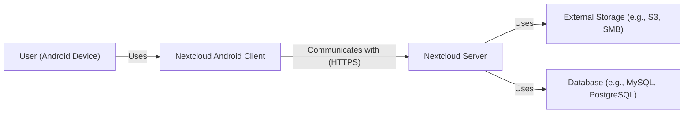
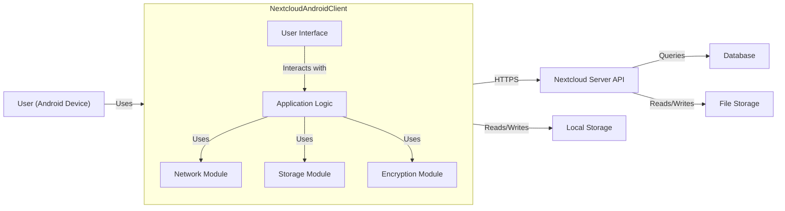
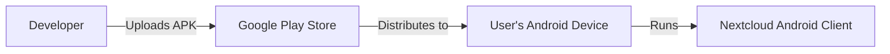
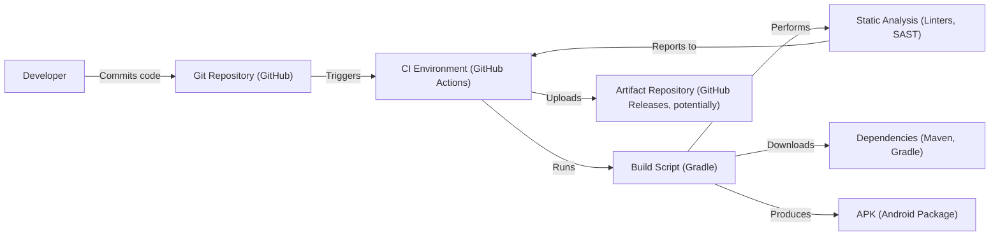

# Project Design Document: Nextcloud Android Client

## BUSINESS POSTURE

Nextcloud is a self-hosted cloud storage solution, and the Android client is a crucial component for user accessibility. The primary business goal is to provide users with secure and convenient access to their files on Nextcloud instances from their Android devices. This project aims to balance usability with robust security, reflecting the core values of Nextcloud as a privacy-focused platform.

Business priorities:

- User Data Privacy: Ensuring the confidentiality and integrity of user data stored on Nextcloud instances.
- Secure Access: Providing secure authentication and authorization mechanisms for accessing files.
- Data Availability: Maintaining consistent and reliable access to files.
- Usability: Offering a user-friendly and intuitive interface for interacting with Nextcloud.
- Cross-Platform Compatibility: Ensuring seamless integration with various Nextcloud server versions.

Business risks:

- Unauthorized Access: Risk of unauthorized users gaining access to sensitive data due to vulnerabilities in the client or compromised credentials.
- Data Breach: Potential for data breaches resulting from client-side vulnerabilities or insecure communication channels.
- Data Loss: Risk of data loss due to synchronization issues, client-side errors, or server-side problems.
- Man-in-the-Middle (MitM) Attacks: Susceptibility to MitM attacks if communication between the client and server is not adequately secured.
- Device Compromise: Risk of data exposure if the user's Android device is compromised.
- Supply Chain Attacks: Risk of malicious code being introduced during the build process or through compromised dependencies.

## SECURITY POSTURE

Existing security controls:

- security control: HTTPS Communication: The client communicates with the Nextcloud server exclusively over HTTPS, encrypting data in transit. Implemented in network communication modules.
- security control: Authentication: Supports various authentication methods, including username/password, and two-factor authentication (2FA). Implemented in authentication modules.
- security control: Certificate Pinning: Option to enable certificate pinning to mitigate MitM attacks. Implemented in network communication modules.
- security control: End-to-End Encryption (E2EE): Supports Nextcloud's end-to-end encryption feature for enhanced data privacy. Implemented in encryption modules.
- security control: Data Storage Encryption: Offers options for encrypting locally stored data on the device. Implemented in data storage modules.
- security control: Code Obfuscation: The application likely uses code obfuscation to deter reverse engineering. Implemented during the build process.
- security control: Regular Security Updates: The project follows a regular release cycle, including security patches. Implemented through the project's release management process.

Accepted risks:

- accepted risk: User Device Security: The security of the user's device is outside the direct control of the application. While the app provides security features, a compromised device can still expose data.
- accepted risk: Server-Side Vulnerabilities: The application relies on the security of the Nextcloud server. Vulnerabilities on the server-side are outside the scope of the client's security controls.
- accepted risk: User Error: Users may choose weak passwords, disable security features, or fall victim to phishing attacks, compromising their accounts.

Recommended security controls:

- security control: Implement Biometric Authentication: Integrate biometric authentication (fingerprint, face recognition) as an additional authentication factor.
- security control: Enhance Session Management: Implement robust session management with short session timeouts and secure token handling.
- security control: Integrate with Android Keystore: Utilize the Android Keystore system for secure storage of cryptographic keys.

Security requirements:

- Authentication:
    - Support strong password policies enforced by the Nextcloud server.
    - Support multi-factor authentication (MFA/2FA).
    - Securely store authentication tokens.
    - Implement secure session management.
    - Provide clear and secure logout functionality.
- Authorization:
    - Enforce server-side authorization checks for all file operations.
    - Implement granular access control based on user roles and permissions defined on the server.
- Input Validation:
    - Validate all user inputs to prevent injection attacks.
    - Sanitize data received from the server before processing.
- Cryptography:
    - Use strong, industry-standard cryptographic algorithms for all encryption operations.
    - Securely manage cryptographic keys.
    - Ensure proper implementation of HTTPS and certificate validation.
    - Support and encourage the use of end-to-end encryption.

## DESIGN

### C4 CONTEXT

Element descriptions:

-   Name: User (Android Device)
    -   Type: Person
    -   Description: A person who uses the Nextcloud Android Client on their Android device to access files stored on a Nextcloud instance.
    -   Responsibilities:
        -   Initiates file operations (upload, download, view, edit, share).
        -   Authenticates with the Nextcloud server.
        -   Manages their Nextcloud account.
    -   Security controls:
        -   Strong password or biometric authentication.
        -   Device security measures (screen lock, device encryption).

-   Name: Nextcloud Android Client
    -   Type: Software System
    -   Description: The Android application that allows users to interact with their Nextcloud instance.
    -   Responsibilities:
        -   Provides a user interface for browsing and managing files.
        -   Handles authentication with the Nextcloud server.
        -   Manages file uploads and downloads.
        -   Synchronizes files between the device and the server.
        -   Implements client-side security features.
    -   Security controls:
        -   HTTPS communication.
        -   Authentication mechanisms (username/password, 2FA).
        -   Certificate pinning (optional).
        -   End-to-end encryption (optional).
        -   Data storage encryption (optional).

-   Name: Nextcloud Server
    -   Type: Software System
    -   Description: The server-side component of Nextcloud, hosting user files and providing access control.
    -   Responsibilities:
        -   Stores and manages user files.
        -   Handles user authentication and authorization.
        -   Provides APIs for client applications.
        -   Manages user accounts and permissions.
    -   Security controls:
        -   Server-side security measures (firewalls, intrusion detection systems).
        -   Data encryption at rest.
        -   Regular security updates.

-   Name: External Storage (e.g., S3, SMB)
    -   Type: External System
    -   Description: Optional external storage used by the Nextcloud server to store files.
    -   Responsibilities:
        -   Provides storage capacity for Nextcloud files.
    -   Security controls:
        -   Storage provider's security measures.
        -   Encryption at rest.

-   Name: Database (e.g., MySQL, PostgreSQL)
    -   Type: External System
    -   Description: The database used by the Nextcloud server to store metadata and user information.
    -   Responsibilities:
        -   Stores user account information, file metadata, and other relevant data.
    -   Security controls:
        -   Database security measures (access control, encryption).

### C4 CONTAINER

Element descriptions:

-   Name: User Interface
    -   Type: Component
    -   Description: The visual elements and user interaction components of the Android app.
    -   Responsibilities:
        -   Displays files and folders.
        -   Provides controls for file operations.
        -   Handles user input.
    -   Security controls:
        -   Input validation.

-   Name: Application Logic
    -   Type: Component
    -   Description: The core logic of the Android app, handling user actions and coordinating other modules.
    -   Responsibilities:
        -   Manages user sessions.
        -   Handles file synchronization.
        -   Coordinates network requests and data storage.
    -   Security controls:
        -   Session management.
        -   Authorization checks.

-   Name: Network Module
    -   Type: Component
    -   Description: Handles communication with the Nextcloud server.
    -   Responsibilities:
        -   Sends and receives HTTP requests.
        -   Manages network connections.
    -   Security controls:
        -   HTTPS communication.
        -   Certificate pinning.

-   Name: Storage Module
    -   Type: Component
    -   Description: Manages local storage of files and data on the Android device.
    -   Responsibilities:
        -   Reads and writes files to local storage.
        -   Manages cached data.
    -   Security controls:
        -   Data storage encryption.

-   Name: Encryption Module
    -   Type: Component
    -   Description: Handles encryption and decryption of data.
    -   Responsibilities:
        -   Encrypts and decrypts files for end-to-end encryption.
        -   Manages encryption keys.
    -   Security controls:
        -   Strong cryptographic algorithms.
        -   Secure key management.

-   Name: Nextcloud Server API
    -   Type: API
    -   Description: The API provided by the Nextcloud server for client applications.
    -   Responsibilities:
        -   Provides endpoints for file operations, authentication, and other functionalities.
    -   Security controls:
        -   Server-side security measures.

-   Name: Local Storage
    -   Type: Storage
    -   Description: The local storage on the Android device.
    -   Responsibilities:
        -   Stores files and data.
    -   Security controls:
        -   Device-level security.

-   Name: Database
    -   Type: Database
    -   Description: The database used by the Nextcloud server.
    -   Responsibilities:
        -   Stores metadata and user information.
    -   Security controls:
        -   Database security measures.

-   Name: File Storage
    -   Type: Storage
    -   Description: The storage used by the Nextcloud server to store files.
    -   Responsibilities:
        -   Stores files.
    -   Security controls:
        -   Storage provider's security measures.

### DEPLOYMENT

Possible deployment solutions:

1.  Google Play Store: The standard distribution method for Android applications.
2.  F-Droid: An alternative app store focusing on free and open-source software.
3.  Direct APK Download: Users can download the APK file directly from the Nextcloud website or GitHub releases.

Chosen deployment solution (Google Play Store):

Element descriptions:

-   Name: Developer
    -   Type: Person
    -   Description: The developers of the Nextcloud Android client.
    -   Responsibilities:
        -   Develops and maintains the application.
        -   Uploads the APK to the Google Play Store.
    -   Security controls:
        -   Secure development practices.

-   Name: Google Play Store
    -   Type: Platform
    -   Description: Google's official app store for Android applications.
    -   Responsibilities:
        -   Distributes the Nextcloud Android client to users.
        -   Provides automatic updates.
    -   Security controls:
        -   Google Play Store's security measures.

-   Name: User's Android Device
    -   Type: Device
    -   Description: The user's Android device.
    -   Responsibilities:
        -   Downloads and installs the application from the Google Play Store.
        -   Runs the Nextcloud Android client.
    -   Security controls:
        -   Device-level security.

-   Name: Nextcloud Android Client
    -   Type: Application
    -   Description: The installed Nextcloud Android client.
    -   Responsibilities:
        -   Provides access to Nextcloud files.
    -   Security controls:
        -   Application-level security measures.

### BUILD

Build process description:

1.  Developers commit code to the Git repository hosted on GitHub.
2.  The commit triggers a build process in the CI environment (GitHub Actions).
3.  The build script (Gradle) is executed.
4.  The build script downloads dependencies from repositories like Maven or Gradle.
5.  Static analysis tools (linters, SAST scanners) are run to check for code quality and security vulnerabilities.
6.  The build script compiles the code and produces an APK (Android Package).
7.  The CI environment uploads the APK to an artifact repository (potentially GitHub Releases).

Security controls in the build process:

-   security control: Dependency Management: Gradle manages dependencies, and tools like Dependabot (on GitHub) can be used to monitor for vulnerable dependencies.
-   security control: Static Analysis: Linters and SAST scanners are used to identify potential security vulnerabilities in the code.
-   security control: Code Signing: The APK is signed with a developer certificate to ensure authenticity and integrity.
-   security control: CI/CD Pipeline Security: GitHub Actions provides a secure environment for building and testing the application. Access controls and secrets management are used to protect sensitive information.

## RISK ASSESSMENT

Critical business processes to protect:

-   User authentication and authorization.
-   File synchronization and access.
-   Data encryption and decryption (if E2EE is enabled).
-   Communication between the client and server.

Data to protect and their sensitivity:

-   User credentials (usernames, passwords, tokens): Highly sensitive.
-   File contents: Sensitivity varies depending on the user's data. Can range from low to extremely high.
-   File metadata (filenames, timestamps, sizes): Moderately sensitive.
-   Encryption keys (if E2EE is enabled): Extremely sensitive.
-   Device identifiers: Moderately sensitive.

## QUESTIONS & ASSUMPTIONS

Questions:

-   What specific SAST tools are used in the build process?
-   What is the exact process for handling compromised developer certificates?
-   Are there any plans to integrate hardware-backed security modules (e.g., Titan M chip)?
-   What is the policy for handling user-reported security vulnerabilities?
-   What are the specific procedures for auditing and reviewing code changes for security implications?
-   Are there plans to implement a bug bounty program?
-   How are secrets (API keys, etc.) managed in the CI/CD pipeline?
-   What is the frequency of penetration testing or security audits?

Assumptions:

-   BUSINESS POSTURE: The Nextcloud server is configured and maintained securely.
-   BUSINESS POSTURE: Users are aware of basic security practices (e.g., strong passwords, device security).
-   SECURITY POSTURE: The project follows secure coding guidelines and best practices.
-   SECURITY POSTURE: Regular security reviews and updates are performed.
-   DESIGN: The CI/CD pipeline is configured securely.
-   DESIGN: Dependencies are regularly checked for vulnerabilities.
-   DESIGN: The application uses appropriate cryptographic libraries and algorithms.
-   DESIGN: The application handles user data securely, minimizing the risk of data leaks.