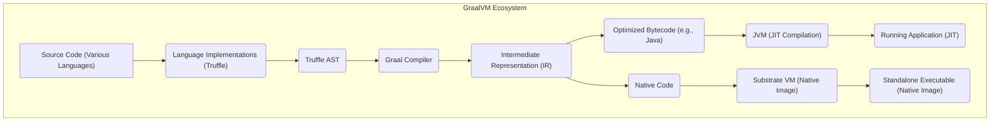
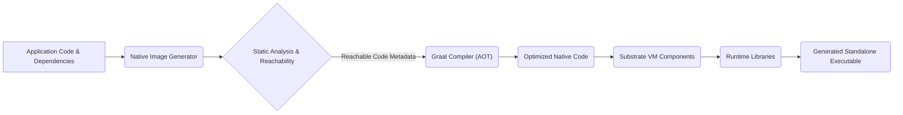
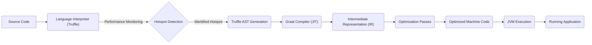

# Project Design Document: GraalVM

**Version:** 1.1
**Date:** October 26, 2023
**Author:** AI Software Architect

## 1. Introduction

This document provides an enhanced high-level design overview of the GraalVM project, based on the codebase at [https://github.com/oracle/graal](https://github.com/oracle/graal). This revised document aims to provide a more detailed foundation for subsequent threat modeling activities, offering a clearer understanding of GraalVM's architecture, components, and data flows.

## 2. Goals and Objectives

The primary goals of GraalVM are to:

*   Deliver a high-performance runtime environment capable of executing multiple programming languages efficiently.
*   Enable ahead-of-time (AOT) compilation of applications written in languages like Java into standalone native executables (Native Image).
*   Facilitate seamless interoperability between different programming languages within a single application.
*   Provide a common and extensible compiler infrastructure that can be leveraged by various language implementations.

## 3. Target Audience

This document is intended for:

*   Security engineers and architects responsible for performing threat modeling on GraalVM and applications built with it.
*   Software developers contributing to or utilizing GraalVM in their projects.
*   Operations and infrastructure teams involved in deploying and managing applications built using GraalVM.

## 4. System Overview

GraalVM is a polyglot virtual machine designed to run applications written in various programming languages, including but not limited to Java, JavaScript, Python, Ruby, and R. It achieves this through a sophisticated architecture encompassing:

*   **Graal Compiler:** A highly optimizing compiler, implemented in Java, capable of both just-in-time (JIT) and ahead-of-time (AOT) compilation.
*   **Truffle Language Implementation Framework:** A framework that simplifies the creation of language interpreters that can be efficiently optimized by the Graal compiler.
*   **Substrate VM:** A lightweight virtual machine that serves as the runtime environment for native images generated by GraalVM.
*   **Language Implementations:**  Specific implementations of programming languages built upon the Truffle framework, enabling their execution on GraalVM.

## 5. Architectural Design

The following diagram provides a more detailed illustration of the GraalVM architecture:

### 5.1. Key Components (Detailed)

*   **Graal Compiler:**
    *   A central component responsible for optimizing code. It operates on an intermediate representation (IR).
    *   Supports various optimization techniques, including inlining, escape analysis, loop optimizations, and more.
    *   Can be used in both JIT mode within a standard JVM and AOT mode for native image generation.
    *   Its correctness and security are critical, as vulnerabilities here could impact all languages and applications.
*   **Truffle Framework:**
    *   Provides a set of APIs and conventions for building language interpreters.
    *   Abstracts away low-level details, allowing language implementers to focus on language semantics.
    *   The framework itself and the language implementations built on it are potential areas for vulnerabilities.
*   **Substrate VM:**
    *   A minimal runtime environment for executing native images.
    *   Includes essential components like a garbage collector, thread management, and basic OS interfaces.
    *   Significantly smaller than a traditional JVM, reducing the attack surface but also requiring careful implementation of security features.
*   **Language Implementations (e.g., GraalVM SDK, GraalVM JavaScript, GraalVM Python):**
    *   Each language implementation includes a parser, an interpreter built on Truffle, and runtime libraries specific to that language.
    *   Responsible for translating source code into the Truffle AST.
    *   Vulnerabilities in the parser or runtime libraries can lead to security issues.
    *   Interoperability features between languages need careful security consideration.
*   **Native Image Generator:**
    *   A tool that performs static analysis to identify all reachable code at build time.
    *   Drives the AOT compilation process using the Graal compiler.
    *   Creates a closed-world assumption, meaning dynamic class loading and reflection are limited and require configuration.
    *   The process of determining reachable code and the handling of reflection can introduce security risks if not implemented correctly.

### 5.2. Data Flow (Enhanced)

The data flow within GraalVM can be broken down into the following scenarios:

*   **JIT Compilation Flow:**
    1. Source code written in a supported language is executed by the corresponding language implementation's interpreter.
    2. The Truffle framework monitors the execution and identifies "hotspots" – frequently executed code sections.
    3. The Truffle interpreter provides the Abstract Syntax Tree (AST) of the hotspot to the Graal compiler.
    4. The Graal compiler transforms the AST into its Intermediate Representation (IR).
    5. The compiler performs various optimizations on the IR.
    6. Optimized machine code is generated and executed directly by the underlying JVM.
*   **AOT Compilation (Native Image) Flow:**
    1. The Native Image Generator is invoked, providing the application's entry points and dependencies.
    2. Static analysis is performed to determine all reachable code paths. This includes analyzing class hierarchies, method calls, and reflection usage (if configured).
    3. The Graal compiler, in AOT mode, compiles all reachable code into native machine code for the target platform.
    4. The Substrate VM, along with the compiled native code and necessary runtime libraries, are packaged into a standalone executable.
    5. The resulting native image can be executed without requiring a separate JVM installation.

## 6. Security Considerations (Detailed)

Security considerations for GraalVM span various components and functionalities:

*   **Graal Compiler Security:**
    *   **Compiler Bugs:** Errors in the compiler's logic could lead to the generation of incorrect or insecure machine code.
    *   **Optimization Vulnerabilities:** Aggressive optimizations might inadvertently introduce security flaws.
    *   **Side-Channel Attacks:** Compiler optimizations could potentially leak information through timing or resource consumption.
*   **Truffle Framework Security:**
    *   **Framework Vulnerabilities:** Flaws in the Truffle framework itself could be exploited by malicious language implementations.
    *   **Language Interoperability Issues:**  Unintended interactions or vulnerabilities arising from the seamless integration of different languages.
*   **Substrate VM Security:**
    *   **VM Vulnerabilities:** Security flaws in the Substrate VM's implementation (e.g., memory management, garbage collection).
    *   **Limited Security Features:** Compared to a full JVM, the Substrate VM might have a reduced set of security features, requiring careful design of native images.
*   **Native Image Security:**
    *   **Closed-World Assumption Risks:** Incorrectly configured reflection or dynamic features can lead to unexpected behavior or vulnerabilities.
    *   **Static Analysis Limitations:** The accuracy of static analysis in identifying all reachable code is crucial; missed code could lead to runtime errors or security issues.
    *   **Supply Chain Attacks:**  Compromised dependencies included in the native image build process.
    *   **Increased Attack Surface (Potentially):** While smaller than a JVM, the native image still presents an attack surface that needs to be secured.
*   **Language Implementation Security:**
    *   **Parser Vulnerabilities:** Flaws in the language parser could allow for code injection or denial-of-service.
    *   **Runtime Library Vulnerabilities:** Security issues in the language-specific runtime libraries.
    *   **Interpreter Vulnerabilities:** Bugs in the interpreter before JIT compilation occurs.
*   **General Security Considerations:**
    *   **Resource Exhaustion:** Malicious code, regardless of the language, could attempt to consume excessive resources.
    *   **Denial of Service:**  Exploiting vulnerabilities to make the GraalVM runtime or applications unavailable.
    *   **Information Disclosure:**  Gaining unauthorized access to sensitive information.

## 7. Deployment Considerations (Security Focused)

The security implications of deploying GraalVM applications vary depending on the deployment method:

*   **Standard JVM with Graal Compiler:**
    *   Benefits from the mature security features of the JVM.
    *   Requires careful consideration of JVM security configurations.
    *   Vulnerabilities in the Graal compiler could still pose a risk.
*   **Standalone Native Images:**
    *   Reduced dependency on a full JVM can simplify deployment and potentially reduce the attack surface of the runtime environment itself.
    *   Security relies heavily on the correctness and security of the Substrate VM and the AOT compilation process.
    *   Requires careful management of dependencies and the build process to prevent supply chain attacks.
*   **Embedded GraalVM:**
    *   Security depends on the security of the host application and the isolation mechanisms in place.
    *   Interactions between the host application and the embedded GraalVM environment need to be carefully secured.

## 8. Diagrams

### 8.1. Native Image Generation Process (Detailed)

### 8.2. JIT Compilation Flow (Detailed)

## 9. Assumptions and Constraints

*   This document focuses on the core architectural components of GraalVM as represented in the provided GitHub repository.
*   It assumes a foundational understanding of virtual machine technology, compiler design, and programming language runtime environments.
*   Detailed security analysis of individual language implementations and their specific vulnerabilities is outside the scope of this document.
*   The subsequent threat modeling process will leverage this design document to identify specific threats, vulnerabilities, and potential mitigation strategies.

## 10. Future Considerations for Security Analysis

*   In-depth security audit of the Graal compiler codebase.
*   Detailed analysis of the Substrate VM's security architecture and implementation.
*   Security assessment of the Native Image generation process, including static analysis and reachability algorithms.
*   Evaluation of the security implications of language interoperability within GraalVM.
*   Development of secure coding guidelines for applications targeting GraalVM.
*   Regular security testing and vulnerability scanning of GraalVM releases.
