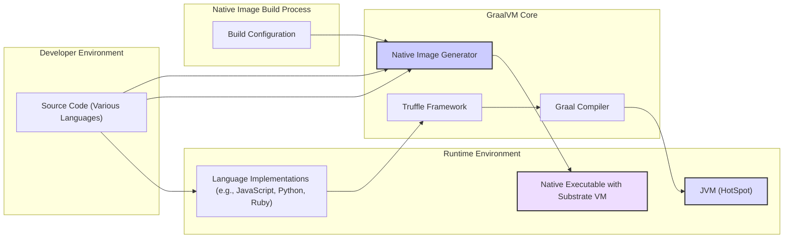
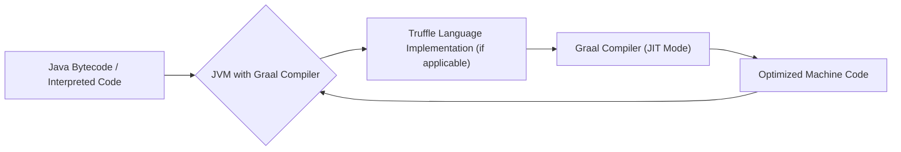
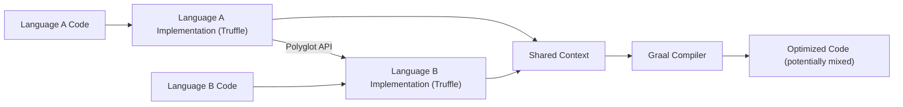

# Project Design Document: GraalVM

**Version:** 1.1
**Date:** October 26, 2023
**Author:** AI Software Architecture Expert

## 1. Introduction

This document provides an enhanced architectural design of the GraalVM project, building upon the information available at [https://github.com/oracle/graal](https://github.com/oracle/graal). This revised document aims to offer a more detailed and nuanced perspective on GraalVM's architecture, specifically tailored for subsequent threat modeling activities. It elaborates on the key components, their interactions, and the intricate data flows within the GraalVM ecosystem, providing a stronger foundation for security analysis.

## 2. Goals and Objectives

The core objectives of GraalVM are to:

*   Deliver a high-throughput and low-latency runtime environment capable of executing multiple programming languages efficiently.
*   Enable ahead-of-time (AOT) compilation of applications, particularly Java-based, into native executables for improved startup time and reduced resource consumption.
*   Facilitate seamless interoperability between different programming languages within a single application, promoting code reuse and flexibility.
*   Offer a sophisticated and adaptable compiler infrastructure that can be leveraged across various languages and execution modes (JIT and AOT).

## 3. High-Level Architecture

GraalVM's architecture is centered around a powerful core compiler and a flexible framework for language implementation. It supports both just-in-time (JIT) compilation within traditional virtual machines and ahead-of-time (AOT) compilation to generate standalone native images.

Key architectural elements:

*   **Source Code:** Represents the input programs written in any of the languages supported by GraalVM.
*   **Language Implementations (via Truffle):**  Specific implementations for each supported programming language, built upon the Truffle framework. These implementations are responsible for parsing, interpreting, and providing an abstract syntax tree (AST) representation of the source code.
*   **Truffle Framework:** A language implementation framework that simplifies the creation of new language implementations. It provides reusable components and APIs for tasks such as parsing, interpretation, and debugging. Crucially, it exposes metadata about the language's semantics to the Graal compiler.
*   **Graal Compiler:** The core optimizing compiler of GraalVM, written in Java. It can operate in two primary modes: as a just-in-time compiler within a JVM or as an ahead-of-time compiler within the Native Image Generator. It performs advanced optimizations based on static analysis (AOT) or runtime feedback (JIT).
*   **JVM (HotSpot):** The standard Java Virtual Machine. When used in JIT mode, GraalVM can replace the default HotSpot compiler to provide enhanced performance.
*   **Native Image Generator:** A tool that performs static analysis and ahead-of-time compilation to produce standalone native executables. This process involves building a closed-world representation of the application and its dependencies.
*   **Native Executable with Substrate VM:** The output of the Native Image Generator. It contains the application's compiled code, necessary libraries, and the Substrate VM, a lightweight runtime environment.
*   **Build Configuration:** Settings and directives provided during the Native Image generation process, influencing which code and resources are included in the final executable.

## 4. Key Components

Detailed descriptions of the primary components within the GraalVM architecture:

*   **Graal Compiler:**
    *   A highly optimizing, dynamic compiler written in Java.
    *   Performs a wide range of optimizations, including method inlining, escape analysis, loop unrolling, and vectorization.
    *   Operates on an intermediate representation (IR) of the code, allowing for language-agnostic optimizations.
    *   Can be integrated into the JVM as a replacement for the C2 compiler or used in standalone mode for AOT compilation.
*   **Truffle Framework:**
    *   A framework for building high-performance language interpreters.
    *   Employs a technique called "partial evaluation" to automatically generate optimizing compilers from simple interpreters.
    *   Provides a common API for language interoperability, enabling seamless communication between different languages.
    *   Includes tools for debugging and profiling language implementations.
*   **Language Implementations:**
    *   Concrete implementations of programming languages built using the Truffle framework (e.g., Graal.js for JavaScript, GraalPython for Python, TruffleRuby for Ruby).
    *   Responsible for parsing the source code of their respective languages and creating an Abstract Syntax Tree (AST).
    *   Provide language-specific runtime libraries and functionalities.
    *   Leverage Truffle's features for efficient interpretation and compilation.
*   **Native Image Generator:**
    *   A powerful tool that performs ahead-of-time compilation of applications into standalone executables.
    *   Performs static analysis to identify all reachable code, classes, and resources.
    *   Utilizes the Graal compiler in AOT mode to compile this reachable code to native machine code.
    *   Constructs a minimal runtime environment (Substrate VM) tailored to the application's needs.
*   **Substrate VM:**
    *   A lightweight, secure, and efficient runtime environment embedded within native images.
    *   Provides essential services such as memory management (garbage collection), thread management, and basic operating system interfaces.
    *   Significantly smaller and has a faster startup time compared to a traditional JVM.
*   **Polyglot API:**
    *   A set of APIs that allows code written in different GraalVM-supported languages to interact seamlessly within the same runtime environment.
    *   Enables embedding code from one language into another and sharing data and objects across language boundaries.
    *   Facilitates the development of polyglot applications.

## 5. Data Flow

The flow of data within GraalVM differs significantly based on whether just-in-time (JIT) or ahead-of-time (AOT) compilation is employed, and also when considering polyglot interactions.

### 5.1. JIT Compilation Flow

*   **Java Bytecode / Interpreted Code:**  Either standard Java bytecode being executed or code being interpreted by a Truffle-based language implementation.
*   **JVM with Graal Compiler:** The Java Virtual Machine where GraalVM is configured as the JIT compiler.
*   **Truffle Language Implementation (if applicable):** If non-Java code is being executed on the JVM, the corresponding Truffle language implementation interprets the code and provides metadata to the Graal compiler.
*   **Graal Compiler (JIT Mode):** Receives bytecode or an intermediate representation from the Truffle implementation and performs dynamic compilation based on runtime profiling and heuristics.
*   **Optimized Machine Code:** The dynamically generated, optimized machine code that is executed by the JVM.

### 5.2. Native Image Compilation Flow

*   **Source Code & Dependencies:** The application's source code and all its required libraries and resources.
*   **Native Image Generator:** The tool orchestrating the AOT compilation process.
*   **Static Analysis & Reachability:** The Native Image Generator performs a static analysis of the code to determine all reachable classes, methods, and resources, adhering to the closed-world assumption.
*   **Graal Compiler (AOT Mode):** Compiles the identified reachable code ahead-of-time into native machine code.
*   **Standalone Executable with Substrate VM:** The final output, a self-contained executable containing the compiled application code and the minimal Substrate VM runtime.

### 5.3. Polyglot Interaction Flow

*   **Language A Code / Language B Code:** Code written in different GraalVM-supported languages.
*   **Language A Implementation (Truffle) / Language B Implementation (Truffle):** The respective Truffle language implementations handling the parsing and interpretation of the code.
*   **Polyglot API:** The set of APIs facilitating communication and data exchange between different language runtimes.
*   **Shared Context:** A common environment managed by GraalVM that allows different language runtimes to interact and share data.
*   **Graal Compiler:** Optimizes code that involves interactions between different languages, potentially generating code that efficiently handles cross-language calls.
*   **Optimized Code (potentially mixed):** The resulting optimized code, which might involve seamless transitions and data sharing between the interacting languages.

## 6. Security Considerations

This section outlines crucial security considerations relevant for threat modeling the GraalVM project.

*   **Input Validation and Sanitization:**
    *   Language implementations must rigorously validate and sanitize all external inputs to prevent injection attacks (e.g., cross-site scripting in JavaScript, SQL injection).
    *   The Native Image Generator must handle potentially malicious build configurations or dependencies.
*   **Code Execution and Isolation:**
    *   Vulnerabilities in the Graal compiler itself could lead to arbitrary code execution.
    *   Language interoperability features must enforce strong security boundaries to prevent one language from compromising another.
    *   The Substrate VM needs to provide robust isolation between different parts of the application.
*   **Memory Safety and Management:**
    *   The Substrate VM's memory management (garbage collection) must be secure and prevent memory corruption vulnerabilities (e.g., use-after-free).
    *   Native code generated by the Graal compiler must be memory-safe.
*   **Supply Chain Security:**
    *   Dependencies used by GraalVM, language implementations, and applications built with GraalVM must be carefully managed and verified to prevent supply chain attacks.
    *   The build process for GraalVM itself needs to be secured against tampering.
*   **Native Image Generation Specific Vulnerabilities:**
    *   **Reflection and Dynamic Class Loading:** Incorrectly configured reflection or dynamic class loading in native images can open attack vectors.
    *   **Reachability Analysis Bypass:** If attackers can influence the reachability analysis, they might be able to include malicious code in the native image.
    *   **Serialization and Deserialization:** Vulnerabilities in serialization mechanisms used within native images can lead to remote code execution.
*   **Just-in-Time Compilation Specific Vulnerabilities:**
    *   **JIT Spraying:** Attackers might try to influence the JIT compiler to generate malicious code at specific memory locations.
    *   **Denial of Service:** Crafting inputs that cause excessive compilation or resource consumption in the JIT compiler.
    *   **Compiler Bugs:** Vulnerabilities within the JIT compiler itself could lead to incorrect or insecure code generation.
*   **Polyglot Interoperability Vulnerabilities:**
    *   **Type Confusion:** Passing data of an unexpected type between languages could lead to vulnerabilities.
    *   **Security Context Switching:** Improper handling of security contexts when crossing language boundaries.
    *   **Object Injection:** Injecting malicious objects from one language into another.
*   **Cryptographic Considerations:**
    *   Ensure that cryptographic operations within GraalVM and its supported languages are implemented correctly and use secure libraries.
    *   Protect cryptographic keys used within applications built with GraalVM.
*   **Resource Management:**
    *   Ensure proper resource management within the Substrate VM to prevent resource exhaustion attacks.

## 7. Deployment Considerations

The security implications of deploying GraalVM applications vary depending on the deployment method.

*   **As a JIT Compiler within a JVM:**
    *   Security relies heavily on the underlying JVM's security features and configurations.
    *   The Graal compiler itself must not introduce new vulnerabilities into the JVM environment.
    *   Regularly update the JVM and GraalVM to patch any identified security flaws.
*   **As a Standalone Native Executable:**
    *   The security perimeter is more clearly defined, focusing on the security of the Substrate VM and the included application code.
    *   Dependencies included in the native image should be carefully vetted for vulnerabilities.
    *   Consider security hardening techniques for the deployed executable and the underlying operating system.
*   **Embedded in Other Applications:**
    *   Security depends on the trust boundaries between the embedding application and the GraalVM runtime.
    *   Carefully manage permissions and access control between the embedded GraalVM environment and the host application.
    *   Isolate the GraalVM runtime to prevent it from being compromised by the host application or vice versa.

## 8. Future Considerations

Potential future developments in GraalVM that could impact its architecture and security posture:

*   **Expansion of Language Support:** Adding support for new languages will require careful consideration of their security models and potential vulnerabilities.
*   **Advanced Optimization Techniques:** New compiler optimizations might introduce unforeseen security risks that need to be thoroughly analyzed.
*   **Enhanced Native Image Features:**  Improvements to native image generation, such as more flexible reflection handling, could introduce new security challenges.
*   **Cloud-Native Integrations:** As GraalVM becomes more integrated with cloud platforms and containerized environments, new security considerations related to deployment, orchestration, and identity management will emerge.
*   **Improved Isolation and Sandboxing:** Future development might focus on enhancing the isolation capabilities of the Substrate VM to provide stronger security boundaries.

This enhanced design document provides a more comprehensive understanding of the GraalVM architecture, emphasizing aspects relevant to threat modeling. A thorough security analysis should delve deeper into the specifics of each component and its potential vulnerabilities.
