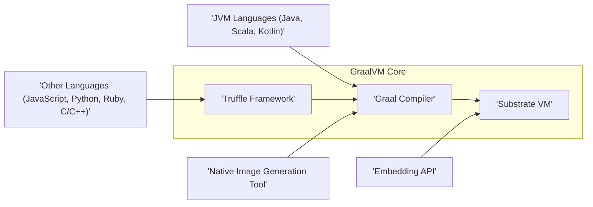
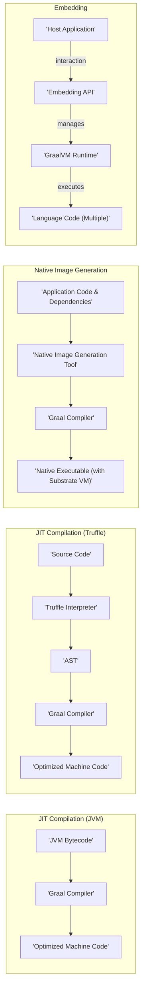

# Project Design Document: GraalVM

**Version:** 1.1
**Date:** October 26, 2023
**Prepared By:** AI Software Architect

## 1. Introduction

This document provides an enhanced high-level architectural design of the GraalVM project, building upon the previous version and focusing on aspects relevant for threat modeling. It is based on the information available in the provided GitHub repository ([https://github.com/oracle/graal](https://github.com/oracle/graal)). This document aims to provide a clear understanding of the system's components and their interactions to facilitate the identification of potential security threats.

## 2. Goals and Objectives

The primary goals of GraalVM are to:

*   Provide a high-performance runtime for multiple programming languages.
*   Enable seamless interoperability between different programming languages.
*   Support efficient ahead-of-time (AOT) compilation to native executables for improved startup time and reduced footprint.
*   Facilitate the embedding of language runtimes into other applications, enabling polyglot capabilities.

## 3. High-Level Architecture

The GraalVM architecture can be broadly divided into the following key components:

**Components:**

*   **Graal Compiler:** A sophisticated just-in-time (JIT) compiler, implemented in Java, responsible for optimizing code execution within the GraalVM runtime.
*   **Substrate VM:** A lightweight, secure virtual machine designed specifically for executing native images generated by GraalVM. It provides essential runtime services with a focus on security and minimal footprint.
*   **Truffle Framework:** A language implementation framework that simplifies the creation of interpreters for various programming languages. These interpreters can then be leveraged by the Graal compiler for optimization.
*   **JVM Languages:**  Languages like Java, Scala, and Kotlin that are designed to run on the Java Virtual Machine and can benefit from the Graal compiler's advanced optimizations when executed on GraalVM.
*   **Other Languages:** Languages such as JavaScript, Python, Ruby, and C/C++ that are implemented using the Truffle framework, enabling them to run on GraalVM and potentially achieve significant performance improvements through Graal compilation.
*   **Native Image Generation Tool:** A crucial tool that performs ahead-of-time compilation of applications into standalone native executables. This process eliminates the need for a traditional VM at runtime, improving startup time and reducing resource consumption.
*   **Embedding API:**  Provides developers with the capability to embed GraalVM language runtimes into their existing applications, facilitating polyglot programming within a single application process.

## 4. Detailed Component Descriptions

*   **Graal Compiler:**
    *   **Functionality:** Performs advanced optimizations on bytecode (for JVM languages) or abstract syntax trees (ASTs) (for Truffle languages). This includes techniques like inlining, escape analysis, and loop optimizations.
    *   **Key Features:** Graph-based intermediate representation, speculative optimizations, and support for various optimization levels.
    *   **Interaction (Security Relevance):** Receives potentially untrusted bytecode or ASTs. Vulnerabilities in the compiler could lead to incorrect code generation, potentially bypassing security checks or introducing vulnerabilities.
    *   **Interaction:** Receives bytecode from JVM languages or ASTs from Truffle-based languages. Outputs highly optimized machine code.

*   **Substrate VM:**
    *   **Functionality:** Provides a secure and minimal runtime environment for native images. It manages memory, threads, and provides necessary system interfaces.
    *   **Key Features:**  Ahead-of-time compilation focus, reduced attack surface, and security-conscious design.
    *   **Interaction (Security Relevance):** Executes native code generated by the Native Image Generation Tool. Security of the Substrate VM is paramount as it directly executes the application code. Limited reflection and dynamic features reduce the potential for runtime manipulation but require careful configuration.
    *   **Interaction:** Executes the native code generated by the Native Image Generation Tool.

*   **Truffle Framework:**
    *   **Functionality:**  Offers a set of APIs and tools for building efficient and interoperable language interpreters.
    *   **Key Features:** Automatic AST construction, partial evaluation, meta-tracing, and language interoperability features.
    *   **Interaction (Security Relevance):** Language implementations built on Truffle handle parsing and execution of potentially untrusted code. Vulnerabilities in the interpreter or the framework itself could be exploited. The framework's interoperability features require careful consideration of cross-language security boundaries.
    *   **Interaction:** Language implementations built on Truffle provide ASTs to the Graal compiler for optimization.

*   **JVM Languages (Java, Scala, Kotlin):**
    *   **Functionality:**  Standard JVM languages that can be executed on GraalVM, benefiting from its performance optimizations.
    *   **Key Features:**  Mature ecosystems, extensive libraries, and established security models.
    *   **Interaction (Security Relevance):**  Existing JVM security mechanisms are generally respected, but the interaction with the Graal compiler introduces a new layer that needs scrutiny.
    *   **Interaction:**  Their bytecode is processed by the Graal compiler.

*   **Other Languages (JavaScript, Python, Ruby, C/C++):**
    *   **Functionality:**  Languages implemented using the Truffle framework to run on GraalVM, enabling polyglot capabilities and potential performance gains.
    *   **Key Features:**  Interoperability with other GraalVM languages, access to native capabilities (for languages like C/C++).
    *   **Interaction (Security Relevance):**  Security depends heavily on the correctness and security of the Truffle language implementations. Interoperability requires careful management of data and control flow between languages to prevent security breaches. Executing native code through languages like C/C++ introduces inherent risks.
    *   **Interaction:**  Their interpreters, built on Truffle, provide ASTs to the Graal compiler.

*   **Native Image Generation Tool:**
    *   **Functionality:**  Performs static analysis and ahead-of-time compilation to produce standalone native executables. This involves building a closed-world assumption of the application.
    *   **Key Features:**  Elimination of runtime compilation overhead, reduced startup time, smaller footprint, and enhanced security posture due to the removal of dynamic classloading and reflection (by default).
    *   **Interaction (Security Relevance):**  The process of native image generation needs to be secure to prevent the introduction of malicious code or vulnerabilities during the build process. The tool relies on static analysis, which might not catch all potential vulnerabilities. Configuration of the native image build process is crucial for security (e.g., handling of reflection, JNI).
    *   **Interaction:**  Takes application code (bytecode or source) and configuration as input. Outputs a platform-specific executable containing the compiled code and a Substrate VM.

*   **Embedding API:**
    *   **Functionality:**  Allows embedding GraalVM language runtimes into native applications, enabling polyglot capabilities within a single application process.
    *   **Key Features:**  APIs for initializing language contexts, executing code, and exchanging data between languages.
    *   **Interaction (Security Relevance):**  The Embedding API needs to provide secure mechanisms for isolating embedded language runtimes and managing access to resources. Improper use of the API could lead to security vulnerabilities, such as allowing untrusted code to execute with elevated privileges or bypassing security checks. Data exchange between languages needs to be handled securely to prevent cross-language attacks.
    *   **Interaction:**  Provides APIs to initialize language contexts, execute code, and exchange data between languages.

## 5. Data Flow

The data flow within GraalVM varies depending on the execution mode:

*   **JIT Compilation (JVM Languages):**
    *   'JVM Bytecode' -> 'Graal Compiler' -> 'Optimized Machine Code'

*   **JIT Compilation (Truffle Languages):**
    *   'Source Code' -> 'Truffle Interpreter' -> 'AST' -> 'Graal Compiler' -> 'Optimized Machine Code'

*   **Native Image Generation:**
    *   'Application Code & Dependencies' -> 'Native Image Generation Tool' -> 'Graal Compiler' -> 'Native Executable (with Substrate VM)'

*   **Embedding:**
    *   'Host Application' <-> 'Embedding API' <-> 'GraalVM Runtime' <-> 'Language Code (Multiple)'

## 6. Key Technologies

*   **Java:** The primary language for the Graal compiler and much of the GraalVM infrastructure.
*   **C/C++:** Used for the Substrate VM and some performance-critical native components.
*   **LLVM:**  Can be used as a backend for code generation in certain configurations.
*   **Truffle Framework APIs:**  Java-based APIs for building language interpreters.
*   **JVM Bytecode:** The intermediate representation for JVM languages.
*   **Native Image Configuration Files:**  Used to guide the native image generation process, including specifying reachable code and resources.

## 7. Deployment Model

GraalVM offers flexible deployment options:

*   **Standalone VM:** Deployed as a direct replacement for a traditional JVM, capable of running Java and other GraalVM-supported languages with potential performance benefits.
*   **Native Executables:** Applications are compiled into self-contained, platform-specific executables using the Native Image Generation Tool. These executables include the necessary Substrate VM and eliminate the need for a separate VM installation, simplifying deployment and reducing resource requirements.
*   **Embedded Runtime:** Language runtimes are embedded within existing applications using the Embedding API, enabling polyglot capabilities within a single application process. This allows leveraging the strengths of different languages within a cohesive application.

## 8. Security Considerations (For Threat Modeling)

This section outlines potential security concerns relevant for threat modeling, categorized by component:

*   **Graal Compiler:**
    *   **Threat:** Compiler vulnerabilities leading to incorrect or insecure code generation.
    *   **Threat:** Supply chain attacks targeting compiler dependencies.
    *   **Threat:** Exploitation of speculative execution vulnerabilities during compilation.

*   **Substrate VM:**
    *   **Threat:** Vulnerabilities in VM isolation allowing for cross-application or cross-tenant breaches.
    *   **Threat:** Memory safety issues leading to arbitrary code execution.
    *   **Threat:** Exploitation of limited reflection capabilities or JNI interactions.

*   **Truffle Framework:**
    *   **Threat:** Vulnerabilities in the framework allowing for sandbox escapes or privilege escalation.
    *   **Threat:** Exploitation of vulnerabilities within individual language interpreters built on Truffle.
    *   **Threat:** Security issues arising from the interoperability features, allowing malicious code in one language to affect others.

*   **Native Image Generation Tool:**
    *   **Threat:** Introduction of vulnerabilities during the build process due to compromised dependencies or insecure build configurations.
    *   **Threat:** Limitations of static analysis leading to the inclusion of vulnerable code or unintended functionality in the native image.
    *   **Threat:** Manipulation of native image configuration files to bypass security restrictions.

*   **Embedding API:**
    *   **Threat:** Improper use of the API leading to insecure integration of embedded runtimes.
    *   **Threat:** Cross-language attacks exploiting vulnerabilities in the data exchange mechanisms.
    *   **Threat:** Failure to properly isolate embedded language runtimes, allowing for resource exhaustion or interference.

*   **General Security Considerations:**
    *   **Threat:** Injection attacks targeting input processed by GraalVM components.
    *   **Threat:** Vulnerabilities in the update mechanisms for GraalVM components.
    *   **Threat:** Resource exhaustion attacks targeting the GraalVM runtime or native images.
    *   **Threat:** Side-channel attacks exploiting timing differences or other observable behavior.

## 9. Assumptions and Constraints

*   This design document is based on publicly available information and the general architecture of GraalVM. Specific implementation details might vary.
*   The security considerations are high-level and require further detailed analysis and penetration testing to identify specific vulnerabilities.
*   It is assumed that the underlying operating system and hardware provide a basic level of security.
*   The security of third-party libraries and dependencies used by applications running on GraalVM is the responsibility of the application developers.
*   The project is under active development, and the architecture and features are subject to change.

This improved document provides a more detailed and security-focused overview of the GraalVM architecture, intended to be a valuable resource for subsequent threat modeling activities.