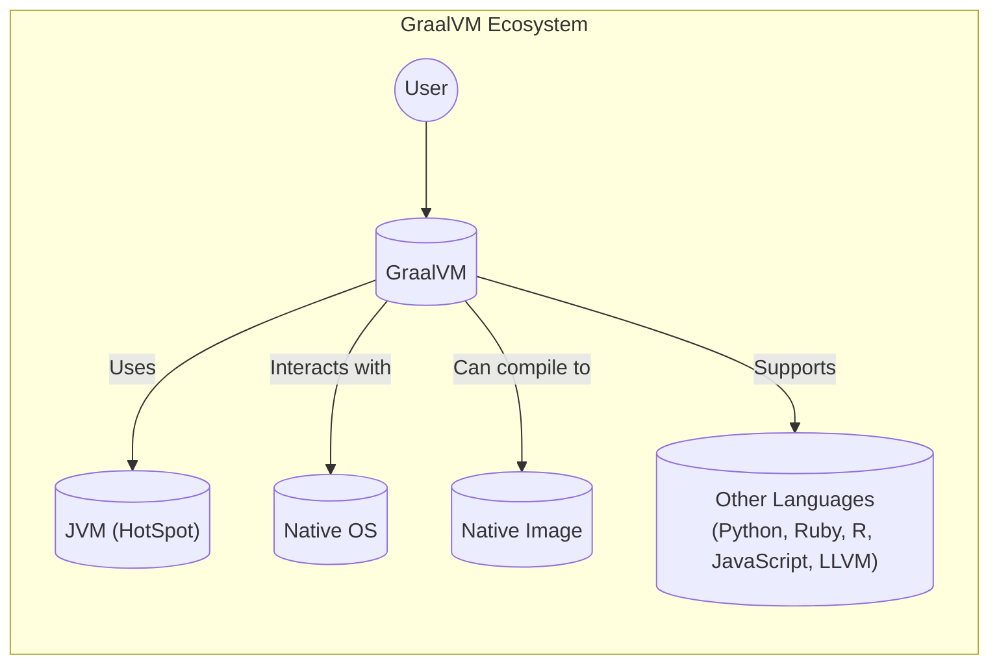
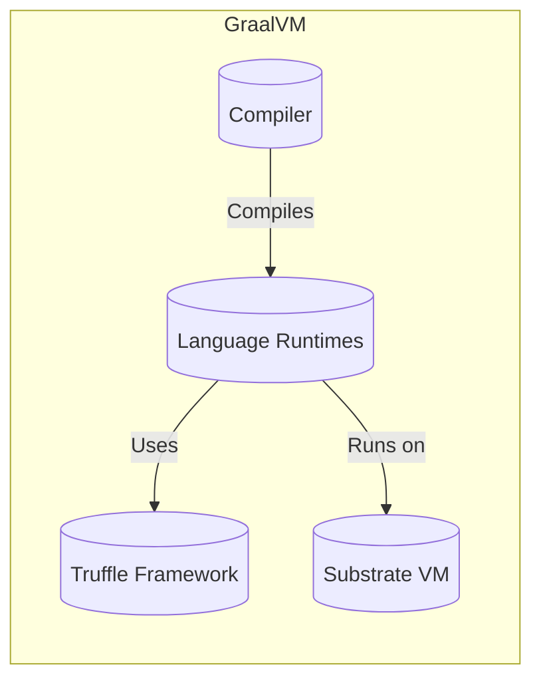
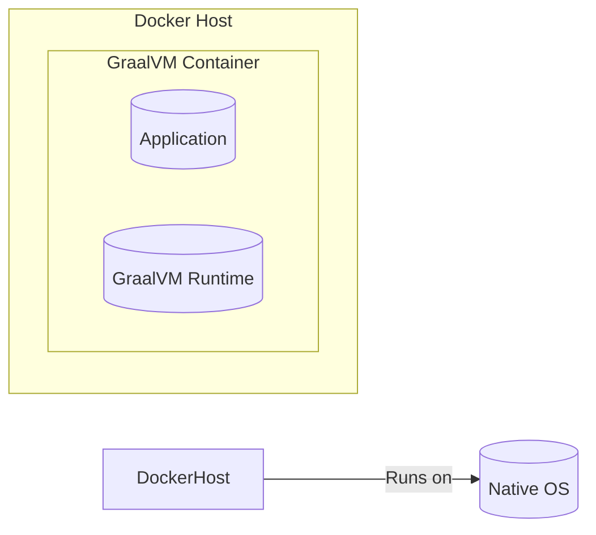
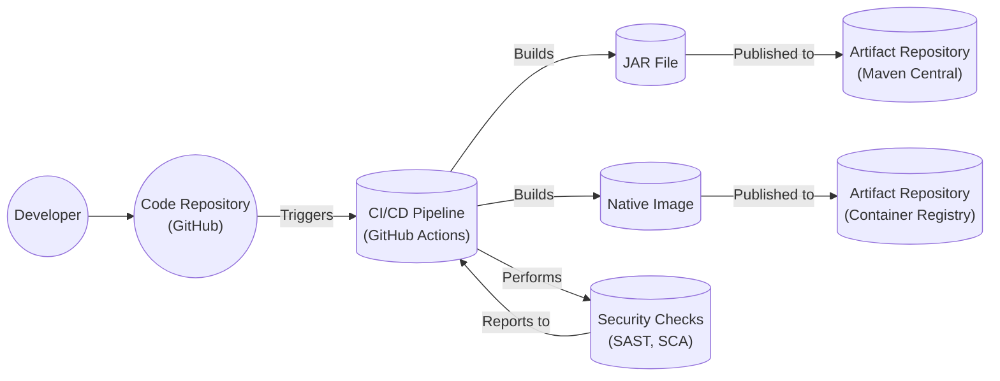

# Project Design Document: GraalVM

## BUSINESS POSTURE

GraalVM is a high-performance, embeddable, polyglot runtime from Oracle. It aims to improve application performance and efficiency while providing seamless interoperability between different programming languages. Given its nature and backing by Oracle, a large enterprise, we can infer the following business priorities and goals:

Priorities:

*   Performance: Significantly improve the performance of applications, especially those written in Java and other JVM-based languages.
*   Efficiency: Reduce resource consumption (CPU, memory) of applications.
*   Polyglot Support: Enable developers to use the best language for a specific task without performance penalties or complex interoperability issues.
*   Developer Productivity: Simplify development by allowing developers to use familiar tools and libraries across different languages.
*   Enterprise Adoption: Drive adoption of GraalVM in enterprise environments, positioning it as a superior runtime for cloud and microservices architectures.
*   Innovation: Push the boundaries of runtime technology and contribute to the evolution of programming languages and virtual machines.

Goals:

*   Become a leading runtime for cloud-native applications.
*   Attract a large and active community of developers and contributors.
*   Establish GraalVM as a viable alternative to traditional JVMs.
*   Generate revenue through commercial offerings (e.g., GraalVM Enterprise Edition).
*   Integrate with popular frameworks and tools.

Business Risks:

*   Security Vulnerabilities: As a complex runtime environment, GraalVM is susceptible to security vulnerabilities that could be exploited by attackers. This is a critical risk given its potential use in enterprise and cloud environments.
*   Compatibility Issues: Ensuring compatibility with existing applications and libraries is crucial for adoption. Incompatibilities could hinder migration and lead to user frustration.
*   Performance Regressions: While performance is a key priority, there's a risk of introducing performance regressions in specific scenarios or for certain workloads.
*   Complexity: The polyglot nature and advanced features of GraalVM introduce complexity, which could make it challenging for developers to understand and use effectively.
*   Competition: GraalVM faces competition from other JVM implementations and alternative runtime environments.

## SECURITY POSTURE

Existing Security Controls:

*   security control: Secure Coding Practices: The project likely follows secure coding practices to minimize vulnerabilities. This is implied by Oracle's involvement and the project's maturity. (Location: Development process, not explicitly documented in the repository's root).
*   security control: Regular Security Audits: Given Oracle's security focus, it's highly probable that GraalVM undergoes regular security audits, both internal and external. (Location: Not directly visible in the repository, but expected from an Oracle project).
*   security control: Vulnerability Reporting Program: Oracle likely has a vulnerability reporting program that encourages responsible disclosure of security issues. (Location: Oracle's general security policies).
*   security control: Code Reviews: The project uses GitHub, which facilitates code reviews as part of the development workflow. (Location: GitHub pull requests).
*   security control: Static Analysis: It's likely that static analysis tools are used to identify potential security vulnerabilities during development. (Location: Not explicitly mentioned, but standard practice for a project of this scale).
*   security control: Fuzzing: Fuzzing is a technique that is likely used to test the robustness of GraalVM components. (Location: Not explicitly mentioned, but standard practice).

Accepted Risks:

*   accepted risk: Complexity of Polyglot Runtime: The inherent complexity of supporting multiple languages increases the attack surface and the potential for unforeseen interactions that could lead to vulnerabilities.
*   accepted risk: Reliance on External Libraries: GraalVM depends on various external libraries, which may have their own security vulnerabilities.
*   accepted risk: Emerging Technology: As a relatively new technology, GraalVM may have undiscovered vulnerabilities that are not yet known to the security community.

Recommended Security Controls:

*   Implement Software Composition Analysis (SCA): To track and manage dependencies and their associated vulnerabilities.
*   Implement Dynamic Application Security Testing (DAST): To identify vulnerabilities in the running application.
*   Enhance Fuzzing Coverage: Expand fuzzing efforts to cover a wider range of inputs and components.
*   Security Training for Developers: Provide regular security training to developers to ensure they are aware of the latest security threats and best practices.

Security Requirements:

*   Authentication:
    *   GraalVM itself does not handle user authentication directly. Authentication is typically managed by the application or framework running on GraalVM.
    *   Requirement: Applications running on GraalVM must implement secure authentication mechanisms appropriate for their use case.

*   Authorization:
    *   Similar to authentication, GraalVM does not directly manage authorization. This is the responsibility of the application or framework.
    *   Requirement: Applications must implement proper authorization controls to restrict access to resources based on user roles and permissions.

*   Input Validation:
    *   GraalVM provides some level of input validation through its language implementations (e.g., type checking in Java). However, applications must perform thorough input validation to prevent vulnerabilities like injection attacks.
    *   Requirement: All input from external sources (e.g., user input, network requests) must be validated before being processed.

*   Cryptography:
    *   GraalVM provides access to cryptographic libraries (e.g., Java Cryptography Architecture).
    *   Requirement: Applications must use strong cryptographic algorithms and manage keys securely. Sensitive data must be encrypted both in transit and at rest.

## DESIGN

### C4 CONTEXT

Element Descriptions:

*   Element: User
    *   Name: User
    *   Type: Person
    *   Description: A developer or end-user interacting with applications running on GraalVM.
    *   Responsibilities: Interacts with applications, provides input, receives output.
    *   Security controls: Authentication and authorization mechanisms within the application.

*   Element: GraalVM
    *   Name: GraalVM
    *   Type: Software System
    *   Description: The core GraalVM runtime environment.
    *   Responsibilities: Executes code, manages memory, provides polyglot capabilities.
    *   Security controls: Secure coding practices, regular security audits, vulnerability reporting program.

*   Element: JVM
    *   Name: JVM (HotSpot)
    *   Type: Software System
    *   Description: The underlying Java Virtual Machine (HotSpot) that GraalVM can run on.
    *   Responsibilities: Provides the base JVM functionality.
    *   Security controls: Standard JVM security features.

*   Element: Native OS
    *   Name: Native OS
    *   Type: Software System
    *   Description: The operating system on which GraalVM runs.
    *   Responsibilities: Provides system resources, manages processes.
    *   Security controls: OS-level security features (e.g., user accounts, file permissions).

*   Element: Native Image
    *   Name: Native Image
    *   Type: Software System
    *   Description: A standalone executable generated by GraalVM Native Image technology.
    *   Responsibilities: Runs as a native application without a JVM.
    *   Security controls: Reduced attack surface compared to running on a full JVM.

*   Element: Other Languages
    *   Name: Other Languages (Python, Ruby, R, JavaScript, LLVM)
    *   Type: Software System
    *   Description: Programming languages supported by GraalVM.
    *   Responsibilities: Provide language-specific runtime environments.
    *   Security controls: Language-specific security features and sandboxing mechanisms.

### C4 CONTAINER

Element Descriptions:

*   Element: Compiler
    *   Name: Compiler
    *   Type: Container
    *   Description: The GraalVM compiler, which optimizes code for different languages.
    *   Responsibilities: Performs just-in-time (JIT) compilation, ahead-of-time (AOT) compilation (for Native Image).
    *   Security controls: Code analysis and optimization techniques to mitigate potential vulnerabilities.

*   Element: Language Runtimes
    *   Name: Language Runtimes
    *   Type: Container
    *   Description: Runtime environments for supported languages (e.g., Java, JavaScript, Python).
    *   Responsibilities: Execute code, manage language-specific data structures.
    *   Security controls: Language-specific security features, sandboxing, and isolation mechanisms.

*   Element: Truffle Framework
    *   Name: Truffle Framework
    *   Type: Container
    *   Description: A framework for building language interpreters and tools.
    *   Responsibilities: Provides APIs for creating language implementations, enables interoperability between languages.
    *   Security controls: Secure design principles for language interoperability.

*   Element: Substrate VM
    *   Name: Substrate VM
    *   Type: Container
    *   Description: A framework for building native images.
    *   Responsibilities: Provides a minimal runtime environment for native images, manages memory, handles system calls.
    *   Security controls: Reduced attack surface, memory safety features.

### DEPLOYMENT

Possible Deployment Solutions:

1.  **Traditional JVM Deployment:** GraalVM can be used as a drop-in replacement for the standard HotSpot JVM. Applications are packaged as JAR files and executed using the `java` command.
2.  **Native Image Deployment:** Applications can be compiled into standalone native images using GraalVM Native Image. This results in faster startup times and reduced resource consumption.
3.  **Containerized Deployment (Docker):** GraalVM can be used within Docker containers, both for running applications on the JVM and for deploying native images.
4.  **Cloud Platform Deployment (e.g., Kubernetes):** GraalVM can be deployed on cloud platforms like Kubernetes, leveraging container orchestration capabilities.

Chosen Deployment Solution (Containerized Deployment with Docker):

Element Descriptions:

*   Element: Docker Host
    *   Name: Docker Host
    *   Type: Infrastructure Node
    *   Description: The physical or virtual machine that runs the Docker engine.
    *   Responsibilities: Hosts Docker containers.
    *   Security controls: OS-level security, Docker daemon security configuration.

*   Element: GraalVM Container
    *   Name: GraalVM Container
    *   Type: Container
    *   Description: A Docker container running the GraalVM runtime and the application.
    *   Responsibilities: Provides an isolated environment for the application.
    *   Security controls: Container isolation, image security scanning, minimal base image.

*   Element: Application
    *   Name: Application
    *   Type: Container
    *   Description: The application code running on GraalVM.
    *   Responsibilities: Performs the application's business logic.
    *   Security controls: Application-level security measures (authentication, authorization, input validation, etc.).

*   Element: GraalVM Runtime
    *   Name: GraalVM Runtime
    *   Type: Container
    *   Description: The GraalVM runtime environment within the container.
    *   Responsibilities: Executes the application code.
    *   Security controls: GraalVM's built-in security features.

*   Element: Native OS
    *   Name: Native OS
    *   Type: Infrastructure Node
    *   Description: Operating System of Docker Host.
    *   Responsibilities: Provides system resources.
    *   Security controls: OS-level security features.

### BUILD

Build Process Description:

1.  Developers commit code to the GitHub repository.
2.  This triggers the CI/CD pipeline (likely GitHub Actions, given the repository).
3.  The CI pipeline performs various build steps, including:
    *   Compiling code.
    *   Running unit tests.
    *   Performing security checks (SAST, SCA).
    *   Building JAR files (for JVM deployment).
    *   Building native images (using GraalVM Native Image).
4.  Build artifacts (JAR files, native images) are published to artifact repositories (e.g., Maven Central for JARs, a container registry for native images).

Security Controls in Build Process:

*   Code Reviews: Enforced through GitHub pull requests.
*   Static Application Security Testing (SAST): Integrated into the CI pipeline to identify vulnerabilities in the source code.
*   Software Composition Analysis (SCA): Used to identify and manage vulnerabilities in dependencies.
*   Build Automation: Ensures consistent and repeatable builds, reducing the risk of manual errors.
*   Artifact Signing: Build artifacts (JARs, native images) should be digitally signed to ensure their integrity and authenticity. (Not explicitly mentioned, but recommended).

## RISK ASSESSMENT

Critical Business Processes:

*   Application execution: GraalVM is responsible for running applications, so its stability and performance are critical.
*   Polyglot language support: The ability to seamlessly execute code from different languages is a key feature.
*   Native image generation: Native Image technology is a major differentiator for GraalVM.

Data Sensitivity:

*   GraalVM itself does not store or manage sensitive data directly. However, the applications running on GraalVM may handle sensitive data. The sensitivity of this data depends on the specific application.
*   Examples:
    *   A financial application running on GraalVM would handle highly sensitive financial data.
    *   A simple web application might only handle moderately sensitive user data (e.g., usernames, email addresses).
    *   A command-line utility might not handle any sensitive data.

## QUESTIONS & ASSUMPTIONS

Questions:

*   What specific SAST and SCA tools are used in the GraalVM build process?
*   Are there any specific security certifications or compliance requirements that GraalVM aims to meet?
*   What is the process for handling security vulnerabilities discovered in GraalVM?
*   What are the specific performance benchmarks and targets for GraalVM?
*   What level of support is provided for different operating systems and architectures?
*   Is there a detailed threat model for GraalVM?

Assumptions:

*   BUSINESS POSTURE: Oracle prioritizes security and invests significant resources in securing GraalVM.
*   SECURITY POSTURE: Secure coding practices, regular security audits, and a vulnerability reporting program are in place.
*   DESIGN: The provided C4 diagrams and deployment model represent a common and recommended configuration, but specific deployments may vary. The build process utilizes CI/CD and includes security checks.