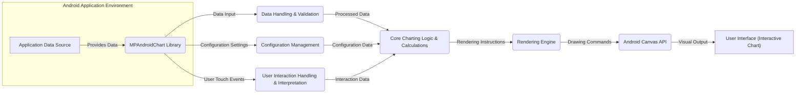

# Project Design Document: MPAndroidChart Library

**Version:** 1.1
**Date:** October 26, 2023
**Author:** AI Software Architect

## 1. Introduction

This document provides an enhanced design overview of the MPAndroidChart library, an open-source charting library for the Android platform. This revised document aims to provide even greater clarity and detail regarding the library's architecture, data flow, and interactions, specifically to facilitate more effective and targeted threat modeling activities.

## 2. Goals

*   Provide a highly detailed and clear understanding of the MPAndroidChart library's architecture.
*   Precisely identify key components and their interactions with a focus on potential security boundaries.
*   Thoroughly outline the data flow within the library, highlighting potential points of data manipulation or interception.
*   Serve as a robust and actionable foundation for subsequent threat modeling activities, enabling the identification of specific vulnerabilities.

## 3. Non-Goals

*   This document does not aim to provide an exhaustive, line-by-line code-level analysis of the library.
*   It does not cover the intricate implementation details of every single chart type and customization option.
*   It does not include performance benchmarking, optimization strategies, or detailed resource consumption analysis.

## 4. High-Level Architecture

The MPAndroidChart library's architecture can be visualized through the following key components and their interactions:

*   **Android Application Environment:** The encompassing environment where the Android application integrating MPAndroidChart resides.
*   **MPAndroidChart Library:** The core charting library, acting as a self-contained unit within the application.
*   **Application Data Source:** The origin of the data to be visualized, which could be local storage, network APIs, or user input.
*   **Data Handling & Validation:** Components responsible for receiving data, parsing it into usable formats, and potentially validating its integrity and format.
*   **Core Charting Logic & Calculations:** The central part of the library where data is transformed into visual representations, including calculations for axes, positions, and sizes.
*   **Rendering Engine:** Components that translate the calculated charting logic into specific drawing instructions for the Android Canvas.
*   **Android Canvas API:** The Android system-level API used by the rendering engine to draw primitives (lines, shapes, text) on the screen.
*   **User Interface (Interactive Chart):** The visual representation of the chart displayed to the user, capable of responding to interactions.
*   **Configuration Management:** Components that handle the various settings and parameters used to customize the chart's appearance and behavior.
*   **User Interaction Handling & Interpretation:** Components that capture user touch events and interpret them as actions like zooming, panning, or selecting data points.

## 5. Detailed Design

This section provides a more granular view of the key components and their functionalities, highlighting potential areas of interest for security analysis.

### 5.1. Data Handling & Validation

*   **`DataSet` Implementations (e.g., `LineDataSet`, `BarDataSet`, `PieDataSet`):** Classes responsible for holding the data to be charted. These accept various data types and structures. *Potential Threat:* Improper handling of unexpected data types or formats could lead to errors or vulnerabilities.
*   **`Entry` Objects:** Represent individual data points within a `DataSet`. They typically contain a numerical value and an optional label or index. *Potential Threat:*  Maliciously crafted labels could be vectors for injection attacks if not properly sanitized during rendering.
*   **Data Formatters:** Classes that format the display of data values on the chart axes and labels. *Potential Threat:* Vulnerabilities in formatting logic could lead to incorrect data representation or even application crashes.
*   **Input Validation Mechanisms:** (To be investigated) The library might have internal mechanisms to validate the input data. Understanding these is crucial for identifying bypass opportunities.

### 5.2. Core Charting Logic & Calculations

*   **`Renderer` Classes (e.g., `LineChartRenderer`, `BarChartRenderer`, `PieChartRenderer`):**  Implement the specific logic for drawing different chart types based on the provided data. *Potential Threat:* Bugs in the rendering logic could lead to incorrect visualizations or unexpected behavior that could be exploited.
*   **Axis Calculators (`XAxisRenderer`, `YAxisRenderer`):** Calculate the ranges, intervals, and labels for the chart axes. *Potential Threat:*  Flaws in axis calculation could lead to incorrect data representation or denial-of-service if extreme values are provided.
*   **Value Calculation and Mapping:** Logic that maps data values to pixel coordinates on the chart. *Potential Threat:*  Errors in these calculations could lead to visual misrepresentation of data or potential for information leakage if sensitive data is involved.
*   **Highlighting Logic:** Determines how data points are highlighted upon user interaction. *Potential Threat:*  Vulnerabilities in highlighting logic could be exploited to trigger unintended actions or reveal information.
*   **Zoom and Pan Implementation:**  Handles the logic for zooming and panning the chart view. *Potential Threat:*  Improperly implemented zoom/pan could lead to denial-of-service if excessive zooming is allowed or expose unintended data ranges.

### 5.3. Rendering Engine

*   **`ChartView` Classes (e.g., `LineChartView`, `BarChartView`):** Android `View` subclasses that manage the rendering process and interact with the `Renderer` classes. *Potential Threat:*  Vulnerabilities in the `View` lifecycle or rendering pipeline could be exploited.
*   **Android Canvas API Interactions:** The library uses the Android `Canvas` API for drawing. *Potential Threat:* While the `Canvas` API itself is part of the Android framework, improper usage within the library could lead to drawing errors or resource exhaustion.
*   **`Paint` Object Usage:** `Paint` objects define the style of drawing elements. *Potential Threat:*  While less likely to be a direct vulnerability, improper `Paint` configuration could lead to visual inconsistencies or performance issues.
*   **Drawing Order Management:** The order in which elements are drawn can affect the final visual output. *Potential Threat:*  Incorrect drawing order could obscure important information or be used for visual spoofing.

### 5.4. Configuration Management

*   **Chart Options Objects:** Objects that hold various configuration settings (colors, labels, axis ranges, etc.). *Potential Threat:* Insecure default configurations could expose sensitive information or make the chart vulnerable to certain attacks.
*   **Setter Methods:** Public methods on `ChartView` and `DataSet` objects used to configure the chart. *Potential Threat:*  Improper validation within setter methods could allow for invalid or malicious configurations.
*   **XML Attribute Handling:**  Parsing and applying configuration settings defined in Android layout XML files. *Potential Threat:*  Vulnerabilities in XML parsing could be exploited to inject malicious configurations.

### 5.5. User Interaction Handling & Interpretation

*   **Touch Event Listeners:**  Handle touch events on the `ChartView`. *Potential Threat:*  Improper handling of touch events could lead to denial-of-service or unexpected behavior.
*   **Gesture Detection Logic:** Interprets touch sequences as specific gestures (zoom, pan, tap). *Potential Threat:*  Bypass vulnerabilities in gesture detection could lead to unintended actions.
*   **Callback Interfaces (e.g., `OnChartValueSelectedListener`):** Allow the integrating application to respond to user interactions. *Potential Threat:*  If not used carefully by the integrating application, data passed through callbacks could be misused.

## 6. Data Flow (Detailed)

A more detailed breakdown of the data flow within MPAndroidChart, highlighting potential points of interest for security analysis:

```mermaid
graph LR
    A["Application Data Source"] -- "Raw Data" --> B("Application Logic");
    B -- "Data Preparation" --> C("Create DataSet Object (e.g., LineDataSet)");
    C -- "Data Population" --> D("Populate DataSet with Entry Objects");
    D -- "Aggregation" --> E("Create ChartData Object (e.g., LineData)");
    E -- "Configuration" --> F("Set ChartData on ChartView");
    F -- "Trigger Render" --> G("ChartView Lifecycle & Rendering Initiation");
    G -- "Data Access" --> H("Data Handling & Validation Components");
    H -- "Processed Data" --> I("Core Charting Logic & Calculations");
    I -- "Rendering Instructions" --> J("Rendering Engine");
    J -- "Canvas Commands" --> K("Android Canvas API");
    K -- "Visual Output" --> L["Chart Displayed on Screen"];
    L -- "User Interaction (Touch)" --> M("User Interaction Handling Components");
    M -- "Interaction Interpretation" --> N("Core Charting Logic (for interaction feedback)");
    N -- "Updated Rendering Instructions" --> J;
```

1. **Application Data Source:** Provides the initial raw data.
2. **Application Logic:**  The application prepares and structures the data.
3. **Create DataSet Object:** An appropriate `DataSet` object is instantiated.
4. **Populate DataSet with Entry Objects:** Data points are added to the `DataSet`.
5. **Create ChartData Object:** A `ChartData` object is created, holding the `DataSet`.
6. **Set ChartData on ChartView:** The `ChartData` is passed to the `ChartView`.
7. **ChartView Lifecycle & Rendering Initiation:** Setting the data triggers the rendering process.
8. **Data Handling & Validation Components:** The library processes and potentially validates the data.
9. **Core Charting Logic & Calculations:** Data is transformed into visual elements.
10. **Rendering Engine:** Generates drawing instructions.
11. **Android Canvas API:**  Draws the chart on the screen.
12. **Chart Displayed on Screen:** The user sees the rendered chart.
13. **User Interaction (Touch):** The user interacts with the chart.
14. **User Interaction Handling Components:** Touch events are captured and interpreted.
15. **Core Charting Logic (for interaction feedback):** The chart logic responds to the interaction (e.g., highlighting).
16. **Updated Rendering Instructions:** The rendering engine updates the display based on the interaction.

## 7. Key Components (with Security Focus)

*   **`ChartView` Subclasses:** Entry point for displaying charts. *Security Focus:* Vulnerabilities here could affect the entire chart display and interaction.
*   **`Data` and `DataSet` Classes:** Hold the data to be visualized. *Security Focus:*  Potential for data injection or manipulation if not handled carefully.
*   **`Entry` Class:** Represents individual data points. *Security Focus:*  Maliciously crafted labels or values could be problematic.
*   **`Renderer` Classes:** Responsible for drawing. *Security Focus:* Bugs could lead to incorrect rendering or denial-of-service.
*   **`AxisRenderer` Classes:** Manage axis display. *Security Focus:*  Flaws could lead to misrepresentation of data.
*   **`Legend` Class:** Displays the chart legend. *Security Focus:*  Potential for injection attacks if legend labels are not sanitized.
*   **`Animator` Class:** Handles animations. *Security Focus:*  Complex animations could be a vector for denial-of-service.
*   **Event Listener Interfaces:** Handle user interactions. *Security Focus:*  Improper handling could lead to unexpected behavior or security vulnerabilities.

## 8. External Dependencies

The MPAndroidChart library depends on the Android SDK. It's crucial to be aware of transitive dependencies introduced through the build system (e.g., through Gradle).

*   **Android SDK:** The core Android development libraries. *Security Focus:* Ensure the target Android SDK version is up-to-date with security patches.
*   **Support Libraries/AndroidX Libraries:**  May be used for compatibility and additional features. *Security Focus:* Regularly check for vulnerabilities in these dependencies.
*   **Third-Party Libraries (if any):**  The library might indirectly depend on other third-party libraries. *Security Focus:*  Maintain an inventory of all dependencies and monitor them for security vulnerabilities.

## 9. Security Considerations (Enhanced for Threat Modeling)

This section expands on the initial security considerations, providing more specific examples and potential attack scenarios:

*   **Malicious Data Injection:**
    *   **Scenario:** An attacker provides a large number of data points with extreme values, potentially causing integer overflows or excessive memory consumption during rendering, leading to a denial-of-service.
    *   **Scenario:**  Crafted data labels containing script tags could potentially lead to cross-site scripting (XSS) if the chart is rendered within a WebView and labels are not properly sanitized.
*   **Denial of Service (DoS):**
    *   **Scenario:**  Providing a configuration with an extremely high number of grid lines or labels could overwhelm the rendering engine, causing the application to become unresponsive.
    *   **Scenario:**  Triggering rapid and continuous zoom/pan actions could potentially exhaust resources and lead to a temporary denial of service.
*   **UI Redressing/Clickjacking:**
    *   **Scenario:** An attacker overlays a malicious UI element on top of the chart, tricking the user into interacting with the attacker's element instead of the chart. This is more of an application-level concern but the chart's structure could influence its susceptibility.
*   **Information Disclosure:**
    *   **Scenario:** If sensitive data is being visualized, ensure that tooltips or data labels do not inadvertently expose more information than intended.
    *   **Scenario:**  Errors in axis calculations or scaling could potentially misrepresent data, leading to unintentional disclosure of sensitive ranges or values.
*   **Dependency Vulnerabilities:**
    *   **Scenario:**  A known vulnerability in a support library used by MPAndroidChart could be exploited to compromise the application. Regularly updating dependencies is crucial.
*   **Insecure Defaults:**
    *   **Scenario:** Default configurations might not enforce proper input validation or sanitization, making the chart more susceptible to injection attacks.
*   **Cross-Site Scripting (XSS) via Labels/Tooltips:**
    *   **Scenario:** If user-provided data is directly used in labels or tooltips without proper encoding, it could allow attackers to inject malicious scripts that execute within the context of a WebView (if applicable).
*   **Integer Overflow/Underflow:**
    *   **Scenario:**  Calculations involving chart dimensions, data point positions, or axis ranges could be vulnerable to integer overflow or underflow if extremely large or small values are provided, potentially leading to unexpected behavior or crashes.
*   **Resource Exhaustion:**
    *   **Scenario:**  Rendering charts with a very large number of data series or complex customizations could consume excessive memory or CPU resources, leading to performance degradation or application crashes.

This improved design document provides a more detailed and security-focused understanding of the MPAndroidChart library, enabling more effective threat modeling and identification of potential vulnerabilities.