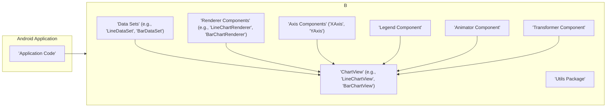
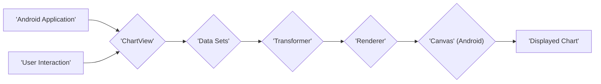

# Project Design Document: MPAndroidChart Library

**Version:** 1.1
**Date:** October 26, 2023
**Author:** AI Software Architect

## 1. Introduction

This document provides an enhanced and more detailed design overview of the MPAndroidChart library, an open-source Android charting library. This document aims to comprehensively describe the library's architecture, core components, intricate data flow mechanisms, and external interaction points. This refined information will serve as a robust foundation for subsequent threat modeling activities, enabling a more thorough security analysis.

## 2. Goals and Objectives

The primary goal of MPAndroidChart is to empower Android developers with a versatile and intuitive charting library. Key objectives include:

*   Broad Chart Type Support: Enabling the creation of diverse chart visualizations, including line, bar, pie, scatter, candlestick, and more.
*   Extensive Customization Capabilities: Offering granular control over chart aesthetics and behavior, allowing developers to tailor charts to their specific needs.
*   Optimized Performance and Responsiveness: Ensuring smooth and efficient chart rendering and interaction, even with large datasets, on a variety of Android devices.
*   Comprehensive Documentation and Active Development: Maintaining clear and up-to-date documentation alongside an active development community for ongoing support and feature enhancements.
*   Seamless Integration into Android Projects: Facilitating straightforward inclusion and utilization within existing and new Android application development workflows.

## 3. High-Level Architecture

MPAndroidChart operates as a self-contained library seamlessly integrated into Android applications to facilitate chart rendering. The central architectural element is the `ChartView`, which extends Android's `View` and orchestrates rendering and user interaction. Data is supplied to the `ChartView` through specialized `DataSet` objects.

## 4. Detailed Design

This section provides an in-depth exploration of the key components and their interactions within the MPAndroidChart library.

### 4.1. Core Components

*   **ChartView:** The foundational class for all chart views, extending Android's `View`. It manages the lifecycle and presentation of the chart.
    *   **Rendering Management:**  Orchestrates the drawing process by delegating to renderer components.
    *   **User Input Handling:** Captures and interprets touch events and gestures for interactions like zooming and panning.
    *   **Data Management Interface:** Provides methods for setting and updating chart data.
    *   **Customization API:** Offers methods to modify chart appearance, including colors, labels, and gridlines.
    *   **Sub-component Management:**  Contains and manages instances of renderers, axes, the legend, and other helper components.
    *   **Layout and Measurement:**  Participates in the Android layout process to determine its size and position.

*   **Data Sets:** Specialized classes designed to hold the data visualized in the chart.
    *   **Entry Storage:** Contains collections of `Entry` objects, where each `Entry` represents a data point with relevant values (e.g., X and Y coordinates).
    *   **Styling Information:** Encapsulates visual attributes specific to the data set, such as color, line thickness, and point styles.
    *   **Label Association:** Holds a label that identifies the data set in the chart legend.

*   **Renderer Components:** Responsible for the visual representation of chart data on the Android `Canvas`.
    *   **Data Iteration:** Processes the data points within the associated `DataSet`.
    *   **Coordinate Transformation:** Utilizes the `Transformer` component to convert data values into pixel coordinates for drawing.
    *   **Primitive Drawing:** Employs Android's `Canvas` API to draw lines, bars, shapes, and text representing the data.
    *   **Highlighting Logic:** Implements visual cues for selected data points.

*   **Axis Components (XAxis, YAxis):** Manage the visual representation and scaling of the chart's axes.
    *   **Line Drawing:** Renders the axis lines.
    *   **Label Generation and Formatting:** Calculates and formats the labels displayed along the axes.
    *   **Scaling and Zooming Management:**  Determines the visible range of the axis based on data and user interaction.
    *   **Grid Line Rendering:** Draws optional grid lines to enhance data readability.

*   **Legend Component:** Provides a visual key to interpret the different data sets or elements within the chart.
    *   **Data Set Information Retrieval:** Obtains labels and styling information from the `DataSet` objects.
    *   **Legend Item Rendering:** Draws symbols and labels representing each data set.
    *   **Layout Management:** Positions the legend within the chart area.

*   **Animator Component:** Facilitates animated transitions for chart drawing and data updates.
    *   **Value Animation:** Smoothly interpolates values during data changes or initial chart rendering.
    *   **Drawing Animation:** Controls the timing and progression of visual elements appearing on the chart.

*   **Transformer Component:** A crucial component responsible for mapping data values to pixel coordinates on the screen.
    *   **Scaling:** Adjusts the data range to fit the chart's viewport.
    *   **Translation:** Shifts the data based on panning interactions.
    *   **Zooming:**  Scales the data to implement zoom functionality.
    *   **Viewport Management:** Keeps track of the currently visible portion of the data.

*   **Utils Package:** Contains a collection of utility classes used across the library.
    *   **Color Handling:** Provides functions for color manipulation and management.
    *   **Value Formatting:** Offers tools for formatting numerical values displayed on the chart.
    *   **Point Calculation:** Includes methods for calculating distances and angles.
    *   **Performance Optimization:** Contains techniques to improve rendering efficiency.

### 4.2. Data Flow

The typical sequence of data processing within MPAndroidChart is as follows:

1. **Data Provision by Application:** The Android application instantiates `DataSet` objects and populates them with `Entry` data points. It's assumed the application handles initial data fetching and validation.
2. **Data Assignment to ChartView:** The application calls methods on the specific `ChartView` instance (e.g., `setData()`, `addEntry()`) to provide the `DataSet`.
3. **Layout and Measurement Phase:** The Android layout system determines the dimensions and placement of the `ChartView` on the screen.
4. **Rendering Initiation (onDraw()):** The `ChartView`'s `onDraw()` method is invoked, triggering the chart rendering process.
5. **Transformation Application:** The `Transformer` component calculates the necessary transformations (scaling, translation based on zoom/pan) to map the logical data coordinates to the pixel coordinates on the `Canvas`.
6. **Rendering by Renderer:** The appropriate `Renderer` (based on the chart type) iterates through the `DataSet` and uses the transformed coordinates and styling information to draw the chart's visual elements (lines, bars, etc.) onto the Android `Canvas`.
7. **Axis and Legend Rendering:** The `Axis` components draw the X and Y axes, including labels and gridlines. The `Legend` component renders the legend based on the provided `DataSet` labels and styles.
8. **User Interaction Handling:** When a user interacts with the chart (e.g., touch, pinch-to-zoom), the `ChartView` intercepts these events, updates the `Transformer`'s parameters (e.g., zoom level, viewport offset), and requests a re-rendering of the chart.

## 5. External Interfaces

MPAndroidChart interacts with its environment through several key interfaces:

*   **Android Framework API:**  The library is built upon and extensively utilizes the Android framework.
    *   **UI Components:**  Relies on `View`, `Canvas`, and `Paint` for rendering and UI management.
    *   **Event Handling:**  Uses `MotionEvent` for processing touch inputs.
    *   **System Services:**  May indirectly interact with system services for resources like fonts and display metrics.
*   **Application Public API:** This is the primary interface for Android applications to interact with the library.
    *   **Data Input Methods:** Functions like `setData()` and `addEntry()` to provide data to the chart.
    *   **Customization Methods:**  Getters and setters for various chart properties (e.g., `getDescription()`, `getXAxis()`, `setColors()`).
    *   **Listener Interfaces:** Interfaces (e.g., `OnChartValueSelectedListener`) to receive notifications about chart events.
*   **Third-Party Libraries (Indirect):** While MPAndroidChart itself has minimal direct dependencies, applications using it might employ other libraries for data fetching, processing, or network communication before providing data to the chart. This interaction is managed at the application level.

## 6. Security Considerations (For Threat Modeling)

The following points highlight potential security considerations relevant for threat modeling the MPAndroidChart library:

*   **Data Injection Vulnerabilities:** If the integrating application provides unsanitized or malicious data to the chart, it could lead to:
    *   **Unexpected Rendering Behavior:**  Malformed data could cause the chart to render incorrectly or display misleading information.
    *   **Resource Exhaustion:**  Extremely large or complex datasets, if not handled properly by the application, could lead to excessive memory consumption or CPU usage, potentially causing the application to slow down or crash.
    *   **Exploitation of Parsing Logic:** If the library has vulnerabilities in how it parses or processes data, malicious input could potentially trigger unexpected behavior.
*   **Denial of Service (DoS) Attacks:**  A malicious actor could attempt to overload the chart rendering process by providing:
    *   **Excessive Data Points:**  Rendering charts with an extremely large number of data points could strain device resources.
    *   **Complex Chart Configurations:**  Highly customized charts with numerous layers or annotations might require significant processing power.
*   **Vulnerabilities in Underlying Android Framework:**  As MPAndroidChart relies on the Android framework, any security vulnerabilities present in the framework could indirectly affect the library. Keeping the Android system updated is crucial.
*   **Information Disclosure Risks:** While primarily a visualization tool, if the application displays sensitive information using the chart without appropriate safeguards (e.g., data obfuscation, access controls), it could lead to unauthorized disclosure. This is primarily an application-level concern.
*   **Cross-Site Scripting (XSS) via WebView (If Applicable):** If the chart is rendered within a `WebView` and the application dynamically generates chart labels or tooltips based on user-provided input without proper sanitization, it could create an XSS vulnerability.
*   **Memory Leaks:**  Although generally well-managed, potential memory leaks within the library's code could, over time, lead to application instability if not addressed. Regular updates to the library are important to mitigate this risk.

## 7. Deployment Model

MPAndroidChart is deployed as a library dependency within Android application projects. Developers typically integrate it by adding a dependency declaration to their project's `build.gradle` file using dependency management tools like Gradle. Once included, the library's classes and components are accessible within the application's codebase. The application then instantiates and configures `ChartView` objects within its layouts to display charts.

## 8. Assumptions and Constraints

*   **Application Responsibility for Data Validation:** It is assumed that the Android application integrating MPAndroidChart is responsible for validating and sanitizing data before providing it to the library to prevent unexpected behavior or potential vulnerabilities.
*   **Reliance on Android Platform Security:** The security of MPAndroidChart is inherently tied to the security of the underlying Android platform.
*   **Performance Considerations:** While generally performant, rendering performance can be affected by the complexity of the chart, the number of data points, and the capabilities of the device.
*   **Intended Use Case:** The library is primarily designed for visualizing static or periodically updated datasets. Real-time, high-frequency data streaming might require careful performance optimization and consideration of the library's capabilities.

This revised design document offers a more comprehensive and detailed understanding of the MPAndroidChart library's architecture, data flow, and external interfaces. This enhanced information will be invaluable for conducting more thorough and effective threat modeling activities.