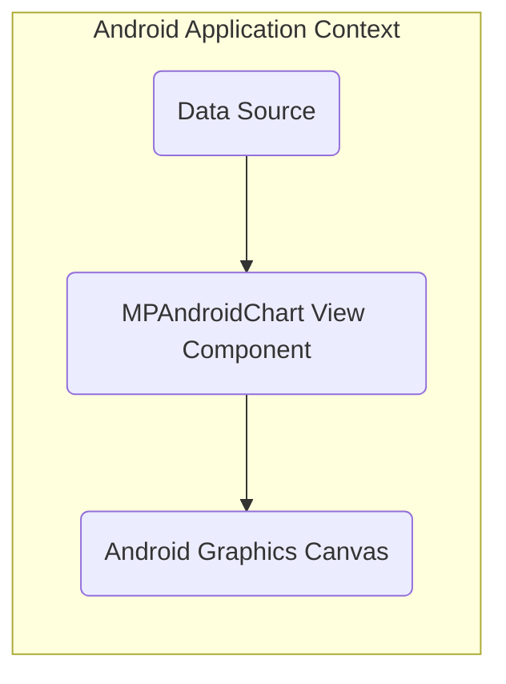
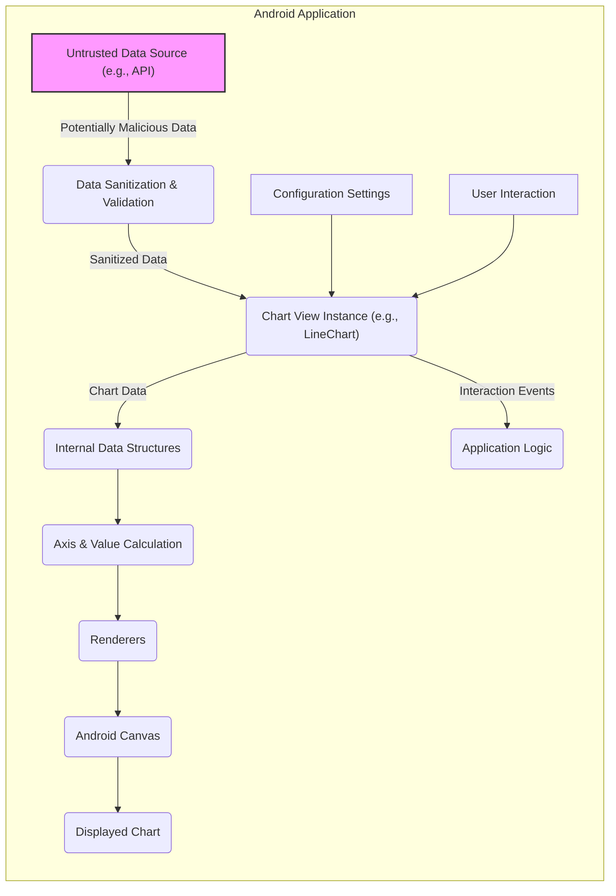

# Project Design Document: MPAndroidChart Library

**Version:** 1.1
**Date:** October 26, 2023
**Author:** AI Software Architect

## 1. Introduction

This document provides an enhanced design overview of the MPAndroidChart library, an open-source Android charting library. This document is intended to serve as a robust foundation for subsequent threat modeling activities. It details the library's architecture, key components, data flow with a focus on potential security implications, and external dependencies.

## 2. Project Overview

MPAndroidChart is a versatile and widely used library for creating various types of charts and graphs within Android applications. It offers support for common chart types like line, bar, pie, scatter, and candlestick charts, among others. The library prioritizes customization, allowing developers to tailor the visual appearance and interactive behavior of their charts.

## 3. Goals

* To provide Android developers with a highly adaptable and customizable charting solution.
* To support a comprehensive range of commonly used chart visualizations.
* To offer extensive options for customizing the visual presentation and interactive elements of charts.
* To ensure efficient and performant rendering of charts on Android mobile devices.
* To facilitate straightforward integration into existing Android development projects.

## 4. Non-Goals

* Implementing mechanisms for fetching or persisting chart data. The library operates on data provided to it.
* Incorporating user authentication or authorization functionalities within the library itself.
* Providing built-in network communication capabilities.
* Offering server-side chart rendering or data processing functionalities.

## 5. Target Audience

* Android application developers requiring data visualization capabilities within their mobile applications.

## 6. High-Level Architecture

The MPAndroidChart library internally employs principles similar to the Model-View-Presenter (MVP) pattern, although it is primarily consumed by developers as a custom `View` component. The fundamental concept involves supplying data and configuration to the chart view, which then handles the rendering of the graphical representation.

* **Data Source:** Represents the origin of the data intended for charting. This is external to the MPAndroidChart library and could be local variables, databases, or other data providers.
* **MPAndroidChart View Component:** The core interface provided by the library. It accepts data and configuration parameters and orchestrates the chart rendering process.
* **Android Graphics Canvas:** The underlying Android system service responsible for the actual drawing of the chart on the device screen.

## 7. Detailed Design

### 7.1. Data Input and Processing

* **Data Ingress Points:** Data is supplied to the `MPAndroidChart` view instances through various setter methods, primarily found within classes that extend the base `Chart` class. Examples include methods like `setData()` in classes such as `LineChart` and `BarChart`. The source of this data is the responsibility of the integrating application.
* **Data Structures:** The library defines specific data structures for representing chart data. Key structures include `Entry` (representing a single data point), `DataSet` (a collection of `Entry` objects with associated styling), and specialized subclasses like `LineDataSet` and `BarDataSet` tailored for different chart types.
* **Data Validation and Sanitization:** While the library performs basic checks on input data (e.g., null checks, type validation), it largely relies on the developer to provide semantically correct and safe data. **This is a critical area for potential vulnerabilities if the application doesn't sanitize data from untrusted sources before passing it to the chart library.**
* **Data Transformation and Scaling:** Internally, the library performs transformations on the input data to prepare it for rendering. This includes scaling data values to fit within the chart's axes and applying any necessary formatting.

### 7.2. Chart Configuration

* **Configuration Mechanisms:** The appearance and behavior of charts are customized through various configuration objects and methods provided by the library. Examples include:
    * `XAxis`, `YAxis`: For configuring the properties of the chart's axes (labels, ranges, etc.).
    * `Legend`: For customizing the appearance and position of the chart legend.
    * `Description`: For setting and styling the chart's description label.
    * `Renderer` classes (internal): Responsible for drawing specific visual elements of the chart.
* **Customization Scope:** Developers have extensive control over visual aspects like colors, fonts, labels, grid lines, and animations. They can also configure interactive behaviors such as zooming, panning, and highlighting.
* **Configuration Approach:** Configuration is primarily achieved programmatically through Java or Kotlin code. **Improper configuration, while less of a direct security vulnerability in the library itself, could lead to misleading or confusing visualizations, which could have security implications in the context of the application using the chart.**

### 7.3. Rendering Process

* **Canvas Utilization:** The library leverages the Android `Canvas` object to perform the actual drawing of chart elements.
* **Drawing Primitives:** It utilizes fundamental drawing primitives offered by the `Canvas` API, such as drawing lines, rectangles, circles, and text. **Potential vulnerabilities could arise if the data being rendered (e.g., labels) is not properly sanitized, potentially leading to unexpected rendering behavior or even denial-of-service if maliciously crafted data causes excessive drawing operations.**
* **Layered Rendering:** Chart elements are rendered in distinct layers to ensure correct visual ordering (e.g., data points are typically drawn on top of grid lines).
* **Performance Considerations:** The library is designed for reasonable performance, but rendering highly complex charts with very large datasets can still impact device performance. **This could be a target for denial-of-service attacks if an attacker can influence the data being displayed.**

### 7.4. User Interaction

* **Touch Event Handling:** The library intercepts and processes touch events to enable interactive features like zooming, panning, and highlighting data points upon touch. **Care must be taken in the application's handling of callbacks from these interactions to prevent unintended actions or information disclosure based on user interaction with potentially malicious data points.**
* **Event Listeners:** Developers can register listeners to receive callbacks when specific user interactions occur, such as tapping on a data point.
* **Gesture Recognition:** The library incorporates logic for recognizing common touch gestures to facilitate intuitive user interaction.

## 8. Data Flow with Security Considerations

* **Untrusted Data Source (e.g., API):** Represents external sources of data that might contain malicious or unexpected content. **This is a primary entry point for potential attacks.**
* **Data Sanitization & Validation:** **Crucial application responsibility.** This step involves cleaning and verifying data before it's passed to the chart library to prevent injection attacks or rendering issues.
* **Chart View Instance (e.g., LineChart):** The specific chart object receiving the data and configuration.
* **Configuration Settings:** Parameters that define the chart's appearance and behavior.
* **Internal Data Structures:** The library's internal representation of the chart data.
* **Axis & Value Calculation:**  The process of determining how data maps to the chart's axes.
* **Renderers:** Components responsible for drawing the visual elements.
* **Android Canvas:** The drawing surface.
* **Displayed Chart:** The final rendered output.
* **User Interaction:** User input on the chart.
* **Application Logic:** The application code that handles events from the chart.

**Security Considerations within Data Flow:**

* **Untrusted Data Ingress:** Data from external sources should always be treated as potentially malicious and rigorously validated and sanitized before being used by the chart library. Failure to do so can lead to various issues, including incorrect rendering, application crashes, or even potential code injection if labels or tooltips are not handled carefully.
* **Configuration Security:** While the library itself doesn't have inherent configuration vulnerabilities, the application developer should be mindful of how configuration options might be influenced by untrusted sources.
* **Rendering Vulnerabilities:** If the rendering process doesn't handle edge cases or malformed data correctly, it could lead to denial-of-service by consuming excessive resources or causing crashes.
* **Interaction Handling:**  Applications should carefully handle user interaction events from the chart, especially if those interactions trigger actions based on the underlying data. Maliciously crafted data could lead to unintended consequences if interaction events are not properly validated.

## 9. Key Components

* **Chart Base Classes:** Abstract classes like `Chart` provide the foundational structure and common functionality for all chart types.
* **Specific Chart Implementations:** Concrete classes such as `LineChart`, `BarChart`, `PieChart`, `ScatterChart`, and `CandleStickChart` extend the base classes and implement the specific rendering logic for each chart type.
* **Data Set Classes:** Classes like `LineDataSet`, `BarDataSet`, `PieDataSet`, etc., are responsible for holding the actual chart data and associated styling information for different data series.
* **Entry Class:** Represents a single data point within a chart, typically containing a value and a corresponding label or index.
* **Axis Classes:** `XAxis` and `YAxis` manage the configuration and rendering of the chart's horizontal and vertical axes, including labels, grid lines, and scaling.
* **Renderer Classes:** Internal components (e.g., `LineRenderer`, `BarRenderer`, `PieRenderer`) responsible for the actual drawing of the visual elements of each chart type.
* **Utils Classes:** Provide a collection of utility functions for tasks such as calculations, formatting, color handling, and other common operations.
* **Animator Classes:** Handle animations for chart drawing and data updates, providing visual feedback to the user.
* **Highlight Classes:** Manage the highlighting of specific data points or sections of the chart in response to user interaction or programmatic triggers.
* **Legend Class:**  Manages the display of the chart legend, which provides a key to understanding the different data series.
* **Description Class:**  Manages the display of the chart's description label.

## 10. External Dependencies

* **Android SDK:** The MPAndroidChart library is inherently dependent on the Android Software Development Kit (SDK) for access to UI components, graphics rendering capabilities (Canvas), and other core Android functionalities.
* **Android Support Libraries / AndroidX:** Depending on the specific version of MPAndroidChart being used, it may have dependencies on specific Android Support Libraries or AndroidX libraries for backward compatibility and access to newer features. *Example:* `androidx.core:core-ktx`, `androidx.appcompat:appcompat`. **It's crucial to track the versions of these dependencies for known vulnerabilities.**
* **Kotlin Standard Library (if using Kotlin version):** If the application is using a Kotlin-based version of the MPAndroidChart library, it will have a dependency on the Kotlin Standard Library. **Ensure the Kotlin standard library is up-to-date to mitigate potential vulnerabilities.**

## 11. Security Considerations

This section provides a more detailed overview of potential security considerations relevant to the MPAndroidChart library and its usage.

* **Malicious Data Injection:** If the application displays data sourced from untrusted sources (e.g., user input, external APIs) without proper sanitization, attackers could inject malicious data that could lead to:
    * **Misleading Visualizations:** Displaying incorrect or manipulated data to deceive users.
    * **Denial of Service (DoS):**  Providing extremely large or complex datasets that overwhelm the rendering process, causing performance issues or crashes.
    * **Cross-Site Scripting (XSS) (Indirect):** If unsanitized data is used in labels, tooltips, or other text elements rendered by the chart, it could potentially lead to XSS if the rendering logic doesn't properly escape special characters.
* **Denial of Service through Resource Exhaustion:** An attacker might be able to provide input that causes the chart library to consume excessive resources (CPU, memory) during rendering, leading to a denial of service. This could be achieved through very large datasets or complex chart configurations.
* **Information Disclosure:** While the library itself doesn't inherently expose sensitive information, applications using it must be careful not to display sensitive data in charts that could be viewed by unauthorized users.
* **Dependency Vulnerabilities:** Vulnerabilities in the Android SDK or any of the external dependencies (Android Support Libraries/AndroidX, Kotlin Standard Library) could indirectly affect the security of applications using MPAndroidChart. **Regularly updating dependencies and scanning for known vulnerabilities is crucial.**
* **Insecure Configuration (Application Level):** While the library provides many configuration options, improper or insecure configuration within the application using the library could lead to vulnerabilities. For example, displaying overly detailed information or enabling unnecessary interactive features with sensitive data.
* **Integer Overflow/Underflow:** While less likely, if the library performs calculations on data sizes or indices without proper bounds checking, there's a theoretical risk of integer overflow or underflow vulnerabilities.
* **Format String Bugs (Less Likely):** If the library uses string formatting functions with user-controlled input without proper sanitization, it could potentially lead to format string vulnerabilities (though this is less common in modern Android development).

This enhanced design document provides a more detailed and security-focused overview of the MPAndroidChart library. This information is essential for conducting a comprehensive threat modeling exercise to identify potential security risks and develop appropriate mitigation strategies at the application level.