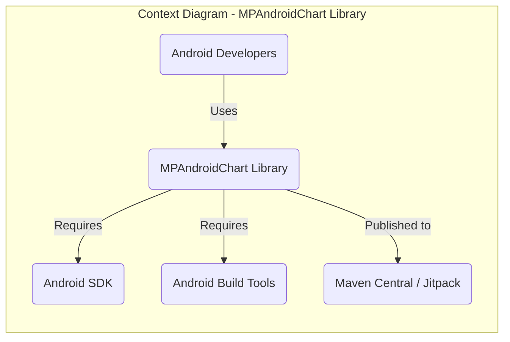
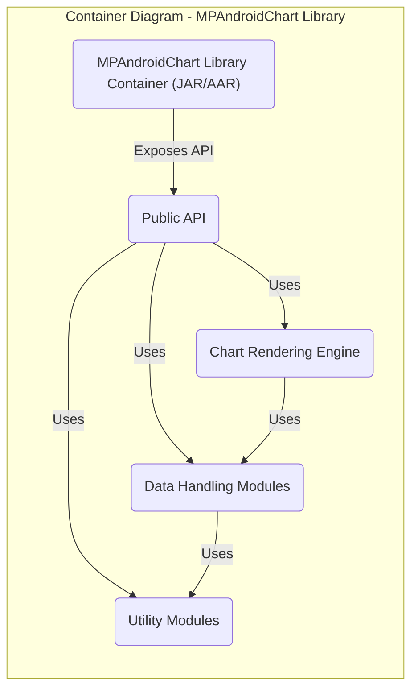
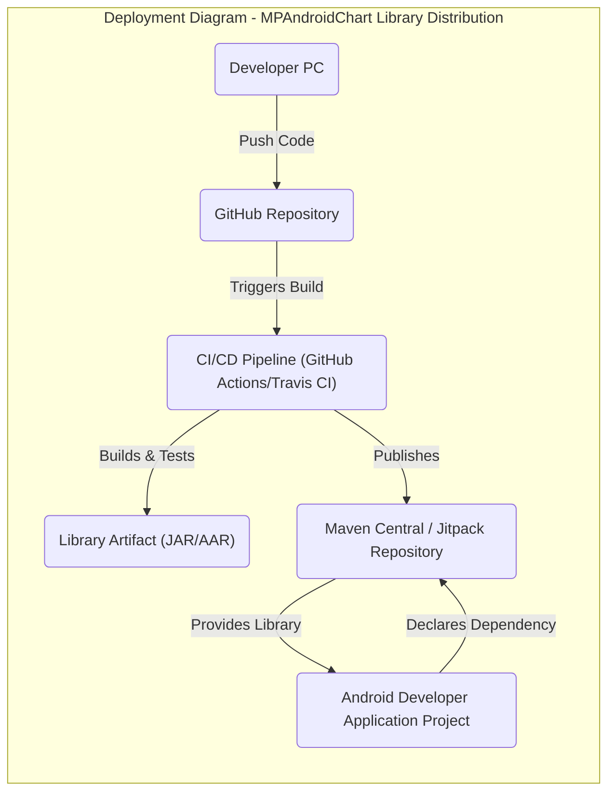
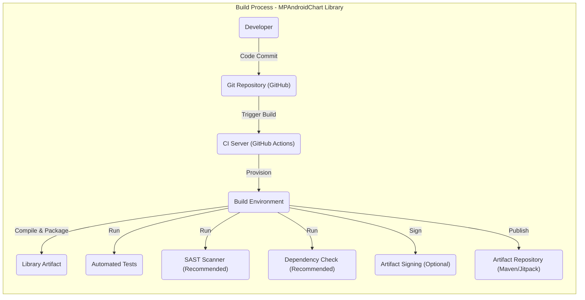

# BUSINESS POSTURE

- Business Priorities and Goals:
  - Provide a robust, feature-rich, and easy-to-use Android charting library for developers.
  - Foster a strong community around the library to encourage contributions and maintainability.
  - Ensure the library is widely adopted and trusted by Android developers for data visualization needs.
- Business Risks:
  - Security vulnerabilities within the library could be exploited in applications using it, damaging reputation and trust.
  - Lack of consistent maintenance and updates could lead to the library becoming outdated and less attractive to developers.
  - Poor performance or bugs could negatively impact user experience in applications utilizing the library.

# SECURITY POSTURE

- Existing Security Controls:
  - security control: Source code hosted on GitHub - Provides version control and transparency.
  - security control: Open Source License (Apache 2.0) - Allows for community review and contribution.
- Accepted Risks:
  - accepted risk: Reliance on community contributions for identifying and addressing security vulnerabilities.
  - accepted risk: No dedicated security team or formal security audit process for the library itself.
- Recommended Security Controls:
  - security control: Implement automated Static Application Security Testing (SAST) in the Continuous Integration (CI) pipeline to identify potential code vulnerabilities.
  - security control: Establish a clear process for reporting and handling security vulnerabilities, including a security policy and contact information.
  - security control: Conduct periodic dependency checks to identify and update vulnerable dependencies used by the library.
  - security control: Provide security guidelines and best practices for developers using the library to prevent misuse and security issues in their applications.
- Security Requirements:
  - Authentication: Not directly applicable to the library itself, but relevant for any potential future services or components associated with the library (e.g., documentation website, issue tracker).
  - Authorization: Not directly applicable to the library itself.
  - Input Validation: The library should be designed to handle potentially malicious or unexpected input data gracefully without causing crashes or unexpected behavior in the host application. This is crucial for preventing denial-of-service or other input-related vulnerabilities in applications using the library. Input validation should be implemented at the library's API boundaries.
  - Cryptography: While a charting library may not directly require cryptography, if any future features involve handling sensitive data or secure communication, appropriate cryptographic measures must be implemented and reviewed by security experts. Ensure no unintentional exposure of sensitive data through logging or debugging features.

# DESIGN

## C4 CONTEXT

- Context Diagram Elements:
  - Element:
    - Name: Android Developers
    - Type: Person
    - Description: Developers who use the MPAndroidChart library to create charts in their Android applications.
    - Responsibilities: Integrate the library into their projects, use the library's API to create charts, and ensure proper data handling in their applications.
    - Security controls: Responsible for securely using the library within their applications, including proper input validation and data handling at the application level.
  - Element:
    - Name: MPAndroidChart Library
    - Type: Software System
    - Description: An open-source Android charting library for displaying various types of charts in Android applications.
    - Responsibilities: Provide charting functionalities, handle chart rendering and data visualization, and maintain code quality and stability.
    - Security controls: Implement input validation within the library, follow secure coding practices, and address reported vulnerabilities.
  - Element:
    - Name: Android SDK
    - Type: Software System
    - Description: The Android Software Development Kit, providing tools and libraries necessary for Android development.
    - Responsibilities: Provide the base platform and APIs for Android applications to run.
    - Security controls: Security controls are managed by Google as the provider of the Android SDK.
  - Element:
    - Name: Android Build Tools
    - Type: Software System
    - Description: Tools like Gradle used to build, compile, and package Android applications and libraries.
    - Responsibilities: Build and package the MPAndroidChart library into distributable artifacts (JAR/AAR).
    - Security controls: Security controls are related to the build environment and dependency management, typically managed by the project maintainers and build tool providers.
  - Element:
    - Name: Maven Central / Jitpack
    - Type: Software System
    - Description: Package repositories where the MPAndroidChart library is published for developers to download and use in their projects.
    - Responsibilities: Host and distribute the MPAndroidChart library artifacts.
    - Security controls: Security controls are managed by Maven Central and Jitpack as package repository providers, ensuring artifact integrity and availability.

## C4 CONTAINER

- Container Diagram Elements:
  - Element:
    - Name: MPAndroidChart Library Container (JAR/AAR)
    - Type: Container
    - Description: The packaged library, distributed as a JAR or AAR file, containing all the code and resources.
    - Responsibilities: Provide a self-contained unit for distribution and integration into Android applications.
    - Security controls: Code signing of the JAR/AAR artifact (if implemented in the build process) to ensure integrity and authenticity.
  - Element:
    - Name: Public API
    - Type: Component
    - Description: The set of public classes and methods exposed by the library for developers to interact with.
    - Responsibilities: Provide a well-defined and documented interface for using the charting functionalities.
    - Security controls: Input validation at the API level to prevent misuse and ensure data integrity. API documentation should include security considerations for developers.
  - Element:
    - Name: Chart Rendering Engine
    - Type: Component
    - Description: The core component responsible for generating and rendering the charts based on provided data and configurations.
    - Responsibilities: Efficiently and accurately render charts, handle different chart types and customizations.
    - Security controls: Ensure secure handling of data during rendering, prevent potential rendering vulnerabilities (e.g., buffer overflows if processing large datasets).
  - Element:
    - Name: Data Handling Modules
    - Type: Component
    - Description: Modules responsible for processing and managing the data provided to the library, including data parsing, formatting, and validation.
    - Responsibilities: Efficiently handle and process chart data, perform data validation and sanitization.
    - Security controls: Implement robust input validation and sanitization to prevent injection attacks or data corruption.
  - Element:
    - Name: Utility Modules
    - Type: Component
    - Description: Various utility modules providing helper functions and common functionalities used across the library.
    - Responsibilities: Provide reusable utility functions, improve code modularity and maintainability.
    - Security controls: Ensure utility modules do not introduce security vulnerabilities and follow secure coding practices.

## DEPLOYMENT

- Deployment Architecture:
  - Distribution via Package Repositories: The MPAndroidChart library is deployed by publishing it to package repositories like Maven Central and Jitpack. Developers then include it as a dependency in their Android projects using build tools like Gradle.

- Deployment Diagram Elements:
  - Element:
    - Name: Developer PC
    - Type: Environment
    - Description: The development environment used by library maintainers to write, test, and build the MPAndroidChart library.
    - Responsibilities: Code development, local testing, and pushing code changes to the repository.
    - Security controls: Developer workstation security practices, code review before committing changes.
  - Element:
    - Name: GitHub Repository
    - Type: Environment
    - Description: The online repository hosting the source code of the MPAndroidChart library.
    - Responsibilities: Version control, code collaboration, issue tracking, and triggering CI/CD pipelines.
    - Security controls: GitHub's security features, access control, branch protection, and vulnerability scanning.
  - Element:
    - Name: CI/CD Pipeline (GitHub Actions/Travis CI)
    - Type: Environment
    - Description: Automated build and deployment pipeline that builds, tests, and publishes the library.
    - Responsibilities: Automate build process, run tests, perform security checks (SAST, dependency scanning - recommended), and publish artifacts.
    - Security controls: Secure CI/CD configuration, secrets management, build environment security, and implementation of security checks in the pipeline.
  - Element:
    - Name: Maven Central / Jitpack Repository
    - Type: Environment
    - Description: Package repositories for distributing the MPAndroidChart library to Android developers.
    - Responsibilities: Host and serve the library artifacts, manage versions, and ensure availability.
    - Security controls: Repository provider's security controls, artifact integrity checks, and potentially artifact signing.
  - Element:
    - Name: Android Developer Application Project
    - Type: Environment
    - Description: Android application projects developed by developers who use the MPAndroidChart library.
    - Responsibilities: Integrate and utilize the MPAndroidChart library in their applications.
    - Security controls: Application-level security controls, secure usage of the library, and dependency management.

## BUILD

- Build Process Elements:
  - Element:
    - Name: Developer
    - Type: Actor
    - Description: Software developer contributing to the MPAndroidChart library.
    - Responsibilities: Writing code, committing changes, and participating in code reviews.
    - Security controls: Secure coding practices, code review participation, and workstation security.
  - Element:
    - Name: Git Repository (GitHub)
    - Type: System
    - Description: Version control system hosting the source code.
    - Responsibilities: Source code management, version history, and collaboration platform.
    - Security controls: Access control, branch protection, and GitHub's security features.
  - Element:
    - Name: CI Server (GitHub Actions)
    - Type: System
    - Description: Continuous Integration server automating the build, test, and deployment process.
    - Responsibilities: Automating build pipeline, running tests, and publishing artifacts.
    - Security controls: Secure CI configuration, secrets management, and access control.
  - Element:
    - Name: Build Environment
    - Type: Environment
    - Description: The environment where the library is compiled, tested, and packaged.
    - Responsibilities: Providing necessary tools and dependencies for building the library.
    - Security controls: Secure build environment, dependency management, and access control.
  - Element:
    - Name: Automated Tests
    - Type: Process
    - Description: Automated unit and integration tests to ensure code quality and functionality.
    - Responsibilities: Verify code functionality and prevent regressions.
    - Security controls: Test coverage for security-relevant functionalities, and secure test data management.
  - Element:
    - Name: SAST Scanner (Recommended)
    - Type: Process
    - Description: Static Application Security Testing tool to identify potential vulnerabilities in the source code.
    - Responsibilities: Identify potential security flaws early in the development process.
    - Security controls: Properly configured SAST tool, regular updates, and remediation of identified vulnerabilities.
  - Element:
    - Name: Dependency Check (Recommended)
    - Type: Process
    - Description: Tool to check for known vulnerabilities in third-party dependencies.
    - Responsibilities: Identify vulnerable dependencies and ensure timely updates.
    - Security controls: Regularly updated dependency vulnerability database and automated dependency updates.
  - Element:
    - Name: Artifact Signing (Optional)
    - Type: Process
    - Description: Digitally signing the library artifact to ensure integrity and authenticity.
    - Responsibilities: Provide assurance of artifact origin and prevent tampering.
    - Security controls: Secure key management for signing process.
  - Element:
    - Name: Artifact Repository (Maven/Jitpack)
    - Type: System
    - Description: Repository for storing and distributing the built library artifacts.
    - Responsibilities: Hosting and distributing the library artifacts.
    - Security controls: Repository provider's security controls and artifact integrity checks.

# RISK ASSESSMENT

- Critical Business Processes:
  - Maintaining the reputation and trustworthiness of the MPAndroidChart library as a reliable charting solution for Android developers.
  - Ensuring the continued adoption and usage of the library by the Android development community.
- Data to Protect:
  - Source code of the MPAndroidChart library - Sensitivity: Publicly available, but integrity and confidentiality of development process are important.
  - Library artifacts (JAR/AAR files) - Sensitivity: Publicly available, but integrity and availability are crucial to prevent supply chain attacks.

# QUESTIONS & ASSUMPTIONS

- Questions:
  - What are the specific performance requirements for the charting library? (Assumption: Performance is important for smooth user experience in applications using the library).
  - Are there any specific compliance requirements that the library needs to adhere to? (Assumption: General good security practices are sufficient, no specific industry compliance mentioned).
  - What is the expected lifespan and maintenance plan for the library? (Assumption: Long-term maintenance and community support are desired for the library's success).
- Assumptions:
  - BUSINESS POSTURE: The primary business goal is to provide a valuable and widely used open-source charting library for Android developers.
  - SECURITY POSTURE: Security is important for the library's reputation and user trust. Basic security controls are in place (GitHub, open source), but further security measures are recommended for a more robust security posture.
  - DESIGN: The library follows a modular design with clear separation of concerns. Deployment is via standard package repositories. Build process can be enhanced with security checks.