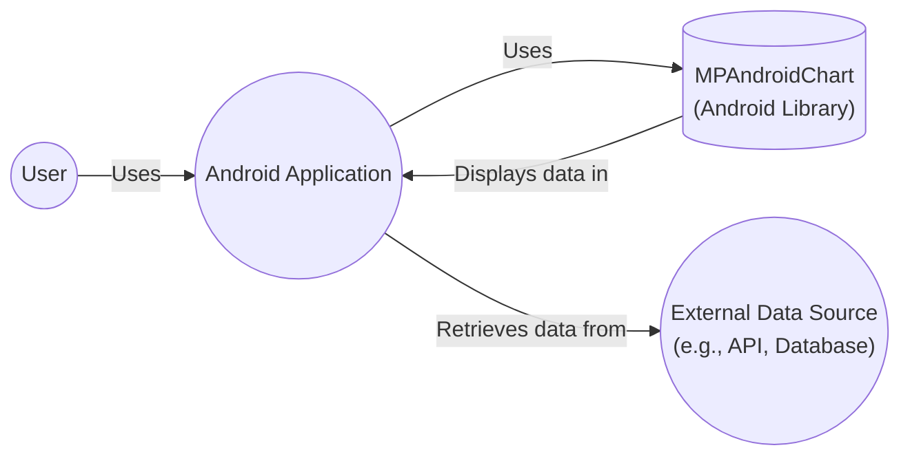
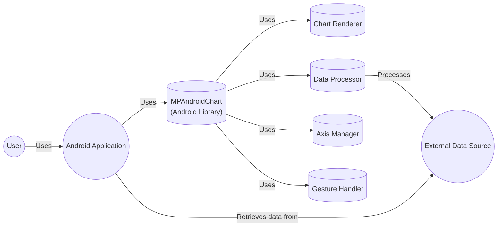
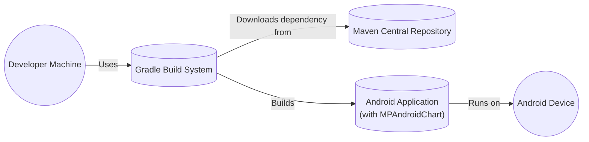

Okay, let's create a design document for the MPAndroidChart library.

# BUSINESS POSTURE

Business Priorities and Goals:

*   Provide a free, open-source, and easy-to-use charting library for Android developers.
*   Enable developers to visualize data effectively within their Android applications.
*   Maintain a high level of customization and flexibility to cater to diverse charting needs.
*   Foster a community around the library for support, contributions, and feature development.
*   Ensure the library is performant and does not negatively impact the performance of applications using it.

Most Important Business Risks:

*   Malicious code injection: The library could be a target for attackers to inject malicious code, potentially compromising applications that use it.
*   Data leakage: Improper handling of data within the library could lead to unintentional data leakage.
*   Denial of Service (DoS): Poorly optimized code or vulnerabilities could make applications using the library susceptible to DoS attacks.
*   Reputation damage: Security vulnerabilities or performance issues could damage the library's reputation and adoption rate.
*   Intellectual property theft: The library's source code could be stolen or misused.

# SECURITY POSTURE

Existing Security Controls:

*   security control: Open-source code: The library's code is publicly available on GitHub, allowing for community review and scrutiny. (Described in: GitHub repository)
*   security control: Permissive License (Apache 2.0): This license allows for broad use, modification, and distribution, but also includes disclaimers of warranty and liability. (Described in: GitHub repository license file)

Accepted Risks:

*   accepted risk: Limited formal security audits: While the open-source nature allows for community review, there may not be regular, formal security audits conducted.
*   accepted risk: Reliance on community contributions: The library's development and maintenance rely heavily on community contributions, which may vary in quality and security awareness.
*   accepted risk: Third-party dependencies: The library may depend on other third-party libraries, which could introduce their own security risks.

Recommended Security Controls:

*   security control: Implement Static Application Security Testing (SAST): Integrate SAST tools into the development workflow to identify potential vulnerabilities early.
*   security control: Conduct regular dependency analysis: Regularly check for outdated or vulnerable dependencies and update them promptly.
*   security control: Implement a security vulnerability disclosure program: Establish a clear process for reporting and addressing security vulnerabilities.
*   security control: Provide security guidelines for contributors: Educate contributors on secure coding practices and security considerations.

Security Requirements:

*   Authentication: Not directly applicable, as the library itself does not handle user authentication.
*   Authorization: Not directly applicable, as the library does not manage user roles or permissions.
*   Input Validation:
    *   The library should validate input data to prevent unexpected behavior or vulnerabilities. This includes checking for data types, ranges, and formats.
    *   Sanitize any user-provided data that is used to generate chart labels or other display elements to prevent Cross-Site Scripting (XSS) vulnerabilities (although XSS is less of a concern in native Android than in web applications).
*   Cryptography:
    *   If the library handles sensitive data (which is unlikely in a charting library), it should use appropriate cryptographic techniques to protect it. This is more relevant if the library were to, for example, support encrypted data sources.

# DESIGN

## C4 CONTEXT



Element Descriptions:

*   Element:
    *   Name: User
    *   Type: Person
    *   Description: The end-user interacting with the Android application.
    *   Responsibilities: Interacts with the Android application to view charts.
    *   Security controls: Relies on the security controls implemented within the Android Application.

*   Element:
    *   Name: MPAndroidChart
    *   Type: Android Library
    *   Description: The charting library used to display data visually.
    *   Responsibilities: Provides charting functionalities, handles data rendering, and supports customization.
    *   Security controls: Input validation, dependency management, secure coding practices.

*   Element:
    *   Name: Android Application
    *   Type: Software System
    *   Description: The Android application that integrates the MPAndroidChart library.
    *   Responsibilities: Fetches data, integrates the charting library, handles user interactions, and manages application logic.
    *   Security controls: Implements application-level security measures, including data validation, secure communication, and user authentication/authorization if needed.

*   Element:
    *   Name: External Data Source
    *   Type: Software System
    *   Description: The source of data displayed in the charts (e.g., an API, a local database, or a file).
    *   Responsibilities: Provides data to the Android application.
    *   Security controls: Depends on the specific data source; should implement appropriate security measures (e.g., API authentication, database security).

## C4 CONTAINER

Since MPAndroidChart is a library, the container diagram is essentially an extension of the context diagram. The "containers" are components *within* the library itself, but from an external perspective, the library is a single unit.



Element Descriptions:

*   Element:
    *   Name: Chart Renderer
    *   Type: Component
    *   Description: Responsible for drawing the chart on the screen.
    *   Responsibilities: Renders chart elements, handles animations, and manages visual updates.
    *   Security controls: Output encoding (if applicable), protection against buffer overflows.

*   Element:
    *   Name: Data Processor
    *   Type: Component
    *   Description: Processes and transforms data for chart rendering.
    *   Responsibilities: Handles data formatting, scaling, and calculations.
    *   Security controls: Input validation, data sanitization.

*   Element:
    *   Name: Axis Manager
    *   Type: Component
    *   Description: Manages the chart axes (x-axis, y-axis).
    *   Responsibilities: Calculates axis ranges, labels, and positions.
    *   Security controls: Input validation, range checking.

*   Element:
    *   Name: Gesture Handler
    *   Type: Component
    *   Description: Handles user interactions with the chart (e.g., touch, zoom, pan).
    *   Responsibilities: Processes touch events, updates chart view based on gestures.
    *   Security controls: Input validation, prevention of unintended actions.

*   Element:
    *   Name: User, AndroidApp, ExternalData, MPAndroidChart
    *   Type: As described in C4 Context
    *   Description: As described in C4 Context
    *   Responsibilities: As described in C4 Context
    *   Security controls: As described in C4 Context

## DEPLOYMENT

Deployment Options:

1.  **Direct Dependency (Gradle/Maven):** The most common approach. Developers add the MPAndroidChart library as a dependency in their project's build.gradle file.
2.  **Manual JAR Inclusion:** Developers can download the JAR file and manually include it in their project's `libs` folder. Less common and not recommended.
3.  **Forking and Modification:** Developers can fork the GitHub repository, make modifications, and build their custom version of the library.

Chosen Deployment (Option 1 - Gradle/Maven):



Element Descriptions:

*   Element:
    *   Name: Developer Machine
    *   Type: Infrastructure Node
    *   Description: The developer's workstation where the Android application is built.
    *   Responsibilities: Hosts the development environment, source code, and build tools.
    *   Security controls: Standard development machine security (antivirus, firewall, etc.).

*   Element:
    *   Name: Gradle Build System
    *   Type: Software System
    *   Description: The build system used to compile and package the Android application.
    *   Responsibilities: Manages dependencies, compiles code, and creates the APK file.
    *   Security controls: Dependency verification, secure configuration.

*   Element:
    *   Name: Maven Central Repository
    *   Type: Software System
    *   Description: A public repository hosting open-source libraries, including MPAndroidChart.
    *   Responsibilities: Stores and provides access to library artifacts.
    *   Security controls: Repository security measures (access control, integrity checks).

*   Element:
    *   Name: Android Device
    *   Type: Infrastructure Node
    *   Description: The physical or emulated Android device where the application runs.
    *   Responsibilities: Executes the Android application.
    *   Security controls: Android operating system security features.

*   Element:
    *   Name: Android Application
    *   Type: Software System
    *   Description: As described in C4 Context
    *   Responsibilities: As described in C4 Context
    *   Security controls: As described in C4 Context

## BUILD

```mermaid
graph LR
    Developer(("Developer"))
    GitHubRepo(("GitHub Repository"))
    BuildSystem(("Build System\n(e.g., GitHub Actions)"))
    SAST[("SAST Tools")]
    DependencyCheck[("Dependency Checker")]
    ArtifactRepository[("Artifact Repository\n(e.g., Maven Central)")]
    BuildArtifact(("Build Artifact\n(AAR/JAR)")]

    Developer -- Pushes code to --> GitHubRepo
    GitHubRepo -- Triggers --> BuildSystem
    BuildSystem -- Runs --> SAST
    BuildSystem -- Runs --> DependencyCheck
    BuildSystem -- Builds --> BuildArtifact
    BuildArtifact -- Published to --> ArtifactRepository
```

Build Process Description:

1.  **Code Commit:** Developers commit and push code changes to the MPAndroidChart GitHub repository.
2.  **Build Trigger:** A build system (e.g., GitHub Actions, Travis CI, or a local build script) is triggered by the code push.
3.  **Security Checks:**
    *   **SAST:** Static Application Security Testing tools (e.g., FindBugs, PMD, or commercial tools) analyze the source code for potential vulnerabilities.
    *   **Dependency Check:** Tools like OWASP Dependency-Check scan the project's dependencies for known vulnerabilities.
4.  **Compilation:** The build system compiles the source code into bytecode.
5.  **Artifact Creation:** The compiled code and resources are packaged into an AAR (Android Archive) or JAR file.
6.  **Artifact Publication:** The build artifact is published to a repository (e.g., Maven Central, JCenter, or a local repository).

Security Controls in Build Process:

*   security control: SAST integration: Identifies potential vulnerabilities in the source code.
*   security control: Dependency scanning: Detects known vulnerabilities in third-party libraries.
*   security control: Build automation: Ensures consistent and repeatable builds, reducing the risk of manual errors.
*   security control: Secure build environment: The build system itself should be secured to prevent unauthorized access or modification.

# RISK ASSESSMENT

Critical Business Processes:

*   Providing a reliable and functional charting library for Android developers.
*   Maintaining the library's reputation and community trust.

Data to Protect and Sensitivity:

*   **Source Code:** The library's source code is publicly available, but protecting it from unauthorized modification or malicious injection is crucial. Sensitivity: Medium (due to potential for malicious code injection).
*   **User Data (Indirectly):** The library itself does not directly handle sensitive user data. However, applications using the library *may* use it to display sensitive data. The library should be designed to minimize the risk of data leakage or misuse in such scenarios. Sensitivity: Low (direct), Potentially High (indirect, depending on the application's use case).
*   **Dependency Information:** Information about the library's dependencies. Sensitivity: Low.

# QUESTIONS & ASSUMPTIONS

Questions:

*   Are there any specific performance requirements or limitations for the library?
*   Are there any plans to support specific data formats or protocols?
*   What is the expected frequency of releases and updates?
*   What is the process for handling bug reports and feature requests?
*   Are there any specific Android versions or device types that need to be supported or excluded?

Assumptions:

*   BUSINESS POSTURE: The primary goal is to provide a free and open-source charting solution. Commercialization is not a primary driver.
*   SECURITY POSTURE: The library relies primarily on community review and open-source best practices for security. Formal security audits are not regularly conducted.
*   DESIGN: The library is designed to be integrated into Android applications as a dependency. It does not operate as a standalone service. The library's primary function is to render charts based on data provided by the integrating application.