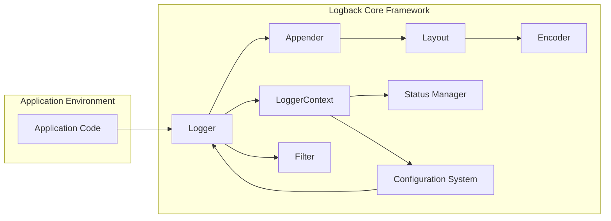
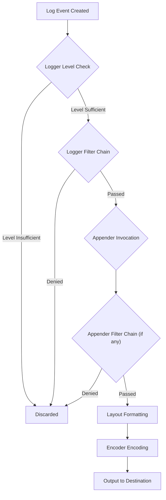
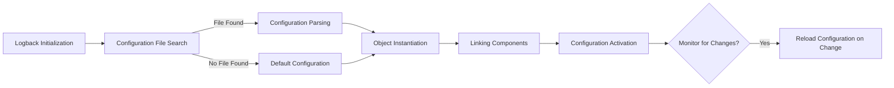
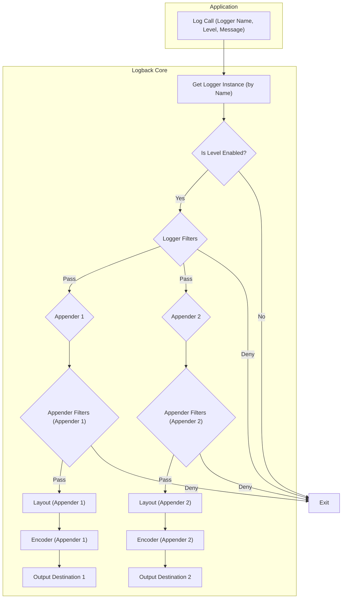

## Project Design Document: Logback Logging Framework (Improved)

**1. Introduction**

This document provides an in-depth design overview of the Logback logging framework, a widely adopted, reliable, generic, fast, and flexible logging library for Java applications. This document aims to meticulously capture the architectural nuances, component interactions, and data flow within Logback, explicitly focusing on aspects relevant to subsequent threat modeling activities. The design is based on the open-source project available at [https://github.com/qos-ch/logback](https://github.com/qos-ch/logback). This document is intended to serve as a comprehensive reference for security analysis and risk assessment.

**2. Goals**

*   Present a detailed and nuanced understanding of Logback's architecture and core functionalities.
*   Clearly delineate the roles and responsibilities of key components and their interdependencies.
*   Provide a precise description of the data flow within the logging framework, highlighting transformation points.
*   Explicitly identify and elaborate on security-relevant design choices and potential vulnerabilities.
*   Serve as a robust and informative foundation for conducting thorough threat modeling exercises.

**3. Non-Goals**

*   Offer a granular, line-by-line analysis of the Logback codebase.
*   Exhaustively list every configurable parameter and option available within Logback.
*   Delve into the intricate implementation details of individual appenders, layouts, or encoders.
*   Trace the complete historical evolution and all past design decisions of Logback.

**4. High-Level Architecture**

Logback employs a modular and extensible architecture, with distinct components collaborating to manage the logging lifecycle. The fundamental concept revolves around named loggers, organized hierarchically, enabling fine-grained control over logging behavior.

*   **Application Code:** The initiator of logging events within the application.
*   **Logger:** The primary interface used by applications to emit log messages. Loggers are named and inherit logging configurations from their ancestors in the hierarchy.
*   **LoggerContext:** The central authority managing all `Logger` instances. It maintains the logger hierarchy and applies configuration settings.
*   **Appender:** An interface responsible for directing formatted log events to a specific destination (e.g., file system, console, network socket, database).
*   **Layout:** An interface that transforms a log event into a formatted string representation according to a defined pattern or structure.
*   **Encoder:** An interface that converts the formatted log event (typically a string) into a byte stream suitable for the appender's output medium, handling character encoding.
*   **Filter:** An interface allowing conditional evaluation of log events, enabling decisions to accept, deny, or remain neutral on processing the event. Filters can be associated with loggers or appenders.
*   **Status Manager:** A component providing insights into Logback's internal operational status, including warnings and errors encountered during configuration or runtime.
*   **Configuration System:** The subsystem responsible for loading, parsing, and applying Logback's configuration, typically from XML files or programmatically.

**5. Detailed Design**

**5.1. Logging Request Processing Flow**

1. **Log Event Origination:** Application code invokes a logging method on a specific `Logger` instance (e.g., `logger.debug("Processing request...")`).
2. **Logger Level Evaluation:** The invoked `Logger` compares the log event's level with its configured threshold level. If the event's level is lower than the threshold, processing stops, and the event is discarded.
3. **Filter Chain Evaluation (Logger):** If the level is sufficient, the log event is passed through the `Filter` chain associated with the `Logger`. Each filter in the chain evaluates the event and returns a decision (ACCEPT, DENY, NEUTRAL). Processing stops if a filter returns ACCEPT or DENY.
4. **Appender Invocation:** If the event passes the logger's filters (or no filters are present), it is passed to all the `Appender`s that are attached to that `Logger` and its ancestors (subject to additivity rules).
5. **Filter Chain Evaluation (Appender):** Before an appender processes the event, it might have its own associated `Filter` chain. The event is evaluated against these filters, and processing proceeds only if the filters allow it.
6. **Layout Formatting:** The `Appender` utilizes its configured `Layout` to transform the log event's data into a formatted string representation.
7. **Encoder Encoding:** The formatted string is then passed to the `Appender`'s configured `Encoder`, which converts it into a byte array, handling character encoding as necessary.
8. **Output to Destination:** Finally, the `Appender` writes the encoded byte stream to its designated output destination (e.g., writing to a file, sending over a network).

**5.2. Key Components and Their Responsibilities**

*   **Loggers:**
    *   Represent named logging channels within the application.
    *   Organized in a hierarchical namespace, allowing for inheritance of logging configurations.
    *   Each logger has an associated level, determining the minimum severity of events it will process.
    *   Obtained via the `LoggerFactory` using a string name (typically the class name).
    *   Support additivity, where log events can be processed by multiple appenders up the hierarchy.

*   **Appenders:**
    *   Concrete implementations of the `Appender` interface.
    *   Responsible for the actual output of log data to various targets.
    *   Examples include:
        *   `FileAppender`: Writes log events to a file, with options for rolling over files based on size or date.
        *   `ConsoleAppender`: Writes log events to the standard output or standard error stream.
        *   `JDBCAppender`: Inserts log events into a relational database table.
        *   `SocketAppender`: Transmits log events over a network socket (TCP or UDP).
        *   `SMTPAppender`: Sends log events via email.
        *   Custom appenders can be created to integrate with specific systems or services.

*   **Layouts:**
    *   Concrete implementations of the `Layout` interface.
    *   Transform log event data (timestamp, level, message, etc.) into a specific textual format.
    *   Examples include:
        *   `PatternLayout`: Uses a configurable pattern string to define the output format.
        *   `HTMLLayout`: Formats log events as an HTML table.
        *   Custom layouts can be implemented for specialized formatting needs.

*   **Encoders:**
    *   Concrete implementations of the `Encoder` interface.
    *   Convert the formatted log event (typically a string from a layout) into a byte stream.
    *   Crucial for handling character encoding (e.g., UTF-8) to ensure proper representation of log messages.
    *   Examples include:
        *   `PatternLayoutEncoder`: Combines the functionality of `PatternLayout` and encoding.
        *   `LayoutWrappingEncoder`: Wraps a `Layout` and provides encoding capabilities.

*   **Filters:**
    *   Concrete implementations of the `Filter` interface.
    *   Provide conditional logic to control the processing of log events.
    *   Can be attached to loggers or appenders.
    *   Examples include:
        *   `LevelFilter`: Filters events based on their log level.
        *   `ThresholdFilter`: Filters events with a level below a specified threshold.
        *   `MDCFilter`: Filters events based on the presence or value of entries in the Mapped Diagnostic Context (MDC).
        *   Custom filters can be created to implement specific filtering rules.

*   **Configuration System:**
    *   Responsible for initializing and managing Logback's settings.
    *   Typically loads configuration from XML files (`logback.xml` or `logback-test.xml`) found in the classpath.
    *   Allows for programmatic configuration as an alternative to XML files.
    *   Supports automatic reloading of configuration files upon modification.

**5.3. Configuration Lifecycle**

1. **Initialization:** When Logback initializes, it searches for configuration files in a predefined order (`logback-test.xml`, then `logback.xml`).
2. **Parsing:** If a configuration file is found, it is parsed (typically using an XML parser).
3. **Object Instantiation:** Based on the parsed configuration, Logback instantiates `Logger`s, `Appender`s, `Layout`s, `Encoder`s, and `Filter`s.
4. **Linking and Association:** The instantiated components are linked together according to the configuration (e.g., attaching appenders to loggers, setting layouts for appenders).
5. **Activation:** The configuration is activated, and the logging system begins operating with the defined settings.
6. **Monitoring and Reloading (Optional):** Logback can be configured to monitor the configuration file for changes and automatically reload the configuration without requiring an application restart.

**6. Data Flow Diagram (Detailed)**

This diagram provides a more granular view of the data flow during log event processing.

**7. Security Considerations (Expanded)**

*   **Configuration Vulnerabilities:**
    *   **XML External Entity (XXE) Injection:** Logback's XML configuration parser, if not properly secured, can be vulnerable to XXE attacks. Attackers can exploit this to read arbitrary files from the server or potentially achieve remote code execution. Mitigation involves disabling external entity resolution in the XML parser.
    *   **Sensitive Data Exposure in Configuration:** Logback configuration files might inadvertently contain sensitive information like database credentials, API keys, or internal network addresses. Proper access control mechanisms on these files are crucial. Consider using environment variables or dedicated secret management solutions for sensitive configuration.
    *   **Configuration Injection:** If configuration parameters are derived from untrusted sources (e.g., user input, network data), it could lead to configuration injection attacks, potentially altering logging behavior maliciously.

*   **Appender Vulnerabilities:**
    *   **Path Traversal in File Appenders:** If the file path for a `FileAppender` is constructed using unsanitized user input, attackers could potentially write log files to arbitrary locations on the file system, leading to data breaches or system compromise. Input validation and sanitization are essential.
    *   **SQL Injection in JDBC Appenders:** When using `JDBCAppender`, if log message parameters are directly incorporated into SQL queries without proper parameterization, it creates a significant risk of SQL injection attacks, potentially allowing attackers to manipulate database data. Always use parameterized queries.
    *   **Network Appender Security:** `SocketAppender` and similar network-based appenders transmit log data over the network. If these transmissions are not encrypted (e.g., using TLS/SSL), sensitive information in logs could be intercepted. Ensure secure communication channels are used. Validate and sanitize data received by remote log aggregation systems.
    *   **Remote Code Execution via Deserialization in Appenders:** Some appenders might process serialized data. If not handled carefully, vulnerabilities in deserialization libraries could lead to remote code execution.

*   **Data Sensitivity and Privacy:**
    *   **Accidental Logging of Personally Identifiable Information (PII):** Applications might unintentionally log sensitive PII (e.g., usernames, passwords, credit card details). Implement robust filtering mechanisms and consider data masking or redaction techniques within Logback configurations. Regularly review logging patterns to identify and mitigate such risks.
    *   **Retention of Sensitive Data:**  Log retention policies should be carefully considered, especially for logs containing sensitive information. Implement automated log rotation and deletion mechanisms to comply with privacy regulations.

*   **Denial of Service (DoS) Attacks:**
    *   **Log Injection/Flooding:** Attackers might attempt to flood the logging system with a large volume of malicious log messages, potentially overwhelming resources (CPU, memory, disk space) and impacting application performance or availability. Implement rate limiting and input validation on log inputs where applicable.
    *   **Resource Exhaustion via Appenders:** Configuring appenders that consume significant resources (e.g., writing to a slow database without proper connection pooling) can be exploited to cause resource exhaustion.

*   **Dependency Vulnerabilities:**
    *   Logback relies on other third-party libraries. Vulnerabilities in these dependencies could indirectly affect Logback's security. Regularly update Logback and its dependencies to the latest stable versions to patch known vulnerabilities. Employ dependency scanning tools to identify potential risks.

*   **Access Control and Auditing:**
    *   **Unauthorized Access to Log Files:** Access to log files should be restricted to authorized personnel only. Implement appropriate file system permissions to prevent unauthorized viewing or modification of sensitive log data.
    *   **Lack of Audit Trails for Configuration Changes:** Changes to Logback configurations should be auditable to track who made changes and when. This can help in identifying and investigating security incidents.

**8. Deployment Considerations (Enhanced)**

*   **Standalone Applications:** In typical Java applications, Logback is bundled as a library. Configuration is often managed through files within the application's resources or specified externally. Security considerations include protecting the configuration files and ensuring secure appender configurations.
*   **Web Applications:** In web applications deployed on application servers, Logback can be configured at the application level or shared at the server level. Ensure proper isolation of logging configurations between different web applications if sharing the logging framework. Be mindful of potential information leakage between applications through shared log destinations.
*   **Containerized Environments (Docker, Kubernetes):** In containerized environments, logs are often directed to the container's standard output/error streams, which are then collected by the container runtime or a dedicated logging agent. Logback appenders can be configured to write to these streams or to external logging services. Security considerations include securing the container runtime and the logging infrastructure.
*   **Cloud Environments (AWS, Azure, GCP):** Cloud platforms offer managed logging services (e.g., AWS CloudWatch Logs, Azure Monitor Logs, Google Cloud Logging). Logback appenders can be configured to directly send logs to these services, leveraging their security and scalability features. Ensure proper authentication and authorization when configuring appenders to interact with cloud services. Consider using secure communication protocols (e.g., HTTPS).
*   **Microservices Architectures:** In microservices, centralized logging is often crucial for observability. Logback appenders can be configured to send logs to a central log aggregation system (e.g., Elasticsearch, Splunk, Graylog). Secure communication between microservices and the logging infrastructure is paramount.

**9. Future Considerations**

*   **Enhanced Asynchronous Logging Capabilities:** Explore further optimizations and features for asynchronous appenders to minimize the performance impact of logging, especially in high-throughput applications.
*   **Improved Integration with Observability Tools:** Enhance integration with modern observability platforms, including better support for structured logging formats (e.g., JSON) and correlation of logs with traces and metrics.
*   **Formal Security Audits and Penetration Testing:** Conduct regular security audits and penetration testing specifically targeting Logback configurations and appender implementations to proactively identify and address potential vulnerabilities.
*   **Standardized Security Configurations and Best Practices:** Develop and promote standardized secure configuration templates and best practices for common Logback deployment scenarios.
*   **Support for More Granular Access Control for Log Management:** Investigate mechanisms for more fine-grained access control over log data and configuration management within Logback.