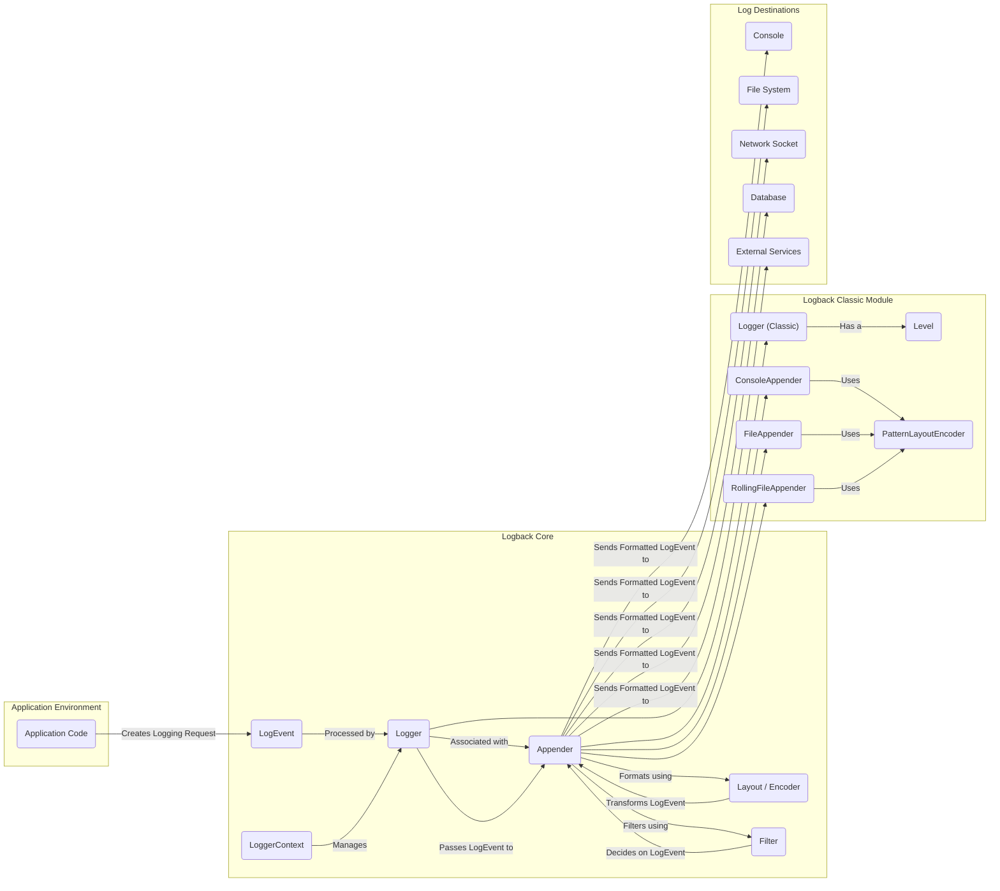
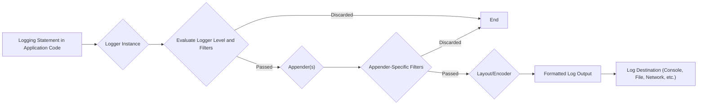

# Project Design Document: Logback Logging Framework - Improved

**1. Introduction**

This document provides an enhanced and more detailed design overview of the Logback logging framework, based on the codebase at [https://github.com/qos-ch/logback](https://github.com/qos-ch/logback). This improved document aims to provide a stronger foundation for subsequent threat modeling activities by offering a clearer understanding of Logback's architecture, data flow, and potential security considerations.

**2. Goals**

*   Provide a comprehensive and refined architectural overview of Logback, emphasizing components relevant to security.
*   Clearly illustrate the interactions between key components with a focus on data flow.
*   Detail the configuration mechanisms available in Logback and their security implications.
*   Explicitly highlight potential areas of interest and specific threats for security analysis and threat modeling, categorized for clarity.

**3. Scope**

This document focuses on the core architecture and functionality of the Logback framework, with a particular emphasis on aspects relevant to security. It covers the major modules, configuration processes, and the lifecycle of a log event, including potential vulnerabilities at each stage. Implementation details are discussed where they directly impact security considerations.

**4. Target Audience**

This document is primarily intended for security architects, security engineers, and developers who will be involved in threat modeling, security analysis, and secure development practices for applications utilizing the Logback framework.

**5. System Overview**

Logback is a robust and widely used logging framework for Java applications, designed as an evolution of log4j. Its primary function is to enable developers to control the generation, filtering, formatting, and destination of log messages. This control is crucial for application monitoring, debugging, and security auditing.

**6. System Architecture**

**7. Data Flow of a Log Event**

**8. Configuration Mechanisms and Security Implications**

Logback's flexibility in configuration is powerful but also introduces potential security considerations:

*   **XML Configuration File (`logback.xml`):**
    *   **Functionality:** Defines loggers, appenders, layouts/encoders, and filters. Loaded at application startup.
    *   **Security Implications:**
        *   **External Entity Injection (XXE):** If the XML parser is not configured to disable external entities, a malicious `logback.xml` could be crafted to access local files or internal network resources.
        *   **Sensitive Information in Configuration:**  Storing credentials or sensitive paths directly in the configuration file is a risk.
        *   **File Path Manipulation:** Incorrectly configured file appenders could be exploited to write logs to arbitrary locations.
*   **Programmatic Configuration:**
    *   **Functionality:** Allows for dynamic configuration of Logback through Java code.
    *   **Security Implications:**
        *   **Injection Vulnerabilities:** If configuration parameters are derived from untrusted input without proper sanitization, it could lead to vulnerabilities.
        *   **Complexity and Maintainability:**  Complex programmatic configurations can be harder to audit for security issues.
*   **Default Configuration:**
    *   **Functionality:** A basic configuration used if no explicit configuration is provided.
    *   **Security Implications:**  While generally safe, the default console appender might expose sensitive information during development or in non-production environments.

**9. Key Components and Security Considerations**

*   **`LoggerContext`:**
    *   **Functionality:** Manages the logging environment.
    *   **Security Considerations:**  While not directly a source of vulnerabilities, its proper initialization and lifecycle management are important for overall security.
*   **`Logger`:**
    *   **Functionality:**  Receives logging requests from the application.
    *   **Security Considerations:**  The naming and hierarchy of loggers can influence which appenders process log events. Misconfiguration could lead to sensitive information being logged inappropriately.
*   **`Appender`:**
    *   **Functionality:**  Determines the destination of log output.
    *   **Security Considerations:**
        *   **FileAppender/RollingFileAppender:** Vulnerable to path traversal if the file path is not carefully controlled. Permissions on log files are critical.
        *   **JDBCAppender:**  Susceptible to SQL injection if log messages are directly inserted into SQL queries without proper parameterization. Database credentials need secure management.
        *   **SocketAppender/SMTPAppender:**  Can expose log data over the network. Encryption (e.g., TLS) should be used. Authentication and authorization for remote logging destinations are important.
        *   **Custom Appenders:**  Security depends entirely on the implementation. Untrusted input handling and secure coding practices are crucial.
*   **`Layout` / `Encoder`:**
    *   **Functionality:** Formats log events for output.
    *   **Security Considerations:**
        *   **PatternLayout:**  Care must be taken to avoid including sensitive information in the logging pattern.
        *   **Custom Layouts/Encoders:**  Similar to custom appenders, security depends on the implementation.
*   **`Filter`:**
    *   **Functionality:**  Allows conditional filtering of log events.
    *   **Security Considerations:**
        *   **Misconfigured Filters:**  Can inadvertently block important security-related logs or allow the logging of sensitive information.
        *   **Complex Filter Logic:**  Can be difficult to audit for correctness and potential bypasses.
*   **`LogEvent`:**
    *   **Functionality:**  Represents a single logging event.
    *   **Security Considerations:**  Contains the log message and other contextual information. Care must be taken to sanitize user input before including it in log messages to prevent injection attacks in downstream log processing systems.

**10. Security Considerations (Categorized)**

To facilitate threat modeling, potential security concerns are categorized below:

*   **Injection Attacks:**
    *   **Log Injection:** Malicious data injected into log messages can compromise log analysis tools or trigger unintended actions.
    *   **SQL Injection (JDBCAppender):** If log data is directly used in SQL queries.
    *   **Command Injection (via custom appenders or integrations):** If log data is used to construct system commands.
*   **Information Disclosure:**
    *   **Logging Sensitive Data:**  Accidentally logging passwords, API keys, personal information, etc.
    *   **Exposure through Log Destinations:**  Insecurely configured appenders (e.g., unencrypted network logging).
    *   **Information Leakage in Error Messages:**  Detailed error logs might reveal internal system information.
*   **Denial of Service (DoS):**
    *   **Excessive Logging:**  Overwhelming the system with log data.
    *   **Log Forging:**  Flooding logs with irrelevant or malicious entries.
    *   **Resource Exhaustion:**  Writing large volumes of logs to disk can fill up storage.
*   **Authentication and Authorization:**
    *   **Lack of Authentication for Remote Appenders:**  Allowing unauthorized access to log data.
    *   **Weak Credentials:**  Compromised credentials for database or network logging.
*   **Configuration Vulnerabilities:**
    *   **XXE in `logback.xml`:** Exploiting XML parsing vulnerabilities.
    *   **Insecure File Permissions:**  Allowing unauthorized access to log files.
    *   **Hardcoded Credentials:**  Storing sensitive information directly in configuration.
*   **Supply Chain Vulnerabilities:**
    *   **Vulnerabilities in Logback Dependencies (SLF4j, Joran, etc.):**  Exploiting known issues in dependent libraries.
*   **Tampering and Auditing:**
    *   **Log Tampering:**  Modifying or deleting log entries to hide malicious activity.
    *   **Insufficient Auditing:**  Not logging critical security events.

**11. Dependencies and Security Implications**

Logback relies on other libraries, and vulnerabilities in these dependencies can impact Logback's security:

*   **SLF4j (Simple Logging Facade for Java):**  A logging abstraction layer. Vulnerabilities in SLF4j could affect how Logback interacts with the application.
*   **Joran:** Logback's configuration framework. Vulnerabilities in Joran's XML parsing could lead to XXE attacks.

It is crucial to keep these dependencies updated to their latest secure versions.

**12. Deployment Considerations and Security**

The security of Logback is also influenced by how it is deployed:

*   **Development Environments:**  More permissive logging might be acceptable, but care should be taken to avoid logging sensitive data that could be exposed.
*   **Testing Environments:**  Similar considerations to development environments.
*   **Production Environments:**  Logging should be carefully configured to balance security and operational needs. Sensitive data should be masked or filtered. Log destinations should be secured. Regular log rotation and archiving are essential.
*   **Cloud Environments:**  Consider using cloud-native logging services and ensure proper IAM (Identity and Access Management) policies are in place to control access to logs.

**13. Future Considerations**

This document provides a detailed design overview for threat modeling purposes. Future updates may include:

*   Analysis of specific Logback extensions and add-ons.
*   More detailed examination of error handling and exception logging.
*   Guidance on secure logging practices for developers.

This improved design document provides a more comprehensive and security-focused understanding of the Logback framework, enabling more effective threat modeling and security analysis.