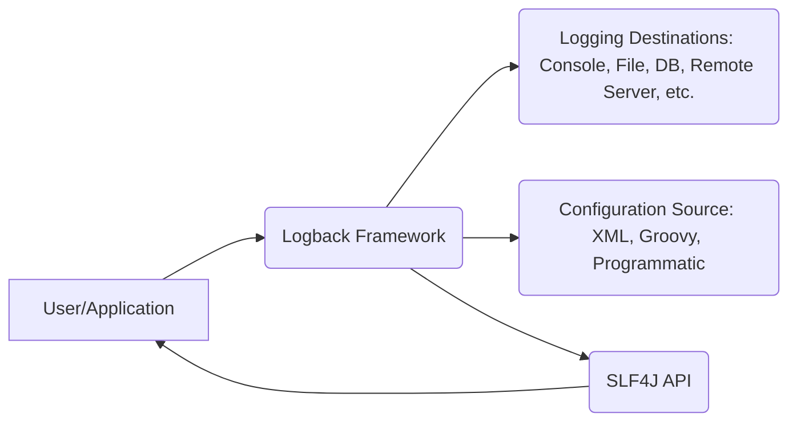
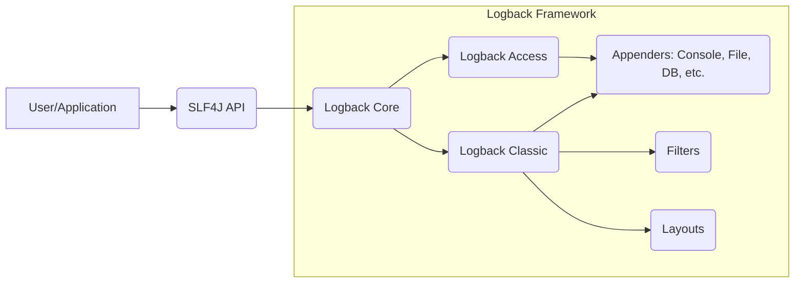
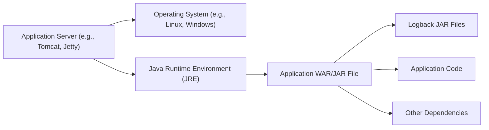
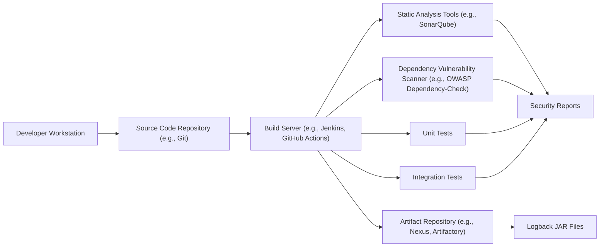

# BUSINESS POSTURE

Business Priorities and Goals:

*   Provide a robust, flexible, and performant logging framework for Java applications.
*   Offer a successor to the popular log4j framework, addressing its shortcomings and providing enhanced features.
*   Maintain backward compatibility where feasible, allowing for a smooth transition from log4j.
*   Provide extensive configuration options, including XML, Groovy, and programmatic configuration.
*   Support various logging appenders (console, file, database, remote servers, etc.).
*   Enable efficient filtering of log events based on level, logger, markers, and context information.
*   Facilitate easy integration with other systems and frameworks.
*   Ensure the framework is well-documented and easy to use.
*   Maintain an active and responsive open-source community.

Business Risks:

*   Vulnerabilities in the logging framework could be exploited to compromise applications using it (e.g., injection attacks, denial of service).
*   Performance issues in the logging framework could negatively impact the performance of applications.
*   Complex configuration could lead to misconfigurations and logging failures.
*   Lack of support for specific logging needs could limit adoption.
*   Inadequate documentation or community support could hinder usage and troubleshooting.
*   Competition from other logging frameworks could reduce market share.

# SECURITY POSTURE

Existing Security Controls:

*   security control: Logback addresses several known vulnerabilities present in log4j 1.x, particularly around configuration and remote code execution. (Described in Logback documentation and security advisories).
*   security control: Logback supports secure configuration practices, such as avoiding hardcoded credentials and using environment variables. (Described in Logback documentation).
*   security control: Logback allows filtering of log events, which can help reduce the risk of sensitive data exposure. (Described in Logback documentation on filters).
*   security control: Logback's architecture is designed to be modular and extensible, allowing for the development of custom security components if needed. (Described in Logback documentation on architecture).
*   security control: Logback uses SLF4J as logging facade. (Described in Logback documentation).

Accepted Risks:

*   accepted risk: While Logback aims to be secure, there is always a residual risk of undiscovered vulnerabilities, as with any software.
*   accepted risk: Misconfiguration of Logback by users can lead to security issues, such as exposing sensitive data in logs.
*   accepted risk: Use of certain appenders (e.g., sending logs to a remote server) introduces network-related security risks.

Recommended Security Controls:

*   security control: Implement regular security audits and penetration testing of the Logback codebase.
*   security control: Provide clear and concise security guidelines for Logback users, emphasizing secure configuration practices.
*   security control: Develop and maintain a robust vulnerability disclosure program.
*   security control: Consider integrating with security information and event management (SIEM) systems for centralized log monitoring and analysis.
*   security control: Explore the use of code signing to ensure the integrity of Logback releases.

Security Requirements:

*   Authentication:
    *   N/A - Logback itself does not handle authentication. Authentication is typically handled by the application using Logback.

*   Authorization:
    *   N/A - Logback itself does not handle authorization. Authorization is typically handled by the application using Logback.

*   Input Validation:
    *   Logback should properly handle and sanitize any input it receives, particularly from configuration files and external sources, to prevent injection attacks.
    *   Logback should validate the format and content of log messages to prevent malformed data from causing issues.

*   Cryptography:
    *   If Logback is used to transmit logs over a network (e.g., using a SocketAppender), it should support secure communication protocols like TLS/SSL.
    *   If sensitive data is logged, Logback should provide mechanisms for encrypting or masking that data.

# DESIGN

## C4 CONTEXT

Element Descriptions:

*   Element 1:
    *   Name: User/Application
    *   Type: User/External System
    *   Description: The Java application that utilizes the Logback framework for logging.
    *   Responsibilities: Generates log events by calling the SLF4J API, which is then processed by Logback.
    *   Security controls: Implements application-level security controls, including authentication, authorization, and input validation.

*   Element 2:
    *   Name: Logback Framework
    *   Type: Internal System
    *   Description: The core logging framework that processes log events.
    *   Responsibilities: Receives log events from the application via SLF4J, applies filtering and formatting rules, and dispatches events to configured appenders.
    *   Security controls: Implements input validation on configuration data, provides mechanisms for secure logging (e.g., TLS/SSL for remote appenders), and addresses known vulnerabilities from previous logging frameworks.

*   Element 3:
    *   Name: Logging Destinations (Console, File, DB, Remote Server, etc.)
    *   Type: External System
    *   Description: The various destinations where log events can be written.
    *   Responsibilities: Stores or processes log events received from the Logback framework.
    *   Security controls: Implements appropriate security controls based on the destination type (e.g., file system permissions, database security, network security for remote servers).

*   Element 4:
    *   Name: Configuration Source (XML, Groovy, Programmatic)
    *   Type: External System
    *   Description: The source from which Logback's configuration is loaded.
    *   Responsibilities: Provides configuration data to the Logback framework, specifying appenders, filters, layouts, and other settings.
    *   Security controls: Configuration files should be protected with appropriate access controls. Sensitive data (e.g., passwords) should be stored securely, potentially using environment variables or externalized configuration mechanisms.

*   Element 5:
    *   Name: SLF4J API
    *   Type: External System
    *   Description: Simple Logging Facade for Java.
    *   Responsibilities: Provides unified logging interface.
    *   Security controls: N/A

## C4 CONTAINER

Element Descriptions:

*   Element 1:
    *   Name: User/Application
    *   Type: User/External System
    *   Description: The Java application using Logback.
    *   Responsibilities: Generates log events.
    *   Security controls: Application-level security.

*   Element 2:
    *   Name: SLF4J API
    *   Type: External System
    *   Description: Simple Logging Facade for Java.
    *   Responsibilities: Provides unified logging interface.
    *   Security controls: N/A

*   Element 3:
    *   Name: Logback Core
    *   Type: Container (Java Library)
    *   Description: Provides the core functionality of Logback, including context management, logging event processing, and common components.
    *   Responsibilities: Manages the logging context, processes logging events, and provides a foundation for other Logback modules.
    *   Security controls: Input validation for configuration data.

*   Element 4:
    *   Name: Logback Classic
    *   Type: Container (Java Library)
    *   Description: Provides the traditional logging functionality, similar to log4j, for general-purpose logging.
    *   Responsibilities: Implements loggers, levels, and the main logging API used by applications.
    *   Security controls: Secure handling of logging events.

*   Element 5:
    *   Name: Logback Access
    *   Type: Container (Java Library)
    *   Description: Provides integration with servlet containers (e.g., Tomcat, Jetty) for logging HTTP requests and responses.
    *   Responsibilities: Captures HTTP request/response data and formats it as log events.
    *   Security controls: Secure handling of potentially sensitive HTTP data.

*   Element 6:
    *   Name: Appenders (Console, File, DB, etc.)
    *   Type: Container (Java Classes)
    *   Description: Components responsible for writing log events to specific destinations.
    *   Responsibilities: Writes log events to the configured destination (console, file, database, etc.).
    *   Security controls: Secure communication with external systems (e.g., TLS/SSL for network appenders), proper file permissions, database security.

*   Element 7:
    *   Name: Filters
    *   Type: Container (Java Classes)
    *   Description: Components that determine whether a log event should be processed based on specific criteria.
    *   Responsibilities: Filters log events based on level, logger, markers, or other criteria.
    *   Security controls: N/A

*   Element 8:
    *   Name: Layouts
    *   Type: Container (Java Classes)
    *   Description: Components that format log events into a specific output format (e.g., text, JSON, XML).
    *   Responsibilities: Formats log events according to a specified pattern or structure.
    *   Security controls: Secure handling of potentially sensitive data during formatting.

## DEPLOYMENT

Possible Deployment Solutions:

1.  Embedded within a Java Application: Logback JAR files are included in the application's classpath, and the application is deployed as a single unit (e.g., a WAR or JAR file).
2.  Shared Library: Logback JAR files are placed in a shared library directory of the application server (e.g., Tomcat's `lib` directory), making them available to multiple applications.
3.  OSGi Bundle: Logback is packaged as an OSGi bundle and deployed in an OSGi container.

Chosen Solution (Embedded within a Java Application):

Element Descriptions:

*   Element 1:
    *   Name: Application Server (e.g., Tomcat, Jetty)
    *   Type: Infrastructure Node
    *   Description: The application server that hosts the Java application.
    *   Responsibilities: Provides the runtime environment for the application, handles HTTP requests, and manages resources.
    *   Security controls: Application server security configuration, network security, access controls.

*   Element 2:
    *   Name: Operating System (e.g., Linux, Windows)
    *   Type: Infrastructure Node
    *   Description: The operating system on which the application server runs.
    *   Responsibilities: Provides the underlying platform for the application server and other components.
    *   Security controls: Operating system security configuration, firewalls, intrusion detection systems.

*   Element 3:
    *   Name: Java Runtime Environment (JRE)
    *   Type: Infrastructure Node
    *   Description: The Java runtime environment that executes the Java application.
    *   Responsibilities: Executes Java bytecode, manages memory, and provides access to system resources.
    *   Security controls: Java security manager, regular security updates.

*   Element 4:
    *   Name: Application WAR/JAR File
    *   Type: Deployment Unit
    *   Description: The packaged Java application, containing the application code, Logback JAR files, and other dependencies.
    *   Responsibilities: Contains all the necessary components to run the application.
    *   Security controls: Code signing, vulnerability scanning of dependencies.

*   Element 5:
    *   Name: Logback JAR Files
    *   Type: Library
    *   Description: The Logback library files included within the application.
    *   Responsibilities: Provides the logging functionality.
    *   Security controls: Dependency vulnerability scanning, regular updates.

*   Element 6:
    *   Name: Application Code
    *   Type: Code
    *   Description: The application's source code.
    *   Responsibilities: Implements the application's business logic.
    *   Security controls: Secure coding practices, code reviews, static analysis.

*   Element 7:
    *   Name: Other Dependencies
    *   Type: Library
    *   Description: Other libraries that application is using.
    *   Responsibilities: Provides additional functionality to application.
    *   Security controls: Dependency vulnerability scanning, regular updates.

## BUILD

Build Process Description:

1.  Developers write code and commit it to a source code repository (e.g., Git).
2.  A build server (e.g., Jenkins, GitHub Actions) monitors the repository for changes.
3.  When a change is detected, the build server checks out the code.
4.  The build server compiles the code.
5.  Static analysis tools (e.g., SonarQube) are run to identify code quality and potential security issues.
6.  A dependency vulnerability scanner (e.g., OWASP Dependency-Check) is run to identify known vulnerabilities in Logback's dependencies.
7.  Unit tests and integration tests are executed to verify the functionality of Logback.
8.  If all checks and tests pass, the build server packages Logback into JAR files.
9.  The JAR files are published to an artifact repository (e.g., Nexus, Artifactory).
10. Security reports from the various tools are generated and reviewed.

Security Controls:

*   security control: Use of a build server automates the build process and ensures consistency.
*   security control: Static analysis tools help identify potential security vulnerabilities in the code.
*   security control: Dependency vulnerability scanners detect known vulnerabilities in third-party libraries.
*   security control: Unit and integration tests help ensure the correctness and security of the code.
*   security control: Artifact repositories provide a central location for storing and managing build artifacts.
*   security control: Code reviews are performed before merging changes into the main branch.
*   security control: Access to the build server and artifact repository is restricted.

# RISK ASSESSMENT

Critical Business Processes:

*   Reliable and efficient logging for all applications using the framework.
*   Maintaining the integrity and availability of the logging framework itself.
*   Providing timely security updates and patches.

Data Sensitivity:

*   Log data may contain sensitive information, depending on what applications are logging. This could include:
    *   Personally Identifiable Information (PII)
    *   Financial data
    *   Authentication credentials (if improperly logged)
    *   Internal system information
    *   Business-sensitive data
*   The sensitivity of the log data depends entirely on the application using Logback and how it's configured. Logback itself doesn't inherently handle highly sensitive data, but it *transports* it. Therefore, the data sensitivity is classified as **variable**, ranging from low (non-sensitive debug information) to high (sensitive application data).

# QUESTIONS & ASSUMPTIONS

Questions:

*   What specific compliance requirements (e.g., GDPR, HIPAA, PCI DSS) must be considered for applications using Logback?
*   Are there any specific performance requirements or limitations for Logback?
*   What is the expected volume of log data generated by applications using Logback?
*   Are there any specific security concerns or requirements from users of Logback?
*   What is the process for reporting and addressing security vulnerabilities in Logback?
*   What level of support and maintenance is provided for Logback?

Assumptions:

*   BUSINESS POSTURE: It is assumed that the primary business goal is to provide a stable, reliable, and secure logging framework.
*   BUSINESS POSTURE: It is assumed that the Logback project has a moderate risk appetite, balancing the need for new features with the importance of security and stability.
*   SECURITY POSTURE: It is assumed that users of Logback are responsible for configuring it securely and for protecting the log data they generate.
*   SECURITY POSTURE: It is assumed that regular security audits and penetration testing are not currently performed, but are desirable.
*   DESIGN: It is assumed that the most common deployment model is embedding Logback within a Java application.
*   DESIGN: It is assumed that a build server and artifact repository are used, but the specific tools may vary.
*   DESIGN: It is assumed that Logback is primarily used with SLF4J.