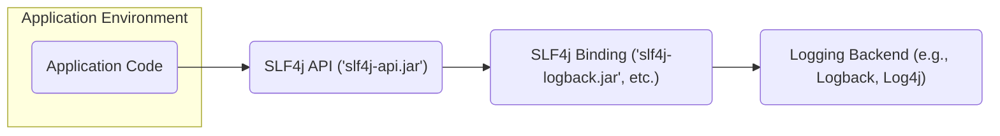
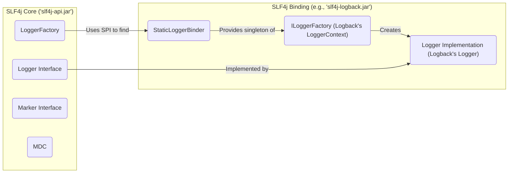
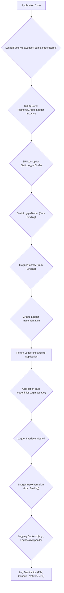

## Project Design Document: Simple Logging Facade for Java (SLF4j)

**Version:** 1.1
**Date:** October 26, 2023
**Author:** AI Software Architect

### 1. Introduction

This document provides a detailed architectural design of the Simple Logging Facade for Java (SLF4j) project, based on the codebase at [https://github.com/qos-ch/slf4j](https://github.com/qos-ch/slf4j). The primary goal of this document is to offer a comprehensive understanding of the system's components, their interactions, and the overall architecture, specifically tailored for use in subsequent threat modeling activities. This document aims to highlight potential areas of security concern within the SLF4j ecosystem.

### 2. Goals and Non-Goals

**Goals:**

*   Clearly define the architecture of the SLF4j library and its core principles.
*   Identify the key components within SLF4j and their specific responsibilities.
*   Describe the flow of log data through the SLF4j system, from application code to the logging backend.
*   Outline the dependencies of the SLF4j library, with a focus on the role of bindings.
*   Provide a solid foundation for identifying potential security vulnerabilities and attack vectors during threat modeling exercises.

**Non-Goals:**

*   Provide an exhaustive, line-by-line code analysis of every class and method within the SLF4j codebase.
*   Detail the internal implementation specifics of individual logging backend bindings (e.g., Logback, Log4j 2, Log4j version 1.2).
*   Document the historical evolution of SLF4j or the detailed rationale behind every design decision.
*   Include performance benchmarks, optimization strategies, or resource utilization metrics.

### 3. Architectural Overview

SLF4j operates as a logging facade, providing an abstract API that applications use for logging. This abstraction decouples the application's logging code from the specifics of any particular underlying logging framework. At runtime, the application is "bound" to a specific logging implementation through an SLF4j binding. This binding acts as a bridge, directing SLF4j calls to the chosen logging backend. Only one binding should be present in the classpath at runtime.

**Key Architectural Concepts:**

*   **Decoupling through Abstraction:** SLF4j's core value proposition is the abstraction it provides, allowing developers to write logging statements without committing to a specific logging implementation.
*   **Bindings as Bridges:**  SLF4j bindings are the crucial link between the SLF4j API and the concrete logging backend. They contain the implementation that adapts SLF4j calls to the target framework.
*   **Service Provider Interface (SPI):** SLF4j leverages Java's SPI mechanism to dynamically discover and load the appropriate `StaticLoggerBinder` implementation from the available binding at runtime. This allows for pluggable logging backends.

### 4. Component Design

This section details the key components within the SLF4j architecture and their roles.

*   **`LoggerFactory`:**
    *   The central entry point for obtaining `Logger` instances.
    *   Internally uses the `StaticLoggerBinder` (provided by the active binding) to delegate the creation of `Logger` instances to the underlying logging framework's factory.
    *   Ensures that all calls for a `Logger` with the same name return the same instance.

*   **`Logger` Interface:**
    *   Defines the standard logging methods (`trace()`, `debug()`, `info()`, `warn()`, `error()`) with varying argument types, including support for parameterized messages to prevent unnecessary string concatenation.
    *   Provides methods to check the current logging level (`isTraceEnabled()`, `isDebugEnabled()`, etc.).
    *   The actual implementation of this interface is provided by the chosen logging backend via the binding.

*   **`Marker` Interface:**
    *   Allows associating symbolic names or tags with log messages.
    *   Enables more sophisticated filtering and routing of log events based on these markers.
    *   Can be used to categorize log messages beyond simple severity levels.

*   **`MDC` (Mapped Diagnostic Context):**
    *   Provides a mechanism to store and retrieve contextual information specific to the current thread.
    *   This information can be included in log messages, aiding in diagnosing issues in multi-threaded environments.
    *   Implementations are typically provided by the underlying logging backend.

*   **`StaticLoggerBinder` (from Binding):**
    *   A concrete class provided by each SLF4j binding.
    *   Its `getSingleton()` method returns the single instance of the `ILoggerFactory` for the associated logging backend.
    *   This class is discovered and loaded by SLF4j using the Java SPI. Only one implementation should be available at runtime.

*   **`ILoggerFactory` (from Binding):**
    *   An interface defined by SLF4j, which must be implemented by the logging backend's binding.
    *   Responsible for creating and managing `Logger` instances specific to that logging backend.
    *   The implementation details are specific to the underlying logging framework (e.g., Logback's `ch.qos.logback.classic.LoggerContext`).

### 5. Data Flow

The flow of a log event through an application using SLF4j involves the following steps:

**Detailed Steps:**

1. The application code requests a `Logger` instance using `LoggerFactory.getLogger()`, specifying a logger name.
2. SLF4j's `LoggerFactory` attempts to retrieve an existing `Logger` instance with that name or creates a new one.
3. If a new `Logger` needs to be created, `LoggerFactory` uses the Java SPI to locate the `StaticLoggerBinder` implementation from the available binding.
4. The `StaticLoggerBinder` provides access to the `ILoggerFactory` of the underlying logging framework.
5. The `ILoggerFactory` creates a concrete `Logger` implementation specific to the logging backend.
6. The `Logger` instance is returned to the application code.
7. The application calls a logging method (e.g., `logger.info()`) on the obtained `Logger` instance.
8. The call is made against the `Logger` interface.
9. The method call is delegated to the corresponding method in the concrete `Logger` implementation provided by the binding.
10. The concrete `Logger` implementation interacts with the underlying logging backend (e.g., Logback) to process the log message.
11. The logging backend uses configured appenders to write the log message to the designated output (e.g., a file, the console, a network socket).

### 6. Security Considerations (Focused on Threat Modeling)

From a threat modeling perspective, the following aspects of SLF4j and its ecosystem are relevant:

*   **Dependency Chain Vulnerabilities:** SLF4j itself has minimal code, but applications rely on a binding. Vulnerabilities in the chosen logging backend (e.g., Log4j's Log4Shell vulnerability) can be exploited even if the application only directly uses SLF4j. Threat: Exploitation of vulnerable dependencies.
*   **Binding Conflicts and Manipulation:** If multiple SLF4j bindings are present in the classpath, the behavior becomes unpredictable, and it might be possible for an attacker to manipulate the classpath to force the use of a vulnerable or malicious binding. Threat:  Tampering, Information Disclosure (if logging goes to an unexpected place).
*   **Logging Backend Configuration Issues:** The security posture of the logging system is heavily dependent on the configuration of the underlying logging backend. Misconfigured appenders could expose sensitive information or create denial-of-service vulnerabilities. Threat: Information Disclosure, Denial of Service.
*   **Injection Attacks via Log Messages:** While SLF4j's API helps prevent direct code injection, if user-controlled data is included in log messages without proper sanitization, the logging backend might be vulnerable to injection attacks (e.g., if the backend processes log messages in a way that interprets special characters). Threat: Injection.
*   **Information Disclosure in Logs:**  Overly verbose logging or logging of sensitive data can lead to information leaks if log files are not properly secured. Threat: Information Disclosure.
*   **Denial of Service through Excessive Logging:**  An attacker might try to flood the application with requests that generate a large volume of log messages, potentially exhausting resources (disk space, CPU). Threat: Denial of Service.
*   **Manipulation of Log Output (Compromised Binding/Backend):** If the SLF4j binding or the underlying logging backend is compromised, an attacker could potentially manipulate log output to hide malicious activity, inject false information, or even execute arbitrary code. Threat: Tampering, Code Execution.

### 7. Dependencies

SLF4j core (`slf4j-api.jar`) has minimal direct dependencies. However, its functionality is entirely dependent on the presence of a single, appropriate binding library at runtime.

*   **Direct Dependency:** None (for `slf4j-api`).
*   **Runtime Dependency:** Exactly one SLF4j binding JAR (e.g., `slf4j-logback.jar`, `slf4j-log4j2.jar`, `slf4j-jdk14.jar`). The choice of binding determines the actual logging backend used.

**Important Note:** Applications using SLF4j inherit the transitive dependencies of the chosen binding library. Managing these transitive dependencies is crucial for security, as vulnerabilities in these dependencies can impact the application.

### 8. Deployment

SLF4j is deployed as a library within a Java application. The core `slf4j-api.jar` file is included in the application's classpath. The critical aspect of deployment is ensuring that **only one** SLF4j binding JAR is present in the classpath at runtime. The Java Service Provider Interface (SPI) mechanism is used to locate and load the `StaticLoggerBinder` implementation from the single binding present. Having multiple bindings can lead to unpredictable behavior and potential security issues.

### 9. Threat Model Focus

This design document highlights several key areas relevant to threat modeling SLF4j within an application:

*   **The Boundary between Application and SLF4j API:**  How does the application interact with the logging facade? What data is passed?
*   **The Boundary between SLF4j API and the Binding:** How is the binding selected and loaded? What are the potential risks of binding manipulation?
*   **The Boundary between the Binding and the Logging Backend:** How are log messages passed to the backend? What are the configuration options and their security implications?
*   **Data Flow of Log Messages:**  Where does the log data originate, how is it transformed, and where does it ultimately reside?  Are there opportunities for interception or manipulation?
*   **Dependencies (Direct and Transitive):** What are the potential vulnerabilities introduced by the dependencies of SLF4j and its bindings?

By understanding these boundaries and the flow of data, security professionals can effectively identify potential threats and design appropriate mitigation strategies for applications utilizing SLF4j.

### 10. Future Considerations

*   Detailed analysis of the security implications of various logging backend configurations and appenders.
*   Regular review of known vulnerabilities in common SLF4j bindings and their underlying logging frameworks.
*   Development of guidelines and best practices for secure logging practices when using SLF4j.
*   Consideration of runtime detection mechanisms for identifying and alerting on the presence of multiple SLF4j bindings.
