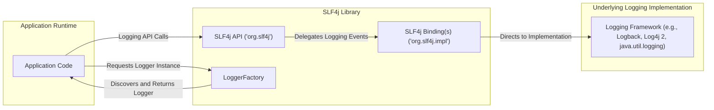

# Project Design Document: SLF4j (Simple Logging Facade for Java)

**Version:** 1.1
**Date:** October 26, 2023
**Author:** Gemini (AI Language Model)

## 1. Introduction

This document provides an enhanced and more detailed design overview of the Simple Logging Facade for Java (SLF4j) project, hosted at [https://github.com/qos-ch/slf4j](https://github.com/qos-ch/slf4j). This refined document aims to serve as a robust foundation for subsequent threat modeling activities by clearly outlining the architecture, components, interactions, and data flow within the SLF4j library. It elaborates on the previous version with more specific details relevant to security considerations.

## 2. Project Overview

SLF4j remains a logging facade, offering a crucial abstraction layer over various underlying Java logging frameworks. This design choice allows developers to interact with a consistent API (`org.slf4j`) without being tightly coupled to a specific logging implementation like Logback, Log4j 2, or java.util.logging. At runtime, a chosen SLF4j binding dynamically connects the SLF4j API calls to the desired logging framework. This dynamic binding provides significant flexibility for deployment and maintenance, enabling changes in the logging infrastructure without requiring recompilation of the application code.

## 3. Goals and Objectives

* **Enhanced Abstraction:**  To further decouple application logic from the specifics of logging frameworks, promoting cleaner and more maintainable code.
* **Improved Flexibility and Pluggability:** To facilitate seamless switching between different logging implementations through simple dependency changes, minimizing disruption.
* **Performance Optimization:** To ensure minimal performance overhead compared to direct usage of underlying logging frameworks, particularly through features like parameterized logging.
* **Simplified and Consistent API:** To provide a straightforward and uniform logging interface that is easy for developers to understand and use across different projects.
* **Comprehensive Logging Feature Support:** To abstract common logging functionalities, including logging levels, parameterized messages, Markers for conditional logging, and the powerful Mapped Diagnostic Context (MDC).
* **Reduced Dependency Conflicts:** By acting as a central facade, SLF4j helps to mitigate potential dependency conflicts that can arise when different libraries within an application depend on different logging frameworks.

## 4. Target Audience

This document is primarily intended for:

* Security engineers tasked with performing threat modeling, security assessments, and penetration testing of applications utilizing SLF4j.
* Software developers who are actively working with or integrating the SLF4j library into their Java applications.
* System architects responsible for designing and overseeing the architecture of systems that incorporate SLF4j for logging purposes.
* DevOps engineers involved in the deployment and configuration of applications using SLF4j.

## 5. Architecture Overview

The SLF4j architecture is centered around the facade pattern, with the SLF4j API acting as the central interface. The crucial element is the dynamic binding mechanism that connects the API to a concrete logging implementation at runtime.



## 6. Key Components

* **SLF4j API (`org.slf4j` package):**
    * This package contains the core interfaces and abstract classes that developers directly interact with for logging purposes.
    * Key interfaces include `Logger` (the primary interface for logging operations), `LoggerFactory` (responsible for creating `Logger` instances), `Marker` (for tagging log events), and `MDC` (for managing thread-local diagnostic context).
    * Provides methods for logging at various severity levels: `trace`, `debug`, `info`, `warn`, and `error`.
    * Supports parameterized log messages (e.g., `log.info("User {} logged in from {}", username, ipAddress)`) which improves performance by deferring string concatenation until the logging level is enabled.
* **SLF4j Bindings (`org.slf4j.impl` package):**
    * These are concrete implementations of the SLF4j API that bridge the gap to a specific logging framework.
    * Examples include `slf4j-logback.jar`, `slf4j-log4j12.jar` (for Log4j 1.2), `slf4j-log4j2.jar` (for Log4j 2), and `slf4j-jdk14.jar` (for java.util.logging).
    * The selection of the active binding occurs at runtime based on the JAR files present in the application's classpath. Only one binding should be present to avoid conflicts.
    * Each binding provides a concrete implementation of the `ILoggerFactory` interface, which is used by the `LoggerFactory` to instantiate `Logger` instances.
* **`LoggerFactory`:**
    * This is a utility class that serves as the entry point for obtaining `Logger` instances.
    * It employs a static initialization block that attempts to locate a suitable `ILoggerFactory` implementation from the available SLF4j bindings on the classpath.
    * If no binding is found, or multiple bindings are found, SLF4j will typically issue a warning or error message.
    * The `getLogger(String name)` method is commonly used to retrieve a `Logger` instance, where the name is often the fully qualified name of the class making the logging call.
* **`Logger` Interface:**
    * This is the central interface used by application code to perform logging operations.
    * It provides methods corresponding to different logging levels (e.g., `trace()`, `debug()`, `info()`, `warn()`, `error()`).
    * Each `Logger` instance is typically associated with a specific name, often derived from the class where it's instantiated.
* **`Marker` Interface:**
    * This interface allows for tagging log statements with specific markers.
    * Markers can be used for filtering log messages or for implementing more complex logging logic based on specific conditions.
* **MDC (Mapped Diagnostic Context):**
    * MDC provides a mechanism to store and retrieve contextual information associated with the current thread.
    * This is particularly useful in multi-threaded environments to correlate log messages with specific requests or transactions.
    * The `MDC` class provides static methods for putting, getting, and removing context information.

## 7. Data Flow

The journey of a log message from the application code to its final destination involves several steps, highlighting the role of SLF4j as an intermediary.

```mermaid
graph TD
    A["Application Code"] --> B{"LoggerFactory.getLogger()"};
    B --> C["Returns Logger Instance (from Binding)"];
    C --> D["Logger.info(\"Log message with {}\", parameter)"];
    D --> E{"SLF4j API Implementation"};
    E --> F{"Active SLF4j Binding (e.g., slf4j-logback)"};
    F --> G{"Underlying Logging Framework (e.g., Logback)"};
    G --> H["Configured Appenders (File, Console, Network, etc.)"];
```

Detailed breakdown:

1. The application code initiates the logging process by calling `LoggerFactory.getLogger()`, typically passing the class name as an argument.
2. The `LoggerFactory` locates the appropriate `ILoggerFactory` provided by the active SLF4j binding and delegates the request. The binding then creates and returns a concrete `Logger` instance.
3. The application code then invokes a logging method on the obtained `Logger` instance, such as `logger.info("Log message with {}", parameter)`.
4. This call is intercepted by the SLF4j API implementation within the `slf4j-api.jar`.
5. The SLF4j API implementation forwards the logging event to the active SLF4j binding that is present on the classpath.
6. The SLF4j binding translates the SLF4j API call into the corresponding API call of the underlying logging framework it is bound to (e.g., Logback, Log4j 2).
7. The underlying logging framework processes the log message according to its own configuration, including filtering based on log levels and routing the message to the configured appenders.
8. Finally, the configured appenders write the log message to the designated destinations, such as log files, the console, or remote logging servers.

## 8. Deployment Model

SLF4j is deployed as a standard library dependency within a Java application. Careful management of dependencies is crucial for correct functionality and security.

* **Mandatory Dependency: `slf4j-api.jar`:** This JAR file containing the core SLF4j API is a required dependency for any application using SLF4j.
* **Exactly One Binding JAR:**  Crucially, only one SLF4j binding JAR (e.g., `slf4j-logback.jar`, `slf4j-log4j2.jar`, `slf4j-jdk14.jar`) must be included in the application's classpath at runtime. Including multiple bindings will lead to unpredictable behavior and potential errors.
* **Underlying Logging Framework JARs:** The JAR files of the chosen underlying logging framework (e.g., `logback-classic.jar`, `log4j-core.jar`, `jul-to-slf4j.jar` if bridging from `java.util.logging`) must also be present in the classpath.
* **Binding Selection Mechanism:** SLF4j uses a simple service provider interface (SPI) mechanism to automatically discover the available `ILoggerFactory` implementation from the binding JARs on the classpath.

## 9. Security Considerations (Detailed)

This section expands on the preliminary security considerations, providing more specific details relevant for threat modeling.

* **Dependency Vulnerabilities:**  As with any dependency, vulnerabilities in the `slf4j-api.jar` or the chosen binding JARs can pose a security risk to the application. Regularly updating SLF4j and its bindings is essential to patch known vulnerabilities. Tools for dependency scanning should be employed to identify and manage these risks.
* **Logging Configuration Exploits:** The configuration of the underlying logging framework (e.g., Logback's `logback.xml`, Log4j 2's `log4j2.xml`) can be a target for exploitation. Misconfigurations can lead to:
    * **Information Disclosure:**  Logging sensitive data (passwords, API keys, personal information) in plain text to accessible locations.
    * **Log Injection Attacks:** If the logging configuration allows for file paths or other parameters to be controlled by external input, attackers might be able to write arbitrary data to sensitive locations or overwrite existing files.
* **Log Injection Vulnerabilities:**  Improper handling of user-provided data within log messages can lead to log injection. Attackers can inject malicious content into log files, potentially:
    * **Spoofing Log Data:**  Manipulating logs to hide malicious activity or frame others.
    * **Exploiting Log Analysis Tools:** Injecting commands or scripts that are executed by log analysis tools.
    * **Bypassing Security Controls:**  Obscuring attacks within a large volume of manipulated log data. Parameterized logging should be used consistently to mitigate this.
* **Excessive Logging and Denial of Service:**  Uncontrolled or overly verbose logging can consume significant system resources (CPU, disk space, I/O), potentially leading to denial of service. Properly configuring logging levels and implementing mechanisms to control log volume are important.
* **MDC Security Risks:** While MDC is powerful, storing sensitive information in the MDC requires careful consideration. If MDC data is not properly sanitized or if log appenders are not secured, this information could be exposed.
* **Binding Conflicts and Classpath Issues:**  Having multiple SLF4j binding JARs on the classpath can lead to unpredictable behavior, including the possibility of a less secure or outdated logging framework being used unintentionally. Careful dependency management is crucial to avoid these conflicts.
* **Third-Party Appender Vulnerabilities:** The security of the appenders used by the underlying logging framework is also a concern. Vulnerabilities in these appenders could be exploited if they process log data in an insecure manner (e.g., insecure network communication, writing to publicly accessible locations).

## 10. Assumptions and Constraints

* It is assumed that developers implementing logging with SLF4j are aware of basic secure coding practices, including the importance of input validation and avoiding logging sensitive information directly.
* The security of the underlying logging frameworks themselves is considered to be the responsibility of those projects, although SLF4j's interaction with them must be considered in threat modeling.
* This document primarily focuses on the core SLF4j library and its interaction with logging frameworks. Detailed configuration of specific logging frameworks is outside the scope of this document.

## 11. Glossary

* **Facade Pattern:** A structural design pattern that provides a simplified interface to a complex subsystem, hiding its internal complexities.
* **Binding (SLF4j):** A specific implementation of the SLF4j API that connects it to a particular underlying logging framework.
* **API (Application Programming Interface):** A set of definitions and protocols used for building and integrating application software.
* **JAR (Java Archive):** A package file format used to aggregate many Java class files, associated metadata, and resources into one file.
* **Classpath:** A parameter in the Java Virtual Machine (JVM) that specifies the locations where the JVM should look for user-defined classes and packages.
* **MDC (Mapped Diagnostic Context):** A mechanism to store and retrieve contextual information associated with a specific thread.
* **Appender (Logging):** A component within a logging framework that is responsible for writing log events to a specific destination (e.g., a file, the console, a database, a network socket).
* **SPI (Service Provider Interface):** A mechanism that enables a framework to discover and load implementations of a specific interface at runtime.

This improved design document provides a more comprehensive and detailed understanding of the SLF4j project, specifically tailored to facilitate thorough and effective threat modeling activities. The expanded descriptions of components, data flow, and security considerations offer a more robust foundation for identifying potential vulnerabilities and developing appropriate mitigation strategies.
