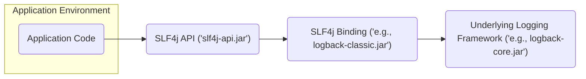
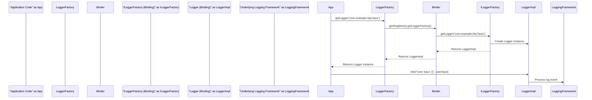

# Project Design Document: Simple Logging Facade for Java (SLF4j)

**Version:** 1.1
**Date:** October 26, 2023
**Author:** AI Software Architect

## 1. Introduction

This document provides a detailed design overview of the Simple Logging Facade for Java (SLF4j) project, as hosted on GitHub at [https://github.com/qos-ch/slf4j](https://github.com/qos-ch/slf4j). This document is specifically created to serve as a foundation for subsequent threat modeling activities, aiming to identify potential security vulnerabilities and risks associated with the SLF4j library and its usage.

## 2. Goals

*   Provide a comprehensive architectural overview of the SLF4j library, focusing on aspects relevant to security.
*   Clearly identify key components, their responsibilities, and potential security implications.
*   Describe the data flow and interactions within the system, highlighting points of potential vulnerability.
*   Outline potential areas of security concern and suggest starting points for threat modeling exercises (e.g., using STRIDE methodology).

## 3. System Overview

SLF4j acts as a logging facade, abstracting away the complexities of specific underlying logging frameworks. Applications interact with the SLF4j API, and at runtime, a binding mechanism connects this API to a concrete logging implementation (like Logback or Log4j 2). This decoupling allows developers to change logging frameworks without modifying application code. However, the binding process and the interaction with the underlying framework introduce potential security considerations.

Here's a high-level architectural diagram illustrating the key interactions:

**Key Concepts:**

*   **Facade Pattern:** SLF4j implements the facade pattern, providing a simplified interface to a more complex subsystem (the various logging frameworks).
*   **Binding Implementation:**  A crucial component that bridges the SLF4j API and a specific logging framework. Only one binding should be active at runtime to avoid conflicts and unpredictable behavior.
*   **API Abstraction:** The `slf4j-api` defines the interfaces and classes developers use for logging, remaining independent of the actual logging implementation.
*   **Underlying Framework Execution:** The chosen logging framework handles the actual processing, formatting, and output of log messages.

## 4. Detailed Design

### 4.1. Core Components

*   **`org.slf4j.Logger` Interface:**
    *   The primary interface for performing logging operations within application code.
    *   Defines methods for logging at different severity levels: `trace`, `debug`, `info`, `warn`, and `error`.
    *   Accepts message strings, which can include placeholders for arguments, preventing the need for manual string concatenation and potentially mitigating some injection risks.

*   **`org.slf4j.LoggerFactory` Class:**
    *   The factory class used by applications to obtain instances of the `Logger` interface.
    *   Provides static `getLogger()` methods, typically taking the class name or a string as input to identify the logger.
    *   Internally delegates the creation of `Logger` instances to the bound `ILoggerFactory`.

*   **`org.slf4j.ILoggerFactory` Interface:**
    *   An interface defining the contract for creating `Logger` instances.
    *   Implemented by the specific SLF4j binding in use. Each binding provides its own implementation.

*   **`org.slf4j.spi.LoggerFactoryBinder` Interface:**
    *   A service provider interface (SPI) that *must* be implemented by each SLF4j binding.
    *   Provides the crucial link between the SLF4j API and the concrete logging implementation.
    *   The `getSingleton()` method returns the single instance of the `LoggerFactoryBinder` for the binding.
    *   The `getLoggerFactory()` method returns the `ILoggerFactory` instance of the bound logging framework.

*   **Static Binding Mechanism:**
    *   SLF4j employs a static binding approach. During class loading, SLF4j attempts to locate an implementation of `LoggerFactoryBinder` on the classpath.
    *   The `StaticLoggerBinder` class (generated as part of the binding) holds a static reference to the `ILoggerFactory` of the selected logging framework.
    *   If multiple bindings are found, SLF4j issues a warning, but the behavior becomes undefined and potentially problematic from a security perspective.

### 4.2. Logging Process Flow

**Detailed Steps:**

1. **Logger Request:** The application calls `LoggerFactory.getLogger(String name)` to obtain a `Logger` instance.
2. **Binding Lookup:** `LoggerFactory` internally uses the statically bound `StaticLoggerBinder` to retrieve the active `ILoggerFactory`.
3. **Logger Creation Delegation:** The `StaticLoggerBinder` provides the `ILoggerFactory` instance associated with the chosen binding. The `LoggerFactory` then calls the `getLogger()` method on this `ILoggerFactory`.
4. **Framework-Specific Logger:** The `ILoggerFactory` implementation (from the binding) creates and returns an instance of the `Logger` interface, which is actually an implementation provided by the underlying logging framework.
5. **Logging Invocation:** The application calls a logging method (e.g., `info()`) on the obtained `Logger` instance, passing the log message and any arguments.
6. **Underlying Framework Processing:** The `Logger` implementation from the bound framework handles the log event, including formatting the message, applying configured filters, and outputting the log to the designated appenders.

### 4.3. Configuration

*   SLF4j itself has minimal configuration. Its primary responsibility is to delegate logging to the underlying framework.
*   The configuration of logging behavior (e.g., log levels, output destinations, formatting patterns) is entirely managed by the bound logging framework (e.g., through `logback.xml`, `log4j2.xml`, or programmatic configuration).
*   SLF4j provides a mechanism to detect and warn if multiple binding implementations are present on the classpath, which is a critical configuration issue with potential security implications.

### 4.4. Markers and MDC

*   **Markers:** SLF4j supports Markers, which are objects attached to log statements to provide additional context or categorization. These are passed to the underlying logging framework if it supports them. Markers can be used for filtering and routing log events.
*   **MDC (Mapped Diagnostic Context):** SLF4j provides an MDC API, allowing applications to store and retrieve contextual information associated with the current thread. This information is often included in log messages, aiding in debugging and tracing. However, improper handling of data placed in the MDC can introduce security vulnerabilities.

## 5. Security Considerations

This section details potential security concerns related to the SLF4j library and its interaction with underlying logging frameworks. These points should be the focus of subsequent threat modeling activities.

*   **Dependency Management & Supply Chain Attacks:**
    *   Vulnerabilities in the `slf4j-api` library itself could be exploited if present.
    *   Security flaws in the chosen SLF4j binding (e.g., `logback-classic`, `slf4j-log4j12`) can directly impact applications. Ensure bindings are kept up-to-date with security patches.
    *   Transitive dependencies of SLF4j and its bindings introduce further risk. Regularly audit and manage these dependencies for known vulnerabilities.

*   **Binding Mechanism Vulnerabilities:**
    *   **Multiple Bindings:** The static binding mechanism relies on finding a single `LoggerFactoryBinder`. If multiple bindings are present, SLF4j warns, but the actual binding used is unpredictable. This could lead to unexpected logging behavior or even the complete failure of logging, hindering security monitoring and incident response. An attacker might try to introduce a malicious binding.
    *   **Malicious Bindings:** If an attacker can somehow inject a malicious SLF4j binding into the classpath, they could potentially gain control over the logging process, suppressing critical security logs or injecting false information.

*   **Underlying Logging Framework Vulnerabilities (Indirect Risk):**
    *   While SLF4j is a facade, vulnerabilities in the underlying logging framework (e.g., Log4Shell in Log4j 2) directly affect applications using SLF4j with that vulnerable binding. It's crucial to stay informed about vulnerabilities in the chosen logging framework.
    *   SLF4j does not provide protection against vulnerabilities within the bound logging framework.

*   **MDC Injection and Information Disclosure:**
    *   If user-controlled data is placed into the MDC without proper sanitization, it could lead to log injection vulnerabilities in the underlying logging framework. Depending on the logging configuration, this could allow attackers to inject arbitrary data into log files, potentially leading to log tampering or the execution of malicious commands if logs are processed by vulnerable systems.
    *   Carelessly including sensitive information in MDC values can lead to unintended information disclosure in log files.

*   **Configuration Security:**
    *   Misconfigured underlying logging frameworks can create security risks. For example, overly permissive logging levels might expose sensitive data.
    *   Insecurely configured appenders could write logs to publicly accessible locations or use insecure protocols.
    *   Lack of proper log rotation and retention policies can lead to excessive disk usage or the loss of valuable security logs.

## 6. Dependencies

*   **`slf4j-api`:** The core API library providing the logging interfaces.
*   **Exactly one SLF4j binding implementation:**
    *   `logback-classic` (requires `logback-core`)
    *   `slf4j-log4j12` (requires Log4j 1.2)
    *   `log4j-slf4j-impl` (requires Log4j 2 API and Core)
    *   `jul-to-slf4j` (for routing `java.util.logging` to SLF4j)
    *   `slf4j-jdk14` (for using `java.util.logging` directly)
    *   `slf4j-nop` (discards all log output)
    *   `slf4j-simple` (simple console output)

## 7. Deployment Considerations

*   SLF4j is deployed as a library within Java applications.
*   The choice of SLF4j binding is a critical deployment decision. Ensure only one appropriate binding is included in the application's classpath.
*   Configuration of the underlying logging framework is typically done through configuration files (e.g., `logback.xml`, `log4j2.xml`) placed on the classpath or specified via system properties. Securely manage these configuration files.

## 8. Future Considerations

*   Further analysis of the security implications of the static binding mechanism and potential mitigation strategies for the multiple bindings issue.
*   Detailed threat modeling exercises focusing on the interaction points between SLF4j and various underlying logging frameworks, considering specific vulnerabilities of each.
*   Investigation into potential security enhancements within the SLF4j API itself, although its role as a facade limits the scope for direct security features.
*   Development of guidelines and best practices for secure logging using SLF4j, emphasizing secure configuration of underlying logging frameworks and safe handling of user input in log messages and MDC.