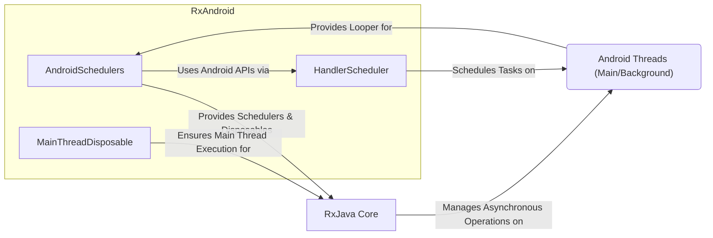
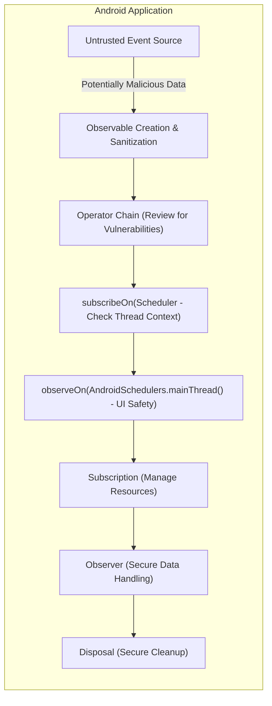

# Project Design Document: RxAndroid

**Version:** 1.1
**Date:** October 26, 2023
**Author:** AI Software Architect

## 1. Introduction

This document provides a detailed architectural design of the RxAndroid library, based on the publicly available source code at [https://github.com/ReactiveX/RxAndroid](https://github.com/ReactiveX/RxAndroid). This document is specifically created to serve as a foundation for subsequent threat modeling activities. It outlines the key components, their interactions, and the overall structure of the library, with a focus on identifying potential security-relevant aspects.

## 2. Goals

*   Clearly define the architecture and key components of RxAndroid, emphasizing elements relevant to security.
*   Illustrate the data flow within the library and its interaction with the Android operating system, highlighting potential points of vulnerability.
*   Identify potential areas of interest and specific threats for security analysis and threat modeling.
*   Provide a comprehensive and security-focused overview for stakeholders involved in the security assessment of projects utilizing RxAndroid.

## 3. Overview

RxAndroid is a library that provides Android-specific bindings for RxJava, a library for composing asynchronous and event-based programs using observable sequences. It bridges the gap between the reactive programming paradigm of RxJava and the Android platform's threading model and UI interactions. The core purpose of RxAndroid is to simplify asynchronous operations and manage events on Android while adhering to platform constraints, particularly regarding the main (UI) thread. This document focuses on how this bridging and management might introduce security considerations.

## 4. Architectural Design

RxAndroid extends the core concepts of RxJava by providing specialized `Scheduler` implementations tailored for the Android environment. Understanding these schedulers and their interaction with the Android OS is crucial for security analysis.

### 4.1. Key Components

*   **`AndroidSchedulers`:** The primary entry point provided by RxAndroid for obtaining `Scheduler` instances specific to Android.
    *   `mainThread()`: Returns a `Scheduler` that executes tasks on the Android main (UI) thread. This is critical for UI updates and interactions but requires careful handling to avoid blocking.
    *   `from(Looper looper)`: Creates a `Scheduler` that executes tasks on the thread associated with the provided `Looper`. This enables scheduling tasks on specific background threads, potentially with different security contexts.
*   **`MainThreadDisposable`:** A `Disposable` implementation ensuring that the disposal logic is executed on the Android main thread. This prevents `CalledFromWrongThreadException` when unsubscribing from observables that interact with UI components. Improper disposal can lead to resource leaks or unexpected behavior.
*   **`HandlerScheduler`:** An internal `Scheduler` implementation used by `AndroidSchedulers.from(Looper)`. It utilizes Android's `Handler` mechanism to schedule and execute tasks on the specified `Looper`'s thread. Understanding the security implications of the target `Looper` is important.
*   **Dependencies:** RxAndroid directly depends on RxJava. Security vulnerabilities in RxJava could propagate to applications using RxAndroid.

### 4.2. Component Interactions

**Detailed Description of Interactions:**

*   **`AndroidSchedulers` Provides Schedulers & Disposables to `RxJava Core`:**  `AndroidSchedulers` acts as a factory, providing `Scheduler` instances (like the main thread scheduler) and `Disposable` implementations (`MainThreadDisposable`) to RxJava. These dictate where and how asynchronous operations are executed and cleaned up. Incorrect scheduler usage can lead to thread safety issues.
*   **`AndroidSchedulers` Uses Android APIs via `HandlerScheduler`:** When a specific `Looper` is provided, `AndroidSchedulers` uses `HandlerScheduler`, which internally interacts with Android's `Handler` mechanism. This interaction needs to be secure, ensuring that tasks are executed in the intended context and don't bypass security restrictions.
*   **`MainThreadDisposable` Ensures Main Thread Execution for `RxJava Core`:**  `MainThreadDisposable` guarantees that disposal logic runs on the main thread. This is crucial for UI safety but also means that any potentially blocking operations within the disposal logic could freeze the UI.
*   **`HandlerScheduler` Schedules Tasks on `Android Threads (Main/Background)`:**  `HandlerScheduler` is responsible for the actual scheduling of tasks on Android threads. The security context of these threads is important. For instance, tasks on the main thread have access to the UI, while background threads might have different permissions.
*   **`RxJava Core` Manages Asynchronous Operations on `Android OS`:** RxJava, guided by the `Schedulers` provided by RxAndroid, performs asynchronous operations. This involves interacting with various parts of the Android OS, such as network components, file system, and sensors. These interactions must adhere to Android's permission model.
*   **`Android OS` Provides Looper for `AndroidSchedulers`:**  The `Looper` objects, which define the message queue of a thread, are provided by the Android OS. Using a `Looper` from a compromised or untrusted source could lead to malicious code execution on that thread.

### 4.3. Data Flow with Security Considerations

The typical data flow in an Android application using RxAndroid, with a focus on security implications, involves:

1. **Untrusted Event Source:** Data originates from various sources, some of which might be untrusted (e.g., user input, network requests, sensor data). *Threat: Injection attacks, data breaches.*
2. **Observable Creation:**  Untrusted data is often transformed into an `Observable`. Care must be taken to sanitize or validate this data at this stage. *Threat: Introduction of malicious data into the stream.*
3. **Operator Chain (Potential Vulnerabilities):** A series of RxJava operators manipulate the data. Custom operators or incorrect usage of standard operators could introduce vulnerabilities. *Threat: Logic flaws, information leaks, denial of service.*
4. **`subscribeOn(Scheduler)` (Thread Context):**  The `subscribeOn()` operator determines the thread where the `Observable`'s source emits items. Executing sensitive operations on an inappropriate thread could expose them. *Threat: Privilege escalation, information disclosure.*
5. **`observeOn(AndroidSchedulers.mainThread())` (UI Interaction):**  Often, `observeOn()` switches processing to the main thread for UI updates. Ensure that only safe operations are performed on the UI thread to prevent blocking or UI manipulation vulnerabilities. *Threat: UI freezing, UI redressing.*
6. **Subscription (Resource Management):** An `Observer` subscribes to the `Observable`. Improper subscription management can lead to resource leaks. *Threat: Denial of service through resource exhaustion.*
7. **Emission and Observation (Data Handling):** The `Observable` emits items, and the `Observer` receives them. Ensure proper handling and sanitization of data received by the `Observer`, especially if it's displayed to the user or used in sensitive operations. *Threat: Cross-site scripting (if displaying web content), data corruption.*
8. **Disposal (Cleanup):** The subscription is disposed of. Ensure disposal logic is secure and doesn't introduce new vulnerabilities, especially if it involves releasing sensitive resources. *Threat: Resource leaks, dangling pointers (less common in managed environments but possible with native interactions).*

## 5. Threat Landscape

Based on the architecture and data flow, here are potential threat areas to consider during threat modeling:

*   **Threading Issues:**
    *   **Race Conditions:** Concurrent access to shared mutable state by observables running on different schedulers.
    *   **Deadlocks:**  Situations where threads are blocked indefinitely, waiting for each other.
    *   **Main Thread Starvation:** Long-running operations on the main thread causing UI unresponsiveness.
*   **Data Handling Vulnerabilities:**
    *   **Injection Attacks:**  Untrusted data flowing through observables without proper sanitization could lead to injection vulnerabilities in downstream components (e.g., SQL injection if data is used in database queries).
    *   **Information Disclosure:** Errors or logging on incorrect schedulers might expose sensitive data.
    *   **Data Corruption:**  Race conditions or incorrect data transformations within the observable chain could lead to data corruption.
*   **Resource Management Issues:**
    *   **Memory Leaks:** Failure to dispose of subscriptions properly, especially those involving main thread interactions.
    *   **Resource Exhaustion:**  Creating observables or schedulers without proper limits could lead to resource exhaustion and denial of service.
*   **Scheduler-Specific Risks:**
    *   **Abuse of `from(Looper)`:** Using a `Looper` associated with a compromised or less privileged process could lead to security breaches.
    *   **Custom Scheduler Vulnerabilities:**  If developers implement custom schedulers, they might introduce threading issues or security flaws.
*   **Dependency Vulnerabilities:**
    *   **RxJava Vulnerabilities:**  Security flaws in the underlying RxJava library could directly impact RxAndroid users.
*   **UI-Related Vulnerabilities:**
    *   **UI Freezing/Blocking:**  Performing long-running operations on the main thread.
    *   **UI Redressing:**  Manipulating the UI in unexpected ways due to asynchronous operations.

## 6. Dependencies

*   **RxJava (io.reactivex.rxjava3:rxjava3):** RxAndroid relies entirely on RxJava for its reactive streams implementation. Security assessments should also consider potential vulnerabilities in this dependency.

## 7. Deployment

RxAndroid is deployed as a library dependency within Android application projects. Developers include it in their `build.gradle` file. Its security posture is therefore directly tied to how it's used and integrated within the application.

## 8. Future Considerations (Out of Scope for Initial Threat Model)

*   Potential security implications of future integrations with other asynchronous programming models like Kotlin Coroutines.
*   The impact of new Android OS features and security enhancements on RxAndroid's security profile.
*   Consideration of specific RxAndroid extensions or community-contributed modules and their security implications.

This document provides a security-focused architectural overview of RxAndroid, intended to be a crucial input for a comprehensive threat modeling exercise. The identified threat areas and data flow analysis highlight potential vulnerabilities that should be further investigated.