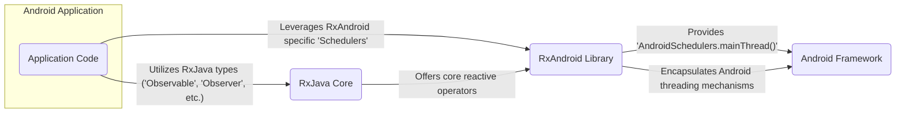

## Project Design Document: RxAndroid Library (Improved)

**1. Introduction**

This document provides a detailed design overview of the RxAndroid library, specifically tailored for threat modeling. It elaborates on the architecture, key components, and interactions of RxAndroid within the Android ecosystem. This document aims to provide a comprehensive understanding of the library's functionalities and potential security implications, serving as a strong foundation for subsequent threat modeling activities. It meticulously outlines the system's boundaries, data flow patterns, and dependencies, facilitating a thorough security analysis.

**2. Project Overview**

RxAndroid is a library that offers Android-specific bindings for RxJava, a powerful library for composing asynchronous and event-based programs using observable sequences. Its primary function is to seamlessly integrate the reactive programming paradigm of RxJava with the Android UI threading model. The core value proposition of RxAndroid lies in simplifying asynchronous operations and ensuring safe UI updates from background threads within Android applications.

**3. Goals**

* Furnish a clear, concise, and comprehensive description of the RxAndroid library's architecture and functionalities.
* Precisely identify key components and meticulously detail their interactions.
* Systematically outline various data flow patterns within the library and its interactions with encompassing Android applications.
* Accurately document all relevant dependencies and the typical deployment environment.
* Serve as the definitive foundational document for subsequent threat modeling activities.

**4. Architecture Overview**

RxAndroid is architecturally designed as a lean layer built directly upon the robust foundation of RxJava. It doesn't introduce significant novel architectural complexities but instead provides specialized utilities and `Scheduler` implementations specifically optimized for the Android environment. The central architectural concept revolves around the harmonious interaction between RxJava's reactive streams and the intricacies of Android's threading model.



**5. Key Components (Detailed)**

* **`AndroidSchedulers`:** This is a central component within RxAndroid. It provides static factory methods for obtaining `Scheduler` instances tailored for Android.
    * **`AndroidSchedulers.mainThread()`:**  Returns a `Scheduler` that executes tasks on the Android main (UI) thread. This is critical for ensuring thread safety when updating UI elements. Potential threats involve tasks blocking the main thread, leading to ANR (Application Not Responding) errors.
    * **Security Relevance:** Misuse can lead to UI freezes and denial-of-service within the application's UI thread.

* **`MainThreadDisposable`:**  An implementation of the `Disposable` interface.
    * **Functionality:** Ensures that the `dispose()` method (used for unsubscribing) is executed on the Android main thread. This is essential to prevent potential threading issues when releasing resources that interact with the UI.
    * **Security Relevance:** Failure to dispose on the main thread could lead to crashes or unexpected behavior related to UI updates after a component is no longer active.

* **`HandlerScheduler`:** A `Scheduler` implementation that utilizes an Android `Handler` for scheduling tasks.
    * **Functionality:** Offers more granular control over task execution by associating it with a specific `Handler` and its associated `Looper`. This can be used for scheduling tasks on background threads with specific characteristics.
    * **Security Relevance:** Improper use of `HandlerScheduler` with handlers tied to untrusted sources could potentially lead to unexpected code execution on unintended threads.

* **Internal Assertions and Error Handling:** While not directly exposed, RxAndroid likely incorporates internal assertions and error handling mechanisms.
    * **Functionality:** These mechanisms aim to catch programming errors and ensure the library's stability.
    * **Security Relevance:**  Robust internal error handling is crucial to prevent unexpected states that could be exploited. Lack of proper error handling might expose internal details or lead to exploitable crashes.

**6. Data Flow Patterns**

This section outlines common data flow patterns within applications using RxAndroid, highlighting potential security considerations in each.

* **Scenario 1: Simple UI Update:**
    * An asynchronous operation completes on a background thread.
    * `observeOn(AndroidSchedulers.mainThread())` is used to switch to the main thread.
    * The `Observer` updates the UI.
    * **Potential Threat:** If the background operation retrieves sensitive data, ensuring the data is handled securely before and after the thread switch is crucial.

    ```mermaid
    graph LR
        subgraph "Background Thread"
            A1("Async Operation") --> B1("Data Emitted")
        end
        C1("observeOn('AndroidSchedulers.mainThread()')")
        subgraph "Main Thread"
            D1("Observer Receives Data") --> E1("UI Update")
        end
        B1 --> C1
        C1 --> D1
    ```

* **Scenario 2: Handling User Input:**
    * UI events (e.g., button clicks) are converted into `Observable` streams.
    * Operators are used to process and react to these events.
    * **Potential Threat:**  If user input is directly used in sensitive operations without proper sanitization, it could lead to vulnerabilities like injection attacks (though RxAndroid itself doesn't directly handle input sanitization).

    ```mermaid
    graph LR
        A2("User Input Event") --> B2("Observable Creation")
        B2 --> C2("Operators (e.g., debounce, filter)")
        C2 --> D2("Action Performed")
    ```

* **Scenario 3: Long-Running Background Tasks:**
    * An `Observable` performs a long-running operation on a background thread.
    * Progress updates might be published to the UI periodically.
    * **Potential Threat:**  Ensuring that background tasks are properly cancellable and don't leak resources is important. Also, if these tasks access sensitive resources, proper permission handling is necessary.

    ```mermaid
    graph LR
        subgraph "Background Thread"
            A3("Long-Running Operation") --> B3("Progress Updates")
        end
        C3("observeOn('AndroidSchedulers.mainThread()')")
        subgraph "Main Thread"
            D3("Update UI with Progress")
        end
        B3 --> C3
        C3 --> D3
    ```

**7. Dependencies**

* **RxJava:** RxAndroid has a mandatory and tight dependency on a specific version (or range of versions) of RxJava.
    * **Security Implication:** Any vulnerabilities present in the underlying RxJava library directly impact the security of applications using RxAndroid. It's crucial to stay updated with RxJava security advisories.

* **Android SDK:** RxAndroid relies on the Android SDK for access to fundamental Android functionalities.
    * **Security Implication:**  The security of RxAndroid is inherently linked to the security of the Android platform. Exploits within the Android SDK could potentially be leveraged through RxAndroid if not handled carefully.

**8. Deployment Environment**

RxAndroid is deployed as a library integrated within Android application packages (APKs). Its execution environment is the Android Runtime (ART) or the older Dalvik virtual machine. The security context of RxAndroid is therefore tightly coupled with the overall security posture of the Android operating system and the specific application it's embedded within.

**9. Security Considerations (Categorized)**

* **Threading and Concurrency:**
    * **Race Conditions:** Improper synchronization when accessing shared resources across different threads managed by RxAndroid schedulers can lead to race conditions.
    * **Deadlocks:** While less common with RxJava's reactive approach, incorrect usage of blocking operations within reactive streams could potentially lead to deadlocks.
    * **Main Thread Blocking:**  Performing long-running or blocking operations directly on the main thread (even if initiated through RxAndroid without proper `observeOn` usage) can lead to ANR errors, effectively a denial-of-service.

* **Resource Management:**
    * **Memory Leaks:** Failure to properly dispose of `Disposable` instances can lead to memory leaks, potentially impacting application stability and performance, and in extreme cases, leading to crashes.
    * **Resource Exhaustion:** Unbounded or rapidly emitting `Observable` streams, if not properly managed with operators like `buffer`, `window`, or `throttle`, can lead to excessive resource consumption (CPU, memory).

* **Data Handling:**
    * **Exposure of Sensitive Data:** If sensitive data is processed within reactive streams, ensuring it's not inadvertently logged or exposed during thread transitions is crucial.
    * **Data Integrity:** While RxAndroid doesn't inherently provide data integrity checks, the flow of data through asynchronous operations introduces potential points where data could be tampered with if the underlying data sources or communication channels are not secure.

* **Dependency Management:**
    * **Vulnerable Dependencies:** As RxAndroid depends on RxJava, vulnerabilities in RxJava directly impact applications using RxAndroid. Regularly updating dependencies is essential.
    * **Transitive Dependencies:**  Care should be taken to understand the security implications of transitive dependencies introduced by RxJava.

* **Error Handling:**
    * **Information Disclosure:**  Poorly handled exceptions within reactive streams might expose sensitive information through error messages or stack traces.
    * **Application Instability:** Unhandled exceptions can lead to application crashes, a form of denial-of-service.

**10. Diagrams**

The architecture and data flow diagrams are provided above using Mermaid syntax.

**11. Future Considerations**

* **Integration with Security Libraries:** Exploring potential integrations with Android security libraries for tasks like secure data storage or network communication within reactive streams could be beneficial.
* **Standardized Security Best Practices:**  Developing and promoting standardized security best practices for using RxAndroid in Android applications would be valuable for developers.
* **Auditing Tools:** The development of tools to automatically audit RxAndroid usage for potential security vulnerabilities could significantly improve the security landscape.

This improved design document provides a more detailed and nuanced understanding of the RxAndroid library's design, specifically focusing on aspects relevant to threat modeling. The categorized security considerations and detailed data flow scenarios offer a more comprehensive basis for identifying potential vulnerabilities and attack vectors.
