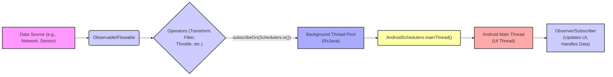

# Project Design Document: RxAndroid

**Version:** 1.1
**Date:** October 26, 2023
**Author:** AI Software Architect

## 1. Introduction

This document provides a detailed architectural design of the RxAndroid project, an open-source library that provides Android-specific bindings for Reactive Extensions for the JVM (RxJava). RxAndroid simplifies asynchronous programming on the Android platform by providing schedulers that operate on Android's main thread and other Android-specific threading models. This document aims to clearly outline the project's components, their interactions, and data flow, making it suitable for subsequent threat modeling activities. Understanding the architecture is crucial for identifying potential attack surfaces and vulnerabilities.

## 2. Goals and Objectives

The primary goals of RxAndroid are:

*   Provide convenient and idiomatic ways to use RxJava on the Android platform, adhering to Android threading best practices.
*   Simplify asynchronous programming on Android, particularly for UI interactions, reducing boilerplate code and improving readability.
*   Offer schedulers that operate seamlessly with Android's main (UI) thread and background threads managed by the Android OS.
*   Enhance the responsiveness and maintainability of Android applications by promoting reactive programming paradigms.
*   Act as a lightweight bridge, minimizing its own footprint and relying on the robust foundation of RxJava.

## 3. Target Audience

This document is intended for:

*   Security engineers performing threat modeling on applications utilizing the RxAndroid library.
*   Developers contributing to or using the RxAndroid library to understand its internal workings and potential security implications.
*   Architects designing Android systems that incorporate RxAndroid and need to assess its security posture.

## 4. Architectural Overview

RxAndroid serves as an extension to the core RxJava library, providing Android-specific implementations, particularly around thread scheduling. It doesn't introduce new reactive stream concepts but adapts RxJava's powerful asynchronous capabilities to the Android environment. The core of RxAndroid lies in its `AndroidSchedulers` component, which bridges the gap between RxJava's scheduling abstractions and Android's threading model. Applications leverage RxAndroid to manage asynchronous tasks and update the UI safely from background threads.

## 5. Component Design

The key components involved in RxAndroid's functionality include:

*   **`AndroidSchedulers`:** The central class providing Android-specific `Scheduler` instances.
    *   `mainThread()`: A `Scheduler` that executes tasks on the Android main (UI) thread. This is crucial for safely updating UI elements. Potential misuse could lead to UI thread blocking if long operations are performed here.
    *   Future potential Android-specific schedulers (e.g., for `Handler` threads).
*   **`Observable` and `Flowable` (from RxJava):** These are the fundamental reactive types representing asynchronous data streams. RxAndroid relies on these for emitting and managing data. Vulnerabilities in how data is produced or consumed within these streams can be relevant.
*   **`Observer` and `Subscriber` (from RxJava):** Interfaces for consuming data emitted by `Observable` and `Flowable`. Security considerations arise in how these consumers handle and process the received data, especially sensitive information.
*   **Operators (from RxJava):** Functions that transform, filter, and combine reactive streams. While RxAndroid doesn't add new operators, the security implications of using specific operators (e.g., those involving time or external resources) are relevant.
*   **Context Awareness (Implicit):** While not a direct component, RxAndroid operations often occur within the context of an Android application, potentially interacting with Android `Context` objects. Improper handling of `Context` can lead to security issues.
*   **Error Handling (Delegated to RxJava):** RxAndroid relies on RxJava's error handling mechanisms. The way errors are handled and propagated can have security implications, potentially exposing sensitive information.

## 6. Data Flow

The typical data flow in an Android application using RxAndroid involves data being emitted on a background thread and then observed and processed on the main thread for UI updates.

**Detailed Data Flow Description:**

*   **Data Source:** Data originates from various sources within the Android application or externally (e.g., network requests, sensor readings, database queries).
*   **Observable/Flowable:** This data is wrapped into an `Observable` (for regular streams) or `Flowable` (for streams with backpressure handling) from RxJava.
*   **Operators:**  A chain of operators can be applied to the `Observable` or `Flowable` to transform, filter, debounce, or otherwise manipulate the data stream. Care should be taken with operators that handle time or external resources.
*   **`subscribeOn(Schedulers.io())`:** This operator typically specifies that the data emission and initial processing should occur on a background thread managed by RxJava's `Schedulers.io()` thread pool. This prevents blocking the main thread for I/O-bound operations.
*   **`AndroidSchedulers.mainThread()`:** The `observeOn()` operator is used with `AndroidSchedulers.mainThread()` to switch the execution context to the Android main thread. This is essential for safely updating UI elements.
*   **Android Main Thread (UI Thread):** Code executing on this thread can directly interact with Android UI components.
*   **Observer/Subscriber:** An `Observer` or `Subscriber` consumes the emitted data on the main thread. This is where UI updates are typically performed. Security vulnerabilities can arise if the `Observer` mishandles sensitive data or performs insecure operations.

## 7. Security Considerations

Using RxAndroid introduces several security considerations that developers need to be aware of:

*   **Thread Safety and Data Races:** While RxAndroid simplifies threading, improper sharing of mutable state between different threads involved in the reactive stream can lead to race conditions and data corruption.
*   **Information Disclosure through Logging:**  Carelessly logging data emitted through reactive streams, especially error information or intermediate values, can expose sensitive information. Ensure proper logging configurations for production builds.
*   **Error Handling and Exception Leaks:** Generic error handling in reactive streams might inadvertently expose sensitive details in error messages or stack traces. Implement specific and secure error handling mechanisms to prevent information leaks.
*   **Resource Exhaustion and Denial of Service:** Unbounded or long-running reactive streams, especially those dealing with external resources, can potentially lead to resource exhaustion if not managed properly (e.g., lack of backpressure in `Flowable`). This could lead to a denial-of-service for the application.
*   **Dependency Vulnerabilities:** RxAndroid directly depends on RxJava. Transitive dependencies of RxJava also need to be considered. Vulnerabilities in these dependencies could indirectly affect applications using RxAndroid. Regular dependency updates and security scanning are crucial.
*   **Main Thread Blocking:**  Although RxAndroid facilitates background processing, incorrect usage (e.g., performing long-running synchronous operations within an `Observer` on the main thread) can still block the UI thread, leading to an unresponsive application and a poor user experience, which can be exploited.
*   **Side Effects and Unintended Consequences:** Operations performed within reactive streams that have side effects (e.g., writing to files, making network requests) need careful consideration. Unintended or malicious side effects could be triggered if the stream is compromised or behaves unexpectedly.
*   **Improper Context Handling:** If reactive streams interact with Android `Context` objects, improper handling (e.g., leaking `Activity` contexts) can lead to memory leaks and potential security vulnerabilities.
*   **Injection Vulnerabilities (Indirect):** While RxAndroid doesn't directly handle user input in the same way as UI components, if data processed by reactive streams originates from untrusted sources, it could be susceptible to injection attacks if not properly sanitized before being used in further operations (e.g., constructing database queries or network requests).

## 8. Dependencies

RxAndroid has a primary dependency:

*   **`io.reactivex.rxjava3:rxjava` (or `io.reactivex.rxjava2:rxjava`):** The core Reactive Extensions library for the JVM. RxAndroid builds directly upon its fundamental types (`Observable`, `Flowable`, `Scheduler`, etc.) and operators. The specific version used is critical for compatibility and security. Transitive dependencies of RxJava also need to be considered.

## 9. Deployment

RxAndroid is deployed as a library that is included in Android application projects via dependency management tools like Gradle. Developers add the RxAndroid dependency to their `build.gradle` file. There is no separate deployment process for RxAndroid itself.

## 10. Future Considerations

Potential future enhancements to RxAndroid could include:

*   More specialized Android schedulers tailored for specific Android components or lifecycle events.
*   Improved utilities for managing Android lifecycles within reactive streams, reducing the risk of memory leaks.
*   Seamless integration with other Android Jetpack libraries and architectural components.
*   Potentially providing more Android-specific operators or extensions.

## 11. Threat Modeling Inputs

This design document provides the following key information for threat modeling activities:

*   **Components:**  `AndroidSchedulers` (specifically `mainThread()`), `Observable`, `Flowable`, `Observer`, `Subscriber`, and the various operators from RxJava used within the application. Each component represents a potential point of interaction and potential vulnerability.
*   **Data Flow Paths:** The flow of data from its source through operators and finally to the `Observer`/`Subscriber` on the main thread defines the attack surface. Points where data transformations or thread transitions occur are critical areas to examine.
*   **Trust Boundaries:**  The boundary between background threads and the main thread is a significant trust boundary. Data crossing this boundary needs careful scrutiny. Interactions with external data sources (network, database, sensors) also represent trust boundaries where data integrity and confidentiality can be compromised.
*   **Data Sensitivity:**  Identify the types of data flowing through the reactive streams. Sensitive data requires extra protection throughout the data flow.
*   **Entry Points:** The `subscribe()` method on `Observable`/`Flowable` is a primary entry point where the reactive stream begins processing data. The implementation of `Observer`/`Subscriber` methods (`onNext`, `onError`, `onComplete`) are also entry points for data consumption and error handling.
*   **Exit Points:** UI updates performed within the `Observer`/`Subscriber` on the main thread are exit points where processed data is presented to the user. Vulnerabilities here could lead to information disclosure or UI manipulation. Interactions with other system components based on the processed data are also exit points.
*   **Key Assets:** The application's data, UI integrity, and responsiveness are key assets that could be impacted by vulnerabilities related to RxAndroid usage.

This document provides a comprehensive overview of the RxAndroid architecture, highlighting key components, data flow, and security considerations. This information is essential for effectively performing threat modeling on Android applications that utilize this library.