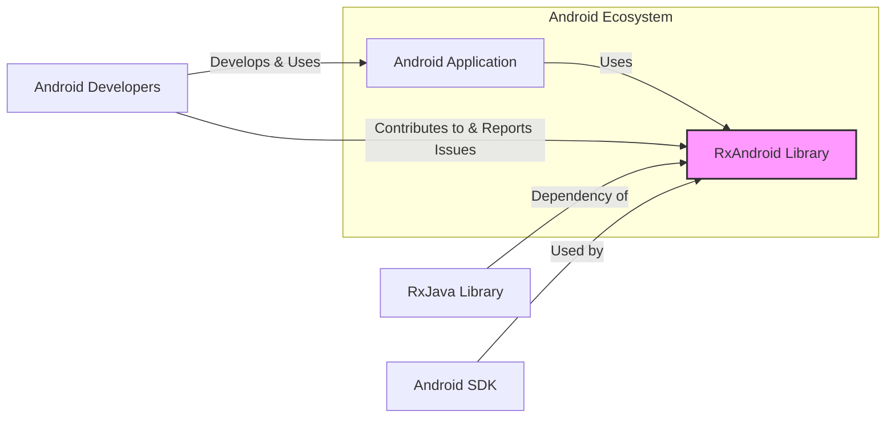
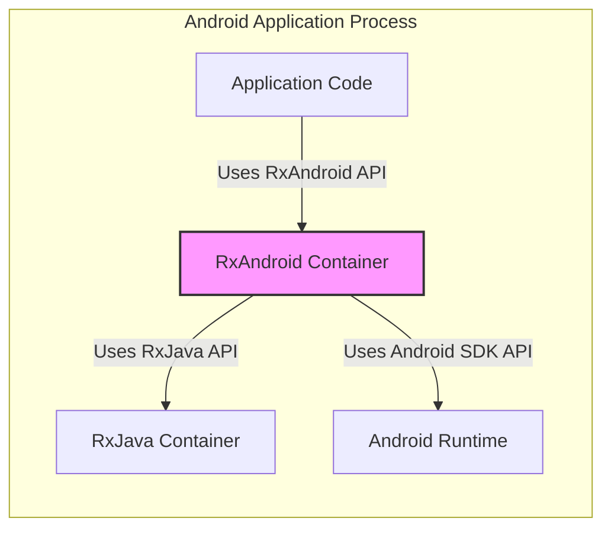
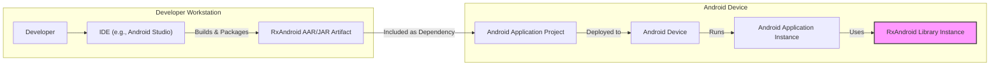
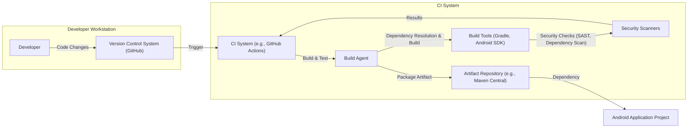

# BUSINESS POSTURE

- Business priorities and goals:
 - Provide a library that simplifies asynchronous programming on the Android platform.
 - Enable developers to write cleaner, more maintainable, and more efficient Android applications by leveraging reactive programming principles.
 - Offer a robust and well-tested solution for handling background tasks, UI updates, and event streams in Android development.
 - Foster a community around reactive programming in Android and contribute to the wider RxJava ecosystem.
- Most important business risks:
 - Risk of introducing bugs or vulnerabilities in the library that could affect applications using it.
 - Risk of the library becoming outdated or unmaintained, leading to compatibility issues or security concerns in the long term.
 - Risk of the library not meeting the evolving needs of the Android development community, potentially leading to decreased adoption.
 - Risk of supply chain vulnerabilities if dependencies are compromised.

# SECURITY POSTURE

- Existing security controls:
 - security control: Code is hosted on GitHub, providing version control and transparency. Implemented in: GitHub repository.
 - security control: Open-source project, allowing community review and contributions. Implemented in: Open-source nature of the project.
 - security control: Build process likely uses standard Android and Java development tools. Implemented in: Build scripts and project configuration.
- Accepted risks:
 - accepted risk: Vulnerabilities might be introduced by community contributors.
 - accepted risk: Open-source nature means vulnerabilities are publicly known once discovered.
 - accepted risk: Reliance on external dependencies (RxJava, Android SDK) for security.
- Recommended security controls:
 - security control: Implement automated security scanning (SAST/DAST) in the CI/CD pipeline.
 - security control: Conduct regular dependency vulnerability scanning and updates.
 - security control: Establish a clear process for reporting and handling security vulnerabilities.
 - security control: Encourage and facilitate security audits by the community.
- Security requirements:
 - Authentication: Not applicable for a library. RxAndroid itself does not handle authentication. Applications using RxAndroid will manage their own authentication.
 - Authorization: Not applicable for a library. RxAndroid itself does not handle authorization. Applications using RxAndroid will manage their own authorization.
 - Input validation: RxAndroid should perform input validation where applicable to prevent unexpected behavior or crashes due to malformed input from the application using the library. This is especially relevant for any public APIs that accept parameters.
 - Cryptography: Cryptography is likely not a core requirement for RxAndroid itself. If applications using RxAndroid need cryptography, they should implement it within their application logic, potentially using other libraries. RxAndroid should not introduce cryptography unless strictly necessary for its core functionality.

# DESIGN

## C4 CONTEXT

- Context Diagram Elements:
 - - Name: Android Application
   - Type: Software System
   - Description: Android applications developed by Android developers. These applications utilize RxAndroid to manage asynchronous operations and event streams.
   - Responsibilities: Implementing application-specific logic, including UI, data handling, and business rules. Utilizing RxAndroid to simplify asynchronous tasks.
   - Security controls: Application-level security controls, including authentication, authorization, input validation, and data protection, are the responsibility of the Android application.
 - - Name: RxAndroid Library
   - Type: Software System
   - Description: A library that provides Reactive Extensions for Android, built on top of RxJava. It simplifies asynchronous programming and event handling in Android applications.
   - Responsibilities: Providing reactive operators and schedulers tailored for the Android platform. Managing thread switching and interactions with the Android main thread.
   - Security controls: Input validation within the library's API. Dependency management and vulnerability scanning of dependencies.
 - - Name: Android Developers
   - Type: Person
   - Description: Software developers who use RxAndroid to build Android applications. They are the primary users and contributors to the RxAndroid project.
   - Responsibilities: Developing Android applications, integrating RxAndroid into their projects, reporting issues, and potentially contributing code to RxAndroid.
   - Security controls: Secure development practices on the developer's side, including secure coding and dependency management in their applications.
 - - Name: RxJava Library
   - Type: Software System
   - Description: A Java library for composing asynchronous and event-based programs using Reactive Extensions. RxAndroid is built on top of RxJava and depends on it.
   - Responsibilities: Providing core reactive operators and abstractions. Handling asynchronous computations and event streams in a platform-agnostic way.
   - Security controls: Security controls of the RxJava project itself, including vulnerability management and secure development practices.
 - - Name: Android SDK
   - Type: Software System
   - Description: The Android Software Development Kit, providing tools and libraries necessary for Android development. RxAndroid is designed to work within the Android SDK environment.
   - Responsibilities: Providing Android-specific APIs and functionalities that RxAndroid interacts with, such as the main thread looper and UI components.
   - Security controls: Security controls of the Android SDK, managed by Google.

## C4 CONTAINER

- Container Diagram Elements:
 - - Name: RxAndroid Container
   - Type: Library Container
   - Description: The RxAndroid library itself, packaged as a JAR or AAR file. It contains the RxAndroid-specific classes and functionalities that extend RxJava for Android.
   - Responsibilities: Providing Android-specific schedulers (e.g., AndroidSchedulers.mainThread()). Bridging RxJava with Android platform components. Handling thread switching to the Android main thread.
   - Security controls: Input validation within the RxAndroid API. Dependency management for RxJava and Android SDK.
 - - Name: Application Code
   - Type: Application Container
   - Description: The code written by Android developers that utilizes the RxAndroid library. This code resides within the Android application.
   - Responsibilities: Implementing application-specific features and logic. Using RxAndroid to manage asynchronous operations and UI updates.
   - Security controls: Application-level security controls, including authentication, authorization, input validation, and secure data handling within the application code.
 - - Name: RxJava Container
   - Type: Library Container
   - Description: The RxJava library, which RxAndroid depends on. It provides the core reactive programming functionalities.
   - Responsibilities: Providing core reactive operators, Observables, Subjects, and other reactive abstractions. Handling asynchronous computations and event streams in a platform-agnostic way.
   - Security controls: Security controls of the RxJava project itself.
 - - Name: Android Runtime
   - Type: Runtime Environment
   - Description: The Android Runtime environment within which Android applications and RxAndroid execute. It provides access to Android system services and APIs.
   - Responsibilities: Executing Android applications and libraries. Managing system resources and providing access to Android platform features.
   - Security controls: Security controls enforced by the Android operating system and runtime environment.

## DEPLOYMENT

- Deployment Diagram Elements:
 - - Name: Developer Workstation
   - Type: Environment
   - Description: The development environment used by Android developers to build and package the RxAndroid library (though less relevant for end-users, more for library maintainers) and Android applications that use RxAndroid.
   - Responsibilities: Development, building, and testing of RxAndroid and Android applications.
   - Security controls: Security controls on the developer's workstation, including access control, malware protection, and secure development practices.
 - - Name: IDE (e.g., Android Studio)
   - Type: Tool
   - Description: Integrated Development Environment used by developers to write, build, and debug Android applications and potentially contribute to RxAndroid.
   - Responsibilities: Providing a development environment, build tools, and debugging capabilities.
   - Security controls: Security controls of the IDE itself and any plugins used. Secure configuration of the IDE.
 - - Name: RxAndroid AAR/JAR Artifact
   - Type: Artifact
   - Description: The packaged RxAndroid library, typically distributed as an AAR (Android Archive) or JAR (Java Archive) file.
   - Responsibilities: Providing the compiled RxAndroid library for inclusion in Android applications.
   - Security controls: Code signing of the artifact (if applicable). Verification of the artifact's integrity during dependency resolution.
 - - Name: Android Application Project
   - Type: Project
   - Description: An Android application project that declares RxAndroid as a dependency in its build configuration (e.g., Gradle).
   - Responsibilities: Building the complete Android application, including the RxAndroid library and application-specific code.
   - Security controls: Dependency management and vulnerability scanning of application dependencies, including RxAndroid. Application-level security controls.
 - - Name: Android Device
   - Type: Environment
   - Description: An Android device (physical or emulator) where the Android application is deployed and executed.
   - Responsibilities: Running the Android application and the RxAndroid library. Providing the Android runtime environment.
   - Security controls: Security controls of the Android operating system and device, including application sandboxing and permissions.
 - - Name: Android Application Instance
   - Type: Software Instance
   - Description: A running instance of the Android application on an Android device.
   - Responsibilities: Executing the application logic and utilizing the RxAndroid library at runtime.
   - Security controls: Application-level security controls at runtime. Android OS security controls.
 - - Name: RxAndroid Library Instance
   - Type: Software Instance
   - Description: The instance of the RxAndroid library loaded and used by the Android application at runtime.
   - Responsibilities: Providing reactive functionalities to the Android application at runtime.
   - Security controls: Runtime security controls within the Android application process.

## BUILD

- Build Diagram Elements:
 - - Name: Developer
   - Type: Person
   - Description: Software developers who contribute code changes to the RxAndroid project.
   - Responsibilities: Writing code, committing changes to the version control system.
   - Security controls: Secure coding practices, code review.
 - - Name: Version Control System (GitHub)
   - Type: System
   - Description: GitHub repository hosting the RxAndroid source code.
   - Responsibilities: Managing source code, tracking changes, facilitating collaboration.
   - Security controls: Access control to the repository, branch protection, audit logs.
 - - Name: CI System (e.g., GitHub Actions)
   - Type: System
   - Description: Continuous Integration system used to automate the build, test, and potentially deployment process of RxAndroid.
   - Responsibilities: Automating build, test, and security checks. Orchestrating the build pipeline.
   - Security controls: Secure configuration of CI pipelines, access control to CI system, secrets management.
 - - Name: Build Agent
   - Type: System
   - Description: Server or virtual machine that executes the build tasks defined in the CI pipeline.
   - Responsibilities: Executing build scripts, running tests, packaging artifacts.
   - Security controls: Hardening of build agent environment, access control.
 - - Name: Build Tools (Gradle, Android SDK)
   - Type: Tool
   - Description: Software tools used to build and package Android projects, including Gradle build system and Android SDK.
   - Responsibilities: Compiling code, resolving dependencies, packaging artifacts.
   - Security controls: Dependency management, vulnerability scanning of build tools and plugins.
 - - Name: Security Scanners
   - Type: Tool
   - Description: Static Application Security Testing (SAST) tools and dependency vulnerability scanners used to identify potential security issues in the code and dependencies.
   - Responsibilities: Performing automated security checks during the build process.
   - Security controls: Configuration and maintenance of security scanners, vulnerability database updates.
 - - Name: Artifact Repository (e.g., Maven Central)
   - Type: System
   - Description: Repository where built artifacts (RxAndroid AAR/JAR files) are published and made available for download by Android application projects.
   - Responsibilities: Storing and distributing build artifacts.
   - Security controls: Access control to the repository, artifact integrity verification (e.g., checksums, signatures).
 - - Name: Android Application Project
   - Type: Project
   - Description: Android application projects that depend on RxAndroid and download the artifact from the artifact repository during their build process.
   - Responsibilities: Resolving and downloading dependencies, including RxAndroid, during application build.
   - Security controls: Dependency management, verification of downloaded artifacts.

# RISK ASSESSMENT

- Critical business process we are trying to protect:
 - Ensuring the reliability and security of Android applications that depend on RxAndroid.
 - Maintaining the integrity and availability of the RxAndroid library for the Android developer community.
 - Protecting the reputation and trust associated with the RxAndroid project.
- Data we are trying to protect and their sensitivity:
 - Source code of RxAndroid: Sensitive, as its compromise could lead to vulnerabilities in the library and applications using it.
 - Build artifacts (AAR/JAR files): Sensitive, as their compromise could lead to distribution of malicious versions of the library.
 - Project infrastructure (CI/CD, repository): Sensitive, as its compromise could lead to unauthorized modifications or malicious releases.
 - Developer credentials and access keys: Highly sensitive, as their compromise could lead to unauthorized access and control over the project.
 - Issue reports and vulnerability disclosures: Sensitive, should be handled securely and responsibly.

# QUESTIONS & ASSUMPTIONS

- Questions:
 - What CI/CD system is currently used for RxAndroid? (Assumption: GitHub Actions is a likely candidate for open-source GitHub projects).
 - Are there any automated security scans currently implemented in the build process? (Assumption: Basic build and test automation is likely present, security scans might be missing or basic).
 - What is the process for reporting and handling security vulnerabilities in RxAndroid? (Assumption: Standard open-source vulnerability reporting process via GitHub issues or security channels).
 - Is there a formal security audit process for RxAndroid? (Assumption: Likely no formal, regular security audits, relying more on community review and ad-hoc contributions).
- Assumptions:
 - BUSINESS POSTURE: The primary goal is to provide a useful and reliable open-source library for the Android developer community.
 - SECURITY POSTURE: Security is important but might not be the top priority compared to functionality and ease of use in an open-source library context. Security relies heavily on community contributions and standard open-source practices.
 - DESIGN: The architecture is relatively straightforward for a library. The main complexity lies in the interaction with the Android platform and RxJava. Deployment is primarily through dependency management in Android projects. Build process is likely automated using standard tools.