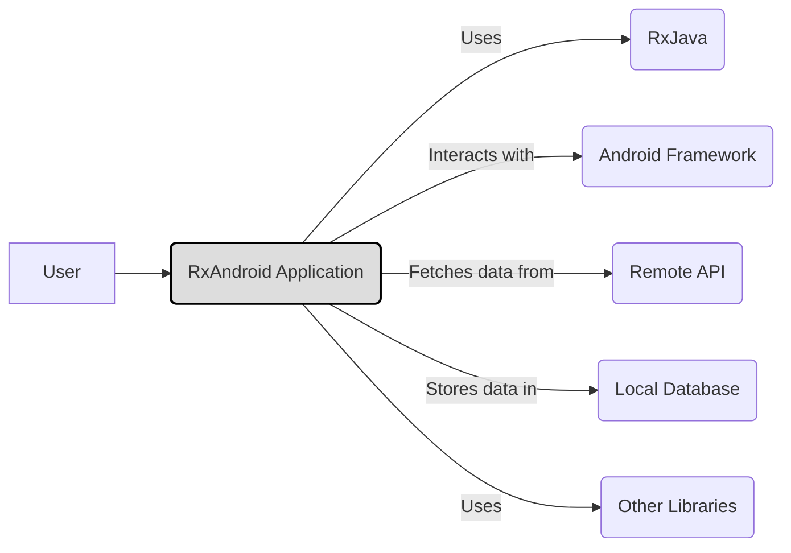
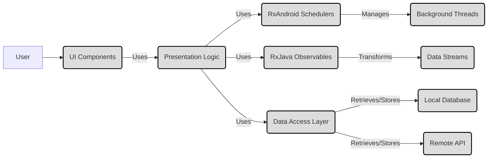
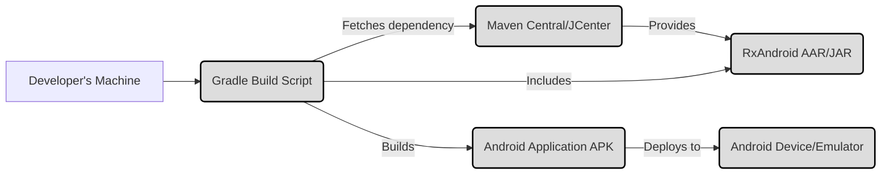
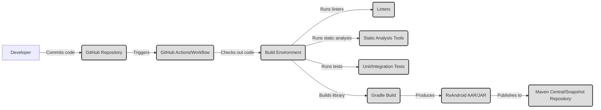

Okay, let's create a design document for RxAndroid.

# BUSINESS POSTURE

RxAndroid is a library that extends RxJava to make it easier to write reactive, asynchronous code on Android. It leverages the power of Observables and Schedulers to handle background tasks, UI updates, and event handling in a more concise and manageable way.

Business Priorities:

*   Improve developer productivity by simplifying asynchronous programming on Android.
*   Enhance application performance and responsiveness by providing tools for efficient threading and concurrency.
*   Reduce code complexity and improve maintainability by promoting a reactive programming style.
*   Provide a stable and reliable library that is well-tested and widely adopted.
*   Maintain backward compatibility with existing RxJava implementations.

Business Goals:

*   Become a standard library for reactive programming in Android development.
*   Increase adoption among Android developers.
*   Reduce the occurrence of common concurrency-related bugs in Android applications.

Most Important Business Risks:

*   Introduction of new bugs or performance regressions that could negatively impact existing applications.
*   Failure to keep up with changes in the Android platform or RxJava, leading to compatibility issues.
*   Lack of adoption by the developer community, rendering the library irrelevant.
*   Security vulnerabilities that could be exploited in applications using the library.

# SECURITY POSTURE

Existing Security Controls:

*   security control: Code Reviews: RxAndroid is an open-source project on GitHub, which inherently includes a code review process by maintainers and contributors before merging changes. (Implemented in GitHub pull request process).
*   security control: Static Analysis: While not explicitly mentioned, it's highly likely that static analysis tools are used as part of the development process to identify potential bugs and vulnerabilities. (Assumed to be part of the build process).
*   security control: Community Scrutiny: Being a widely used open-source library, RxAndroid benefits from scrutiny by a large community of developers, increasing the chances of identifying and reporting security issues. (Implemented through GitHub issues and community forums).
*   security control: Dependency Management: RxAndroid manages its dependencies (primarily RxJava) through a build system (Gradle), which helps ensure that known vulnerable versions are not used. (Implemented in build.gradle files).

Accepted Risks:

*   accepted risk: Reliance on RxJava Security: RxAndroid's security is inherently tied to the security of RxJava. Any vulnerabilities in RxJava could potentially impact RxAndroid.
*   accepted risk: Threading Complexity: While RxAndroid simplifies threading, incorrect usage of Schedulers and Observables can still lead to concurrency issues, including potential race conditions or deadlocks if not handled carefully.
*   accepted risk: Operator Misuse: RxJava and RxAndroid offer a wide range of operators. Misuse of certain operators (e.g., those related to timing or resource management) could lead to unexpected behavior or resource leaks.

Recommended Security Controls:

*   security control: Regular Security Audits: Conduct periodic security audits, both manual and automated, to identify potential vulnerabilities.
*   security control: Fuzz Testing: Implement fuzz testing to identify edge cases and unexpected behavior that could lead to security issues.
*   security control: Document Security Best Practices: Provide clear documentation on secure usage of RxAndroid, including best practices for threading, error handling, and resource management.

Security Requirements:

*   Authentication: Not directly applicable to RxAndroid, as it's a library for asynchronous programming, not authentication.
*   Authorization: Not directly applicable to RxAndroid.
*   Input Validation: While RxAndroid itself doesn't handle user input directly, it's crucial for applications using RxAndroid to properly validate any data received from external sources before processing it with Observables. This prevents injection vulnerabilities and ensures data integrity.
*   Cryptography: Not directly applicable to RxAndroid, but if the library is used to handle sensitive data, appropriate cryptographic measures should be implemented in the application logic.

# DESIGN

## C4 CONTEXT

C4 Context Element List:

*   1.  Name: User
    *   Type: Person
    *   Description: The user of the Android application.
    *   Responsibilities: Interacts with the application's UI.
    *   Security Controls: None (handled by the application).

*   2.  Name: RxAndroid Application
    *   Type: Software System
    *   Description: An Android application that utilizes RxAndroid for asynchronous operations.
    *   Responsibilities: Handles user interactions, manages data flow, performs background tasks.
    *   Security Controls: Input validation, secure coding practices, adherence to Android security guidelines.

*   3.  Name: RxJava
    *   Type: Library
    *   Description: The core reactive extensions library.
    *   Responsibilities: Provides the foundation for reactive programming.
    *   Security Controls: Relies on community scrutiny and code reviews.

*   4.  Name: Android Framework
    *   Type: Framework
    *   Description: The underlying Android operating system and its APIs.
    *   Responsibilities: Provides core system services and UI components.
    *   Security Controls: Android's built-in security features (permissions, sandboxing, etc.).

*   5.  Name: Remote API
    *   Type: External System
    *   Description: A remote server providing data to the application.
    *   Responsibilities: Responds to API requests.
    *   Security Controls: Authentication, authorization, input validation, transport layer security (TLS).

*   6.  Name: Local Database
    *   Type: External System
    *   Description: A local database on the Android device.
    *   Responsibilities: Stores data persistently.
    *   Security Controls: Data encryption (if sensitive data is stored), access controls.

*   7.  Name: Other Libraries
    *   Type: Library
    *   Description: Other third-party libraries used by the application.
    *   Responsibilities: Varies depending on the library.
    *   Security Controls: Relies on the security of the individual libraries.

## C4 CONTAINER

C4 Container Element List:

*   1.  Name: User
    *   Type: Person
    *   Description: The user of the Android application.
    *   Responsibilities: Interacts with the application's UI.
    *   Security Controls: None (handled by the application).

*   2.  Name: UI Components
    *   Type: Container
    *   Description: Standard Android UI elements (Activities, Fragments, Views).
    *   Responsibilities: Display information to the user and handle user input.
    *   Security Controls: Adherence to Android UI security best practices.

*   3.  Name: Presentation Logic
    *   Type: Container
    *   Description: Code that manages the UI and interacts with the data layer (e.g., ViewModels).
    *   Responsibilities: Handles user actions, updates the UI, subscribes to Observables.
    *   Security Controls: Input validation, error handling.

*   4.  Name: RxAndroid Schedulers
    *   Type: Container
    *   Description: Provides Schedulers specific to Android (e.g., `AndroidSchedulers.mainThread()`).
    *   Responsibilities: Specifies the thread on which Observable operations should execute.
    *   Security Controls: Proper usage to avoid threading issues.

*   5.  Name: RxJava Observables
    *   Type: Container
    *   Description: Represents streams of data or events.
    *   Responsibilities: Emits data, handles errors, and signals completion.
    *   Security Controls: Careful handling of subscriptions and disposal to prevent leaks.

*   6.  Name: Data Access Layer
    *   Type: Container
    *   Description: Code that interacts with data sources (local database, remote API).
    *   Responsibilities: Retrieves and stores data.
    *   Security Controls: Secure data handling, parameterized queries (for databases).

*   7.  Name: Background Threads
    *   Type: Container
    *   Description: Threads managed by RxAndroid Schedulers for background operations.
    *   Responsibilities: Executes long-running tasks without blocking the main thread.
    *   Security Controls: Proper thread management to avoid resource exhaustion.

*   8.  Name: Data Streams
    *   Type: Container
    *   Description: The flow of data through Observables.
    *   Responsibilities: Transports data between different parts of the application.
    *   Security Controls: Data validation and sanitization at various stages.

*   9.  Name: Local Database
    *   Type: Container
    *   Description: A local database on the Android device (e.g., SQLite, Room).
    *   Responsibilities: Stores data persistently.
    *   Security Controls: Data encryption (if sensitive data is stored), access controls.

*   10. Name: Remote API
    *   Type: Container
    *   Description: A remote server providing data to the application.
    *   Responsibilities: Responds to API requests.
    *   Security Controls: Authentication, authorization, input validation, transport layer security (TLS).

## DEPLOYMENT

Possible Deployment Solutions:

1.  **Direct Integration via Gradle:** The most common approach. Developers add RxAndroid as a dependency in their app's `build.gradle` file. Gradle handles downloading and linking the library.
2.  **Manual JAR Inclusion:** Less common, but developers could manually download the RxAndroid JAR file and include it in their project's `libs` folder.
3.  **Custom Build from Source:** Developers could clone the RxAndroid repository and build the library from source, then integrate the resulting AAR or JAR file.

Chosen Solution (Detailed Description): Direct Integration via Gradle

Deployment Element List:

*   1.  Name: Developer's Machine
    *   Type: Infrastructure Node
    *   Description: The computer where the Android application is developed.
    *   Responsibilities: Hosts the development environment (IDE, SDK, etc.).
    *   Security Controls: Standard developer machine security practices.

*   2.  Name: Gradle Build Script
    *   Type: Software
    *   Description: The `build.gradle` file that defines the project's dependencies and build configuration.
    *   Responsibilities: Manages dependencies, compiles code, packages the application.
    *   Security Controls: Dependency verification (using checksums or signatures).

*   3.  Name: Maven Central/JCenter
    *   Type: Infrastructure Node
    *   Description: Repositories that host open-source libraries, including RxAndroid.
    *   Responsibilities: Provides access to library artifacts.
    *   Security Controls: Repository security measures (access controls, integrity checks).

*   4.  Name: RxAndroid AAR/JAR
    *   Type: Software
    *   Description: The compiled RxAndroid library file.
    *   Responsibilities: Provides the RxAndroid functionality.
    *   Security Controls: Code signing (ideally, but not explicitly mentioned for RxAndroid).

*   5.  Name: Android Application APK
    *   Type: Software
    *   Description: The final packaged Android application.
    *   Responsibilities: Runs on the Android device.
    *   Security Controls: Android application security best practices.

*   6.  Name: Android Device/Emulator
    *   Type: Infrastructure Node
    *   Description: The physical device or emulator where the application is deployed.
    *   Responsibilities: Executes the application.
    *   Security Controls: Android OS security features.

## BUILD

Build Process Description:

1.  **Developer Commits Code:** A developer makes changes to the RxAndroid codebase and commits them to the GitHub repository.
2.  **GitHub Actions Trigger:** The commit triggers a GitHub Actions workflow (or a similar CI/CD system).
3.  **Build Environment Setup:** The workflow sets up a build environment (e.g., a virtual machine with the Android SDK and build tools).
4.  **Code Checkout:** The workflow checks out the latest code from the repository.
5.  **Linters:** Linters (e.g., Checkstyle, ktlint) are run to enforce code style and identify potential issues.
6.  **Static Analysis:** Static analysis tools (e.g., FindBugs, PMD, Android Lint) are run to detect potential bugs and vulnerabilities.
7.  **Tests:** Unit and integration tests are executed to verify the functionality of the code.
8.  **Gradle Build:** The Gradle build system is invoked to compile the code and build the RxAndroid AAR/JAR file.
9.  **Artifact Publication:** The resulting AAR/JAR file is published to a repository (e.g., Maven Central for releases, a snapshot repository for development builds).

Security Controls in Build Process:

*   security control: Code Review (GitHub Pull Requests): All code changes are reviewed before being merged.
*   security control: Linting (Checkstyle, ktlint): Enforces code style and helps prevent common errors.
*   security control: Static Analysis (FindBugs, PMD, Android Lint): Detects potential bugs and vulnerabilities.
*   security control: Automated Testing (Unit/Integration Tests): Verifies code functionality and helps prevent regressions.
*   security control: Dependency Management (Gradle): Ensures that the correct versions of dependencies are used.
*   security control: CI/CD (GitHub Actions): Automates the build and testing process, ensuring consistency and reducing the risk of manual errors.

# RISK ASSESSMENT

Critical Business Processes to Protect:

*   Application Stability: Ensuring that RxAndroid does not introduce crashes or instability into applications that use it.
*   Developer Productivity: Maintaining the ease of use and efficiency benefits that RxAndroid provides.
*   Library Reputation: Protecting the reputation of RxAndroid as a reliable and well-maintained library.

Data to Protect and Sensitivity:

*   RxAndroid itself does not directly handle sensitive user data. However, it's used to manage the flow of data within applications. Therefore, the sensitivity of the data depends on the specific application using RxAndroid.
*   If an application uses RxAndroid to handle Personally Identifiable Information (PII), financial data, or other sensitive information, then that data must be protected according to relevant regulations and best practices (e.g., GDPR, HIPAA). The application developers are responsible for implementing appropriate security measures. RxAndroid, as a library, facilitates the *flow* of this data, but the responsibility for *securing* the data lies with the application using the library.

# QUESTIONS & ASSUMPTIONS

Questions:

*   Are there any specific security certifications or compliance requirements that RxAndroid needs to meet?
*   What is the process for reporting and handling security vulnerabilities discovered in RxAndroid?
*   Are there any plans to add features that would directly handle sensitive data (e.g., encryption, secure storage)?
*   Is there a dedicated security team or individual responsible for RxAndroid security?
*   What specific static analysis tools are used in the build process?
*   Are there any performance benchmarks or targets that RxAndroid aims to achieve?

Assumptions:

*   BUSINESS POSTURE: The primary goal is to provide a stable and efficient library for reactive programming on Android, prioritizing developer productivity and application performance.
*   SECURITY POSTURE: Security is a concern, but the library relies heavily on the security of RxJava and the underlying Android framework. The development team relies on community scrutiny and code reviews as primary security measures.
*   DESIGN: The design follows standard reactive programming principles and integrates seamlessly with RxJava and the Android ecosystem. The build process is automated using GitHub Actions (or a similar CI/CD system) and includes linting, static analysis, and testing.