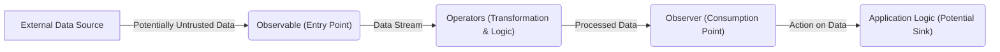

# Project Design Document: RxJava Library (Improved)

**Version:** 1.1
**Date:** October 26, 2023
**Author:** AI Software Architect

## 1. Introduction

This document provides an enhanced design overview of the RxJava library, specifically tailored to facilitate comprehensive threat modeling. Building upon the foundational understanding of RxJava's architecture, components, and data flow, this version delves deeper into potential security implications and areas of concern. The aim is to equip security analysts with the necessary information to effectively identify and assess threats within systems utilizing RxJava.

## 2. Goals and Objectives

The primary goal remains to provide a clear and concise architectural description of RxJava to enable effective threat modeling. This improved version aims to:

*   Provide more granular detail on key components and their potential security vulnerabilities.
*   Elaborate on data flow paths and potential points of manipulation or interception.
*   Explicitly highlight areas requiring focused attention during threat modeling exercises.
*   Strengthen the understanding of the library's attack surface and potential entry points for malicious actors.

## 3. System Architecture

RxJava facilitates asynchronous and event-based programming through observable sequences. Understanding its architecture is crucial for identifying potential security weaknesses.

### 3.1. High-Level Architecture (Security Focused)



*   **External Data Source:** Represents any source of data that feeds into the RxJava stream. This is a critical point for considering untrusted or malicious input.
*   **Observable (Entry Point):** The initial point where data enters the RxJava pipeline. Vulnerabilities here could allow for injection or manipulation of the entire stream.
*   **Operators (Transformation & Logic):**  The core processing units. Malicious or poorly implemented operators can introduce vulnerabilities or leak information.
*   **Observer (Consumption Point):** Where the processed data is consumed. Security flaws in the observer can lead to exploitation of the received data.
*   **Application Logic (Potential Sink):** The final destination of the data. While not part of RxJava, understanding how RxJava feeds into the application logic is vital for end-to-end security analysis.

### 3.2. Component-Level Architecture (Security Implications)

This section details key components with a focus on their potential security implications:

*   **Core Abstractions:**
    *   `Observable`/`Flowable`:  The source of data. Threats include:
        *   **Unvalidated Input:** If the `Observable` directly consumes external input without validation, it can be a point of injection.
        *   **Resource Exhaustion:**  An `Observable` emitting an unbounded stream of data can lead to resource exhaustion if not handled properly.
    *   `Observer`/`Subscriber`: The consumer of data. Threats include:
        *   **Vulnerable Logic:**  Security flaws in the `Observer`'s `onNext`, `onError`, or `onComplete` methods can be exploited.
        *   **Information Disclosure:**  Error handling within the `Observer` might unintentionally reveal sensitive information.
    *   `Subscription`/`Disposable`: Managing the lifecycle. Threats include:
        *   **Resource Leaks:** Failure to dispose of resources can lead to memory leaks or other resource exhaustion issues.
*   **Operators (Potential Vulnerabilities):**
    *   **Creation Operators (e.g., `just`, `fromCallable`):**
        *   **Code Injection:** If the functions provided to these operators are dynamically generated or based on untrusted input, they can be vectors for code injection.
    *   **Transformation Operators (e.g., `map`, `flatMap`):**
        *   **Data Manipulation:** Malicious or flawed transformation logic can alter data in unintended ways.
        *   **Information Leakage:**  Transformations might inadvertently expose sensitive information.
    *   **Filtering Operators (e.g., `filter`):**
        *   **Bypass Controls:** Incorrect filtering logic can allow unauthorized data to pass through.
    *   **Combination Operators (e.g., `merge`, `zip`):**
        *   **Data Mixing:** Combining streams with different security levels can lead to unintended information sharing.
    *   **Error Handling Operators (e.g., `onErrorReturn`, `retry`):**
        *   **Information Disclosure:** Returning specific error values might reveal details about the system's internal state.
        *   **Denial of Service:**  Uncontrolled retries can exacerbate denial-of-service conditions.
    *   **Utility Operators (e.g., `delay`, `timeout`):**
        *   **Timing Attacks:**  Operators like `delay` could be exploited in timing attacks.
*   **Schedulers (Concurrency and Security):**
    *   **Thread Safety Issues:** Improper use of schedulers can lead to race conditions and data corruption if shared mutable state is involved.
    *   **Context Switching:**  Frequent context switching might introduce performance bottlenecks that could be exploited.
*   **Backpressure Strategies (Resource Management):**
    *   **Buffer Overflow:**  Using `BUFFER` without limits can lead to memory exhaustion.
    *   **Data Loss:** Strategies like `DROP` or `LATEST` can result in the loss of important data if backpressure is not handled correctly.

## 4. Data Flow (Threat Vectors)

Understanding the data flow is crucial for identifying potential points of attack and data manipulation.

```mermaid
graph LR
    A["Untrusted Data Source"] -->|Potential Injection/Malicious Data| B("Observable");
    B -->|onNext(unvalidated_item)| C{"Operator 1 (e.g., map)"};
    C -->|onNext(potentially_manipulated_item)| D{"Operator 2 (e.g., filter)"};
    D -->|onNext(filtered_item)| E("Observer");
    E -->|onNext(final_item)| F("Application Logic (Potential Vulnerability)");
    B -->|onError(error)| G("Error Handling (Information Leak?)");
    B -->|onComplete()| H("Completion (Resource Release?)");
```

*   **Untrusted Data Source:**  The initial entry point for potentially malicious data.
*   **Observable:**  If not properly secured, it can propagate malicious data.
*   **Operators:**  Each operator in the chain is a potential point for:
    *   **Data Manipulation:**  Introducing malicious transformations.
    *   **Information Leakage:**  Unintentionally exposing sensitive data.
    *   **Denial of Service:**  Introducing logic that consumes excessive resources.
*   **Observer:**  A vulnerable observer can be exploited by malicious data.
*   **Application Logic:**  While outside RxJava, the application logic consuming the data is the ultimate target of many attacks.
*   **Error Handling:**  Improper error handling can reveal sensitive information or create denial-of-service opportunities.
*   **Completion:**  Ensuring proper resource release upon completion is important for preventing resource leaks.

**Key Data Flow Considerations for Security:**

*   **Data Validation:**  Implementing validation at the earliest possible stage in the RxJava stream is crucial.
*   **Secure Transformations:**  Ensuring that data transformations are performed securely and do not introduce vulnerabilities.
*   **Least Privilege:**  Operators should only have access to the data they need to perform their function.
*   **Secure Error Handling:**  Implementing robust error handling that does not expose sensitive information.

## 5. Key Components and Interactions (Security Analysis)

This section focuses on the security implications of interactions between key components.

*   **Observable Creation and External Data:**
    *   **Threat:**  If an `Observable` is created directly from user input or an external API without sanitization, it can be a vector for injection attacks (e.g., cross-site scripting if the data is used in a web context).
    *   **Mitigation:**  Implement robust input validation and sanitization before creating `Observables` from external sources.
*   **Operator Chaining and Data Flow Manipulation:**
    *   **Threat:**  A compromised or malicious operator inserted into a chain can manipulate data, introduce delays, or leak information without being easily detected.
    *   **Mitigation:**  Carefully review and control the operators used in RxJava streams, especially in security-sensitive contexts. Consider using static analysis tools to identify potentially problematic operator chains.
*   **Schedulers and Concurrent Access:**
    *   **Threat:**  If multiple threads managed by different schedulers access and modify shared mutable state within the RxJava stream without proper synchronization, it can lead to race conditions and data corruption.
    *   **Mitigation:**  Minimize the use of shared mutable state in RxJava streams. If necessary, use appropriate synchronization mechanisms (e.g., locks, concurrent data structures) and carefully choose schedulers to manage concurrency.
*   **Observer Implementation and Vulnerable Sinks:**
    *   **Threat:**  If the `Observer` implementation has security vulnerabilities (e.g., buffer overflows, format string bugs), malicious data passed through the RxJava stream can exploit these vulnerabilities.
    *   **Mitigation:**  Thoroughly review and test `Observer` implementations for security vulnerabilities. Follow secure coding practices when implementing observers.
*   **Backpressure Handling and Denial of Service:**
    *   **Threat:**  If backpressure is not handled correctly, a fast producer can overwhelm a slow consumer, leading to resource exhaustion and denial of service.
    *   **Mitigation:**  Choose appropriate backpressure strategies based on the characteristics of the data stream and the consumer's capacity. Implement monitoring to detect and respond to backpressure issues.

## 6. Security Considerations (Detailed)

This section expands on the initial security considerations, providing more specific examples and potential attack scenarios.

*   **Data Integrity:**
    *   **Threat:** Malicious operators could alter data in transit, leading to incorrect or compromised information.
    *   **Mitigation:** Implement checksums or cryptographic signatures on data emitted by Observables and verify them in the Observer.
*   **Confidentiality:**
    *   **Threat:** Sensitive data might be exposed through logging, error messages, or insecure data transformations.
    *   **Mitigation:**  Avoid logging sensitive data. Implement secure data transformations and ensure error handling mechanisms do not reveal confidential information.
*   **Availability:**
    *   **Threat:** Resource exhaustion due to unbounded streams or poorly managed backpressure can lead to denial of service.
    *   **Mitigation:** Implement appropriate backpressure strategies and resource limits on RxJava streams.
*   **Resource Exhaustion:**
    *   **Threat:**  Operators that buffer large amounts of data or create many subscriptions can consume excessive memory or CPU.
    *   **Mitigation:**  Use operators that handle resources efficiently (e.g., windowing, buffering with limits). Properly manage subscriptions and dispose of resources when they are no longer needed.
*   **Thread Safety:**
    *   **Threat:** Race conditions and data corruption can occur if shared mutable state is accessed concurrently without proper synchronization.
    *   **Mitigation:** Minimize shared mutable state. Use thread-safe data structures and synchronization mechanisms when necessary.
*   **Injection Vulnerabilities:**
    *   **Threat:**  If external data is used to construct or manipulate RxJava streams without proper sanitization, it can lead to injection attacks.
    *   **Mitigation:**  Sanitize and validate all external input before using it in RxJava streams.
*   **Error Handling and Information Disclosure:**
    *   **Threat:**  Verbose error messages or stack traces might reveal sensitive information about the application's internal workings.
    *   **Mitigation:**  Implement secure error handling that logs errors appropriately without exposing sensitive details to unauthorized parties.
*   **Dependency Security:**
    *   **Threat:**  Vulnerabilities in RxJava's dependencies could potentially be exploited.
    *   **Mitigation:**  Keep RxJava and its dependencies up to date with the latest security patches. Regularly scan dependencies for known vulnerabilities.

## 7. Deployment Considerations (Security Context)

The deployment environment significantly impacts the security considerations for RxJava.

*   **Application Security:** The security of the application embedding RxJava is paramount. Vulnerabilities in the application can be exploited through the RxJava library.
*   **Configuration:**  While RxJava has limited configuration, the choice of schedulers and how operators are chained can impact security. Secure configuration practices should be followed.
*   **Environment:**  The deployment environment (e.g., cloud, mobile device) introduces specific security concerns that need to be considered in the context of RxJava usage. For example, in a mobile environment, data persistence and inter-process communication involving RxJava streams need careful security considerations.

## 8. Technologies Used

*   **Java:** The core language. Security best practices for Java development apply.
*   **Reactive Streams Specification:** Understanding the security implications of the Reactive Streams specification is relevant.

## 9. Future Considerations (Security Research)

*   Further research into the security implications of less commonly used or custom operators.
*   Development of static analysis tools to automatically identify potential security vulnerabilities in RxJava usage.
*   Investigation of secure coding patterns and best practices for developing secure reactive applications with RxJava.

This improved document provides a more detailed and security-focused analysis of the RxJava library, serving as a robust foundation for comprehensive threat modeling activities. By understanding the potential threats and vulnerabilities associated with each component and interaction, security analysts can effectively assess and mitigate risks in systems utilizing RxJava.