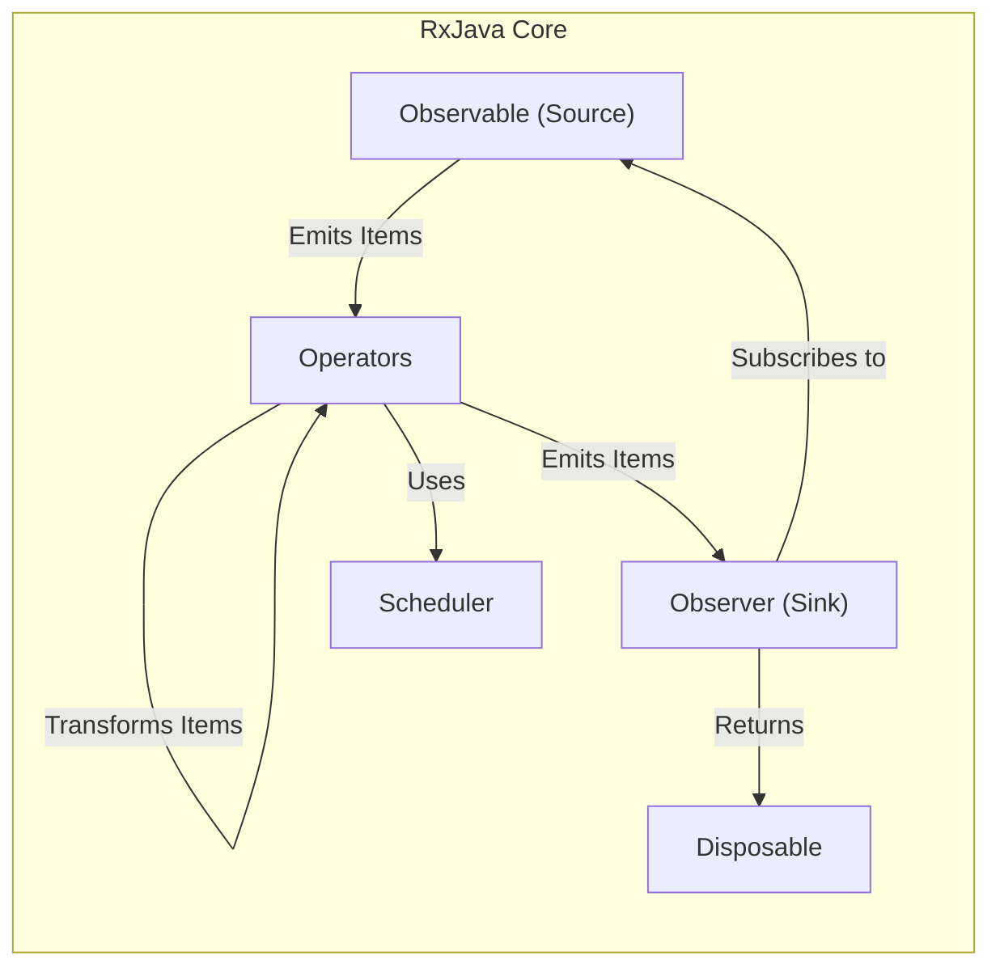
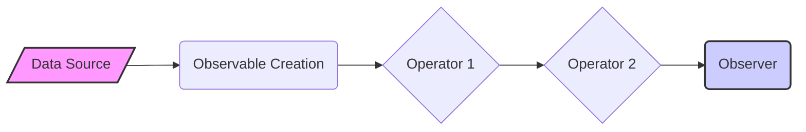
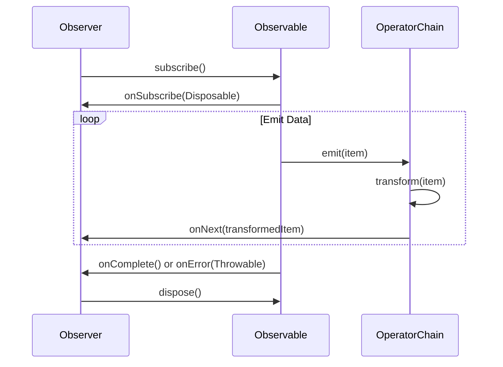

# Project Design Document: ReactiveX RxJava

**Version:** 1.1
**Date:** October 26, 2023
**Author:** AI Software Architect

## 1. Introduction

This document provides a refined and detailed design overview of the ReactiveX RxJava library. It aims to capture the core architectural elements, data flow mechanisms, and key components of RxJava to effectively support subsequent threat modeling activities. The focus remains on the fundamental design principles and structures inherent to the library itself, rather than specific applications built upon it.

## 2. Goals and Objectives

The fundamental goals of the RxJava library are to:

* Facilitate asynchronous and event-driven programming paradigms.
* Offer a comprehensive set of operators for the transformation, composition, and orchestration of data sequences.
* Implement the Reactive Streams specification to provide robust backpressure handling capabilities.
* Present a consistent and unified API for managing diverse asynchronous data sources.
* Enhance the readability and maintainability of code dealing with asynchronous operations.

This design document aims to clearly articulate the underlying mechanisms and architectural patterns through which these objectives are realized within the RxJava library.

## 3. Architectural Overview

RxJava's architecture is centered around the concept of reactive streams, providing a framework for representing and manipulating asynchronous data streams.

**Key Architectural Elements:**

* **Observable (Source):**  Represents the source of asynchronous data or events, emitting a sequence of items over time.
* **Observer (Sink):**  Consumes the items emitted by an Observable, acting as the recipient of the data stream.
* **Operators:**  Functions that act on Observables, transforming, filtering, combining, and otherwise manipulating the data streams.
* **Scheduler:** Manages the execution context for Observables and Observers, controlling concurrency and threading aspects.
* **Disposable:** Represents a resource handle, typically associated with the subscription between an Observable and an Observer, allowing for cancellation.

## 4. Detailed Design

### 4.1. Observable

* **Purpose:** To represent a stream of data or events that unfolds over time. It can emit zero, one, or multiple items and can terminate with either a completion signal or an error notification.
* **Key Characteristics:**
    * **Push-Based Model:** The Observable actively pushes data to its subscribed Observers.
    * **Primarily Asynchronous:** While capable of synchronous operation, Observables are predominantly used for managing asynchronous operations.
    * **Type Safety:** Observables are parameterized with a specific type, indicating the type of items they emit (e.g., `Observable<String>`).
* **Lifecycle:**
    * Creation: An Observable is created, defining the source of data.
    * Subscription: An Observer subscribes to the Observable.
    * Emission: The Observable emits items to the subscribed Observer(s).
    * Termination: The Observable terminates, either successfully (onComplete) or with an error (onError).
* **Core Methods:**
    * `subscribe(Observer)`: Establishes a connection and begins the flow of data to the provided Observer.
    * `subscribe(Consumer<T> onNext)`: A simplified subscription handling only the emission of the next item.
    * `subscribe(Consumer<T> onNext, Consumer<Throwable> onError)`: Handles both the next emitted item and potential errors.
    * `subscribe(Consumer<T> onNext, Consumer<Throwable> onError, Action onComplete)`: Handles item emission, errors, and successful completion.
    * `subscribe(Consumer<T> onNext, Consumer<Throwable> onError, Action onComplete, Consumer<Disposable> onSubscribe)`: Provides access to the `Disposable` associated with the subscription.

### 4.2. Observer

* **Purpose:** To consume and react to the items emitted by an Observable, defining the behavior for different events in the stream's lifecycle.
* **Key Responsibilities:**
    * Receiving and processing emitted items.
    * Handling error conditions.
    * Responding to the completion signal.
    * Managing the subscription lifecycle through the `Disposable`.
* **Core Methods:**
    * `onSubscribe(Disposable d)`: Invoked when the subscription is established, providing a `Disposable` instance for managing the connection's lifecycle.
    * `onNext(T t)`: Called when the Observable emits a new item, providing the emitted data.
    * `onError(Throwable e)`: Invoked when the Observable terminates due to an error, providing the error information.
    * `onComplete()`: Called when the Observable successfully completes its emission sequence.

### 4.3. Operators

* **Purpose:** To provide a rich set of functions for manipulating and transforming Observables, enabling the creation of complex data processing pipelines. Operators are chained together to define the flow of data transformation.
* **Categorization (Examples):**
    * **Creation Operators:** Used to instantiate new Observables from various sources (e.g., `just`, `fromIterable`, `interval`).
    * **Transformation Operators:** Modify the items emitted by an Observable (e.g., `map`, `flatMap`, `buffer`).
    * **Filtering Operators:** Select specific items from an Observable based on certain criteria (e.g., `filter`, `distinct`, `take`).
    * **Combination Operators:** Merge or combine multiple Observables into a single Observable (e.g., `merge`, `zip`, `concat`).
    * **Error Handling Operators:** Provide mechanisms for managing errors within the stream (e.g., `onErrorReturn`, `retry`).
    * **Utility Operators:** Offer supplementary functionalities like delaying emissions or controlling execution context (e.g., `delay`, `subscribeOn`, `observeOn`).
* **Implementation Pattern:** Operators typically return a new Observable that encapsulates the source Observable and applies the specific transformation or manipulation logic.

### 4.4. Scheduler

* **Purpose:** To govern the execution context (thread or thread pool) where Observables emit items and Observers receive notifications, crucial for managing concurrency.
* **Types of Schedulers (Examples):**
    * `Schedulers.computation()`: Optimized for computational, CPU-intensive tasks.
    * `Schedulers.io()`: Designed for I/O-bound operations, utilizing a thread pool that can grow as needed.
    * `Schedulers.newThread()`: Creates a new thread for each unit of work, suitable for isolating tasks.
    * `Schedulers.single()`: Employs a single, reusable thread for sequential execution.
    * `Schedulers.trampoline()`: Executes tasks on the current thread, queuing them for later execution if the current thread is busy.
* **Usage in Operators:** Operators like `subscribeOn()` dictate the Scheduler on which the Observable will operate, while `observeOn()` specifies the Scheduler where the Observer will receive notifications.

### 4.5. Disposable

* **Purpose:** Represents a handle to a resource that can be released, primarily the subscription link between an Observable and an Observer, allowing for the cancellation of the data stream.
* **Key Method:**
    * `dispose()`:  Unsubscribes the associated Observer from the Observable, preventing further emissions and releasing any related resources.

## 5. Data Flow

The typical data flow within RxJava involves an Observable emitting data items that are then processed through a sequence of operators before being consumed by an Observer.

**Detailed Data Flow Steps:**

* **Observable Creation:** A data source (e.g., network response, user event, sensor reading) is encapsulated within an Observable.
* **Subscription Initiation:** An Observer subscribes to the Observable, signaling its intent to receive data.
* **Data Emission:** The Observable begins emitting data items.
* **Operator Chain Processing:** Each emitted item traverses a chain of operators, with each operator applying its specific transformation or filtering logic.
* **Observer Notification:** The final processed item is delivered to the Observer's `onNext()` method.
* **Completion or Error Signaling:** The Observable signals the end of the stream, either by calling `onComplete()` on the Observer for successful completion or `onError()` in case of an error.
* **Subscription Termination (Disposal):** The subscription can be terminated by either the Observer or the Observable (in case of errors or completion), halting the data flow and releasing resources.

## 6. Key Components

* **`io.reactivex` Package:** The core package containing the fundamental interfaces and classes for reactive programming in RxJava.
    * `io.reactivex.Observable`: The central class representing an asynchronous stream of data.
    * `io.reactivex.Observer`: The interface defining how to consume and react to data emitted by an Observable.
    * `io.reactivex.disposables.Disposable`: Interface for managing the lifecycle of a subscription and allowing for its cancellation.
    * `io.reactivex.schedulers.Schedulers`: Provides factory methods for obtaining various types of Schedulers to manage concurrency.
* **Operator Implementations:** Numerous classes implementing the various operators available for transforming and manipulating Observables (e.g., classes within `io.reactivex.internal.operators.*`).

## 7. Interactions

The primary interaction pattern in RxJava is the subscription process between an Observable and an Observer, which establishes the reactive stream.

**Interaction Details:**

* **Subscription Request:** The Observer initiates the interaction by calling the `subscribe()` method of the Observable.
* **Subscription Confirmation:** The Observable confirms the subscription by calling the `onSubscribe()` method of the Observer, providing a `Disposable` instance.
* **Data Emission and Transformation:** The Observable emits data items, which are then processed sequentially through the chain of operators. Each operator applies its defined transformation to the item.
* **Notification to Observer:** Each processed item is delivered to the Observer's `onNext()` method.
* **Completion or Error Signaling:** Upon completion of the data stream or the occurrence of an error, the Observable invokes the Observer's `onComplete()` or `onError()` method, respectively.
* **Disposal (Cancellation):** The Observer can terminate the subscription at any point by calling the `dispose()` method of the `Disposable`, preventing further emissions.

## 8. Security Considerations (For Threat Modeling)

When considering RxJava within a threat modeling context, the following aspects represent potential areas of concern:

* **Error Handling Vulnerabilities:**
    * **Information Disclosure:** Verbose error messages propagated through the stream might inadvertently expose sensitive information.
    * **Denial of Service (DoS):**  Uncontrolled error propagation or retry mechanisms could lead to resource exhaustion or infinite loops.
* **Resource Management Weaknesses:**
    * **Resource Exhaustion:**  Improper disposal of subscriptions or resources within operators could lead to memory leaks or exhaustion of other system resources.
    * **Thread Starvation:**  Misuse of Schedulers or long-running operations on inappropriate threads could lead to thread starvation.
* **Backpressure Exploitation:**
    * **Memory Overflow:**  Failure to handle backpressure correctly when a fast producer overwhelms a slow consumer can lead to excessive memory consumption and potential crashes.
* **Concurrency and Synchronization Issues:**
    * **Race Conditions:**  Improperly synchronized access to shared mutable state within operators or Observers can lead to unpredictable behavior and potential vulnerabilities.
    * **Deadlocks:**  Complex interactions between Schedulers and blocking operations could result in deadlocks.
* **Injection Vulnerabilities in Custom Operators:**
    * **Code Injection:**  If custom operators process external input without proper sanitization, they could be susceptible to code injection attacks.
* **Dependency Chain Risks:**
    * **Vulnerable Dependencies:**  Outdated or vulnerable dependencies of RxJava could introduce security flaws.
* **Side Effects of Operators:**
    * **Unintended Consequences:** Operators with side effects (e.g., logging, external API calls) could be exploited if not carefully controlled.
* **Weaknesses in Cancellation Mechanisms:**
    * **Resource Leaks:** Failure to properly dispose of resources upon cancellation could lead to leaks.
    * **Incomplete Cleanup:**  Cancellation might not fully clean up all associated resources or processes.

## 9. Assumptions and Constraints

* This design document focuses on the core RxJava library and does not encompass specific implementations or integrations with external libraries or frameworks.
* It is assumed that developers utilizing RxJava possess a foundational understanding of reactive programming principles and best practices.
* The security considerations outlined are intended to be high-level and will necessitate further in-depth analysis and context-specific evaluation during the actual threat modeling process.

This improved document provides a more structured and detailed understanding of RxJava's architecture and components, enhancing its value for subsequent threat modeling activities. The refined descriptions of data flow, interactions, and categorized security considerations offer a more comprehensive foundation for identifying and mitigating potential vulnerabilities.