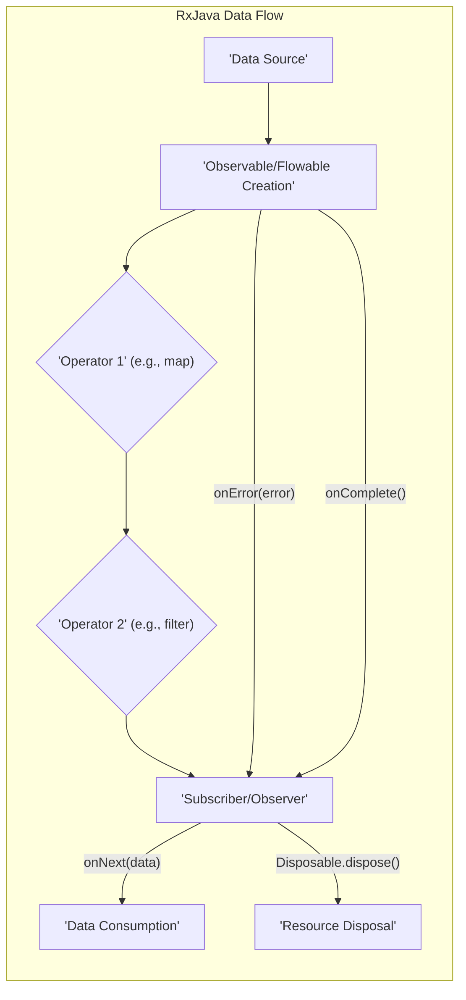
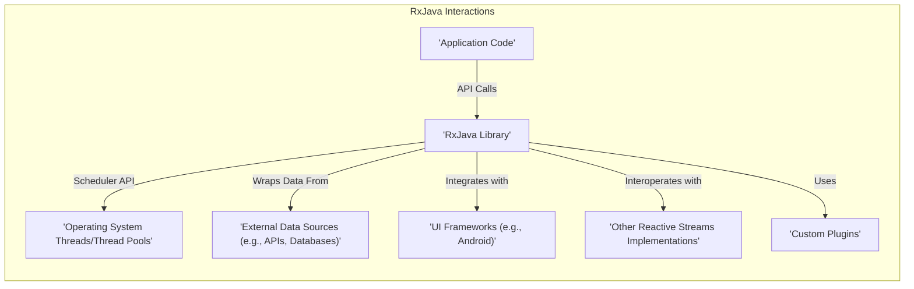
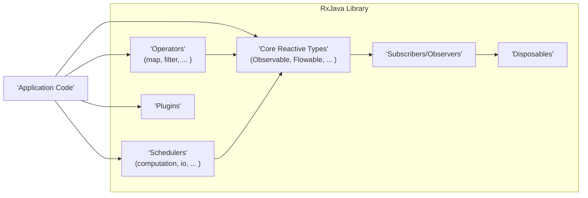
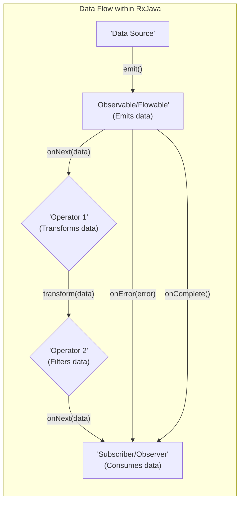

# Project Design Document: RxJava

**Version:** 1.1
**Date:** October 26, 2023
**Author:** Gemini (AI Language Model)

## 1. Introduction

This document provides a detailed architectural design of the RxJava library, a foundational Java library for composing asynchronous and event-based programs using observable sequences. This document is specifically tailored to facilitate subsequent threat modeling activities. It meticulously outlines the key components, data flow mechanisms, and interaction points within the library and with external systems, with a focus on potential security implications.

## 2. Goals

The primary goals of this design document are to:

*   Provide a granular and comprehensive overview of the RxJava architecture, suitable for security analysis.
*   Clearly identify key components, their specific responsibilities, and their potential attack surfaces.
*   Thoroughly describe the flow of data and control within the library, highlighting potential points of interception or manipulation.
*   Explicitly identify potential areas of interaction with external systems and the associated security risks.
*   Serve as a robust and detailed basis for identifying potential security vulnerabilities and attack vectors during threat modeling sessions.

## 3. Overview of RxJava

RxJava is a library that implements the Reactive Extensions pattern for the Java Virtual Machine (JVM), enabling developers to manage asynchronous data streams and events declaratively. Its core principles revolve around treating data as sequences over time. Key concepts include:

*   **Observables/Flowables:** Represent asynchronous data streams that emit zero or more items over time, potentially completing successfully or with an error. `Flowable` is a crucial backpressure-aware variant of `Observable`, designed to handle scenarios where the data emission rate exceeds the consumption rate.
*   **Operators:** Pure functions that transform, filter, combine, control timing, and otherwise manipulate the data emitted by Observables/Flowables. They form the building blocks of complex reactive pipelines.
*   **Subscribers/Observers:** Consume the data emitted by Observables/Flowables and react to the emitted items and lifecycle events (onNext, onError, onComplete). They define the end points of the data streams.
*   **Schedulers:** Control the execution context (thread or thread pool) on which Observables/Flowables emit items and Subscribers/Observers receive and process them. This is critical for managing concurrency and responsiveness.
*   **Disposables:** Represent resources (often subscriptions) that need to be explicitly released to prevent leaks and ensure proper cleanup when an Observable/Flowable is no longer needed or the subscription is terminated.

RxJava empowers developers to construct reactive applications that exhibit enhanced responsiveness, resilience to errors, and elasticity under varying loads.

## 4. Architectural Design

The RxJava library is structured around several interconnected components:

*   **Core Reactive Types:** These are the fundamental interfaces and classes for representing asynchronous data streams:
    *   `Observable`: The foundational type for representing a stream of zero or more events.
    *   `Flowable`: A backpressure-aware version of `Observable`, essential for managing large or fast-emitting data sources to prevent `OutOfMemoryError` exceptions.
    *   `Single`: Represents an asynchronous computation that will emit exactly one value or an error.
    *   `Completable`: Represents an asynchronous computation that will complete successfully or with an error, without emitting any value.
    *   `Maybe`: Represents an asynchronous computation that might emit a single value, complete without emitting a value, or emit an error.
*   **Operators:** A rich set of functions that operate on the core reactive types, enabling complex data stream transformations and manipulations. Examples include:
    *   **Creation Operators:**  `just`, `fromIterable`, `interval`, `create` (allows custom emission logic). *Security Note:*  Careless use of `create` might introduce vulnerabilities if emission logic is flawed.
    *   **Transformation Operators:** `map`, `flatMap`, `buffer`, `scan`. *Security Note:* Transformations might inadvertently expose or modify sensitive data if not implemented correctly.
    *   **Filtering Operators:** `filter`, `take`, `debounce`, `distinct`. *Security Note:*  Insufficient filtering could lead to processing of unwanted or malicious data.
    *   **Combining Operators:** `merge`, `zip`, `concat`, `combineLatest`. *Security Note:* Combining streams from untrusted sources can introduce vulnerabilities if data is not validated.
    *   **Error Handling Operators:** `onErrorReturn`, `retry`, `onErrorResumeNext`. *Security Note:*  Poor error handling can expose sensitive information or lead to denial of service.
    *   **Utility Operators:** `subscribeOn`, `observeOn`, `delay`, `timeout`. *Security Note:* Incorrect use of `subscribeOn` and `observeOn` can lead to concurrency issues and data corruption. `timeout` is important for preventing resource starvation.
*   **Schedulers:**  Manage the execution context for reactive streams, controlling which threads or thread pools are used for emitting and processing data:
    *   `Schedulers.computation()`: Optimized for CPU-intensive, computational tasks.
    *   `Schedulers.io()`: Designed for I/O-bound operations (network requests, file access).
    *   `Schedulers.newThread()`: Creates a new thread for each unit of work. *Security Note:*  Uncontrolled creation of threads can lead to resource exhaustion.
    *   `Schedulers.single()`: A single-threaded, event-loop based scheduler.
    *   `Schedulers.trampoline()`: Executes tasks on the current thread, queuing them for later execution.
    *   `AndroidSchedulers` (in `rxandroid`): Specifically for interacting with the Android main thread. *Security Note:* Improper interaction with the UI thread can lead to UI freezes or security vulnerabilities.
*   **Subscribers/Observers:** Interfaces that define the contract for consuming data emitted by Observables/Flowables:
    *   `onNext(T value)`: Called when a new item is emitted by the Observable/Flowable.
    *   `onError(Throwable error)`: Called when an error occurs during the processing of the Observable/Flowable. *Security Note:* Ensure error details do not leak sensitive information.
    *   `onComplete()`: Called when the Observable/Flowable has finished emitting items successfully.
    *   `onSubscribe(Disposable d)`: Called when the subscription is established, providing a `Disposable` to manage the subscription lifecycle.
*   **Disposables:** An interface representing a cancellable resource, typically a subscription. Implementing `dispose()` releases resources and prevents further data emission. *Security Note:* Failure to dispose of resources can lead to memory leaks and potential denial of service.
*   **Plugins:** A mechanism to intercept and customize RxJava's internal behavior, such as error handling, scheduler selection, and hook into various lifecycle events. *Security Note:*  Malicious or poorly written plugins can introduce significant security vulnerabilities.

## 5. Data Flow

The typical lifecycle of data within an RxJava stream involves these stages:

1. **Observable/Flowable Instantiation:** A data source is encapsulated within an Observable or Flowable. This source can originate from:
    *   In-memory data structures (collections).
    *   External event streams (user input, sensor data).
    *   Results of asynchronous operations (network calls, database queries).
2. **Operator Chaining:** Operators are applied sequentially to transform, filter, and manipulate the data stream. Each operator returns a new Observable/Flowable, creating a pipeline of operations.
3. **Subscription Initiation:** A Subscriber or Observer subscribes to the terminal Observable/Flowable in the chain. This action triggers the data flow.
4. **Data Emission:** The source Observable/Flowable begins emitting data items.
5. **Operator Processing:** Each operator in the chain processes the emitted items according to its defined logic.
6. **Subscriber Consumption:** The Subscriber/Observer receives the processed data items via its `onNext()` method.
7. **Completion or Error Termination:** The Observable/Flowable eventually either completes successfully, invoking the `onComplete()` method of the Subscriber/Observer, or terminates with an error, invoking the `onError()` method.
8. **Resource Disposal:** The subscription, represented by a `Disposable`, can be explicitly disposed of to stop the data flow and release associated resources.

## 6. Key Interactions

RxJava interacts with various components within an application and potentially with external systems:

*   **Application Code:** Developers directly interact with RxJava's API to create reactive streams, apply transformations, and handle emitted data. This is the primary interface and a significant area for potential misuse or vulnerabilities.
*   **Threading and Concurrency Mechanisms:** RxJava relies heavily on threads and concurrency, managed through Schedulers. Incorrect scheduler configuration or usage can lead to race conditions, deadlocks, and performance bottlenecks, potentially exploitable for denial-of-service.
*   **External Data Sources:** Observables/Flowables frequently wrap data retrieved from external sources such as databases, network APIs, message queues, and file systems. These interactions introduce risks related to data integrity, confidentiality, and availability. *Security Note:* Data fetched from untrusted sources should be rigorously validated and sanitized.
*   **User Interface (UI) Frameworks (e.g., Android, JavaFX):** Libraries like `rxandroid` facilitate seamless integration with UI frameworks, enabling asynchronous updates to the user interface. Improper handling of UI thread interactions can lead to UI freezes or security vulnerabilities.
*   **Reactive Streams Implementations:** RxJava adheres to the Reactive Streams specification, allowing interoperability with other reactive libraries. *Security Note:*  Interactions with external reactive streams should consider the security posture of those libraries.
*   **Custom Plugins:** The plugin mechanism allows developers to customize RxJava's behavior. While powerful, this also presents a risk if plugins are not developed and managed securely. Malicious plugins could compromise the entire application.

## 7. Security Considerations (Detailed)

The flexibility and power of RxJava, while beneficial, also introduce potential security considerations that developers must be aware of:

*   **Resource Exhaustion and Denial of Service (DoS):**
    *   **Unbounded Streams:** Observables/Flowables that emit data indefinitely without proper termination or backpressure can consume excessive memory or CPU resources, leading to DoS. *Mitigation:* Implement backpressure strategies with `Flowable`, use operators like `take`, `takeUntil`, `timeout`, and ensure proper disposal of subscriptions.
    *   **Scheduler Abuse:**  Creating an excessive number of threads using `Schedulers.newThread()` or overloading shared schedulers can lead to resource exhaustion. *Mitigation:* Carefully choose appropriate schedulers based on task characteristics and limit the creation of new threads.
*   **Information Disclosure:**
    *   **Error Handling:**  Verbose error messages propagated through `onError()` can inadvertently expose sensitive information about the application's internal state or data. *Mitigation:* Implement robust error handling that logs errors appropriately and provides generic error messages to the user. Avoid logging sensitive data in error messages.
    *   **Data Leaks in Operators:** Custom operators or incorrect usage of built-in operators might unintentionally expose sensitive data during transformations or filtering. *Mitigation:* Thoroughly review and test custom operators. Be mindful of data transformations and ensure sensitive data is handled securely.
*   **Concurrency Vulnerabilities:**
    *   **Race Conditions:** Incorrect use of Schedulers or shared mutable state accessed by multiple reactive streams can lead to race conditions, resulting in data corruption or unexpected behavior. *Mitigation:* Employ appropriate synchronization mechanisms when dealing with shared mutable state. Carefully choose Schedulers and understand their threading implications. Consider using immutable data structures.
    *   **Deadlocks:**  Improper synchronization or blocking operations within reactive streams can lead to deadlocks, causing the application to become unresponsive. *Mitigation:* Avoid blocking operations within reactive streams. Use non-blocking alternatives and carefully manage synchronization.
*   **Malicious Data Injection and Processing:**
    *   **Untrusted Data Sources:** If Observables/Flowables consume data from untrusted external sources, this data could contain malicious payloads or exploit vulnerabilities in downstream operators or subscribers. *Mitigation:* Implement robust input validation and sanitization before processing data from external sources.
    *   **Operator Exploitation:**  Certain operators, if used carelessly with untrusted input, could be exploited. For example, dynamically creating Observables based on user input without proper validation could lead to code injection vulnerabilities. *Mitigation:* Avoid dynamic creation of reactive streams based on untrusted input without thorough validation.
*   **Security of Plugins:**
    *   **Malicious Plugins:** If the plugin mechanism is used, ensure that plugins are sourced from trusted locations and undergo security reviews. Malicious plugins can have full access to the application's resources and can introduce arbitrary vulnerabilities. *Mitigation:* Implement strict controls over plugin usage and ensure thorough security vetting of plugins.
*   **Dependency Chain Vulnerabilities:**
    *   **Outdated RxJava Version:** Using an outdated version of RxJava might expose the application to known vulnerabilities in the library itself. *Mitigation:* Keep the RxJava library and its dependencies up-to-date with the latest security patches.

## 8. Diagrams

The following diagrams provide a visual representation of the RxJava architecture and data flow.

### 8.1. High-Level Architecture

### 8.2. Detailed Data Flow Diagram

## 9. Conclusion

This enhanced design document provides a more granular and security-focused understanding of the RxJava library's architecture and data flow. It explicitly highlights potential security considerations associated with various components and their interactions. This detailed information serves as a crucial foundation for conducting thorough threat modeling activities, enabling the identification and mitigation of potential security vulnerabilities in applications leveraging the RxJava library. This document should be regularly reviewed and updated as the RxJava library evolves and new security considerations emerge.