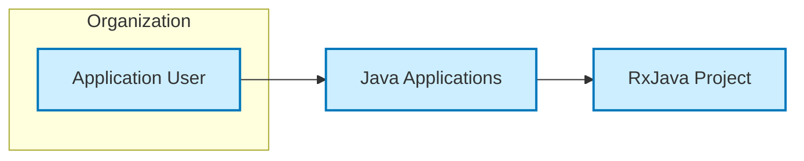
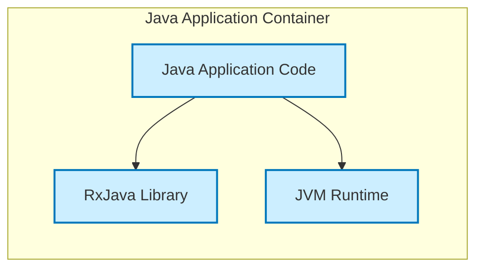
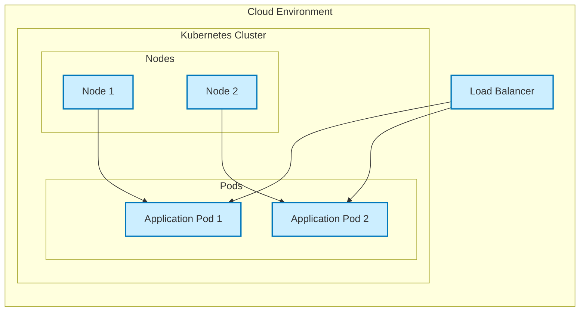

# BUSINESS POSTURE

The RxJava project is a library for composing asynchronous and event-based programs using observable sequences for the Java Virtual Machine (JVM). It provides a reactive programming paradigm that simplifies the development of concurrent and distributed systems.

- Business priorities and goals:
  - Enable developers to build responsive and efficient applications.
  - Simplify the handling of asynchronous operations and event streams.
  - Improve code maintainability and readability for complex asynchronous logic.
  - Facilitate the development of reactive systems that can handle backpressure and concurrency effectively.

- Most important business risks:
  - Dependency vulnerabilities: As a library, RxJava is a dependency for other projects. Vulnerabilities in RxJava can impact all dependent applications.
  - Performance bottlenecks: Incorrect usage of RxJava can lead to performance issues, such as memory leaks or excessive resource consumption, impacting application stability and responsiveness.
  - Integration complexity: Integrating RxJava into existing projects might introduce complexity and require developers to learn a new programming paradigm, potentially leading to errors and delays.
  - Compatibility issues: Upgrades to RxJava versions might introduce breaking changes, requiring refactoring of dependent applications and potentially causing compatibility issues.

# SECURITY POSTURE

- Existing security controls:
  - security control: Open Source Community Review - The project is open source and benefits from community review, which can help identify and address potential security vulnerabilities. Implemented through public code repository and contribution process.
  - security control: Dependency Scanning - Developers using RxJava are expected to perform dependency scanning on their projects, which would include RxJava as a dependency. Implemented by developers using dependency scanning tools in their projects.
  - security control: Static Analysis - Developers using RxJava are expected to perform static analysis on their projects, which would include code that uses RxJava. Implemented by developers using static analysis tools in their projects.

- Accepted risks:
  - accepted risk: Reliance on Community Security - Security relies heavily on the open-source community to identify and report vulnerabilities. There is a risk that vulnerabilities might be discovered and exploited before a patch is available.
  - accepted risk: Third-Party Dependency Vulnerabilities - RxJava itself depends on other libraries. Vulnerabilities in these transitive dependencies could indirectly affect RxJava and dependent applications.
  - accepted risk: Misuse by Developers - Developers might misuse RxJava APIs in ways that introduce security vulnerabilities in their applications, such as improper handling of errors or uncontrolled resource consumption.

- Recommended security controls:
  - security control: Automated Dependency Scanning - Implement automated dependency scanning in the RxJava project's CI/CD pipeline to proactively identify and address vulnerabilities in dependencies.
  - security control: Security Audits - Conduct periodic security audits of the RxJava codebase by security experts to identify potential vulnerabilities that might not be caught by community review or automated tools.
  - security control: Security Guidelines for Users - Provide clear security guidelines and best practices for developers using RxJava to help them avoid common security pitfalls and use the library securely.
  - security control: Vulnerability Disclosure Policy - Establish a clear vulnerability disclosure policy to provide a channel for security researchers to report vulnerabilities responsibly and to manage the vulnerability patching process effectively.

- Security requirements:
  - Authentication: Not applicable to RxJava library itself. Authentication is the responsibility of the applications that use RxJava.
  - Authorization: Not applicable to RxJava library itself. Authorization is the responsibility of the applications that use RxJava.
  - Input validation: RxJava should handle inputs robustly and avoid vulnerabilities related to input manipulation. Input validation within RxJava itself is limited as it primarily processes data streams provided by the application. Applications using RxJava must perform input validation at the application level before data enters RxJava streams.
  - Cryptography: RxJava itself does not provide cryptographic functionalities. If applications using RxJava require cryptography, they should use dedicated cryptography libraries and ensure proper key management and secure implementation.

# DESIGN

## C4 CONTEXT

- Context Diagram Elements:
  - - Name: Application User
    - Type: Person
    - Description: End-users who interact with Java applications that utilize RxJava.
    - Responsibilities: Uses applications to perform tasks and access functionalities.
    - Security controls: User authentication and authorization are handled by the Java Applications.

  - - Name: RxJava Project
    - Type: Software System (Library)
    - Description: The RxJava library itself, providing reactive programming capabilities for Java applications.
    - Responsibilities: Provides APIs and functionalities for asynchronous and event-based programming. Does not directly handle user data or business logic.
    - Security controls: Code review, dependency scanning, and community security efforts.

  - - Name: Java Applications
    - Type: Software System (Application)
    - Description: Java applications developed by organizations that integrate and utilize the RxJava library to implement reactive functionalities.
    - Responsibilities: Provides business logic, user interface, data handling, and integrates RxJava for asynchronous operations.
    - Security controls: Application-level security controls including authentication, authorization, input validation, data encryption, and secure deployment practices.

## C4 CONTAINER

- Container Diagram Elements:
  - - Name: Java Application Code
    - Type: Software Container (Code)
    - Description: The custom application code written by developers that utilizes RxJava library. This code implements the specific business logic and functionalities of the application.
    - Responsibilities: Implements application features, handles user requests, manages data, and orchestrates asynchronous operations using RxJava.
    - Security controls: Application-level input validation, authorization checks, secure coding practices, and error handling.

  - - Name: RxJava Library
    - Type: Software Container (Library)
    - Description: The RxJava library integrated as a dependency within the Java Application Container. Provides reactive programming APIs and functionalities.
    - Responsibilities: Provides reactive streams, operators, and schedulers for composing asynchronous and event-based programs.
    - Security controls: Dependency scanning, code review within the RxJava project, and adherence to secure coding practices in the library development.

  - - Name: JVM Runtime
    - Type: Infrastructure Container (Runtime Environment)
    - Description: The Java Virtual Machine (JVM) runtime environment that executes the Java Application Code and the RxJava library.
    - Responsibilities: Provides the execution environment for the Java application, manages memory, and handles system-level operations.
    - Security controls: JVM security features, operating system level security controls, and runtime environment hardening.

## DEPLOYMENT

Deployment of RxJava is dependent on the application that uses it. RxJava itself is a library and is not deployed as a standalone service. The deployment diagram below illustrates a typical deployment scenario for a Java application that uses RxJava in a cloud environment.

- Deployment Diagram Elements:
  - - Name: Cloud Environment
    - Type: Environment
    - Description: The cloud infrastructure where the Java application is deployed. This could be AWS, Azure, GCP, or any other cloud provider.
    - Responsibilities: Provides the underlying infrastructure, including compute, network, and storage resources.
    - Security controls: Cloud provider security controls, network security groups, firewalls, and infrastructure monitoring.

  - - Name: Kubernetes Cluster
    - Type: Infrastructure Component (Orchestration)
    - Description: A Kubernetes cluster used for container orchestration and management of the Java application pods.
    - Responsibilities: Manages application deployment, scaling, and health monitoring.
    - Security controls: Kubernetes RBAC, network policies, pod security policies, and cluster security hardening.

  - - Name: Nodes (Node 1, Node 2)
    - Type: Infrastructure Component (Compute)
    - Description: Worker nodes in the Kubernetes cluster that host the application pods.
    - Responsibilities: Provides compute resources for running application containers.
    - Security controls: Operating system security hardening, node security configurations, and security monitoring.

  - - Name: Pods (Application Pod 1, Application Pod 2)
    - Type: Software Component (Container)
    - Description: Kubernetes pods that contain instances of the Java Application Container (including RxJava library and application code).
    - Responsibilities: Runs the Java application instances, handles requests, and executes business logic.
    - Security controls: Container image scanning, least privilege container configurations, and application-level security controls within the container.

  - - Name: Load Balancer
    - Type: Infrastructure Component (Network)
    - Description: A load balancer that distributes incoming traffic across multiple application pods for high availability and scalability.
    - Responsibilities: Distributes traffic, performs health checks, and ensures application availability.
    - Security controls: Load balancer security configurations, TLS termination, and DDoS protection.

## BUILD

```mermaid
flowchart LR
    A["Developer"] --> B["Code Repository (GitHub)"];
    B --> C["Build System (GitHub Actions/Jenkins)"];
    C --> D["Dependency Management (Maven/Gradle)"];
    D --> E["Security Scanners (SAST/Dependency Check)"];
    E --> F["Artifact Repository (Maven Central/Nexus)"];

    style A fill:#CCEEFF,stroke:#0077BB,stroke-width:2px
    style B fill:#CCEEFF,stroke:#0077BB,stroke-width:2px
    style C fill:#CCEEFF,stroke:#0077BB,stroke-width:2px
    style D fill:#CCEEFF,stroke:#0077BB,stroke-width:2px
    style E fill:#CCEEFF,stroke:#0077BB,stroke-width:2px
    style F fill:#CCEEFF,stroke:#0077BB,stroke-width:2px
```

- Build Process:
  - Developer: Writes code and commits changes to the code repository.
    - Responsibilities: Writing secure code, performing local testing, and adhering to coding standards.
    - Security controls: Developer training on secure coding practices, code review process.

  - Code Repository (GitHub): Stores the source code of the RxJava project.
    - Responsibilities: Version control, code collaboration, and triggering build pipelines.
    - Security controls: Access control, branch protection, and audit logging.

  - Build System (GitHub Actions/Jenkins): Automates the build, test, and packaging process.
    - Responsibilities: Compiling code, running tests, performing security scans, and creating build artifacts.
    - Security controls: Secure build environment, access control to build system, and audit logging.

  - Dependency Management (Maven/Gradle): Manages project dependencies, including transitive dependencies.
    - Responsibilities: Resolving dependencies, downloading libraries, and ensuring dependency integrity.
    - Security controls: Dependency vulnerability scanning, dependency pinning, and using trusted dependency repositories.

  - Security Scanners (SAST/Dependency Check): Performs static analysis security testing (SAST) and dependency vulnerability checks.
    - Responsibilities: Identifying potential code vulnerabilities and known vulnerabilities in dependencies.
    - Security controls: SAST tools, dependency scanning tools, and automated security checks in the build pipeline.

  - Artifact Repository (Maven Central/Nexus): Stores and distributes the build artifacts (JAR files) of RxJava.
    - Responsibilities: Hosting build artifacts, managing versions, and providing access to developers.
    - Security controls: Access control, artifact integrity checks (e.g., checksum verification), and secure artifact repository.

# RISK ASSESSMENT

- Critical business processes we are trying to protect:
  - For RxJava itself, the critical process is maintaining the integrity and availability of the library for the open-source community and dependent projects.
  - For applications using RxJava, the critical business processes are application-specific and depend on the functionality of those applications. RxJava is used to enhance the reliability and responsiveness of these processes.

- Data we are trying to protect and their sensitivity:
  - RxJava library code itself is public and open source. The primary data to protect is the integrity of the library releases and the build process to prevent supply chain attacks.
  - Applications using RxJava will handle various types of data depending on their purpose. The sensitivity of this data is application-specific and needs to be assessed in the context of those applications. RxJava itself does not directly handle or store sensitive data.

# QUESTIONS & ASSUMPTIONS

- Questions:
  - What are the typical use cases and application domains where RxJava is commonly used? Understanding the common use cases will help tailor security recommendations.
  - What are the common security concerns and attack vectors that are relevant to applications using reactive programming libraries like RxJava?
  - Are there any specific regulatory compliance requirements that applications using RxJava might need to adhere to?

- Assumptions:
  - RxJava is primarily used as a library in other Java applications and is not deployed as a standalone service.
  - Security is a shared responsibility. While the RxJava project focuses on the security of the library itself, applications using RxJava are responsible for their own application-level security.
  - Developers using RxJava are expected to have a basic understanding of reactive programming principles and secure coding practices.
  - The deployment environment for applications using RxJava can vary widely, from on-premises data centers to cloud environments. The deployment diagram provided is a representative example of a cloud-based deployment.