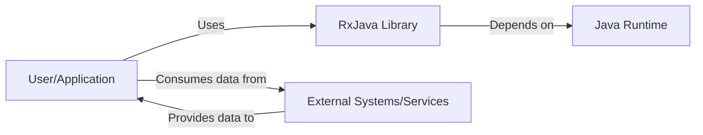
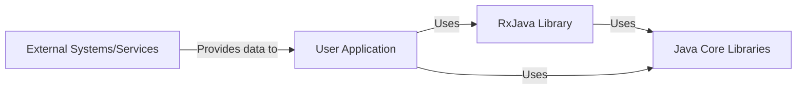
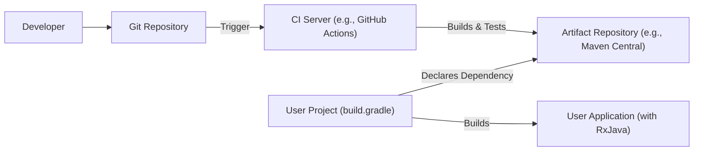

# BUSINESS POSTURE

RxJava is a mature, widely-used library. It's a core component in many Android applications and backend Java systems. The primary business goal is to provide a robust, efficient, and well-maintained library for reactive programming. Stability, backward compatibility (within semantic versioning guidelines), and performance are paramount.

Business Priorities:

*   Maintainability: The library must be easy to maintain and evolve over time.
*   Performance: Operations should be highly performant, minimizing overhead.
*   Reliability: The library must be free of bugs and handle errors gracefully.
*   Compatibility: Maintain a reasonable level of backward compatibility and support a wide range of Java versions.
*   Community Support: Foster a strong community and provide adequate support channels.

Business Risks:

*   Introduction of breaking changes: New features or bug fixes could inadvertently break existing implementations, impacting a large user base.
*   Performance regressions: Changes could negatively impact the performance of applications using RxJava.
*   Security vulnerabilities: Although primarily a functional library, vulnerabilities could arise from improper use or interactions with other systems.
*   Lack of maintainers: Insufficient active maintainers could lead to stagnation and unaddressed issues.
*   Competition: Alternative reactive libraries could surpass RxJava in features, performance, or community support.

# SECURITY POSTURE

RxJava, as a library, doesn't directly handle things like network communication, data persistence, or user authentication. Its security posture is primarily about ensuring the code itself is free of vulnerabilities and that it doesn't introduce weaknesses into the applications that use it.

Existing Security Controls:

*   security control: Code Reviews: All changes go through a code review process by maintainers. (Implicit in the open-source nature and contribution guidelines).
*   security control: Static Analysis: Likely use of static analysis tools to identify potential bugs and vulnerabilities. (Common practice for mature Java projects, but not explicitly stated in the repository).
*   security control: Testing: Extensive test suite to ensure correctness and prevent regressions. (Visible in the repository's test directory).
*   security control: Dependency Management: Careful management of dependencies to minimize the risk of supply chain attacks. (Evidenced by the use of build tools like Gradle).
*   security control: Fuzz Testing: Use of fuzz testing to identify potential bugs and vulnerabilities. (Visible in the repository's fuzz directory).

Accepted Risks:

*   accepted risk: Reliance on user input validation: RxJava itself doesn't perform input validation. It's the responsibility of the application using RxJava to sanitize and validate any data passed to RxJava operators.
*   accepted risk: Potential for misuse: RxJava's operators can be complex. Misuse could lead to performance issues or unexpected behavior, but this is considered an application-level concern.
*   accepted risk: Denial of Service (DoS) via resource exhaustion: While RxJava provides mechanisms for backpressure, a malicious or poorly designed stream could still potentially exhaust resources (e.g., memory) if not handled correctly by the consuming application.

Recommended Security Controls:

*   security control: Explicitly document security considerations: Add a `SECURITY.md` file to the repository outlining best practices and potential security pitfalls when using RxJava.
*   security control: Integrate SAST tools into the CI/CD pipeline: Ensure static analysis is consistently run on every build.
*   security control: Regularly update dependencies: Automate dependency updates to address known vulnerabilities in third-party libraries.
*   security control: Consider using a Software Bill of Materials (SBOM): Generate and maintain an SBOM to improve supply chain security.

Security Requirements:

*   Authentication: Not directly applicable to RxJava itself.
*   Authorization: Not directly applicable to RxJava itself.
*   Input Validation: RxJava should not perform input validation. This is the responsibility of the application using the library. However, documentation should clearly state this.
*   Cryptography: Not directly applicable to RxJava itself.
*   Error Handling: RxJava provides extensive error handling mechanisms (e.g., `onError`, `retry`, `retryWhen`). These should be used appropriately by applications to handle errors gracefully and prevent unexpected behavior. Documentation should emphasize the importance of proper error handling.
*   Backpressure Handling: RxJava provides backpressure handling mechanisms. Documentation should emphasize the importance of proper backpressure handling.

# DESIGN

## C4 CONTEXT

*   Elements:
    *   Name: User/Application
        *   Type: User/Application
        *   Description: The application or user that utilizes the RxJava library for reactive programming.
        *   Responsibilities: Implements business logic, handles user interactions, and consumes data from external systems. Uses RxJava to manage asynchronous operations and data streams.
        *   Security controls: Input validation, output encoding, authentication, authorization, session management, error handling, logging.
    *   Name: RxJava Library
        *   Type: Library
        *   Description: The RxJava library itself, providing the core functionality for reactive programming.
        *   Responsibilities: Provides operators for transforming, filtering, and combining data streams. Manages subscriptions and handles backpressure.
        *   Security controls: Code reviews, static analysis, testing, dependency management, fuzz testing.
    *   Name: Java Runtime
        *   Type: Platform
        *   Description: The Java Runtime Environment (JRE) or Java Development Kit (JDK) on which RxJava and the user application run.
        *   Responsibilities: Provides the underlying platform for executing Java code.
        *   Security controls: Java security manager, regular security updates.
    *   Name: External Systems/Services
        *   Type: External System
        *   Description: Any external systems or services that provide data to the user application.
        *   Responsibilities: Varies depending on the specific system.
        *   Security controls: Depends on the specific system.

## C4 CONTAINER

Since RxJava is a library, the container diagram is essentially an extension of the context diagram.

*   Elements:
    *   Name: User Application
        *   Type: Application
        *   Description: The application that uses RxJava.
        *   Responsibilities: Implements business logic, handles user interactions, and consumes data.
        *   Security controls: Input validation, output encoding, authentication, authorization, session management, error handling, logging.
    *   Name: RxJava Library
        *   Type: Library
        *   Description: The RxJava library.
        *   Responsibilities: Provides reactive programming functionality.
        *   Security controls: Code reviews, static analysis, testing, dependency management, fuzz testing.
    *   Name: Java Core Libraries
        *   Type: Library
        *   Description: Core Java libraries used by RxJava and the user application.
        *   Responsibilities: Provides fundamental functionalities of the Java platform.
        *   Security controls: Java security manager, regular security updates.
    *   Name: External Systems/Services
        *   Type: External System
        *   Description: Any external systems or services that provide data to the user application.
        *   Responsibilities: Varies depending on the specific system.
        *   Security controls: Depends on the specific system.

## DEPLOYMENT

RxJava is a library, not a standalone application. Therefore, deployment is about how it's included in other projects.

Possible Deployment Solutions:

1.  **Dependency Management System (Maven, Gradle, etc.):** The most common approach. RxJava is declared as a dependency in the project's build file (e.g., `pom.xml` for Maven, `build.gradle` for Gradle). The build system automatically downloads the appropriate version from a repository (e.g., Maven Central) and includes it in the application's classpath.
2.  **Manual Download and Inclusion:** Less common, but possible. The RxJava JAR file can be manually downloaded and placed in the project's classpath.
3.  **Included in a larger framework/platform:** Some frameworks might include RxJava as a built-in component.

Chosen Solution (most common): Dependency Management System (Gradle)

*   Elements:
    *   Name: Developer
        *   Type: Person
        *   Description: The developer working on RxJava or a project using RxJava.
        *   Responsibilities: Writes code, tests, and documentation.
        *   Security controls: Secure coding practices, code reviews.
    *   Name: Git Repository
        *   Type: Version Control System
        *   Description: The repository hosting the RxJava source code (e.g., GitHub).
        *   Responsibilities: Stores code, tracks changes, manages versions.
        *   Security controls: Access control, branch protection rules.
    *   Name: CI Server (e.g., GitHub Actions)
        *   Type: Continuous Integration Server
        *   Description: The server that automates the build and testing process.
        *   Responsibilities: Runs builds, tests, and other checks on code changes.
        *   Security controls: Secure configuration, access control.
    *   Name: Artifact Repository (e.g., Maven Central)
        *   Type: Repository
        *   Description: The repository where RxJava artifacts (JAR files) are published.
        *   Responsibilities: Stores and distributes released versions of RxJava.
        *   Security controls: Access control, integrity checks.
    *   Name: User Project (build.gradle)
        *   Type: Project
        *   Description: A project that uses RxJava, with its build configuration defined in `build.gradle`.
        *   Responsibilities: Defines project dependencies, build steps, and other configurations.
        *   Security controls: Dependency management, secure build configuration.
    *   Name: User Application (with RxJava)
        *   Type: Application
        *   Description: The final application built from the user project, including RxJava as a dependency.
        *   Responsibilities: Executes the application's functionality.
        *   Security controls: All application-level security controls.

## BUILD

```mermaid
graph LR
    Dev["Developer"] --> Commit["Commit Code"]
    Commit --> Git["Git Repository"]
    Git -- "Push" --> Trigger["Trigger CI/CD"]
    Trigger --> Clone["Clone Repository"]
    Clone --> Lint["Run Linters"]
    Lint --> SAST["Run SAST"]
    SAST --> Test["Run Unit/Integration Tests"]
    Test --> Fuzz["Run Fuzz Tests"]
    Fuzz --> Build["Build Artifact (JAR)"]
    Build --> Publish["Publish to Artifact Repository"]

```

*   Build Process Description:

    1.  **Developer Commits Code:** Developers write code and commit changes to the local Git repository.
    2.  **Push to Git Repository:** Changes are pushed to the remote Git repository (e.g., GitHub).
    3.  **Trigger CI/CD:** The push triggers the CI/CD pipeline (e.g., GitHub Actions).
    4.  **Clone Repository:** The CI/CD pipeline clones the repository.
    5.  **Run Linters:** Linters are executed to check code style and identify potential issues.
    6.  **Run SAST:** Static Application Security Testing (SAST) tools are run to analyze the code for security vulnerabilities.
    7.  **Run Unit/Integration Tests:** Unit and integration tests are executed to verify the functionality of the code.
    8.  **Run Fuzz Tests:** Fuzz tests are executed to verify the functionality of the code.
    9.  **Build Artifact (JAR):** If all checks pass, the RxJava library is built, producing a JAR file.
    10. **Publish to Artifact Repository:** The JAR file is published to an artifact repository (e.g., Maven Central).

*   Security Controls in Build Process:

    *   **Linters:** Enforce code style and identify potential errors.
    *   **SAST:** Detect security vulnerabilities in the code.
    *   **Unit/Integration/Fuzz Tests:** Ensure code correctness and prevent regressions.
    *   **Dependency Management:** Manage dependencies securely and track vulnerabilities.
    *   **CI/CD Pipeline:** Automates the build process, ensuring consistency and reducing manual errors.
    *   **Artifact Repository:** Provides a secure and reliable way to distribute the library.

# RISK ASSESSMENT

*   Critical Business Processes:
    *   Providing a reliable and performant reactive programming library.
    *   Maintaining backward compatibility (within semantic versioning guidelines).
    *   Supporting a wide range of Java versions.
    *   Fostering a strong community and providing adequate support.

*   Data:
    *   RxJava itself does not handle sensitive data directly. It operates on data streams provided by the user application. The sensitivity of the data depends entirely on the application using RxJava.
    *   Source code: Publicly available, but integrity is important.
    *   Build artifacts (JAR files): Publicly available, but integrity is crucial to prevent supply chain attacks.

# QUESTIONS & ASSUMPTIONS

*   Questions:
    *   Are there any specific compliance requirements (e.g., specific industry regulations) that RxJava needs to be aware of? Although it's a library, downstream users might have such requirements.
    *   What is the current process for handling reported security vulnerabilities? Is there a vulnerability disclosure program?
    *   What specific SAST tools are currently used, and how are the results managed?
    *   What is the frequency of dependency updates, and is there an automated process for this?
    *   What are the specific Java versions officially supported by RxJava?

*   Assumptions:
    *   BUSINESS POSTURE: The RxJava project prioritizes stability, performance, and backward compatibility.
    *   SECURITY POSTURE: The RxJava maintainers follow secure coding practices and are responsive to security concerns.
    *   DESIGN: RxJava is primarily used as a library within other Java applications. The build process uses standard Java tools (Gradle, Maven) and publishes artifacts to a public repository (Maven Central). The development process uses Git and a CI/CD pipeline.