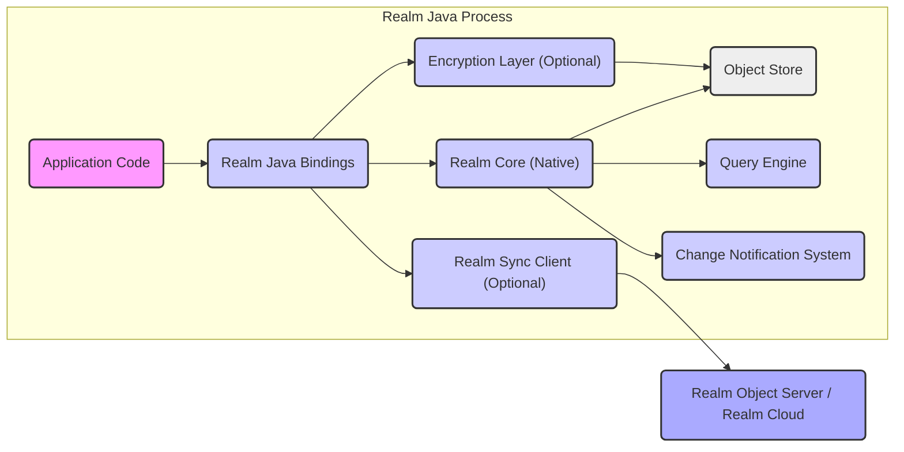

# Project Design Document: Realm Java

**Version:** 1.1
**Date:** October 26, 2023
**Author:** AI Software Architect

## 1. Introduction

This document provides a detailed design overview of the Realm Java project, an open-source embedded mobile database. This document is intended to serve as a foundation for subsequent threat modeling activities. It clearly articulates the system's boundaries, components, and interactions, enabling security professionals to identify potential vulnerabilities and attack vectors.

### 1.1. Purpose

The primary purpose of this document is to provide a comprehensive technical description of Realm Java to facilitate effective threat modeling. It aims to detail the system's architecture and functionality, enabling a thorough analysis of potential security risks.

### 1.2. Scope

This document covers the core architecture and functionality of the Realm Java library as presented in the provided GitHub repository. It focuses on the in-process, on-device database functionality and includes considerations for the optional Realm Sync feature. External services and client applications utilizing Realm Java are outside the direct scope, but their interactions with Realm are considered where relevant to security.

### 1.3. Audience

This document is intended for:

* Security engineers and architects responsible for threat modeling and security assessments of applications using Realm Java.
* Developers working with or contributing to the Realm Java project who need a deep understanding of its architecture.
* Anyone requiring a detailed understanding of the internal workings and security aspects of Realm Java.

## 2. System Overview

Realm Java is an embedded, object-oriented mobile database designed to run directly within Android and Java applications. It provides a mechanism for persisting and querying data locally on the device with high performance. Key features include:

* **Local Data Persistence:** Provides a persistent store for application data directly on the device.
* **Object-Oriented API:**  Data is accessed and manipulated as objects with properties, simplifying development.
* **Reactive Architecture:** Supports live objects and change notifications, enabling real-time updates in applications.
* **Efficient Querying:** Offers a powerful query language for retrieving data.
* **Zero-Copy Design:** Minimizes data copying between the database engine and the application, improving performance.
* **Optional Encryption:** Supports encrypting the local database file to protect data at rest.
* **Optional Realm Sync:** Enables seamless synchronization of data between devices and a backend service.

## 3. System Architecture

The architecture of Realm Java comprises several interconnected components working together to provide its functionality:

* **Realm Core (Native, C++):** The foundational database engine written in C++. It manages the underlying data storage format, transaction management, query execution, and core database operations. This component is platform-specific and accessed via JNI.
* **Realm Java Bindings:** This layer provides the Java API that application developers interact with. It acts as a bridge between the Java/Kotlin code and the native Realm Core, translating Java method calls into native function calls.
* **Object Store (Data File):** The physical file on the device's storage where the Realm database is persisted. It contains the actual data, schema information, and indexes.
* **Query Engine (within Realm Core):** Responsible for parsing and executing queries against the data stored in the Object Store. It optimizes query execution for performance.
* **Change Notification System (within Realm Core and Bindings):** A mechanism that detects changes to Realm data and notifies registered listeners in the Java layer. This enables reactive programming patterns.
* **Encryption Layer (within Realm Core):** An optional component that handles the encryption and decryption of data before it is written to or read from the Object Store. It uses a symmetric encryption algorithm.
* **Realm Sync Client (Optional):** A component that manages the synchronization of data with a remote Realm Object Server or Realm Cloud. It handles conflict resolution, data transfer, and connection management.

### 3.1. Component Diagram

## 4. Data Flow

Understanding the data flow is crucial for identifying potential points of vulnerability.

* **Writing Data to Realm:**
    * The application initiates a write transaction and modifies Realm objects through the Realm Java Bindings.
    * The Java Bindings serialize these object changes and pass them to the Realm Core via JNI.
    * Within Realm Core, the transaction is processed. If encryption is enabled, the Encryption Layer encrypts the data.
    * The updated data is written to the Object Store on disk.
    * If Realm Sync is enabled, the changes are also captured by the Realm Sync Client for later synchronization.

* **Reading Data from Realm:**
    * The application queries for Realm objects through the Realm Java Bindings.
    * The Java Bindings translate the query and pass it to the Realm Core's Query Engine via JNI.
    * The Query Engine retrieves the relevant data from the Object Store. If encryption is enabled, the Encryption Layer decrypts the data.
    * The Realm Core returns the data to the Java Bindings.
    * The Java Bindings materialize the data as live Realm objects, which are then accessible to the application.

* **Data Synchronization (with Realm Sync):**
    * The Realm Sync Client establishes a secure, persistent connection (typically using WebSockets over TLS) with the Realm Object Server or Realm Cloud.
    * Local changes made to the Realm database are transmitted to the server. This involves serializing the changes and sending them over the network.
    * The server processes these changes, potentially resolving conflicts, and persists them in the server-side Realm.
    * Changes from the server (made by other clients or server-side logic) are received by the Realm Sync Client.
    * The Realm Sync Client applies these remote changes to the local Realm database, triggering change notifications.

## 5. Security Considerations

This section details security considerations relevant to Realm Java, highlighting potential threats and existing security mechanisms.

* **Data at Rest Encryption:**
    * **Mechanism:** Realm Java offers optional encryption of the local database file using AES-256 encryption in counter mode.
    * **Threat Mitigation:** Protects sensitive data stored on the device from unauthorized access if the device is lost or compromised.
    * **Considerations:** The security relies heavily on the secure generation, storage, and management of the encryption key by the application. Weak key management can negate the benefits of encryption.
* **Data in Transit Encryption (Realm Sync):**
    * **Mechanism:** When using Realm Sync, all communication between the client and the Realm Object Server/Cloud is encrypted using TLS/SSL.
    * **Threat Mitigation:** Protects data transmitted over the network from eavesdropping and tampering.
    * **Considerations:** The security depends on the proper implementation and configuration of TLS/SSL.
* **Authentication and Authorization (Realm Sync):**
    * **Mechanism:** Realm Sync requires clients to authenticate with the Realm Object Server/Cloud to verify their identity. Authorization rules on the server control access to specific data.
    * **Threat Mitigation:** Prevents unauthorized users from accessing or modifying data.
    * **Considerations:** The strength of authentication depends on the chosen authentication method (e.g., username/password, API keys, OAuth). Proper authorization rules are crucial to prevent privilege escalation.
* **Input Validation and Data Integrity:**
    * **Mechanism:** While Realm enforces schema constraints, the application is responsible for validating data before writing it to the Realm.
    * **Threat Mitigation:** Prevents the storage of malicious or malformed data that could lead to application errors or security vulnerabilities.
    * **Considerations:** Insufficient input validation can lead to data corruption or exploitation of vulnerabilities in other parts of the application.
* **Access Control (Local Database):**
    * **Mechanism:** Realm itself does not provide fine-grained access control within the local database. All processes with access to the database file have full access.
    * **Threat Mitigation:** Limited. Relies on operating system-level security to protect the database file.
    * **Considerations:** If the device is rooted or compromised, the local database is vulnerable.
* **Native Code Security (Realm Core):**
    * **Mechanism:** Realm Core is written in C++, which requires careful memory management to prevent vulnerabilities like buffer overflows.
    * **Threat Mitigation:** Realm's development practices and security testing aim to minimize vulnerabilities in the native code.
    * **Considerations:** Vulnerabilities in the native code could potentially lead to crashes, data corruption, or even remote code execution.
* **Java Native Interface (JNI) Security:**
    * **Mechanism:** Realm Java uses JNI to communicate with the native Realm Core.
    * **Threat Mitigation:** Proper handling of data passed across the JNI boundary is crucial to prevent vulnerabilities.
    * **Considerations:** Errors in JNI calls or data handling can lead to crashes or security issues.
* **Dependency Management:**
    * **Mechanism:** Realm Java relies on the underlying operating system and potentially other libraries.
    * **Threat Mitigation:** Keeping dependencies up-to-date with security patches is essential.
    * **Considerations:** Vulnerabilities in dependencies can indirectly affect the security of Realm Java.
* **Secure Storage of Encryption Keys:**
    * **Mechanism:** The application is responsible for securely storing the encryption key if data-at-rest encryption is used.
    * **Threat Mitigation:** Prevents unauthorized decryption of the database.
    * **Considerations:** Storing keys insecurely (e.g., hardcoded in the application) defeats the purpose of encryption. Consider using Android Keystore or similar secure storage mechanisms.

## 6. Dependencies

Realm Java has the following key dependencies:

* **Operating System:** Android (for mobile applications) or a standard Java-compatible operating system.
* **Realm Core Native Library:** Platform-specific native libraries (e.g., `.so` files on Android, `.dylib` on macOS) containing the core database engine.
* **Java Native Interface (JNI):** The standard Java mechanism for interacting with native code.
* **Realm Sync SDK (Optional):**  If using Realm Sync, this includes libraries for network communication (e.g., WebSockets), data serialization, and synchronization protocols.

## 7. Deployment

Realm Java is deployed as a library integrated within the application.

* **Mobile Applications (Android):** The Realm Java library is included as a dependency in the `build.gradle` file. The database file is typically stored in the application's private data directory on the device's storage.
* **Java Applications:** The Realm Java library is included as a dependency using a build tool like Maven or Gradle. The location of the database file is configurable by the application.

When using Realm Sync, the deployment also involves:

* **Realm Object Server or Realm Cloud Instance:** A backend service responsible for managing and synchronizing data. This can be self-hosted or use a managed service.
* **Network Infrastructure:** Reliable network connectivity is required for clients to communicate with the Realm Object Server/Cloud.

## 8. Future Considerations

Potential future developments and considerations that could impact the design and security of Realm Java include:

* **Enhanced Local Access Control:** Implementing more granular access control mechanisms within the local database to restrict access based on application logic or user roles.
* **Improved Key Management Options:** Providing more robust and flexible options for managing encryption keys, potentially integrating with hardware-backed security features.
* **Formal Security Audits:** Regular, independent security audits of both the Java bindings and the native Realm Core to identify and address potential vulnerabilities.
* **Integration with Hardware Security Modules (HSMs):** Exploring the possibility of leveraging HSMs for enhanced protection of encryption keys, especially in server-side deployments of Realm Object Server.
* **Support for Data Masking/Redaction:** Implementing features to mask or redact sensitive data within the database for compliance and privacy purposes.

This document provides a comprehensive design overview of Realm Java, focusing on aspects relevant to threat modeling. Understanding these details is crucial for identifying and mitigating potential security risks in applications utilizing Realm Java.
