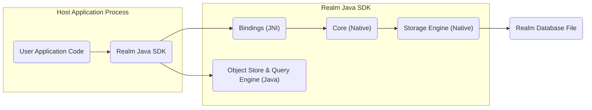

# Project Design Document: Realm Java (Improved for Threat Modeling)

**Version:** 1.1
**Date:** October 26, 2023
**Prepared By:** AI Software Architect

## 1. Introduction

This document provides an enhanced design overview of the Realm Java project, an open-source mobile database embedded directly within applications. The primary purpose of this document is to facilitate comprehensive threat modeling by clearly outlining the system's architecture, components, and data flow, with a strong emphasis on security-relevant aspects. This detailed description will serve as the foundation for identifying potential vulnerabilities and attack vectors.

## 2. Goals

The goals of this design document, specifically for threat modeling, are to:

*   Provide a clear and detailed architectural overview of Realm Java, highlighting components relevant to security.
*   Illustrate the data flow within Realm Java and its interactions with the host application, pinpointing potential data exposure points.
*   Explicitly identify key areas and components that represent potential attack surfaces and require focused security analysis.
*   Offer a foundational understanding of the system to enable effective and targeted threat modeling exercises.

## 3. Scope

This document focuses on the security-relevant aspects of the core Realm Java library's architecture and functionality. It includes:

*   The core components of the Realm Java library and their interactions.
*   The lifecycle of data within the Realm Java library, from storage to access.
*   Security features and considerations inherent in the library's design.
*   Interfaces between the Realm Java library and the host application.

This document does not cover:

*   Security implementations within specific host applications using Realm Java.
*   The Realm Object Server or other backend synchronization services, unless their interaction directly impacts the local Realm Java library's security.
*   Internal implementation details of the native Core library beyond their security implications.
*   Performance characteristics unrelated to security.

## 4. High-Level Architecture

The following diagram illustrates the primary components of Realm Java and their relationships within the application process.



*   **User Application Code:** The application code that utilizes the Realm Java SDK to manage and interact with data. This is the primary interface for developers.
*   **Realm Java SDK:** The Java library providing the API for developers to interact with the Realm database. It handles object mapping, query execution, and transaction management in the Java layer.
*   **Bindings (JNI):** The Java Native Interface layer responsible for communication between the Java SDK and the native Core library. This is a critical boundary for security considerations.
*   **Object Store & Query Engine (Java):**  The Java component within the SDK responsible for managing Realm object lifecycles, performing queries, and handling transactions at the Java level before interacting with the native layer.
*   **Core (Native):** The core database engine written in C++, responsible for low-level database operations, data integrity, and concurrency control.
*   **Storage Engine (Native):** The native component responsible for managing the persistent storage of the Realm database on disk.
*   **Realm Database File:** The file on the device's storage where the Realm database is persisted. This is the primary target for data-at-rest security.

## 5. Detailed Component Description (with Security Implications)

*   **User Application Code:**
    *   **Functionality:** Defines data models, performs CRUD operations on Realm objects, and handles data events.
    *   **Security Implications:** Vulnerabilities in application code (e.g., SQL injection-like flaws if constructing raw queries, insecure data handling) can compromise Realm data. Improper key management for encryption would also reside here.

*   **Realm Java SDK:**
    *   **Functionality:** Provides the high-level API, manages Realm instances, performs object mapping, and translates queries. Enforces schema.
    *   **Security Implications:** Bugs or vulnerabilities in the SDK could lead to data corruption, unauthorized access, or denial of service. Improper handling of encryption keys passed from the application is a risk.

*   **Bindings (JNI):**
    *   **Functionality:** Bridges the Java and native layers, marshaling data and invoking native functions.
    *   **Security Implications:** This is a critical security boundary. Vulnerabilities in the JNI layer could allow attackers to bypass Java security measures and directly interact with the native Core, potentially leading to memory corruption or arbitrary code execution.

*   **Object Store & Query Engine (Java):**
    *   **Functionality:** Manages the in-memory representation of Realm objects, optimizes queries, and coordinates transactions within the Java layer.
    *   **Security Implications:**  Vulnerabilities here could lead to data leaks or manipulation before data reaches the native layer. Improper handling of sensitive data in memory is a concern.

*   **Core (Native):**
    *   **Functionality:** Implements the core database logic, including transaction management, concurrency control, and data integrity.
    *   **Security Implications:**  Security vulnerabilities in the Core library (e.g., buffer overflows, race conditions) could have severe consequences, including data corruption, crashes, and potential for remote code execution if exploited.

*   **Storage Engine (Native):**
    *   **Functionality:** Manages the reading and writing of data to the persistent storage. Handles file locking and potentially encryption.
    *   **Security Implications:**  Vulnerabilities here could lead to data breaches (if encryption is not properly implemented or bypassed) or data corruption. Improper file access controls could also be exploited.

*   **Realm Database File:**
    *   **Functionality:** The persistent storage for all Realm data.
    *   **Security Implications:** The primary target for data-at-rest attacks. If not encrypted or if the encryption key is compromised, the entire database is exposed. File permissions and storage location are critical security considerations.

## 6. Data Flow (with Potential Threats)

The following diagram illustrates the flow of data during a typical read operation, highlighting potential threat points. Write operations follow a similar path in reverse.

```mermaid
graph LR
    subgraph "Host Application"
        A("User Application")
    end
    subgraph "Realm Java SDK"
        B("Realm Instance")
        C("Object Mapping")
        D("Query Builder")
    end
    subgraph "Core (Native)"
        E("Query Execution")
        F("Storage Engine")
    end
    G("Realm Database File")

    A -- "Read Request" --> B
    B -- "Query Definition" --> D
    D -- "Optimized Query" --> C
    C -- "JNI Call" --> E
    E -- "Data Retrieval" --> F
    F -- "Read Data" --> G
    G -- "Data" --> F
    F -- "Data" --> E
    E -- "JNI Return" --> C
    C -- "Populated Objects" --> B
    B -- "Data Response" --> A

    linkStyle 0,9 stroke:#000,stroke-width:2px;
    linkStyle 1,2,3,4,5,6,7,8 stroke:#aaa,stroke-width:1px;

    style A fill:#ccf,stroke:#333,stroke-width:2px
    style G fill:#eee,stroke:#333,stroke-width:2px

    subgraph "Potential Threat Points"
        direction down
        T1["Application Logic Flaws"]:::threat
        T2["SDK Vulnerabilities"]:::threat
        T3["JNI Boundary Exploits"]:::threat
        T4["Native Code Vulnerabilities"]:::threat
        T5["Data Breach (Unencrypted)"]:::threat
    end

    A -- "T1" --> T1
    B -- "T2" --> T2
    C -- "T3" --> T3
    E -- "T4" --> T4
    G -- "T5" --> T5

    classDef threat fill:#fdd,stroke:#f00,stroke-width:2px;
```

*   **User Application to Realm Instance (Read Request):**
    *   **Potential Threats (T1):** Application logic flaws could lead to unintended data access or exposure.

*   **Realm Instance to Query Builder (Query Definition):**
    *   **Potential Threats (T2):** Vulnerabilities in the SDK's query building logic could be exploited.

*   **Query Builder to Object Mapping (Optimized Query):**
    *   **Potential Threats (T2):**  SDK vulnerabilities could allow manipulation of the query.

*   **Object Mapping to Core (JNI Call):**
    *   **Potential Threats (T3):** Exploits at the JNI boundary could allow attackers to intercept or manipulate the query or data being passed.

*   **Core to Storage Engine (Data Retrieval):**
    *   **Potential Threats (T4):** Vulnerabilities in the native Core logic could be exploited during data retrieval.

*   **Storage Engine to Realm Database File (Read Data):**
    *   **Potential Threats (T5):** If the database file is not encrypted or encryption is weak, the data is vulnerable to unauthorized access.

*   **Realm Database File to Storage Engine (Data):**
    *   **Potential Threats (T5):**  Compromised storage or file system could lead to data breaches.

*   **Storage Engine to Core (Data):**
    *   **Potential Threats (T4):** Vulnerabilities in the native Core could be exploited to manipulate retrieved data.

*   **Core to Object Mapping (JNI Return):**
    *   **Potential Threats (T3):** Exploits at the JNI boundary could allow manipulation of the returned data.

*   **Object Mapping to Realm Instance (Populated Objects):**
    *   **Potential Threats (T2):** SDK vulnerabilities could lead to incorrect object population or data leakage.

*   **Realm Instance to User Application (Data Response):**
    *   **Potential Threats (T1):** Application logic flaws could lead to insecure handling or display of the retrieved data.

## 7. Security Considerations (Expanded)

This section details specific security considerations for Realm Java:

*   **Data at Rest Encryption:**
    *   **Consideration:** Realm Java offers database encryption using AES-256.
    *   **Threats:** If encryption is not enabled, the database file is readable by anyone with access to the device's storage. Weak or compromised encryption keys render encryption ineffective.
    *   **Mitigations:** Always enable encryption. Securely generate, store, and manage encryption keys (e.g., using Android Keystore). Avoid hardcoding keys.

*   **Data in Memory:**
    *   **Consideration:** Realm objects are held in memory while in use.
    *   **Threats:** Memory dumps or unauthorized memory access could expose sensitive data.
    *   **Mitigations:** Minimize the time sensitive data resides in memory. Follow secure coding practices to prevent memory leaks and buffer overflows.

*   **Authentication and Authorization:**
    *   **Consideration:** Realm Java itself does not provide user-level authentication or authorization within the local database.
    *   **Threats:** Any application with access to the Realm file can read and modify data.
    *   **Mitigations:** Implement application-level authentication and authorization mechanisms. Consider the security of the device itself.

*   **Input Validation:**
    *   **Consideration:** Data written to Realm should be validated.
    *   **Threats:** Malicious or malformed data could lead to unexpected behavior or data corruption.
    *   **Mitigations:** Implement robust input validation in the application code before writing data to Realm.

*   **Schema Migrations:**
    *   **Consideration:** Changes to the data model require migrations.
    *   **Threats:** Improperly handled migrations can lead to data loss or corruption.
    *   **Mitigations:** Thoroughly test schema migrations. Use Realm's migration API correctly.

*   **JNI Security:**
    *   **Consideration:** The JNI layer is a potential vulnerability point.
    *   **Threats:** Bugs in the JNI bindings could lead to memory corruption or other exploitable issues.
    *   **Mitigations:** Rely on the well-maintained JNI bindings provided by Realm. Keep the Realm library updated.

*   **Native Core Security:**
    *   **Consideration:** Security vulnerabilities in the underlying C++ Core library.
    *   **Threats:** Exploitable vulnerabilities in the native code.
    *   **Mitigations:** Stay updated with Realm releases to benefit from security patches. Follow responsible disclosure practices if vulnerabilities are found.

*   **File Permissions and Storage Location:**
    *   **Consideration:** The location and permissions of the Realm database file.
    *   **Threats:** If stored in a publicly accessible location or with overly permissive permissions, the database is vulnerable.
    *   **Mitigations:** Ensure the database file is stored in the application's private storage directory with appropriate permissions.

## 8. Deployment Considerations (with Security Implications)

Realm Java is typically deployed as an embedded library within a mobile application.

*   **Dependency Management:** The Realm Java SDK is included as a dependency. Ensure dependencies are from trusted sources to avoid supply chain attacks.
*   **Native Library Packaging:** The native Core library is bundled with the application. Ensure the integrity of these native libraries.
*   **Storage Location:** The default storage location is within the application's private data directory. Avoid changing this to a more public location.
*   **Encryption Key Provisioning:** Securely provisioning the encryption key to the application is crucial. Avoid embedding keys directly in the application code.

## 9. Key Technologies

*   **Java:** The primary language for the Realm Java SDK and typically the host application.
*   **C++:** The language used for the performance-critical Realm Core library.
*   **JNI (Java Native Interface):** The technology enabling communication between Java and native C++ code.

## 10. Assumptions and Constraints

*   This design document assumes a standard mobile application deployment scenario.
*   The focus is on the security of the local Realm database.
*   It is assumed that developers follow secure coding practices in their application code.
*   The document assumes the use of the official Realm Java SDK.

## 11. Future Considerations (Security Focused)

*   Detailed analysis of the attack surface presented by the JNI boundary.
*   Formal security audit of the native Core library.
*   Exploration of potential side-channel attacks on encrypted Realm databases.
*   Investigation of secure key management solutions for Realm encryption within different mobile environments.

This improved design document provides a more detailed and security-focused overview of Realm Java, intended to be a valuable resource for thorough and effective threat modeling activities.