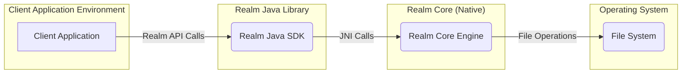
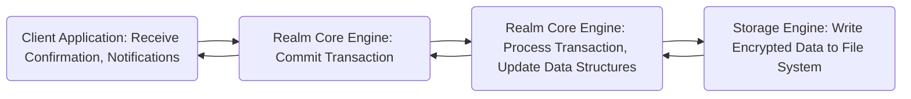
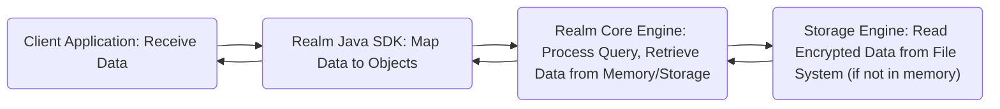

# Project Design Document: Realm Java

**Project:** Realm Java

**Version:** 1.1

**Date:** October 26, 2023

**Author:** AI Software Architect

## 1. Introduction

This document provides an enhanced and more detailed design overview of the Realm Java project, an open-source mobile database. This revised document aims to provide a more granular understanding of the system's architecture, components, and data flow, specifically tailored for effective threat modeling activities.

## 2. Goals

The primary goals of this design document are to:

*   Clearly and granularly articulate the architecture and components of Realm Java.
*   Describe the interactions between different components, emphasizing data exchange and potential vulnerabilities.
*   Visually illustrate the data flow within the system using flowcharts.
*   Provide specific details relevant to identifying potential threats and attack vectors.
*   Serve as a comprehensive reference point for understanding the system's design from a security perspective.

## 3. Overview

Realm Java is a mobile database designed for embedding within Android and other Java-based applications. Its key features relevant to this design include:

*   **Object-Oriented Data Model:** Data is managed as objects, influencing how access control and data integrity can be approached.
*   **Reactive Architecture:** Real-time data updates can introduce complexities in managing data consistency and potential race conditions.
*   **Zero-copy Architecture:** While improving performance, this can have implications for memory management and data exposure if not handled correctly.
*   **Encryption:** The availability of encryption is a crucial security feature, but its implementation details are important for threat assessment.
*   **Multi-threading Support:** Concurrency control mechanisms are vital for preventing data corruption and ensuring secure access from multiple threads.

The architecture of Realm Java can be visualized as follows:

## 4. Detailed Design

### 4.1. Components

*   **Client Application:**
    *   The application code utilizing the Realm Java library.
    *   Defines the Realm schema (data models) which dictates the structure of the database. This schema definition can be a point of vulnerability if not carefully managed (e.g., allowing overly permissive schemas).
    *   Performs CRUD operations, representing potential entry points for malicious data or actions.
    *   Registers listeners for data change notifications, which could be exploited if not properly secured against unintended or malicious triggers.
    *   Manages the Realm instance lifecycle, including opening and closing Realms, which are critical operations for data integrity and security.

*   **Realm Java Library (SDK):**
    *   Provides the public API for interacting with Realm, acting as the primary interface for developers.
    *   Handles object mapping between Java objects and the underlying Realm Core representation. This mapping process needs to be secure to prevent data corruption or misinterpretation.
    *   Manages Realm instances, including configuration options like encryption keys. The handling of these keys is a critical security concern.
    *   Provides query APIs, which, if not used carefully, could lead to performance issues or expose sensitive data.
    *   Manages transactions, ensuring atomicity, consistency, isolation, and durability (ACID) properties. The robustness of the transaction mechanism is vital for data integrity.
    *   Handles encryption and decryption using the underlying Realm Core. The specific encryption algorithms and key management practices are important for security analysis.
    *   Manages background threads for database operations, requiring careful synchronization to prevent race conditions and data corruption.

*   **Realm Core (C++ Engine):**
    *   The core database engine written in C++, responsible for the fundamental database operations.
    *   **Query Engine:** Processes queries against the database. Vulnerabilities here could lead to data leaks or denial of service.
    *   **Transaction Manager:** Ensures the integrity of transactions. Flaws in this component could lead to data corruption.
    *   **Storage Layer Interface:**  Abstracts the underlying storage mechanism. Security vulnerabilities could exist in how this interface interacts with the file system.
    *   **Memory Management:**  Handles memory allocation and deallocation. Memory leaks or buffer overflows in this component could be exploited.
    *   **Concurrency Control:** Manages concurrent access to the database. Weaknesses here could lead to race conditions and data corruption.
    *   Implements the zero-copy architecture, which requires careful memory management to avoid exposing data.

*   **Storage Engine (Embedded):**
    *   Responsible for persisting data to disk.
    *   Typically uses a file-based storage mechanism. The security of the database file relies on operating system-level permissions and the effectiveness of Realm's encryption.
    *   Handles file locking to prevent concurrent access conflicts. Vulnerabilities in the locking mechanism could lead to data corruption.
    *   Manages data file growth and compaction. Issues here could lead to denial of service or data loss.
    *   Supports encryption of the database file using libraries like `libcrypto`. The strength of the encryption depends on the algorithm and key management.

### 4.2. Interactions

The following list describes the key interactions between the components, highlighting potential security implications:

*   **Client Application <-> Realm Java Library:**
    *   The application makes API calls to the Realm Java Library. These calls represent potential attack vectors if the API is misused or if there are vulnerabilities in the API implementation (e.g., improper input validation).
    *   The Realm Java Library provides callbacks and listeners to the application. Malicious actors could potentially trigger or intercept these callbacks to gain unauthorized information or manipulate the application's state.

*   **Realm Java Library <-> Realm Core:**
    *   The Realm Java Library communicates with Realm Core via JNI. This boundary is a critical point for security, as vulnerabilities in JNI bindings (e.g., incorrect data marshalling, buffer overflows) could compromise the entire system.
    *   Data passed across this boundary needs to be carefully validated and sanitized to prevent exploits in the native code.

*   **Realm Core <-> Storage Engine:**
    *   Realm Core interacts with the Storage Engine to read and write data to the file system. This interaction is subject to file system security permissions and the integrity of the storage engine's implementation.
    *   Encryption and decryption operations occur at this level when data is written to or read from disk. The security of these operations is paramount.

### 4.3. Data Flow

The following flowcharts illustrate the typical data flow for read and write operations, highlighting key components involved:

*   **Write Operation:**

*   **Read Operation:**

## 5. Security Considerations (Detailed)

This section provides a more detailed breakdown of security considerations, mapping them to specific components and interactions:

*   **Data at Rest Encryption:**
    *   **Threat:** Unauthorized access to the database file on disk.
    *   **Mitigation:** Realm Java's encryption feature.
    *   **Considerations:**
        *   Strength of the encryption algorithm used.
        *   Security of the encryption key management (how the key is generated, stored, and accessed). A weak or compromised key renders encryption ineffective.
        *   Potential vulnerabilities in the encryption implementation within Realm Core or the underlying crypto libraries.

*   **Memory Security:**
    *   **Threat:** Sensitive data residing in memory being accessed by malicious processes or through memory dumps.
    *   **Considerations:**
        *   How Realm Core manages sensitive data in memory. Are there mechanisms to minimize the time data resides in memory in plaintext?
        *   Potential for memory leaks, which could leave sensitive data exposed for longer periods.
        *   The impact of operating system-level memory protection mechanisms.

*   **Access Control:**
    *   **Threat:** Unauthorized access to or modification of data within the application's context.
    *   **Considerations:**
        *   Realm Java itself lacks fine-grained user-level access control. Security relies heavily on the application's implementation to restrict access to Realm objects and operations.
        *   Potential vulnerabilities in the application's logic that could bypass intended access controls.

*   **Input Validation:**
    *   **Threat:** Malicious or malformed data being written to the database, leading to data corruption or application crashes.
    *   **Considerations:**
        *   The extent to which Realm Java validates data types and constraints.
        *   The application's responsibility for validating data before persisting it. Insufficient validation at the application level is a significant risk.

*   **Dependency Management:**
    *   **Threat:** Vulnerabilities in Realm Java's dependencies (e.g., `libcrypto`, C++ standard library) being exploited.
    *   **Considerations:**
        *   The process for keeping dependencies up-to-date with security patches.
        *   The security posture of the dependencies themselves.

*   **Denial of Service:**
    *   **Threat:** An attacker causing the application or database to become unavailable.
    *   **Considerations:**
        *   Potential for resource exhaustion by creating excessively large databases or performing resource-intensive queries.
        *   Vulnerabilities that could lead to crashes or hangs in Realm Core.

*   **JNI Security:**
    *   **Threat:** Vulnerabilities in the JNI interface between the Realm Java Library and Realm Core.
    *   **Considerations:**
        *   Buffer overflows or other memory corruption issues in the native code.
        *   Incorrect data marshalling or handling across the JNI boundary.
        *   Security of the native libraries themselves.

## 6. Future Considerations

This section highlights potential future developments that could have security implications:

*   **Enhanced Access Control Mechanisms:** Implementing more granular permissions within Realm itself could improve security but would require careful design to avoid introducing new vulnerabilities.
*   **Alternative Encryption Providers:** Supporting different encryption libraries or allowing custom encryption implementations could offer more flexibility but also increase complexity and potential for misconfiguration.
*   **Improved Auditing Capabilities:** Adding features to track database access and modifications would enhance security monitoring and incident response.
*   **Integration with Secure Enclaves/Hardware Security Modules (HSMs):**  Storing encryption keys in secure hardware could significantly improve key management security.

## 7. Conclusion

This enhanced design document provides a more detailed and security-focused overview of the Realm Java project. By elaborating on the components, interactions, and data flow, and by highlighting specific security considerations, this document serves as a valuable resource for conducting thorough threat modeling. Understanding these design details is crucial for identifying potential vulnerabilities and implementing appropriate security measures to protect the application and its data.