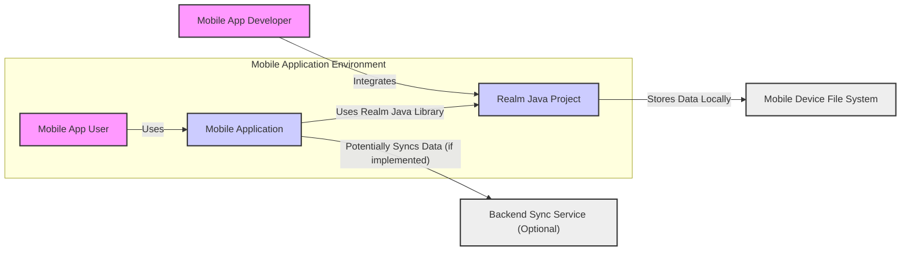
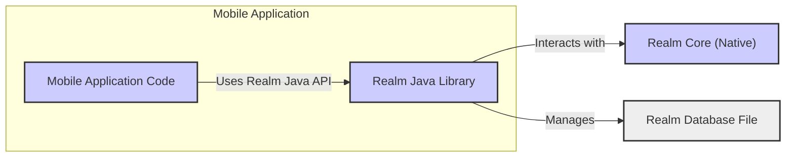
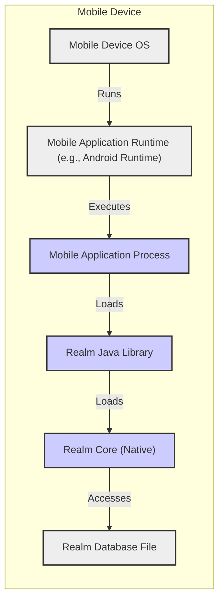
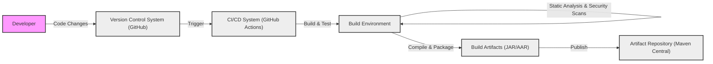

# BUSINESS POSTURE

This project, Realm Java, provides a mobile database solution for Java and Android developers. It aims to simplify local data persistence and management in mobile applications, offering features like object-relational mapping, data synchronization, and offline capabilities.

Business Priorities:
- Ease of Use:  Realm Java should be straightforward for developers to integrate and use in their mobile applications.
- Performance: The database should offer high performance for mobile devices, ensuring quick data access and minimal impact on application responsiveness.
- Reliability: Realm Java must be reliable and stable, ensuring data integrity and preventing data loss or corruption.
- Feature Richness:  Provide a comprehensive set of features that meet the needs of modern mobile application development, including data modeling, querying, and synchronization.
- Community Support: Foster a strong community around Realm Java to encourage adoption, provide support, and drive future development.

Business Goals:
- Increase adoption of Realm Java among mobile developers.
- Establish Realm as a leading mobile database solution in the Java and Android ecosystem.
- Expand the Realm ecosystem by integrating with other relevant technologies and platforms.
- Generate revenue through enterprise support, cloud services, or other monetization strategies (if applicable, though not explicitly stated in the repository).

Business Risks:
- Data breaches due to vulnerabilities in Realm Java or its integration.
- Data integrity issues leading to data corruption or loss.
- Performance bottlenecks impacting application user experience.
- Lack of developer adoption due to complexity, bugs, or missing features.
- Security vulnerabilities exploited by malicious actors to compromise applications using Realm Java.
- Dependency on external libraries or components that may introduce security risks or instability.
- Open-source nature may lead to slower response times for critical security issues compared to commercial solutions.

# SECURITY POSTURE

Security Controls:
- security control: Code Reviews: The project is hosted on GitHub, suggesting that code reviews are likely part of the development process, although not explicitly stated in the repository. Implementation location: GitHub Pull Requests.
- security control: Open Source: Being open source allows for community scrutiny and potential identification of security vulnerabilities. Implementation location: GitHub Repository.
- security control: Issue Tracking: GitHub Issues are used for bug reporting and feature requests, which can include security-related issues. Implementation location: GitHub Issues.

Accepted Risks:
- accepted risk: Reliance on community contributions for security vulnerability identification and patching.
- accepted risk: Potential delays in security patch releases due to the open-source development model.
- accepted risk: Vulnerabilities in dependencies that are not immediately identified or addressed.
- accepted risk: Security misconfigurations by developers using Realm Java in their applications.

Recommended Security Controls:
- security control: Automated Security Scanning: Implement automated static application security testing (SAST) and dependency scanning in the CI/CD pipeline to identify potential vulnerabilities early in the development process.
- security control: Penetration Testing: Conduct regular penetration testing or security audits by external security experts to identify and address security weaknesses.
- security control: Security Champions: Designate security champions within the development team to promote security awareness and best practices.
- security control: Security Training: Provide security training to developers and contributors on secure coding practices and common mobile security threats.
- security control: Vulnerability Disclosure Policy: Establish a clear vulnerability disclosure policy to guide security researchers and users on how to report security issues responsibly.
- security control: Incident Response Plan: Develop an incident response plan to handle security incidents effectively and minimize their impact.

Security Requirements:
- Authentication:
    - Requirement: Realm Java itself does not handle user authentication directly, as it is a local database. Applications using Realm Java are responsible for implementing their own authentication mechanisms to control access to the application and its features.
    - Requirement: Consider integration with device-level authentication mechanisms (e.g., biometrics, device lock) for enhanced security of locally stored data.
- Authorization:
    - Requirement: Realm Java should provide mechanisms for fine-grained access control to data within the database. This may involve defining roles and permissions to restrict access to specific data objects or fields based on user roles or application logic.
    - Requirement: Ensure that default configurations are secure and do not grant excessive permissions.
- Input Validation:
    - Requirement: Realm Java should perform input validation to prevent injection attacks and data corruption. This includes validating data types, formats, and ranges before storing data in the database.
    - Requirement: Applications using Realm Java should also implement input validation at the application level to sanitize user inputs before passing them to Realm Java.
- Cryptography:
    - Requirement: Data at Rest Encryption: Realm Java should provide built-in support for encrypting data at rest to protect sensitive information stored locally on the device. This encryption should be robust and use industry-standard encryption algorithms.
    - Requirement: Data in Transit Encryption: If Realm Java supports data synchronization with a backend service, ensure that data in transit is encrypted using secure protocols such as TLS/SSL.
    - Requirement: Secure Key Management: Implement secure key management practices for encryption keys, ensuring that keys are stored securely and are not easily accessible to unauthorized users or processes.

# DESIGN

## C4 CONTEXT

Context Diagram Elements:

- Element:
    - Name: Mobile App User
    - Type: Person
    - Description: End-user who interacts with the mobile application that utilizes Realm Java.
    - Responsibilities: Uses the mobile application to perform tasks, generate data, and consume information.
    - Security controls: Device-level security controls (passcode, biometrics), application-level authentication (if implemented by the mobile application).

- Element:
    - Name: Mobile Application
    - Type: Software System
    - Description: The mobile application developed by developers that integrates the Realm Java library to manage local data.
    - Responsibilities: Provides user interface, application logic, data processing, and utilizes Realm Java for data persistence.
    - Security controls: Application-level authentication, authorization, input validation, secure coding practices, integration with OS security features.

- Element:
    - Name: Realm Java Project
    - Type: Software System
    - Description: The Realm Java library itself, which is the focus of this design document. It provides the database functionality for mobile applications.
    - Responsibilities: Provides APIs for data modeling, querying, persistence, and synchronization (if applicable). Manages local database files.
    - Security controls: Data at rest encryption, access control mechanisms within the library, input validation within the library, secure coding practices in the library development.

- Element:
    - Name: Mobile Device File System
    - Type: External System
    - Description: The local file system on the mobile device where Realm Java stores the database files.
    - Responsibilities: Provides storage space for the Realm database.
    - Security controls: Operating system level file system permissions, device encryption, physical security of the mobile device.

- Element:
    - Name: Backend Sync Service (Optional)
    - Type: External System
    - Description: An optional backend service that the mobile application might use to synchronize data stored in Realm Java with a remote server. This is not part of Realm Java itself but is a potential integration point.
    - Responsibilities: Stores and manages synchronized data, handles data conflicts, provides data access for multiple users or devices.
    - Security controls: Server-side authentication, authorization, data in transit encryption (TLS/SSL), data at rest encryption, access control to backend data.

- Element:
    - Name: Mobile App Developer
    - Type: Person
    - Description: Developers who use the Realm Java library to build mobile applications.
    - Responsibilities: Integrates Realm Java into mobile applications, designs data models, writes application code, configures Realm Java.
    - Security controls: Secure development practices, code reviews, security testing of applications using Realm Java.

## C4 CONTAINER

Container Diagram Elements:

- Element:
    - Name: Mobile Application Code
    - Type: Application
    - Description: The application code written by mobile developers, typically in Java or Kotlin for Android, that utilizes the Realm Java library.
    - Responsibilities: Implements application logic, user interface, and interacts with the Realm Java API to perform database operations.
    - Security controls: Application-level authentication, authorization, input validation, secure coding practices.

- Element:
    - Name: Realm Java Library
    - Type: Library
    - Description: The Realm Java library, providing the Java API for interacting with the underlying Realm database engine. This is a managed component, likely written in Java.
    - Responsibilities: Exposes Java APIs for data modeling, querying, persistence, and synchronization. Bridges the gap between Java application code and the native Realm Core. Implements data at rest encryption, access control mechanisms.
    - Security controls: API access control, input validation within the library, secure coding practices in library development, data at rest encryption.

- Element:
    - Name: Realm Core (Native)
    - Type: Native Library
    - Description: The core database engine of Realm, likely written in C++ for performance and cross-platform compatibility. This handles the low-level database operations and storage management.
    - Responsibilities: Manages database files, performs data storage and retrieval operations, handles indexing and query execution.
    - Security controls: Low-level memory management, protection against buffer overflows and other native code vulnerabilities, implementation of core encryption and access control functionalities.

- Element:
    - Name: Realm Database File
    - Type: Data Store
    - Description: The file on the mobile device's file system where Realm Java stores the persistent database.
    - Responsibilities: Stores the application data persistently on the device.
    - Security controls: Data at rest encryption (implemented by Realm Java Library and Core), file system permissions managed by the operating system.

## DEPLOYMENT

Deployment Architecture: Standalone Mobile Application Deployment

Deployment Diagram Elements:

- Element:
    - Name: Mobile Device OS
    - Type: Infrastructure
    - Description: The operating system of the mobile device (e.g., Android, iOS).
    - Responsibilities: Provides the underlying platform for running applications, manages file system, provides security features.
    - Security controls: Device encryption, operating system level security patches, application sandboxing, permission management.

- Element:
    - Name: Mobile Application Runtime (e.g., Android Runtime)
    - Type: Infrastructure
    - Description: The runtime environment that executes mobile applications (e.g., Android Runtime on Android).
    - Responsibilities: Provides execution environment for applications, manages resources, enforces security policies.
    - Security controls: Application sandboxing, runtime permissions, memory management.

- Element:
    - Name: Mobile Application Process
    - Type: Container Instance
    - Description: The process in which the mobile application is running.
    - Responsibilities: Executes application code, manages application resources, interacts with Realm Java library.
    - Security controls: Process isolation, application-level security controls.

- Element:
    - Name: Realm Java Library
    - Type: Container Instance
    - Description: The instance of the Realm Java library loaded within the mobile application process.
    - Responsibilities: Provides database functionalities to the application.
    - Security controls: Library-level security controls (encryption, access control).

- Element:
    - Name: Realm Core (Native)
    - Type: Container Instance
    - Description: The instance of the native Realm Core library loaded by the Realm Java library.
    - Responsibilities: Handles low-level database operations.
    - Security controls: Native code security controls, memory management.

- Element:
    - Name: Realm Database File
    - Type: Data Store Instance
    - Description: The instance of the Realm database file stored on the mobile device's file system.
    - Responsibilities: Persistently stores application data.
    - Security controls: Data at rest encryption, file system permissions.

## BUILD

Build Process Description:

1. Developer: Developers write code, fix bugs, and add features for Realm Java.
2. Version Control System (GitHub): Code changes are committed and pushed to the GitHub repository, which acts as the version control system.
3. CI/CD System (GitHub Actions): GitHub Actions is used as the CI/CD system. Pushing code changes to the repository triggers automated build pipelines defined in GitHub Actions workflows.
4. Build Environment: A dedicated build environment is set up by GitHub Actions. This environment includes necessary tools like Java SDK, Android SDK, Gradle, and potentially native build tools.
5. Build & Test: The build process involves compiling Java and potentially native code, running unit tests and integration tests to ensure code quality and functionality.
6. Static Analysis & Security Scans: Static analysis tools (e.g., linters, SAST scanners) are integrated into the build pipeline to automatically check the code for potential bugs, code style violations, and security vulnerabilities. Dependency scanning is also performed to identify vulnerable dependencies.
7. Compile & Package: If tests and security scans pass, the code is compiled and packaged into build artifacts, typically JAR (Java Archive) and AAR (Android Archive) files for Realm Java.
8. Artifact Repository (Maven Central): The build artifacts are published to an artifact repository like Maven Central, making them available for developers to download and use in their projects.

Build Security Controls:
- security control: Secure Build Environment: Using a clean and controlled build environment provided by GitHub Actions reduces the risk of build contamination.
- security control: Automated Build Process: Automation through GitHub Actions ensures consistency and repeatability of the build process, reducing manual errors.
- security control: Static Application Security Testing (SAST): Integration of SAST tools in the build pipeline helps identify potential security vulnerabilities in the code before release.
- security control: Dependency Scanning: Automated dependency scanning tools check for known vulnerabilities in third-party libraries used by Realm Java.
- security control: Code Signing: Build artifacts are likely signed to ensure integrity and authenticity, although this needs to be confirmed by examining the build process details.
- security control: Access Control to Build System: Access to the GitHub repository and GitHub Actions workflows should be restricted to authorized personnel to prevent unauthorized modifications to the build process.
- security control: Build Artifact Integrity: Publishing to a trusted artifact repository like Maven Central helps ensure the integrity and authenticity of the released artifacts.

# RISK ASSESSMENT

Critical Business Processes:
- Providing reliable and performant local data storage for mobile applications.
- Ensuring data integrity and preventing data loss or corruption in mobile applications using Realm Java.
- Maintaining developer trust and adoption of Realm Java as a secure and dependable mobile database solution.

Data to Protect:
- Source code of Realm Java: Sensitivity: High (Confidentiality, Integrity, Availability). Compromise could lead to vulnerabilities in the library itself.
- Build artifacts (JAR/AAR): Sensitivity: High (Integrity, Availability). Compromised artifacts could introduce vulnerabilities into applications using Realm Java.
- User data stored in Realm databases by applications: Sensitivity: Varies (Confidentiality, Integrity, Availability). Sensitivity depends on the type of data stored by applications using Realm Java. Could range from low (application settings) to high (personal identifiable information, financial data).
- Intellectual property and proprietary algorithms within Realm Java: Sensitivity: High (Confidentiality, Integrity).

Data Sensitivity Levels:
- Public: Realm Java source code (open source).
- Internal: Build process details, internal documentation, issue tracker information.
- Confidential: Potential proprietary algorithms, security vulnerability details before public disclosure, user data stored by applications (sensitivity depends on application context).

# QUESTIONS & ASSUMPTIONS

BUSINESS POSTURE:
- Question: What is the monetization strategy for Realm Java? Is it purely open source, or are there enterprise support or cloud service offerings?
- Assumption: Realm Java is primarily an open-source project focused on community adoption and developer satisfaction, potentially with future monetization through related services or enterprise support.
- Question: What is the target audience for Realm Java? Is it all mobile developers, or are there specific segments or industries being targeted?
- Assumption: The target audience is broad, encompassing Java and Android mobile developers across various industries and application types.

SECURITY POSTURE:
- Question: Is there a formal security audit history for Realm Java? Are there reports available?
- Assumption: While not explicitly stated, it is assumed that some level of security review and testing has been conducted, but the extent and formality are unknown without further investigation.
- Question: What is the process for handling security vulnerabilities? Is there a dedicated security team or point of contact? What is the typical response time for security issues?
- Assumption: Security vulnerabilities are likely handled through the open-source community and maintainers, with response times potentially varying depending on the severity and community engagement. A formal vulnerability disclosure policy would be beneficial.
- Question: Is data at rest encryption enabled by default in Realm Java, or is it a configurable option? What encryption algorithms are used?
- Assumption: Data at rest encryption is likely a configurable option, and it is assumed that industry-standard encryption algorithms are used. Details need to be verified in the documentation.

DESIGN:
- Question: What specific access control mechanisms are implemented within Realm Java to manage data access within an application?
- Assumption: Realm Java provides some level of access control, potentially through roles or permissions, but the granularity and features need to be examined in the documentation.
- Question: How does Realm Java handle data synchronization, if supported? What security protocols are used for data in transit during synchronization?
- Assumption: If data synchronization is supported, it is assumed that secure protocols like TLS/SSL are used for data in transit. The details of synchronization mechanisms need to be investigated.
- Question: What are the dependencies of Realm Java, and how are they managed and updated?
- Assumption: Realm Java likely has dependencies on other libraries, and dependency management is handled through standard build tools like Gradle. Dependency updates and security patching processes need to be verified.
- Question: Is there integration with device-level security features like Android Keystore for secure key management?
- Assumption: Integration with device-level security features for key management would be a strong security control, and it is assumed that Realm Java may leverage such features, but this needs to be confirmed.