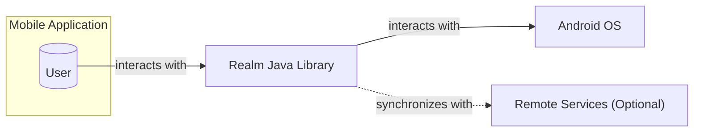
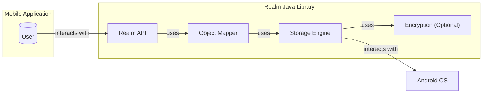
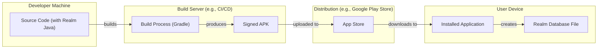
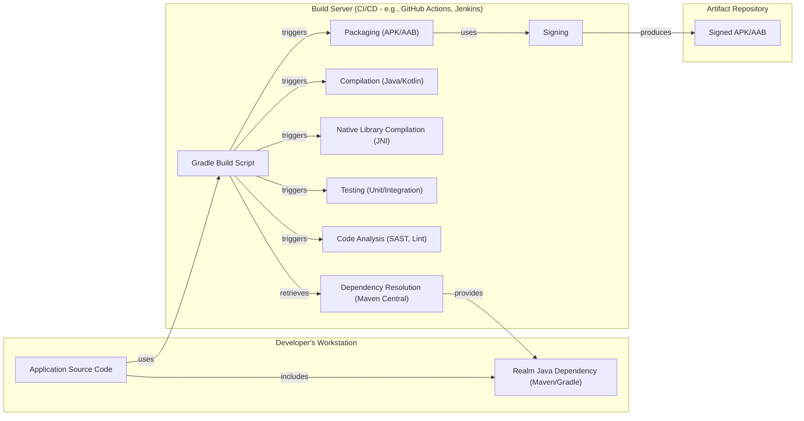

Okay, let's create a design document for the Realm Java library.

# BUSINESS POSTURE

Realm Java is a client-side, offline-first, object database that aims to simplify and speed up mobile application development. It's an alternative to SQLite and Core Data.

Priorities:

*   Performance: Fast data access and persistence are crucial for a smooth user experience.
*   Ease of Use: Simple API for developers to integrate and use.
*   Reliability: Data integrity and consistency are paramount.
*   Cross-Platform Compatibility: While this document focuses on Java, the broader Realm ecosystem supports multiple platforms.
*   Offline Functionality: Enable applications to function seamlessly without a network connection.
*   Security: Protect sensitive data stored within the database.

Goals:

*   Provide a fast and efficient local database solution for Android and Java applications.
*   Reduce development time and complexity compared to traditional database solutions.
*   Offer a robust and reliable data persistence mechanism.
*   Enable offline-first application architectures.

Business Risks:

*   Data Loss or Corruption: Bugs in the library could lead to data loss or corruption, severely impacting applications relying on Realm.
*   Security Vulnerabilities: Exploitable vulnerabilities could expose sensitive user data.
*   Performance Bottlenecks: Inefficient data handling could lead to performance issues in applications, especially with large datasets.
*   Compatibility Issues: Changes in the Android ecosystem or Java versions could lead to compatibility problems.
*   Competition: Other database solutions (both local and cloud-based) pose a competitive threat.
*   Lack of Adoption: If developers don't adopt Realm, the project's long-term viability is at risk.

# SECURITY POSTURE

Existing Security Controls:

*   security control: Encryption at Rest: Realm supports AES-256 encryption to protect data stored on disk. This is configurable by the developer. Described in documentation and implemented in core database.
*   security control: Access Control: Realm's object-oriented nature implicitly provides some level of access control, as developers interact with data through defined object models. Implemented in Java API.
*   security control: Code Obfuscation: ProGuard/R8 can be used to obfuscate the application code, making reverse engineering more difficult (though this is a general Android security practice, not specific to Realm). Implemented during build process.
*   security control: Sandboxing: Android's application sandboxing provides a layer of isolation, preventing unauthorized access to Realm files from other applications. Implemented by Android OS.

Accepted Risks:

*   accepted risk: Lack of Fine-Grained Permissions: Realm does not offer built-in, fine-grained (e.g., row-level or column-level) access control mechanisms. Developers are responsible for implementing such controls within their application logic.
*   accepted risk: Dependency Vulnerabilities: Realm relies on third-party libraries, which could potentially introduce vulnerabilities.
*   accepted risk: Rooted Device Risk: On a rooted device, the application sandbox can be bypassed, potentially exposing the Realm database file.

Recommended Security Controls:

*   security control: Input Validation: Thoroughly validate all data before storing it in Realm to prevent injection attacks or data corruption.
*   security control: Secure Key Management: If encryption is used, securely manage the encryption key. Avoid hardcoding keys and consider using the Android Keystore system.
*   security control: Regular Security Audits: Conduct regular security audits and penetration testing of applications using Realm.
*   security control: Dependency Scanning: Regularly scan dependencies for known vulnerabilities.
*   security control: Tamper Detection: Implement mechanisms to detect if the Realm file has been tampered with.

Security Requirements:

*   Authentication: Not directly applicable to the Realm library itself, as it's a local database. Authentication is the responsibility of the application using Realm.
*   Authorization: Implement application-level authorization logic to control access to data within Realm. Realm itself does not provide granular authorization mechanisms.
*   Input Validation: Sanitize and validate all data before writing it to the Realm database. This is crucial to prevent various injection vulnerabilities and ensure data integrity.
*   Cryptography:
    *   Utilize Realm's built-in encryption feature (AES-256) to protect data at rest.
    *   Securely manage the encryption key, leveraging platform-specific secure storage mechanisms (e.g., Android Keystore).
    *   Consider additional encryption for highly sensitive data fields within the application logic.

# DESIGN

## C4 CONTEXT

Element Descriptions:

*   Element:
    *   Name: User
    *   Type: Person
    *   Description: The end-user of the mobile application.
    *   Responsibilities: Interacts with the application's UI, provides input, and views data.
    *   Security Controls: Relies on application-level authentication and authorization.

*   Element:
    *   Name: Realm Java Library
    *   Type: Software System
    *   Description: The embedded object database library.
    *   Responsibilities: Provides data persistence, querying, and management within the application.
    *   Security Controls: Encryption at rest (AES-256), basic access control through object models.

*   Element:
    *   Name: Android OS
    *   Type: Software System
    *   Description: The underlying operating system.
    *   Responsibilities: Provides file system access, memory management, and application sandboxing.
    *   Security Controls: Application sandboxing, file system permissions.

*   Element:
    *   Name: Remote Services (Optional)
    *   Type: Software System
    *   Description: External services (e.g., cloud synchronization) that the application might interact with.
    *   Responsibilities: Data synchronization, backup, or other remote functionalities.
    *   Security Controls: Dependent on the specific service (e.g., TLS, authentication, authorization). This is outside the scope of the Realm Java library itself.

## C4 CONTAINER

Element Descriptions:

*   Element:
    *   Name: User
    *   Type: Person
    *   Description: The end-user of the mobile application.
    *   Responsibilities: Interacts with the application's UI, provides input, and views data.
    *   Security Controls: Relies on application-level authentication and authorization.

*   Element:
    *   Name: Realm API
    *   Type: Container
    *   Description: The public interface for developers to interact with Realm.
    *   Responsibilities: Provides methods for creating, reading, updating, and deleting data (CRUD operations), querying, and managing transactions.
    *   Security Controls: Basic access control through object models.

*   Element:
    *   Name: Object Mapper
    *   Type: Container
    *   Description: Maps Java objects to the underlying database representation.
    *   Responsibilities: Translates between object-oriented data and the database schema.
    *   Security Controls: Enforces data type constraints defined in the object models.

*   Element:
    *   Name: Storage Engine
    *   Type: Container
    *   Description: Handles the low-level data storage and retrieval.
    *   Responsibilities: Manages data persistence, indexing, and query execution.
    *   Security Controls: None directly, relies on Encryption container and Android OS.

*   Element:
    *   Name: Encryption (Optional)
    *   Type: Container
    *   Description: Provides encryption and decryption of data.
    *   Responsibilities: Encrypts data before writing to disk and decrypts data when reading from disk.
    *   Security Controls: AES-256 encryption.

*   Element:
    *   Name: Android OS
    *   Type: Software System
    *   Description: The underlying operating system.
    *   Responsibilities: Provides file system access, memory management, and application sandboxing.
    *   Security Controls: Application sandboxing, file system permissions.

## DEPLOYMENT

Realm Java is a library, not a standalone application. Therefore, deployment is integrated into the application's deployment process.

Possible Deployment Solutions:

1.  **Standard Android Application Package (APK):** The most common deployment method. Realm Java is bundled within the APK.
2.  **Android App Bundle (AAB):** A more modern approach that allows Google Play to optimize the APK for different device configurations. Realm Java is included in the AAB.
3.  **Dynamic Feature Modules:** Realm Java could be included within a dynamic feature module, allowing it to be downloaded on demand.

Chosen Solution (Standard Android Application Package - APK):

Element Descriptions:

*   Element:
    *   Name: Source Code (with Realm Java)
    *   Type: Code
    *   Description: The application's source code, including the Realm Java library as a dependency.
    *   Responsibilities: Contains the application logic and data models.
    *   Security Controls: Code reviews, static analysis.

*   Element:
    *   Name: Build Process (Gradle)
    *   Type: Process
    *   Description: The Android build process using Gradle.
    *   Responsibilities: Compiles the code, packages resources, and creates the APK.
    *   Security Controls: Dependency scanning, code obfuscation (ProGuard/R8).

*   Element:
    *   Name: Signed APK
    *   Type: Artifact
    *   Description: The digitally signed Android application package.
    *   Responsibilities: Represents the deployable unit of the application.
    *   Security Controls: Digital signature verification.

*   Element:
    *   Name: App Store
    *   Type: Platform
    *   Description: The distribution platform (e.g., Google Play Store).
    *   Responsibilities: Hosts the application and makes it available for download.
    *   Security Controls: App store security checks, malware scanning.

*   Element:
    *   Name: Installed Application
    *   Type: Application
    *   Description: The application installed on the user's device.
    *   Responsibilities: Runs the application logic and interacts with the Realm database.
    *   Security Controls: Android application sandboxing.

*   Element:
    *   Name: Realm Database File
    *   Type: File
    *   Description: The physical file containing the Realm database.
    *   Responsibilities: Stores the application's data.
    *   Security Controls: Encryption at rest (if enabled), file system permissions (managed by Android).

## BUILD

The Realm Java library itself has a complex build process, involving multiple modules and native code compilation.  However, from the perspective of an *application* using Realm Java, the build process is simplified by using Gradle.

Security Controls in the Build Process:

*   **Dependency Management (Maven/Gradle):** Realm Java is typically included as a dependency using Maven or Gradle. This simplifies version management and ensures that the correct library version is used.
*   **Dependency Scanning:** Tools like OWASP Dependency-Check can be integrated into the build process to scan for known vulnerabilities in dependencies, including Realm Java and its transitive dependencies.
*   **Static Application Security Testing (SAST):** Tools like FindBugs, PMD, or SonarQube can be used to analyze the application code for potential security vulnerabilities.
*   **Linting:** Android Lint can identify potential issues in the Android-specific code, including security-related problems.
*   **Code Obfuscation (ProGuard/R8):** This makes reverse engineering of the application code more difficult.
*   **Signing:** The APK/AAB is digitally signed, ensuring the integrity and authenticity of the application.
*   **Automated Build System (CI/CD):** Using a CI/CD system (e.g., GitHub Actions, Jenkins) ensures that the build process is consistent and repeatable, and that security checks are performed automatically.
*   **Supply Chain Security**: Realm publishes checksums and signatures for their releases. Developers should verify these to ensure the integrity of the downloaded library.

# RISK ASSESSMENT

Critical Business Processes:

*   **Data Persistence:** Storing and retrieving application data reliably.
*   **Offline Functionality:** Enabling the application to work without a network connection.
*   **Data Synchronization (if applicable):** Keeping data consistent between the local database and any remote services.

Data Sensitivity:

The sensitivity of the data stored in Realm depends entirely on the application using it. Realm itself is a general-purpose database and can store any type of data. Therefore, the data sensitivity can range from:

*   **Low:** Non-sensitive configuration data, cached content.
*   **Medium:** User preferences, application state.
*   **High:** Personally Identifiable Information (PII), financial data, health data, authentication tokens.

It is crucial for developers to assess the sensitivity of the data they are storing in Realm and implement appropriate security measures (e.g., encryption, access controls) accordingly.

# QUESTIONS & ASSUMPTIONS

Questions:

*   What specific types of data will be stored in Realm by applications using this library? (This is crucial for determining the appropriate security measures.)
*   Will Realm Java be used in conjunction with Realm Sync (or other synchronization mechanisms)? If so, what are the security implications of the synchronization process?
*   Are there any specific regulatory requirements (e.g., GDPR, HIPAA) that apply to applications using Realm Java?
*   What is the expected size and complexity of the Realm databases used by applications? (This can impact performance and resource usage.)
*   What level of rooted device detection/prevention is required or desired?

Assumptions:

*   BUSINESS POSTURE: We assume that the primary users of Realm Java are Android and Java developers building mobile applications.
*   SECURITY POSTURE: We assume that developers will follow secure coding practices and implement appropriate security measures within their applications. We assume that encryption will be used for sensitive data.
*   DESIGN: We assume that the basic architecture of Realm Java, as described in the documentation, is accurate. We assume that Gradle will be the primary build system used by applications integrating Realm Java. We assume that most applications will be deployed as standard APKs.