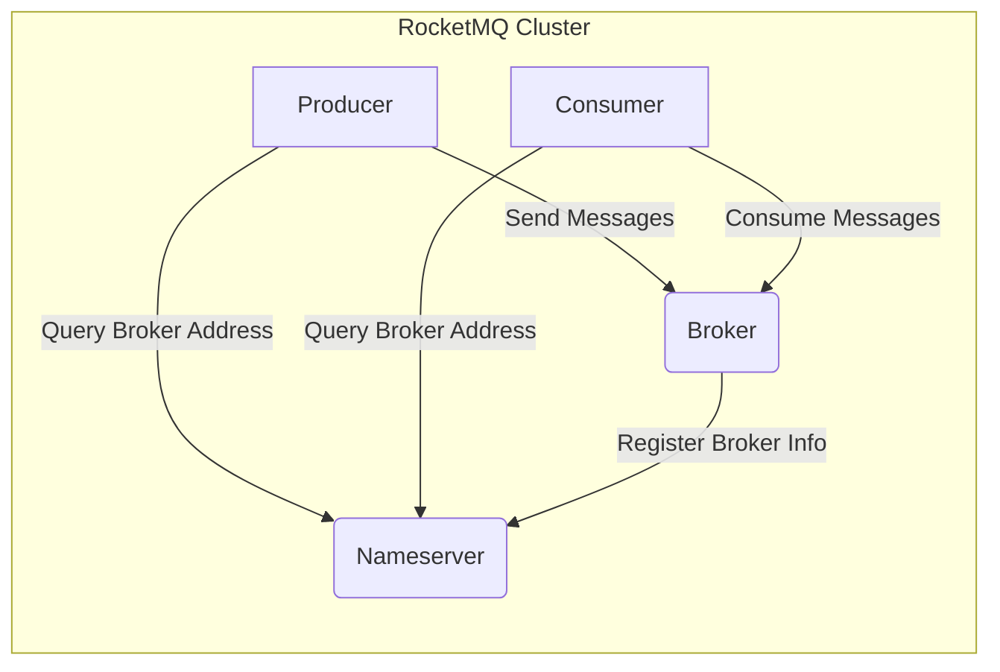
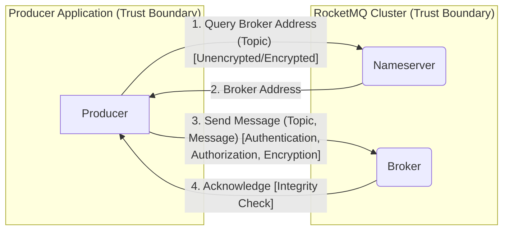
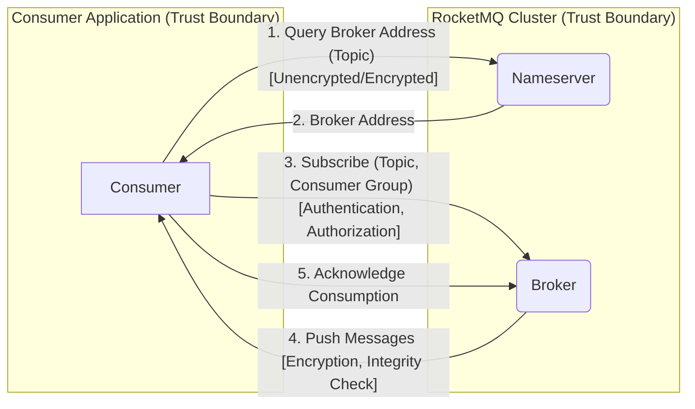

# Project Design Document: Apache RocketMQ (Improved)

**Version:** 1.1
**Date:** October 26, 2023
**Author:** AI Software Architect

## 1. Introduction

This document provides an enhanced architectural design of Apache RocketMQ, an open-source distributed messaging and streaming platform. This design document is specifically created to facilitate future threat modeling activities by clearly outlining the system's components, interactions, and data flows, with a stronger emphasis on security considerations. The information presented here is based on the publicly available information and source code of the Apache RocketMQ project found at [https://github.com/apache/rocketmq](https://github.com/apache/rocketmq).

## 2. Goals and Objectives

The primary goals of Apache RocketMQ are to provide:

*   **High Reliability:** Ensuring message delivery even in the face of hardware failures or network issues.
*   **High Throughput:**  Handling a large volume of messages with low latency.
*   **Scalability:**  Easily scaling the system horizontally to accommodate increasing message loads.
*   **Order Messaging:**  Guaranteeing message delivery order within a partition.
*   **Rich Message Model:** Supporting various message types and delivery semantics.
*   **Easy Integration:** Providing client libraries for various programming languages.
*   **Security:** Protecting message data and system integrity against unauthorized access and manipulation.

This design document aims to clearly articulate the architecture that enables these goals, with a particular focus on aspects relevant to security considerations and potential threats.

## 3. High-Level Architecture

Apache RocketMQ follows a distributed architecture with several key components working together.

*   **Nameserver:**  Provides lightweight service discovery for Brokers. Producers and Consumers query the Nameserver to find the addresses of Brokers.
*   **Broker:**  Responsible for storing and delivering messages. It receives messages from Producers and delivers them to Consumers. Brokers can be deployed in a master-slave or Dledger configuration for high availability and data replication.
*   **Producer:**  An application that sends messages to the Broker.
*   **Consumer:**  An application that receives messages from the Broker.
*   **Message:** The fundamental unit of data transmitted through the system. Contains headers and a body.
*   **Topic:** A logical grouping of messages.
*   **Queue (Message Queue):** A physical storage unit within a Broker for messages belonging to a specific topic. Messages within a queue are ordered.
*   **Consumer Group:** A logical grouping of Consumers that subscribe to the same topic. Consumers within a group typically share the message load.

## 4. Component Details

This section provides a more detailed description of each key component, highlighting aspects relevant to security and potential vulnerabilities.

### 4.1. Nameserver

*   **Functionality:**
    *   Maintains a registry of active Brokers and their metadata (e.g., addresses, topic information, health status).
    *   Provides service discovery for Producers and Consumers, enabling them to locate available Brokers.
    *   Performs basic health checks on Brokers by monitoring heartbeats.
    *   Manages topic and route information.
*   **Key Interactions:**
    *   Brokers register their network address and metadata with the Nameserver upon startup and periodically send heartbeats (typically via TCP).
    *   Producers and Consumers query the Nameserver (typically via TCP) to obtain a list of available Brokers for a specific topic.
    *   Management tools may interact with the Nameserver to manage topics and brokers.
*   **Security Considerations:**
    *   **Access Control:**  How is access to the Nameserver controlled? Who can register Brokers? Who can query Broker information?  Lack of proper access control could allow unauthorized registration of malicious brokers or information leaks.
    *   **Data Integrity:** How is the integrity of the Broker registry maintained? Can malicious actors inject false Broker information, leading Producers and Consumers to connect to rogue brokers?
    *   **Availability:**  The Nameserver is a critical component. How is its availability ensured? A denial-of-service attack on the Nameserver could disrupt the entire messaging system.
    *   **Authentication:** Does the Nameserver authenticate Brokers attempting to register?  Without authentication, any entity could impersonate a legitimate Broker.
    *   **Authorization:** Is there authorization in place to control which entities can query broker information or manage topics?
    *   **Communication Security:** Is the communication between Brokers and the Nameserver, and between clients and the Nameserver, secured (e.g., using TLS)? Unencrypted communication could expose sensitive information.

### 4.2. Broker

*   **Functionality:**
    *   Receives messages from Producers.
    *   Stores messages persistently in local files (typically using a combination of commitlog and consume queue files).
    *   Delivers messages to Consumers based on their subscriptions and consumer group.
    *   Manages message queues and consumer offsets, tracking which messages have been consumed by which groups.
    *   Supports various message filtering mechanisms (e.g., tag-based filtering, SQL-based filtering).
    *   Handles message retries and dead-letter queues.
*   **Key Interactions:**
    *   Receives messages from Producers over the network (typically via a custom TCP-based protocol).
    *   Sends messages to Consumers over the network (typically via a custom TCP-based protocol).
    *   Interacts with the Nameserver for registration, health checks, and topic updates (typically via TCP).
    *   May interact with other Brokers in a master-slave or Dledger setup for message replication and high availability (typically via TCP).
    *   Exposes management interfaces (e.g., via HTTP or JMX) for monitoring and administration.
*   **Security Considerations:**
    *   **Authentication and Authorization:** How are Producers and Consumers authenticated and authorized to send and receive messages for specific topics?  Weak authentication can lead to unauthorized message production or consumption.
    *   **Message Confidentiality:** Is message content encrypted in transit and at rest? Lack of encryption exposes message data to eavesdropping and unauthorized access.
    *   **Message Integrity:** How is the integrity of messages ensured during transmission and storage?  Mechanisms like checksums can prevent tampering.
    *   **Access Control:** Who can manage topics and queues on the Broker?  Unauthorized management could lead to data loss or service disruption.
    *   **Data at Rest Security:** How is the persistent storage of messages secured?  File system permissions and encryption are important considerations.
    *   **Network Security:** How are network connections to the Broker secured (e.g., TLS)?  This protects against man-in-the-middle attacks.
    *   **Resource Management:** How are resources (CPU, memory, disk, network) managed to prevent denial-of-service attacks?  Rate limiting and resource quotas can be used.
    *   **Input Validation:** Are message headers and bodies validated to prevent injection attacks or buffer overflows?
    *   **Management Interface Security:** How are the management interfaces secured?  Weak authentication or authorization on these interfaces can allow unauthorized control of the Broker.

### 4.3. Producer

*   **Functionality:**
    *   Creates and sends messages to specific topics.
    *   Resolves Broker addresses for the target topic by querying the Nameserver.
    *   Handles message sending retries and error handling.
    *   Supports various message sending modes (e.g., synchronous, asynchronous, one-way).
    *   May implement message compression.
*   **Key Interactions:**
    *   Queries the Nameserver for Broker addresses (typically via TCP).
    *   Sends messages to Brokers over the network (typically via a custom TCP-based protocol).
    *   Receives acknowledgments from Brokers.
*   **Security Considerations:**
    *   **Authentication:** How is the Producer authenticated to the Broker?  This prevents unauthorized message sending.
    *   **Authorization:** Is the Producer authorized to send messages to the target topic?  This enforces access control policies.
    *   **Secure Key Management:** If message encryption is used, how are encryption keys managed securely on the Producer side?  Storing keys insecurely can compromise message confidentiality.
    *   **Data Integrity:** Does the Producer ensure the integrity of the message before sending (e.g., by calculating a checksum)?
    *   **Connection Security:** Is the connection between the Producer and the Broker secured (e.g., using TLS)?

### 4.4. Consumer

*   **Functionality:**
    *   Subscribes to specific topics and consumer groups.
    *   Receives messages from Brokers.
    *   Manages message consumption offsets, tracking the last consumed message.
    *   Supports different message consumption modes (e.g., push, pull).
    *   May implement message decompression.
*   **Key Interactions:**
    *   Queries the Nameserver for Broker addresses (typically via TCP).
    *   Subscribes to topics on Brokers (typically via a custom TCP-based protocol).
    *   Receives messages from Brokers over the network (typically via a custom TCP-based protocol).
    *   Sends acknowledgments to Brokers after processing messages.
*   **Security Considerations:**
    *   **Authentication:** How is the Consumer authenticated to the Broker? This prevents unauthorized message consumption.
    *   **Authorization:** Is the Consumer authorized to receive messages from the subscribed topic? This enforces access control policies.
    *   **Data Confidentiality:** If messages are encrypted, how are they decrypted on the Consumer side? Secure key management is crucial here.
    *   **Secure Key Management:** If message encryption is used, how are decryption keys managed securely on the Consumer side?
    *   **Connection Security:** Is the connection between the Consumer and the Broker secured (e.g., using TLS)?

## 5. Data Flow Diagrams

This section illustrates the flow of messages and control information within the RocketMQ system, highlighting potential trust boundaries.

### 5.1. Message Sending Flow with Security Context

**Steps:**

*   **1. Query Broker Address (Topic):** The Producer queries the Nameserver for the address of the Broker responsible for the target topic. *Security Note:* This communication might be unencrypted, potentially revealing the topics being accessed. Encryption (e.g., TLS) can protect this.
*   **2. Broker Address:** The Nameserver responds with the address of one or more Brokers.
*   **3. Send Message (Topic, Message):** The Producer sends the message to the designated Broker. *Security Note:* This is a critical point for security. Authentication and authorization should be enforced by the Broker. Message content should be encrypted if confidentiality is required.
*   **4. Acknowledge:** The Broker acknowledges the successful receipt of the message. *Security Note:* The acknowledgment can include integrity checks to ensure the message was received without modification.

### 5.2. Message Consumption Flow with Security Context

**Steps:**

*   **1. Query Broker Address (Topic):** The Consumer queries the Nameserver for the address of the Broker responsible for the target topic. *Security Note:* Similar to the producer, this communication might be unencrypted.
*   **2. Broker Address:** The Nameserver responds with the address of one or more Brokers.
*   **3. Subscribe (Topic, Consumer Group):** The Consumer subscribes to the target topic on the Broker, specifying its consumer group. *Security Note:* Authentication and authorization are crucial here to ensure only legitimate consumers can subscribe.
*   **4. Push Messages:** The Broker pushes messages destined for the Consumer's topic and consumer group. (Alternatively, in pull mode, the Consumer would actively request messages). *Security Note:* Messages should be encrypted in transit if confidentiality is required. Integrity checks ensure the message hasn't been tampered with.
*   **5. Acknowledge Consumption:** The Consumer acknowledges the successful processing of the received messages.

## 6. Security Considerations (Detailed)

This section expands on the initial security considerations, providing more specific examples and potential threats.

*   **Authentication and Authorization:**
    *   **Threats:** Unauthorized Producers sending malicious messages, unauthorized Consumers accessing sensitive data, rogue Brokers joining the cluster.
    *   **Considerations:** Explore the authentication mechanisms used by RocketMQ (e.g., ACLs, SASL). How are identities managed and verified? How is authorization enforced at the topic and group level?
*   **Data Confidentiality:**
    *   **Threats:** Eavesdropping on network traffic, unauthorized access to message storage.
    *   **Considerations:** Investigate RocketMQ's support for encryption in transit (e.g., TLS) and at rest. How are encryption keys managed and rotated?
*   **Data Integrity:**
    *   **Threats:** Message tampering during transmission or storage.
    *   **Considerations:** Examine the use of checksums or other mechanisms to ensure message integrity.
*   **Availability:**
    *   **Threats:** Denial-of-service attacks on Nameservers or Brokers, resource exhaustion.
    *   **Considerations:** Analyze RocketMQ's mechanisms for handling high load and preventing resource exhaustion. Are there rate limiting or traffic shaping capabilities? How is the system protected against distributed denial-of-service (DDoS) attacks?
*   **Auditing and Logging:**
    *   **Threats:** Lack of visibility into security-related events, hindering incident response.
    *   **Considerations:** Identify the types of security events that are logged by RocketMQ components. How are these logs stored and accessed? Can they be integrated with SIEM systems?
*   **Secure Configuration:**
    *   **Threats:** Misconfigured components leading to security vulnerabilities.
    *   **Considerations:** Document the recommended security configurations for each component. Are there default insecure settings that need to be changed?
*   **Input Validation:**
    *   **Threats:** Injection attacks (e.g., SQL injection if SQL-based filtering is used), buffer overflows.
    *   **Considerations:** How does RocketMQ validate inputs from Producers and Consumers? Are there any known vulnerabilities related to input handling?
*   **Dependency Management:**
    *   **Threats:** Vulnerabilities in third-party libraries used by RocketMQ.
    *   **Considerations:** How are dependencies managed and updated? Is there a process for tracking and patching vulnerabilities?
*   **Network Security:**
    *   **Threats:** Unauthorized access to network ports, man-in-the-middle attacks.
    *   **Considerations:** Document the network ports used by each component. Are there recommendations for network segmentation and firewall rules?

## 7. Deployment Considerations (Security Implications)

The deployment architecture of RocketMQ has significant security implications.

*   **Standalone Mode:**
    *   **Security Implications:**  All components on a single machine increase the attack surface. A compromise of the machine compromises the entire system. Not recommended for production environments with security concerns.
*   **Master-Slave Mode:**
    *   **Security Implications:**  Replication enhances availability but introduces new communication channels between master and slave Brokers that need to be secured. Access control between these nodes is important.
*   **Dledger Mode:**
    *   **Security Implications:**  The Raft consensus protocol used by Dledger requires secure communication between the participating Brokers. Authentication and authorization within the Dledger group are critical.
*   **Kubernetes Deployment:**
    *   **Security Implications:**  Leverages Kubernetes security features (e.g., network policies, RBAC). However, proper configuration of these features is essential. Consider the security of the container images used. Secrets management for credentials becomes important.

## 8. Future Considerations

Potential future enhancements to RocketMQ that could impact security include:

*   **Enhanced Authentication and Authorization Mechanisms:**  Integration with industry-standard authentication protocols like OAuth 2.0 or OpenID Connect, support for more granular role-based access control (RBAC).
*   **Fine-grained Access Control:**  More granular control over access to topics and queues, potentially down to the message level.
*   **Improved Encryption Capabilities:**  Support for more advanced encryption algorithms, key rotation mechanisms, and integration with Hardware Security Modules (HSMs).
*   **Integration with Security Information and Event Management (SIEM) Systems:**  Standardized logging formats and easier integration with SIEM platforms for centralized security monitoring.
*   **Pluggable Security Providers:**  Allowing users to integrate custom authentication and authorization modules.

This improved design document provides a more detailed and security-focused overview of the Apache RocketMQ architecture. This information will serve as a more robust foundation for conducting thorough threat modeling exercises to identify and mitigate potential security risks.
