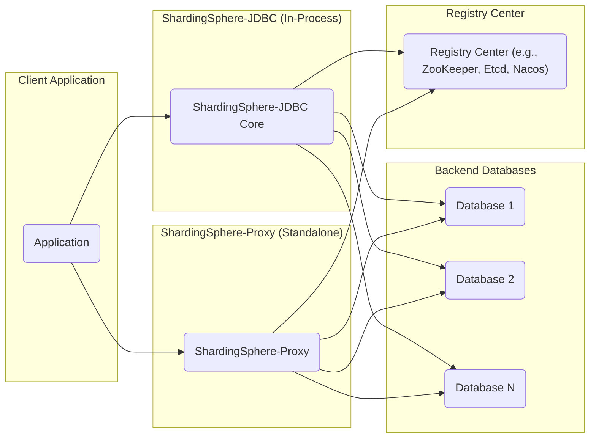
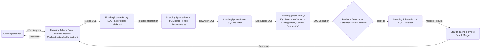

# Project Design Document: Apache ShardingSphere (Improved for Threat Modeling)

**1. Introduction**

This document provides an enhanced design overview of the Apache ShardingSphere project, specifically tailored for use in threat modeling activities. It details the key architectural components, data flows, and interactions within the system, with a strong emphasis on security-relevant aspects. This document aims to provide a comprehensive understanding of the system's attack surface and potential vulnerabilities.

**2. Goals and Objectives**

The primary goal of Apache ShardingSphere is to provide a distributed database solution that enhances the scalability and availability of applications accessing relational databases. Key objectives include:

*   Data Sharding: Distributing data across multiple physical database instances to handle large datasets and high traffic.
*   Read/Write Splitting: Routing read and write operations to different database instances to optimize performance and resource utilization.
*   Distributed Governance: Providing a unified management and control plane for distributed databases, simplifying administration.
*   SQL Federation: Allowing applications to interact with the distributed database as if it were a single logical database, abstracting away the complexity of sharding.
*   Elastic Scaling: Enabling the addition or removal of database instances with minimal disruption to the application.
*   Transaction Management: Ensuring data consistency across distributed transactions, maintaining ACID properties.
*   Data Encryption: Protecting sensitive data at rest and in transit through encryption mechanisms.
*   Shadow DB: Providing a mechanism for online schema changes and data migration with minimal downtime and risk.

**3. High-Level Architecture**

Apache ShardingSphere offers two primary deployment modes: ShardingSphere-JDBC and ShardingSphere-Proxy. Both share the same core functionalities but differ in their deployment architecture, impacting the attack surface.

*   Client Application: The application that initiates database interactions. This is a potential entry point for attacks.
*   ShardingSphere-JDBC: A Java library integrated directly into the application. Security depends heavily on the application's security posture.
*   ShardingSphere-Proxy: A standalone network service acting as a database intermediary. Introduces a network attack surface.
*   Backend Databases: The actual relational database systems. These need to be secured independently.
*   Registry Center: A critical component for configuration and coordination. Compromise can lead to widespread system failure or data breaches.

**4. Detailed Design (Security Focused)**

This section details the key components within ShardingSphere-JDBC and ShardingSphere-Proxy, highlighting security considerations for each.

**4.1. ShardingSphere-JDBC Components:**

*   SQL Parser:
    *   Function: Analyzes incoming SQL statements to understand their structure and intent.
    *   Security Consideration: Vulnerable to SQL injection if not implemented with robust input validation and sanitization. Maliciously crafted SQL could bypass security checks or access unauthorized data.
*   SQL Router:
    *   Function: Determines the target database(s) and table(s) for SQL execution based on configured sharding rules.
    *   Security Consideration: Incorrectly configured or compromised routing rules could lead to data leakage or unauthorized access to specific shards. The logic for determining the target needs to be secure and auditable.
*   SQL Rewriter:
    *   Function: Modifies the original SQL statement to be executed on the target backend database(s), adding sharding conditions or rewriting table names.
    *   Security Consideration: If the rewriting process is flawed, it could introduce new vulnerabilities or bypass existing security measures in the backend databases.
*   SQL Executor:
    *   Function: Executes the rewritten SQL statements against the target backend databases. Manages database connections and transactions.
    *   Security Consideration: Requires secure management of database credentials. Vulnerable if connections are not properly secured (e.g., using TLS). Improper error handling could leak sensitive information.
*   Result Merger:
    *   Function: Combines the results returned from multiple backend databases into a single logical result set.
    *   Security Consideration: Potential for data leakage if merging logic is flawed or if access controls are not consistently enforced across shards.
*   Metadata Management:
    *   Function: Manages the metadata of the distributed database, including schema information and sharding rules, often synchronized with the Registry Center.
    *   Security Consideration: Compromise of metadata can lead to incorrect routing, data corruption, or unauthorized access. Secure access and integrity of metadata are crucial.
*   Transaction Manager:
    *   Function: Provides distributed transaction capabilities to ensure data consistency across multiple database instances.
    *   Security Consideration: Vulnerabilities in the transaction management process could lead to data inconsistencies or the ability to manipulate data across shards without proper authorization.
*   Data Encryption Engine:
    *   Function: Handles data encryption and decryption based on configured rules, potentially at the column level.
    *   Security Consideration: The security of the encryption depends on the strength of the algorithms used and the secure management of encryption keys. Key compromise would render the encryption ineffective.
*   Shadow DB Engine:
    *   Function: Manages the shadow database for online schema changes and data migration.
    *   Security Consideration: Access to the shadow database needs to be carefully controlled to prevent unauthorized modifications or data breaches during the migration process.

**4.2. ShardingSphere-Proxy Components:**

*   Network Module:
    *   Function: Listens for client connections and handles network communication using database protocols (e.g., MySQL, PostgreSQL).
    *   Security Consideration: This is a primary entry point for attacks. Requires strong authentication and authorization mechanisms. Vulnerable to network-based attacks if not properly secured (e.g., using TLS, firewalls).
*   SQL Parser: (Same security considerations as in ShardingSphere-JDBC)
*   SQL Router: (Same security considerations as in ShardingSphere-JDBC)
*   SQL Rewriter: (Same security considerations as in ShardingSphere-JDBC)
*   SQL Executor: (Same security considerations as in ShardingSphere-JDBC)
*   Result Merger: (Same security considerations as in ShardingSphere-JDBC)
*   Metadata Management: (Same security considerations as in ShardingSphere-JDBC)
*   Transaction Manager: (Same security considerations as in ShardingSphere-JDBC)
*   Data Encryption Engine: (Same security considerations as in ShardingSphere-JDBC)
*   Shadow DB Engine: (Same security considerations as in ShardingSphere-JDBC)
*   Admin Console:
    *   Function: Provides a web-based interface for managing the ShardingSphere-Proxy instance.
    *   Security Consideration: Requires strong authentication and authorization to prevent unauthorized access and configuration changes. Vulnerable to web application security threats (e.g., XSS, CSRF). Secure communication (HTTPS) is essential.

**4.3. Registry Center Components:**

*   Configuration Storage:
    *   Function: Stores the global configuration of ShardingSphere, including data source definitions and sharding rules.
    *   Security Consideration: Access to configuration data must be restricted. Unauthorized modification can lead to system malfunction or security breaches. Sensitive information (e.g., database credentials) stored here needs to be encrypted.
*   Metadata Storage:
    *   Function: Stores the metadata of the distributed database schema.
    *   Security Consideration: Integrity of metadata is critical. Unauthorized changes can lead to incorrect data routing and access control issues.
*   State Management:
    *   Function: Manages the state of the ShardingSphere cluster, including instance availability and leader election.
    *   Security Consideration: Manipulation of the cluster state could lead to denial of service or data inconsistencies. Secure leader election mechanisms are important.
*   Locking Service:
    *   Function: Provides distributed locking capabilities for coordinating operations across multiple ShardingSphere instances.
    *   Security Consideration: Vulnerabilities in the locking service could lead to deadlocks or the ability to block critical operations.

**5. Data Flow (Security Focused)**

The following diagram illustrates the typical data flow for a SQL query through ShardingSphere-Proxy, highlighting potential security checkpoints and vulnerabilities.

*   Client Application sends SQL request: Potential for injection attacks at this stage.
*   Network Module receives request: Authentication and authorization checks are crucial here.
*   SQL Parser parses the SQL: Input validation is necessary to prevent SQL injection.
*   SQL Router determines target databases: Enforcement of sharding rules and access controls.
*   SQL Rewriter modifies the SQL: Potential for introducing vulnerabilities if not done carefully.
*   SQL Executor executes on backend databases: Secure credential management and connection security are vital.
*   Backend Databases process the query: Relies on the security measures implemented at the database level.
*   SQL Executor receives results.
*   Result Merger merges results.
*   Network Module sends response.

The data flow for ShardingSphere-JDBC is similar, but the security responsibilities are shared between the application and the JDBC library.

**6. Security Considerations (Expanded)**

This section expands on potential security considerations, categorizing them for clarity.

*   **Authentication and Authorization:**
    *   Client Authentication: Mechanisms used to verify the identity of client applications connecting to ShardingSphere-Proxy (e.g., username/password, certificates, OAuth). Weak or default credentials pose a significant risk.
    *   Backend Database Authentication: How ShardingSphere authenticates to the backend databases. Storing credentials securely is paramount. Consider using secrets management solutions.
    *   Admin Console Authentication: Security of the web-based admin console. Multi-factor authentication should be considered.
    *   Authorization: Mechanisms to control what actions users or applications are allowed to perform. Fine-grained access control is essential to prevent unauthorized data access or manipulation.
*   **Data Protection (Confidentiality and Integrity):**
    *   Data Encryption at Rest: How sensitive data is protected when stored in the backend databases. ShardingSphere's encryption features and underlying database encryption capabilities should be considered. Key management practices are critical.
    *   Data Encryption in Transit: Ensuring communication channels are encrypted using TLS/SSL between the client and ShardingSphere, and between ShardingSphere and the backend databases.
    *   Data Masking and Anonymization: Techniques to protect sensitive data by masking or anonymizing it for non-production environments or specific use cases.
*   **Injection Attacks:**
    *   SQL Injection: Preventing malicious SQL code from being injected through application inputs or manipulated within ShardingSphere components. Robust input validation and parameterized queries are essential.
    *   Other Injection Attacks: Consider potential for other injection vulnerabilities in the admin console or other interfaces.
*   **Access Control (Network and Application Level):**
    *   Network Segmentation: Isolating ShardingSphere instances and backend databases within secure network segments. Firewalls and network policies should restrict access.
    *   Registry Center Security: Securing access to the Registry Center to prevent unauthorized modification of configuration and metadata. Authentication and authorization for the Registry Center itself are crucial.
*   **Configuration Security:**
    *   Secure Storage of Configuration: Protecting ShardingSphere configuration files and ensuring sensitive credentials are not stored in plaintext. Encryption and access controls are necessary.
*   **Logging and Auditing:**
    *   Comprehensive Logging: Logging security-relevant events, such as authentication attempts, authorization failures, configuration changes, and data access patterns.
    *   Auditing: Regularly reviewing logs to detect suspicious activity and potential security breaches.
*   **Denial of Service (DoS):**
    *   Rate Limiting: Implementing mechanisms to limit the number of requests from a single source to prevent resource exhaustion.
    *   Input Validation: Preventing malformed or excessively large requests from overwhelming the system.
*   **Vulnerability Management:**
    *   Regular Security Audits: Conducting periodic security assessments and penetration testing to identify potential vulnerabilities.
    *   Patch Management: Keeping ShardingSphere and its dependencies up-to-date with the latest security patches.
*   **Third-Party Dependencies:**
    *   Dependency Scanning: Regularly scanning third-party libraries for known vulnerabilities.
    *   Keeping Dependencies Updated: Ensuring all dependencies are updated to their latest secure versions.

**7. Deployment Considerations (Security Implications)**

*   ShardingSphere-JDBC:
    *   Security heavily reliant on the application's security posture. If the application is compromised, ShardingSphere-JDBC is also compromised.
    *   Credential management within the application needs careful consideration.
    *   Network security between the application and backend databases is crucial.
*   ShardingSphere-Proxy:
    *   Introduces a network endpoint that needs to be secured.
    *   Requires robust authentication and authorization mechanisms for client connections.
    *   The proxy itself becomes a target for attacks.
    *   Secure deployment of the admin console is essential.
*   Registry Center:
    *   A critical component; its compromise can have widespread impact.
    *   Requires strong authentication and authorization.
    *   Secure communication between ShardingSphere instances and the Registry Center is necessary.
*   Backend Databases:
    *   Independent security measures are required for each backend database.
    *   ShardingSphere's security is built upon the security of the underlying databases.

**8. Threat Landscape (Potential Threats)**

Based on the architecture and components, potential threats include:

*   **SQL Injection:** Through client applications or vulnerabilities in ShardingSphere's SQL parsing.
*   **Authentication Bypass:** Weak or compromised credentials for clients, backend databases, or the admin console.
*   **Authorization Failures:** Users or applications gaining access to data or performing actions they are not authorized for due to misconfigured rules or vulnerabilities.
*   **Data Breaches:** Unauthorized access to sensitive data due to lack of encryption or compromised encryption keys.
*   **Man-in-the-Middle Attacks:** Interception of communication between clients and ShardingSphere or between ShardingSphere and backend databases if encryption is not used.
*   **Configuration Tampering:** Unauthorized modification of ShardingSphere configuration through a compromised Registry Center or admin console.
*   **Denial of Service:** Overwhelming ShardingSphere or backend databases with malicious requests.
*   **Compromise of Registry Center:** Leading to widespread system failure, data corruption, or unauthorized access.
*   **Vulnerabilities in Third-Party Libraries:** Exploitation of known vulnerabilities in dependencies.
*   **Admin Console Exploits:** Web application vulnerabilities in the admin console allowing unauthorized access or control.

**9. Future Considerations (Security Enhancements)**

*   Enhanced Role-Based Access Control (RBAC) and fine-grained authorization policies.
*   Integration with Hardware Security Modules (HSMs) for secure key management.
*   Improved monitoring and alerting capabilities for security events and anomalies.
*   Support for more advanced authentication mechanisms (e.g., multi-factor authentication for clients).
*   Strengthened input validation and sanitization across all components.
*   Automated security scanning and vulnerability assessment integration.

This improved design document provides a more detailed and security-focused overview of Apache ShardingSphere, making it a valuable resource for conducting thorough threat modeling and identifying potential security vulnerabilities.