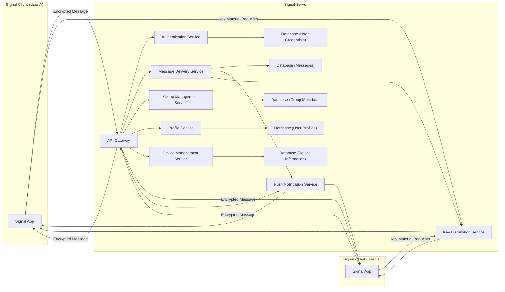
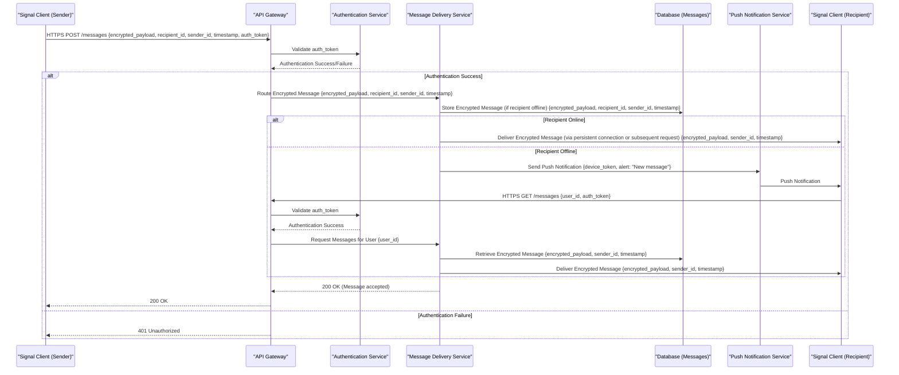
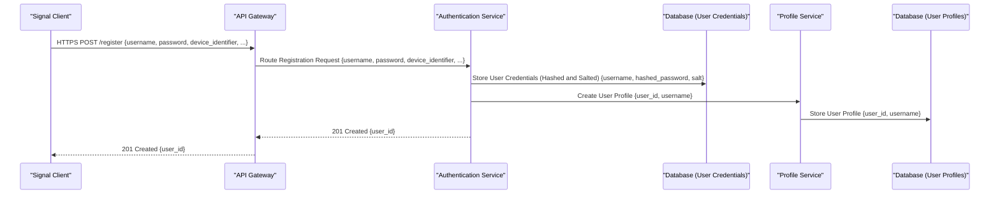

## Project Design Document: Signal Server (Improved)

**1. Introduction**

This document provides a detailed architectural design of the Signal Server, based on the open-source project available at [https://github.com/signalapp/signal-server](https://github.com/signalapp/signal-server). This document aims to provide a comprehensive and improved understanding of the server's components, their interactions, and the overall system architecture. It will serve as a robust foundation for subsequent threat modeling activities.

**1.1. Purpose**

The primary purpose of this document is to clearly and comprehensively articulate the design of the Signal Server. This enhanced clarity will enable stakeholders, particularly security engineers, to gain a deeper understanding of the system's structure and identify potential security vulnerabilities with greater precision.

**1.2. Scope**

This document focuses on the server-side architecture of the Signal messaging platform. It covers the core components responsible for handling user registration, message delivery, group management, profile management, and other server-side functionalities. Client applications (iOS, Android, Desktop) are considered external entities and are not within the scope of this document, except where their interactions with the server are directly relevant to understanding server-side processes.

**1.3. Audience**

This document is intended for:

*   Security engineers involved in threat modeling, security architecture reviews, and penetration testing.
*   Software architects and developers working on, integrating with, or extending the Signal Server.
*   Operations engineers responsible for the deployment, maintenance, monitoring, and scaling of the Signal Server infrastructure.

**2. System Overview**

The Signal Server acts as the central, privacy-focused hub for routing end-to-end encrypted messages between Signal users. It securely manages user identities, device registrations, cryptographic key material (for session establishment, though not message content), and group memberships. Critically, the server is designed to have no access to the plaintext content of messages due to the implementation of the Signal Protocol.

**2.1. High-Level Architecture Diagram**

**2.2. Key Components**

*   **API Gateway:** The single entry point for all client requests. It handles request routing to specific backend services, implements rate limiting and potentially performs initial security checks such as token validation.
*   **Authentication Service:** Responsible for verifying user credentials during login, managing user sessions through tokens, and handling account registration and recovery processes.
*   **Message Delivery Service:**  The core component for handling the routing and temporary storage of end-to-end encrypted messages between users. It manages message queues and ensures reliable delivery.
*   **Group Management Service:** Manages all aspects of Signal groups, including creation, modification, membership management (adding, removing users), and handling invitations.
*   **Profile Service:** Stores and manages non-sensitive user profile information such as usernames and avatars.
*   **Device Management Service:**  Manages the registration and association of user devices with their accounts. This is crucial for multi-device support and secure message delivery.
*   **Database (User Credentials):** Securely stores sensitive user authentication information, such as salted and hashed passwords or authentication tokens.
*   **Database (Messages):** Temporarily stores end-to-end encrypted messages until they are successfully delivered to the recipient(s).
*   **Database (Group Metadata):** Stores metadata related to Signal groups, including member lists, group settings, and group identifiers.
*   **Database (User Profiles):** Stores non-sensitive user profile data.
*   **Database (Device Information):** Stores information about registered user devices, including device tokens for push notifications.
*   **Push Notification Service:** An interface to external platform-specific push notification providers (e.g., APNs for iOS, FCM for Android) to notify users of new messages when the application is not in the foreground.
*   **Key Distribution Service:**  Manages the distribution of pre-keys and signed pre-keys necessary for establishing secure end-to-end encrypted sessions between users, as defined by the Signal Protocol.

**3. Component Details**

This section provides a more detailed description of each key component, focusing on functionality, data flow, and security considerations.

**3.1. API Gateway**

*   **Functionality:**
    *   Receives and processes all incoming HTTP/S requests from Signal clients.
    *   Routes requests to the appropriate internal backend service based on the requested endpoint.
    *   Implements rate limiting and traffic shaping to mitigate denial-of-service attacks and abuse.
    *   Performs initial authentication checks, such as verifying the presence and validity of authentication tokens.
    *   May handle TLS termination.
*   **Inputs:** HTTP/S requests from Signal clients, including authentication tokens and message payloads.
*   **Outputs:** Routed HTTP/S requests to backend services, HTTP/S responses to clients (success or error).
*   **Interactions:** Interacts with all other backend services to route requests. May interact with the Authentication Service for token validation.
*   **Technology Stack (Example):**  Likely a high-performance reverse proxy and load balancer such as Nginx, HAProxy, or a cloud-native API Gateway service like AWS API Gateway or Kong.

**3.2. Authentication Service**

*   **Functionality:**
    *   Authenticates users based on provided credentials (username/password or potentially other authentication factors).
    *   Generates, issues, and manages session tokens (e.g., JWTs) for authenticated users to maintain session state.
    *   Handles user account registration, password reset, and account recovery functionalities.
    *   May implement multi-factor authentication (MFA).
*   **Inputs:** User credentials during login attempts, session tokens for validation, registration data.
*   **Outputs:** Authentication success/failure responses, session tokens upon successful authentication, error messages.
*   **Interactions:** Interacts with the Database (User Credentials) to verify credentials and store/retrieve user authentication information. Interacts with the API Gateway to validate tokens presented by clients.
*   **Technology Stack (Example):**  A custom service built using a framework like Spring Boot (Java), Node.js (Express), or Go, potentially utilizing libraries for JWT management and secure password hashing (e.g., Argon2, bcrypt).

**3.3. Message Delivery Service**

*   **Functionality:**
    *   Receives end-to-end encrypted messages from sending clients.
    *   Determines the intended recipients of the message.
    *   Temporarily stores messages in a queue or database if recipients are offline or unavailable.
    *   Retrieves stored messages for recipients when they come online.
    *   Interacts with the Push Notification Service to notify offline recipients of new messages.
    *   Potentially interacts with the Key Distribution Service to ensure necessary keys are available for message delivery.
*   **Inputs:** End-to-end encrypted message payloads, sender and recipient identifiers.
*   **Outputs:** Delivery acknowledgements to senders, encrypted messages to recipients.
*   **Interactions:** Interacts with the Database (Messages) for temporary storage, the Push Notification Service for sending notifications, the Profile Service to resolve user identifiers, and potentially the Key Distribution Service.
*   **Technology Stack (Example):**  A high-throughput, low-latency messaging service potentially built using technologies like Apache Kafka, RabbitMQ, or a cloud-based message queue service. Backend logic likely implemented with a framework like Spring Boot or Node.js.

**3.4. Group Management Service**

*   **Functionality:**
    *   Handles the creation of new Signal groups, including managing group metadata.
    *   Manages group membership, including adding and removing users, and handling join requests and invitations.
    *   Updates group metadata such as group name, avatar, and settings.
    *   Enforces group access control policies.
*   **Inputs:** Requests to create, modify, or manage groups, including user identifiers and group metadata.
*   **Outputs:** Success/failure responses for group management operations, updated group metadata.
*   **Interactions:** Interacts with the Database (Group Metadata) to store and retrieve group information, the Profile Service to resolve user identifiers, and potentially the Message Delivery Service for group message routing.
*   **Technology Stack (Example):**  A service built with a backend framework, potentially with data structures optimized for managing group relationships and permissions.

**3.5. Profile Service**

*   **Functionality:**
    *   Stores and retrieves non-sensitive user profile information.
    *   Allows users to update their own profile information (e.g., username, avatar).
    *   Provides a mechanism to look up user profiles by identifier.
*   **Inputs:** Requests to retrieve or update user profiles, including user identifiers and profile data.
*   **Outputs:** User profile data.
*   **Interactions:** Interacts with the Database (User Profiles) to store and retrieve profile information.
*   **Technology Stack (Example):**  A service built with a backend framework and a suitable database optimized for read-heavy workloads.

**3.6. Device Management Service**

*   **Functionality:**
    *   Handles the registration of new user devices with their Signal accounts.
    *   Manages the association between user accounts and their registered devices.
    *   Stores device-specific information, such as push notification tokens.
    *   Allows users to view and manage their registered devices.
*   **Inputs:** Device registration requests, device tokens for push notifications.
*   **Outputs:** Success/failure responses for device management operations.
*   **Interactions:** Interacts with the Database (Device Information) to store device-related data. May interact with the Push Notification Service to update or invalidate tokens.
*   **Technology Stack (Example):**  A service built with a backend framework, potentially with specific logic for handling device registration and push notification token management.

**3.7. Database (User Credentials)**

*   **Functionality:** Securely stores sensitive user authentication information.
*   **Data Stored:** Usernames, salted and hashed passwords or other authentication secrets, potentially session revocation information.
*   **Security Considerations:**  Requires strong encryption at rest and in transit. Access should be strictly controlled with principle of least privilege. Regular security audits are essential.
*   **Technology Stack (Example):**  A robust and secure relational database like PostgreSQL or MySQL, potentially with encryption features enabled.

**3.8. Database (Messages)**

*   **Functionality:** Temporarily stores end-to-end encrypted messages.
*   **Data Stored:** Encrypted message payloads, sender and recipient identifiers, timestamps, delivery status.
*   **Security Considerations:**  While message content is encrypted, the database itself should be secured to prevent unauthorized access to metadata. Access control and encryption at rest are crucial.
*   **Technology Stack (Example):**  A database optimized for write-heavy workloads and efficient retrieval, potentially a NoSQL database like Cassandra or a managed database service.

**3.9. Database (Group Metadata)**

*   **Functionality:** Stores metadata related to Signal groups.
*   **Data Stored:** Group identifiers, member lists, group settings, group names, avatars, creation timestamps, and potentially invitation information.
*   **Security Considerations:** Access control to group metadata is important to prevent unauthorized modification or disclosure.
*   **Technology Stack (Example):**  A relational or NoSQL database suitable for storing structured data with relationships.

**3.10. Database (User Profiles)**

*   **Functionality:** Stores non-sensitive user profile data.
*   **Data Stored:** Usernames, avatars, potentially other public profile information.
*   **Security Considerations:**  While less sensitive, access control should still be implemented.
*   **Technology Stack (Example):**  A relational or NoSQL database.

**3.11. Database (Device Information)**

*   **Functionality:** Stores information about registered user devices.
*   **Data Stored:** User identifiers, device identifiers, platform-specific push notification tokens, device registration timestamps.
*   **Security Considerations:** Secure storage and handling of device tokens are crucial to prevent unauthorized push notification sending.
*   **Technology Stack (Example):**  A relational or NoSQL database.

**3.12. Push Notification Service**

*   **Functionality:** Sends push notifications to user devices via platform-specific push notification providers (e.g., APNs for iOS, FCM for Android).
*   **Inputs:** Recipient device tokens, notification payloads (typically minimal information indicating a new message).
*   **Outputs:** Push notifications sent to external providers.
*   **Interactions:** Interacts with the Message Delivery Service to trigger notifications. Interacts with the Database (Device Information) to retrieve device tokens.
*   **Security Considerations:** Secure storage and handling of device tokens. Secure communication with push notification providers. Rate limiting to prevent notification spam.

**3.13. Key Distribution Service**

*   **Functionality:**  Implements the key distribution mechanisms of the Signal Protocol, providing clients with the necessary pre-keys and signed pre-keys to establish secure communication sessions.
*   **Inputs:** Requests for key material from Signal clients.
*   **Outputs:** Pre-keys and signed pre-keys.
*   **Interactions:** Interacts with the clients to provide key material. May interact with a database to store and manage key material.
*   **Security Considerations:**  This service is critical for the security of the end-to-end encryption. Secure generation, storage, and distribution of key material are paramount.
*   **Technology Stack (Example):**  A service built with a backend framework, specifically designed to handle the cryptographic operations and data management required by the Signal Protocol's key exchange.

**4. Data Flow Diagrams**

This section illustrates the flow of data through the system for key functionalities, providing more detail on the data exchanged.

**4.1. Message Sending Flow (Detailed)**

**4.2. User Registration Flow (Detailed)**

**5. Security Considerations**

This section outlines key security considerations for the Signal Server, providing more specific examples where applicable.

*   **End-to-End Encryption (Signal Protocol):** The fundamental security mechanism, ensuring only communicating parties can decrypt messages. The server's role is to facilitate the secure exchange of these encrypted messages, not to decrypt them.
*   **Authentication and Authorization:**
    *   Strong password policies and enforcement.
    *   Secure storage of credentials using strong hashing algorithms (e.g., Argon2id) with unique salts.
    *   Implementation of robust session management using secure tokens (e.g., JWTs with appropriate expiration and refresh mechanisms).
    *   Authorization checks at the API Gateway and within backend services to ensure users can only access resources they are permitted to.
*   **Secure Storage of Credentials:** Employing encryption at rest for the Database (User Credentials) using technologies like Transparent Data Encryption (TDE).
*   **Protection of Encryption Keys (Server-Side):** While the server doesn't have access to message content keys, it manages pre-keys and signed pre-keys. Secure generation, storage, and access control for these keys within the Key Distribution Service are critical.
*   **Input Validation:** Rigorous validation and sanitization of all input received from clients at the API Gateway and within backend services to prevent injection attacks (e.g., SQL injection, cross-site scripting).
*   **Rate Limiting:** Implementing aggressive rate limiting at the API Gateway to protect against denial-of-service attacks, brute-force attacks, and abuse.
*   **Secure Communication Channels:** Enforcing HTTPS with TLS 1.3 or higher for all client-server communication, ensuring proper certificate management and configuration.
*   **Database Security:**
    *   Implementing network segmentation and firewall rules to restrict access to database servers.
    *   Employing the principle of least privilege for database user accounts.
    *   Regularly patching and updating database software.
    *   Implementing encryption at rest for all databases containing sensitive information.
    *   Performing regular database backups and ensuring their secure storage.
*   **Logging and Auditing:** Comprehensive logging of important events, including authentication attempts, API requests, and security-related actions, for security monitoring, intrusion detection, and incident response. Secure storage and access control for audit logs.
*   **Dependency Management:** Maintaining a comprehensive Software Bill of Materials (SBOM) and regularly scanning dependencies for known vulnerabilities. Implementing a process for promptly patching or mitigating identified vulnerabilities.
*   **Push Notification Security:** Secure handling and storage of device tokens. Using authenticated and encrypted communication channels with push notification providers.
*   **Regular Security Assessments:** Conducting regular penetration testing and vulnerability assessments to identify and address potential security weaknesses.

**6. Assumptions and Constraints**

*   **Secure Infrastructure:** It is assumed that the underlying server infrastructure (hardware, operating systems, network) is securely configured and maintained.
*   **Trust in External Services:** The design relies on the security and availability of external services such as push notification providers.
*   **Client Application Security:** While out of scope, the security of the Signal client applications is crucial for the overall security of the platform. It is assumed that clients properly implement the Signal Protocol and handle key material securely.
*   **Scalability and High Availability:** The design should be implemented with scalability and high availability in mind, although specific implementation details are not the primary focus of this document.

**7. Conclusion**

This improved document provides a more detailed and comprehensive overview of the Signal Server architecture, elaborating on the functionalities of its key components and the flow of data within the system. The enhanced focus on security considerations makes this document a more robust foundation for conducting thorough threat modeling exercises and identifying potential vulnerabilities within the Signal Server. This detailed design will aid in building a more secure and resilient messaging platform.