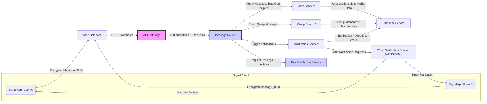

## Project Design Document: Signal Server (Improved)

**1. Introduction**

This document provides an enhanced architectural design of the Signal Server, based on the publicly available source code repository: [https://github.com/signalapp/signal-server](https://github.com/signalapp/signal-server). This revision aims to provide a more detailed and refined understanding of the system's components, their interactions, and crucial security considerations, specifically tailored for subsequent threat modeling activities.

**2. Goals**

*   Provide a comprehensive and detailed overview of the Signal Server architecture, suitable for threat modeling.
*   Clearly identify key components, their responsibilities, and their security-relevant functions.
*   Describe the data flow within the system with a focus on security boundaries and data transformation points.
*   Highlight significant security features, potential vulnerabilities, and considerations for each component.
*   Serve as a robust and actionable basis for identifying potential threats, attack vectors, and vulnerabilities.

**3. Scope**

This document focuses on the core backend infrastructure of the Signal Server. It primarily covers the components responsible for:

*   Secure user registration and identity management.
*   End-to-end encrypted message routing and reliable delivery.
*   Secure group management and membership control.
*   Handling and securing push notifications.
*   Cryptographic key exchange and secure session management.

This document intentionally excludes the intricacies of the client applications (iOS, Android, Desktop) and the low-level implementation details of cryptographic protocols, focusing instead on the server-side architecture and its security context.

**4. System Architecture**

The Signal Server employs a microservices-oriented architecture, emphasizing security and scalability. The following diagram illustrates the high-level components and their interactions, highlighting security boundaries:

**5. Component Details**

*   **Signal App (User A/B):**  The client application responsible for end-to-end encryption and decryption of messages. It establishes secure connections with the server and handles user interface logic. *Security Focus: Key generation, secure storage of private keys, cryptographic operations.*
*   **Load Balancer (LB):** Distributes incoming, TLS-encrypted client requests across multiple instances of the API Gateway. *Security Focus: TLS termination, preventing direct access to backend services.*
*   **API Gateway (AG):** The single entry point for all client requests. It performs authentication (verifying user identity), authorization (ensuring users have permissions), and rate limiting to protect backend services. *Security Focus: Authentication mechanisms (e.g., password-based, token-based), input validation, protection against common web attacks (OWASP Top 10).*
*   **Message Router (MR):** The core routing engine responsible for directing encrypted messages to the intended recipients. It does not have access to the plaintext content of messages. *Security Focus: Secure routing logic, preventing message interception or redirection, ensuring message integrity during transit within the backend.*
*   **User Service (US):** Manages user accounts, registration, profile information, device linking, and authentication credentials. *Security Focus: Secure storage of user credentials (hashed and salted passwords), multi-factor authentication, account recovery mechanisms, prevention of account takeover.*
*   **Group Service (GS):** Handles group creation, membership management, and group metadata. It enforces access control policies for group operations. *Security Focus: Secure group invitation and join processes, managing group membership changes securely, preventing unauthorized access to group information.*
*   **Notification Service (NS):** Responsible for generating and managing push notifications to inform users of new messages or events. It interacts with third-party push notification providers. *Security Focus: Secure generation of notification payloads (avoiding sensitive information), secure communication with push notification providers (APNS/FCM), preventing notification spoofing.*
*   **Database Service (DS):** Persists application data, including user information, device registrations, group details, and transient message metadata. Access to the database should be strictly controlled. *Security Focus: Data encryption at rest, access control mechanisms, regular backups, protection against SQL injection and other database vulnerabilities.*
*   **Key Distribution Service (KS):** Facilitates the initial key exchange process and the distribution of pre-keys, enabling secure end-to-end encryption. It stores public keys and related cryptographic material. *Security Focus: Secure storage and retrieval of cryptographic keys, protection against key compromise, secure generation and rotation of keys.*
*   **Push Notification Service (PS - APNS/FCM):** Third-party services used to deliver push notifications to user devices. The Signal Server interacts with these services to trigger notifications. *Security Focus: Secure API communication with APNS/FCM, proper handling of device tokens, understanding the security implications of relying on third-party services.*

**6. Data Flow (Security Focused)**

*   **Secure User Registration:**
    *   The Signal App sends a registration request (over TLS) to the API Gateway.
    *   The API Gateway validates the request and forwards it to the User Service.
    *   The User Service securely stores user credentials (hashed and salted) in the Database Service.
    *   The User Service might interact with the Key Distribution Service to generate initial cryptographic keys for the user.
*   **Sending an End-to-End Encrypted Message:**
    *   The sending Signal App encrypts the message using the recipient's public key (obtained through the key exchange mechanism).
    *   The encrypted message is sent (over TLS) to the Load Balancer.
    *   The Load Balancer forwards the HTTPS request to the API Gateway.
    *   The API Gateway authenticates the sender and forwards the encrypted message to the Message Router.
    *   The Message Router determines the recipient and routes the *encrypted* message. It does not decrypt the message.
    *   The Notification Service is triggered to send a push notification to the recipient's devices via the Push Notification Service (APNS/FCM). The notification payload contains minimal information, avoiding sensitive message content.
*   **Receiving an End-to-End Encrypted Message:**
    *   The recipient's Signal App receives a push notification from APNS/FCM.
    *   The app connects to the Signal Server (via Load Balancer and API Gateway over TLS).
    *   The API Gateway authenticates the recipient's app.
    *   The Message Router retrieves the stored *encrypted* message (if it was stored transiently) or confirms its availability.
    *   The *encrypted* message is delivered to the recipient's app.
    *   The recipient's app decrypts the message locally using their private key. The server is never involved in decryption.
*   **Secure Group Management:**
    *   Group creation and membership updates are handled via authenticated requests to the API Gateway, which forwards them to the Group Service.
    *   The Group Service enforces access controls and securely updates group metadata in the Database Service.
    *   Message routing to groups involves the Message Router identifying group members and routing the *encrypted* message to each member individually.

**7. Security Considerations (Detailed)**

*   **End-to-End Encryption (E2EE):** The cornerstone of Signal's security. Ensures only communicating parties can read messages. Threat Model Implications: Focus on key exchange vulnerabilities, compromised client devices, and potential metadata leaks.
*   **Transport Layer Security (TLS):** Protects communication between clients and the server and between internal services. Threat Model Implications: Focus on TLS configuration vulnerabilities, weak cipher suites, and man-in-the-middle attacks.
*   **Authentication and Authorization:** Crucial for verifying user identity and controlling access to resources. Threat Model Implications: Focus on brute-force attacks, credential stuffing, session hijacking, and privilege escalation.
*   **Rate Limiting:** Prevents abuse and denial-of-service attacks. Threat Model Implications: Focus on bypassing rate limits and the impact of service disruption.
*   **Input Validation:** Prevents injection attacks and other vulnerabilities. Threat Model Implications: Focus on various injection points in the API Gateway and backend services.
*   **Secure Key Management:**  Protecting cryptographic keys is paramount. Threat Model Implications: Focus on key storage vulnerabilities, key leakage, and compromised key generation processes.
*   **Regular Security Audits and Penetration Testing:** Essential for identifying and addressing vulnerabilities. Threat Model Implications:  These activities provide input for identifying potential weaknesses.
*   **Secure Coding Practices:** Minimizes the introduction of security flaws. Threat Model Implications:  Reduces the likelihood of common software vulnerabilities.
*   **Data Minimization:** Reduces the potential impact of a data breach. Threat Model Implications: Limits the amount of sensitive data an attacker could potentially access.
*   **Push Notification Security:** Metadata associated with push notifications needs careful consideration. Threat Model Implications: Focus on potential information leakage through notification content and timing.
*   **Dependency Management:**  Securely managing third-party libraries and dependencies. Threat Model Implications: Vulnerabilities in dependencies can introduce security risks.
*   **Logging and Monitoring:**  Essential for detecting and responding to security incidents. Threat Model Implications:  Insufficient logging can hinder incident response and forensic analysis.

**8. Deployment Architecture (Conceptual)**

The Signal Server is likely deployed on a robust and scalable cloud infrastructure, emphasizing security and resilience. A typical deployment might include:

*   **Multiple Availability Zones:** Ensuring high availability and fault tolerance.
*   **Auto-Scaling Groups:** Dynamically adjusting resources based on demand.
*   **Containerization (Docker):**  Providing consistent and isolated environments for services.
*   **Orchestration (Kubernetes):** Managing and scaling containerized applications.
*   **Managed Database Service with Encryption at Rest:** Ensuring data confidentiality and integrity.
*   **Secure Secrets Management:**  Protecting sensitive credentials and API keys.
*   **Web Application Firewall (WAF):** Protecting the API Gateway from common web attacks.
*   **Intrusion Detection and Prevention Systems (IDPS):** Monitoring network traffic for malicious activity.
*   **Centralized Logging and Security Information and Event Management (SIEM):**  Aggregating and analyzing logs for security monitoring and incident response.

**9. Technology Stack (Inferred)**

*   **Programming Language:** Java (primary)
*   **Database:** Likely PostgreSQL with encryption features enabled
*   **Message Broker/Queue:** Potentially RabbitMQ or Kafka for asynchronous communication
*   **API Framework:** Likely Spring Boot with security features
*   **Protocol Buffers:** For efficient and secure data serialization
*   **Build Tool:** Gradle or Maven with dependency management
*   **Caching:** Potentially Redis or Memcached for performance optimization
*   **Security Libraries:**  Likely using well-vetted cryptographic libraries

**10. Assumptions and Constraints**

*   This design document is based on publicly available information and logical inferences. The actual internal architecture may differ.
*   Specific implementation details and technologies are subject to change.
*   Robust security measures are assumed to be implemented and actively maintained across all components.
*   The system is designed to handle a large number of concurrent users and messages with low latency.

**11. Future Considerations**

*   Enhancements to metadata privacy.
*   Exploration of decentralized or federated architectures.
*   Improved resilience against sophisticated attacks.
*   Continuous security monitoring and improvement based on threat intelligence.

This improved design document provides a more detailed and security-focused overview of the Signal Server architecture. It serves as a more robust foundation for conducting comprehensive threat modeling exercises, enabling the identification of potential vulnerabilities and the development of effective mitigation strategies.
