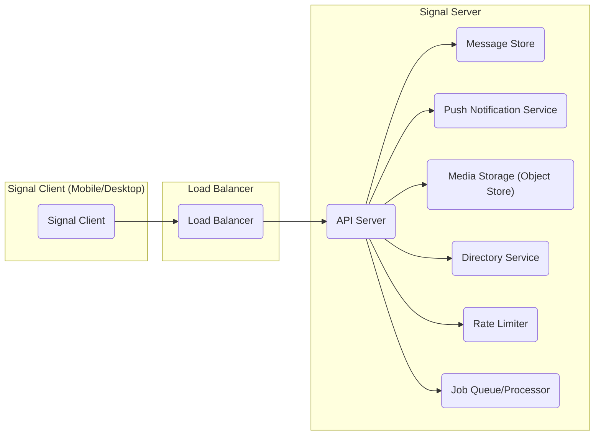
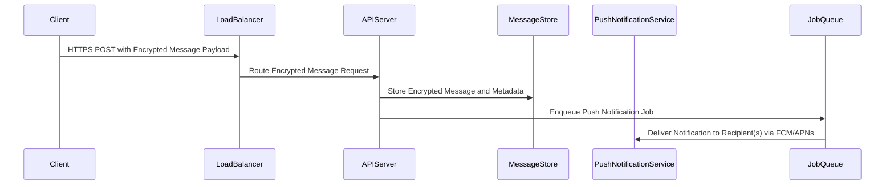

## Project Design Document: Signal Server - Improved

**Document Version:** 1.1
**Date:** October 26, 2023
**Prepared By:** AI Software Architecture Expert

### 1. Introduction

This document provides an enhanced architectural design of the Signal Server, based on the publicly available GitHub repository (https://github.com/signalapp/signal-server). This revised design document aims to offer a more detailed and nuanced understanding of the server's components, their interactions, and the overall system architecture. This improved document will serve as a more robust foundation for subsequent threat modeling activities, providing greater clarity on potential attack surfaces and data flows.

### 2. Goals

*   Provide a more granular definition of the major components of the Signal Server, including specific responsibilities and potential technologies.
*   Elaborate on the interactions and data flow between these components, detailing the types of data exchanged.
*   Clearly outline the key functionalities provided by the server, with examples of specific operations.
*   Offer a more comprehensive basis for identifying potential security vulnerabilities and threats, considering component-specific risks.

### 3. Scope

This document focuses on the core server-side architecture of the Signal application, providing a deeper dive into key areas. It includes:

*   Detailed API endpoint categories for client communication (e.g., messaging, user management, group operations).
*   In-depth description of message handling and routing mechanisms, including queueing and delivery guarantees.
*   Elaboration on user management and authentication flows, including registration and key management.
*   Detailed breakdown of group management functionalities, including permissions and membership models.
*   Specifics of push notification integration, including handling of different notification types and priorities.
*   More detail on media storage and retrieval, including potential pre-processing and access control.

This document continues to exclude:

*   Fine-grained implementation specifics of individual components' code.
*   Client-side application architecture (iOS, Android) beyond their interaction with the server.
*   Specific cryptographic details of the Signal Protocol encryption algorithms.
*   Operational aspects like detailed deployment configurations, infrastructure management, and real-time monitoring solutions.

### 4. High-Level Architecture



**Description:**

*   **Signal Client:** Represents the applications used by end-users on their devices (mobile or desktop), initiating communication with the server.
*   **Load Balancer:**  Distributes incoming client requests across multiple API Server instances, ensuring high availability, fault tolerance, and optimal resource utilization.
*   **API Server:** The central component responsible for handling authenticated client requests, enforcing authorization policies, processing messages, managing user and group data, and orchestrating interactions with other backend services.
*   **Message Store:**  A persistent data store responsible for securely storing encrypted messages, message metadata, group information, user profiles, and other critical data.
*   **Push Notification Service:**  Dedicated service for reliably delivering push notifications to client devices via platform-specific gateways (e.g., FCM, APNs) when new messages or events occur.
*   **Media Storage (Object Store):**  Scalable and durable storage for media files (images, videos, audio, files) shared between users, potentially with pre-processing and access control mechanisms.
*   **Directory Service:** Manages user identities, public keys, contact discovery information, and facilitates user registration and account management processes.
*   **Rate Limiter:**  A component responsible for controlling the rate of incoming requests to protect the API Server from abuse and denial-of-service attacks.
*   **Job Queue/Processor:**  Handles asynchronous tasks and background processes, such as delayed message delivery, media processing, and potentially some aspects of push notification handling.

### 5. Component Details

#### 5.1. API Server

*   **Functionality:**
    *   **Authentication:** Verifies user credentials using methods like phone number verification and registration codes.
    *   **Authorization:** Enforces access control policies to ensure users can only access resources they are permitted to.
    *   **Message Handling:** Receives encrypted messages from clients, routes them to recipients, and interacts with the Message Store.
    *   **Group Management:** Handles requests for creating, joining, leaving, and managing groups, including updating group metadata and member lists.
    *   **Key Exchange Initiation:** Facilitates the initial key exchange process for establishing secure communication channels.
    *   **Profile Management:** Allows users to update their profile information and settings.
    *   **Contact Discovery:** Provides mechanisms for users to find and connect with other Signal users.
    *   **Push Notification Triggering:**  Initiates push notifications via the Push Notification Service for new messages and events.
*   **Responsibilities:**
    *   Enforcing core application logic and security policies at the application layer.
    *   Orchestrating complex workflows involving multiple backend components.
    *   Exposing well-defined and secure API endpoints for client communication (e.g., `/v1/messages`, `/v1/groups`, `/v1/users`).
    *   Handling request validation and error handling.
*   **Key Technologies (Inferred):**
    *   Primarily Java or Kotlin, leveraging frameworks like Spring Boot for API development and dependency injection.
    *   Likely uses gRPC for efficient internal communication between microservices.
    *   Potentially utilizes message queues (e.g., Kafka, RabbitMQ) for asynchronous task handling.

#### 5.2. Message Store

*   **Functionality:**
    *   **Encrypted Message Persistence:** Securely stores end-to-end encrypted message payloads.
    *   **Metadata Storage:** Stores message metadata, including sender, recipient(s), timestamp, delivery status, and potentially read receipts.
    *   **Group Data Storage:** Persists group membership information, group settings, and administrative roles.
    *   **User Profile Storage:** Stores user-related data, such as registration details, settings, and potentially device information.
    *   **Indexing and Querying:** Provides efficient mechanisms for retrieving messages and related data based on various criteria.
*   **Responsibilities:**
    *   Ensuring the durability, availability, and consistency of stored data.
    *   Providing efficient read and write operations for the API Server.
    *   Implementing data at rest encryption to protect stored data.
    *   Maintaining data integrity through appropriate database constraints and validation.
*   **Key Technologies (Inferred):**
    *   Likely a robust relational database like PostgreSQL with extensions for handling JSON or binary data efficiently.
    *   Potentially utilizes caching mechanisms (e.g., Redis, Memcached) to improve read performance.

#### 5.3. Push Notification Service

*   **Functionality:**
    *   **Notification Reception:** Receives notification requests from the API Server, containing recipient information and message details.
    *   **Platform-Specific Formatting:** Adapts notification payloads to the specific formats required by FCM and APNs.
    *   **Device Token Management:** Stores and manages device tokens associated with user accounts.
    *   **Notification Delivery:** Sends formatted notifications to the appropriate platform-specific push notification gateways.
    *   **Delivery Status Tracking:** Potentially tracks the delivery status of notifications.
    *   **Priority Handling:**  Manages different notification priorities (e.g., high priority for direct messages).
*   **Responsibilities:**
    *   Reliable and timely delivery of notifications to offline clients.
    *   Efficient management of a large number of device tokens.
    *   Handling potential failures and retries in notification delivery.
    *   Ensuring the security of communication with push notification gateways.
*   **Key Technologies (Inferred):**
    *   Direct integration with FCM (Firebase Cloud Messaging) for Android and APNs (Apple Push Notification service) for iOS.
    *   Potentially utilizes a message queue for buffering and managing outgoing notifications.

#### 5.4. Media Storage (Object Store)

*   **Functionality:**
    *   **Media Upload:**  Receives and stores media files uploaded by users.
    *   **Secure Storage:**  Provides durable and secure storage for media content.
    *   **Media Retrieval:**  Allows authorized users to retrieve stored media files.
    *   **Thumbnail Generation:**  Potentially generates thumbnails for images and videos.
    *   **Media Processing:** May perform other media processing tasks, such as format conversion or virus scanning.
    *   **Access Control:** Implements mechanisms to control access to stored media files.
*   **Responsibilities:**
    *   Ensuring the confidentiality, integrity, and availability of stored media.
    *   Providing scalable and cost-effective storage solutions.
    *   Implementing appropriate access control policies to prevent unauthorized access.
    *   Potentially handling data lifecycle management for media files.
*   **Key Technologies (Inferred):**
    *   Likely utilizes a cloud-based object storage service like AWS S3, Google Cloud Storage, or Azure Blob Storage.

#### 5.5. Directory Service

*   **Functionality:**
    *   **User Registration:** Handles the process of creating new user accounts.
    *   **Identity Management:** Stores and manages user identities, including phone numbers, usernames, and public keys.
    *   **Contact Discovery:** Enables users to find other Signal users based on phone numbers or other identifiers.
    *   **Public Key Distribution:** Facilitates the secure distribution of user public keys for establishing end-to-end encryption.
    *   **Profile Information Storage:** Stores user profile details.
*   **Responsibilities:**
    *   Maintaining a consistent and authoritative source of user identity information.
    *   Ensuring the security and privacy of user data.
    *   Providing efficient lookup and retrieval of user information.
*   **Key Technologies (Inferred):**
    *   Potentially a dedicated database optimized for read-heavy workloads or integrated within the Message Store with specific indexing strategies.

#### 5.6. Rate Limiter

*   **Functionality:**
    *   **Request Monitoring:** Tracks the number of requests originating from specific clients or IP addresses.
    *   **Threshold Enforcement:**  Compares request rates against predefined thresholds.
    *   **Rate Limiting Actions:**  Takes actions when thresholds are exceeded, such as rejecting requests or delaying responses.
    *   **Configuration Management:** Allows for configuring different rate limits for various API endpoints or user types.
*   **Responsibilities:**
    *   Protecting the API Server from denial-of-service attacks and abuse.
    *   Ensuring fair usage of server resources.
    *   Maintaining the availability and performance of the API.
*   **Key Technologies (Inferred):**
    *   Could be implemented using libraries or standalone services like Redis with rate limiting algorithms or dedicated API gateway features.

#### 5.7. Job Queue/Processor

*   **Functionality:**
    *   **Asynchronous Task Handling:**  Receives and queues tasks that do not need immediate processing.
    *   **Task Execution:**  Processes queued tasks in the background.
    *   **Task Management:**  Manages the lifecycle of tasks, including retries and error handling.
*   **Responsibilities:**
    *   Offloading long-running or resource-intensive tasks from the main API request flow.
    *   Ensuring reliable execution of asynchronous operations.
    *   Improving the responsiveness of the API.
*   **Key Technologies (Inferred):**
    *   Likely utilizes a message queue system like Kafka, RabbitMQ, or Celery, along with worker processes to consume and execute tasks.

### 6. Data Flow

#### 6.1. Sending a Message



**Description:**

1. The sending client encrypts the message using the Signal Protocol and sends it via an HTTPS POST request to the Load Balancer.
2. The Load Balancer routes the encrypted message request to an available API Server instance.
3. The API Server stores the encrypted message payload and associated metadata in the Message Store.
4. The API Server enqueues a job in the Job Queue to handle the push notification.
5. The Job Queue processor retrieves the job and instructs the Push Notification Service to deliver notifications to the recipient's registered devices via FCM or APNs.

#### 6.2. Receiving a Message

```mermaid
sequenceDiagram
    participant Client
    participant PushNotificationService
    participant LoadBalancer
    participant APIServer
    participant MessageStore

    Client<--PushNotificationService: Receive Notification via FCM/APNs
    Client->>LoadBalancer: HTTPS GET /v1/messages for New Messages
    LoadBalancer->>APIServer: Route Message Retrieval Request
    APIServer->>MessageStore: Retrieve Encrypted Messages for User
    APIServer-->>Client: HTTPS Response with Encrypted Messages
    Client->>Client: Decrypt Message using Signal Protocol
```

**Description:**

1. The receiving client receives a push notification via FCM or APNs indicating a new message.
2. The client initiates an HTTPS GET request to the Load Balancer to retrieve new messages.
3. The Load Balancer routes the message retrieval request to an API Server.
4. The API Server queries the Message Store to retrieve encrypted messages for the user.
5. The API Server sends an HTTPS response containing the encrypted messages to the client.
6. The client decrypts the received messages using the Signal Protocol.

### 7. Security Considerations (For Threat Modeling)

*   **API Server:**
    *   **Authentication Bypass:** Vulnerabilities allowing unauthorized access to API endpoints.
    *   **Authorization Flaws:**  Issues in enforcing access control policies, leading to privilege escalation.
    *   **Input Validation Failures:**  Susceptibility to injection attacks (e.g., SQL injection, command injection) due to improper input sanitization.
    *   **Rate Limiting Evasion:**  Techniques to bypass rate limits and overwhelm the server.
    *   **Session Management Weaknesses:**  Vulnerabilities in how user sessions are managed and secured.
*   **Message Store:**
    *   **Data Breach:** Unauthorized access to the database leading to exposure of encrypted messages and metadata.
    *   **Data Integrity Issues:**  Corruption or modification of stored data.
    *   **Access Control Violations:**  Unauthorized access or modification of data within the database.
    *   **Backup Security:**  Vulnerabilities in the backup and recovery processes.
*   **Push Notification Service:**
    *   **Notification Spoofing:**  Malicious actors sending fake notifications to users.
    *   **Device Token Compromise:**  Unauthorized access to device tokens allowing for targeted notification sending.
    *   **Man-in-the-Middle Attacks:**  Interception of communication with FCM/APNs.
*   **Media Storage (Object Store):**
    *   **Unauthorized Access:**  Exposure of media files due to misconfigured access controls.
    *   **Data Leakage:**  Accidental or intentional exposure of sensitive media content.
    *   **Data Tampering:**  Modification or deletion of stored media files.
*   **Directory Service:**
    *   **Account Takeover:**  Unauthorized access to user accounts.
    *   **Information Disclosure:**  Exposure of user identities and contact information.
    *   **Registration Abuse:**  Malicious actors creating fake or numerous accounts.
*   **Rate Limiter:**
    *   **Bypass Techniques:**  Methods to circumvent rate limiting mechanisms.
    *   **Configuration Errors:**  Incorrectly configured rate limits leading to service disruptions or ineffectiveness.
*   **Job Queue/Processor:**
    *   **Job Injection:**  Malicious actors injecting unauthorized jobs into the queue.
    *   **Task Execution Vulnerabilities:**  Security flaws in the code that processes queued tasks.

### 8. Deployment Considerations

*   The Signal Server infrastructure is likely deployed across multiple availability zones within a cloud provider (e.g., AWS, GCP, Azure) for high availability and disaster recovery.
*   Containerization using Docker is highly probable for packaging and deploying individual components.
*   Orchestration platforms like Kubernetes are likely used for managing, scaling, and automating the deployment of containerized services.
*   CI/CD pipelines are essential for automating the build, test, and deployment processes.
*   Infrastructure as Code (IaC) tools like Terraform or CloudFormation are likely used for managing and provisioning infrastructure resources.
*   Comprehensive monitoring and logging solutions are crucial for detecting and responding to issues.

### 9. Future Considerations (Out of Scope for Initial Threat Model)

*   Implementation of sealed sender functionality.
*   Support for federated Signal server instances.
*   Integration with third-party services or platforms.
*   Advanced features related to ephemeral messages or disappearing media.

This improved document provides a more detailed and nuanced understanding of the Signal Server architecture, offering a stronger foundation for conducting comprehensive threat modeling activities. The added details regarding component functionalities, data flows, and specific security considerations will enable a more thorough identification of potential vulnerabilities and the development of effective mitigation strategies.