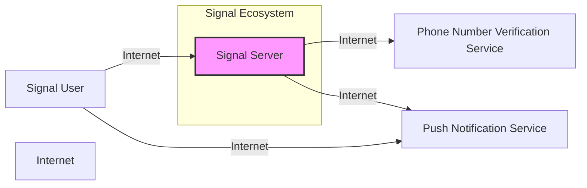
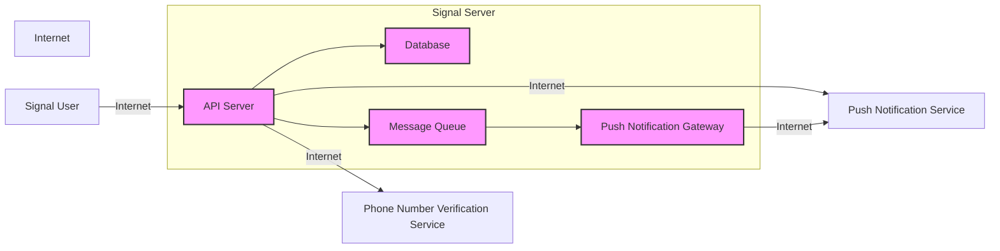
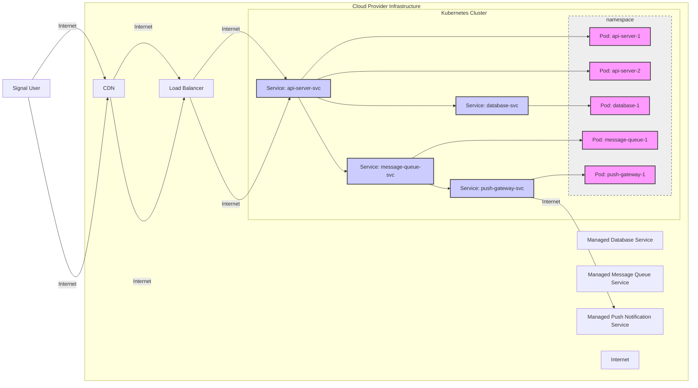

# BUSINESS POSTURE

The Signal Server project aims to provide a reliable, secure, and private messaging platform. The primary business priority is to ensure confidential and secure communication for its users. This involves protecting user privacy, message confidentiality, and system availability. The goal is to enable users to communicate freely and securely without fear of eavesdropping or censorship.

Most important business risks that need to be addressed:
- Data breaches leading to exposure of user messages and metadata.
- Service unavailability disrupting user communication.
- Privacy violations due to unauthorized access or misuse of user data.
- Legal and regulatory compliance issues related to data privacy and security.
- Reputational damage due to security incidents.

# SECURITY POSTURE

Existing security controls:
- security control: End-to-end encryption using Signal Protocol to protect message confidentiality in transit and at rest on user devices. Described in Signal Protocol documentation and implementation within Signal clients and server.
- security control: Open-source codebase allowing for public scrutiny and community security audits. Available on GitHub repository.
- security control: Regular security updates and patching of server software. Implemented through development and release processes.
- security control: Use of TLS/SSL for communication between clients and server. Standard practice for web applications.
- security control: Account registration and authentication mechanisms. Implemented within the server codebase.
- security control: Data storage encryption at rest for sensitive server-side data. Likely implemented in database configuration and server-side code.

Accepted risks:
- accepted risk: Reliance on user devices for key management and end-to-end encryption. Risk of compromise if user devices are insecure.
- accepted risk: Metadata collection (e.g., timestamps, sender/receiver information) necessary for service operation. Risk of metadata analysis and privacy implications.
- accepted risk: Open-source nature may expose vulnerabilities to attackers if not promptly addressed. Requires proactive security monitoring and patching.

Recommended security controls:
- security control: Implement automated security scanning (SAST/DAST) in the CI/CD pipeline to identify and address vulnerabilities early in the development lifecycle.
- security control: Conduct regular penetration testing and security audits by external security experts to identify and remediate security weaknesses.
- security control: Implement rate limiting and DDoS protection mechanisms to ensure service availability and prevent abuse.
- security control: Implement robust logging and monitoring for security events and incident response.
- security control: Implement intrusion detection and prevention systems (IDS/IPS) to detect and respond to malicious activity.

Security requirements:
- Authentication:
    - security requirement: Secure user authentication mechanism to verify user identity.
    - security requirement: Multi-factor authentication (MFA) should be considered for enhanced account security.
- Authorization:
    - security requirement: Role-based access control (RBAC) within the server to manage administrative privileges.
    - security requirement: Proper authorization checks to ensure users can only access their own data and resources.
- Input validation:
    - security requirement: Strict input validation on all user inputs to prevent injection attacks (e.g., SQL injection, command injection).
    - security requirement: Input sanitization to prevent cross-site scripting (XSS) vulnerabilities.
- Cryptography:
    - security requirement: Use strong cryptographic algorithms and protocols for encryption and hashing.
    - security requirement: Secure key management practices for server-side cryptographic keys.
    - security requirement: Proper implementation of Signal Protocol for end-to-end encryption.

# DESIGN

## C4 CONTEXT

Context Diagram Elements:

- Element:
    - Name: Signal User
    - Type: Person
    - Description: Individuals using Signal client applications (mobile or desktop) to send and receive messages.
    - Responsibilities: Sending and receiving messages, managing their Signal account, and ensuring the security of their devices.
    - Security controls: End-to-end encryption key management, device security (passcodes, biometrics), and application security updates.

- Element:
    - Name: Signal Server
    - Type: Software System
    - Description: Backend server infrastructure that facilitates message routing, user registration, group management, and other supporting services for Signal users.
    - Responsibilities: Message routing, user account management, group management, push notification delivery, and phone number verification.
    - Security controls: TLS/SSL for communication, server-side data encryption, authentication and authorization mechanisms, input validation, security logging and monitoring.

- Element:
    - Name: Phone Number Verification Service
    - Type: External System
    - Description: Third-party service used to verify user phone numbers during registration.
    - Responsibilities: Sending and verifying SMS or making phone calls for phone number verification.
    - Security controls: API security (authentication, authorization), secure communication channels (HTTPS).

- Element:
    - Name: Push Notification Service
    - Type: External System
    - Description: Platform-specific services (e.g., Firebase Cloud Messaging (FCM), Apple Push Notification service (APNs)) used to deliver push notifications to user devices.
    - Responsibilities: Delivering push notifications to Signal client applications when new messages arrive or for other events.
    - Security controls: API security (authentication, authorization), secure communication channels (HTTPS), and platform-specific security mechanisms.

- Element:
    - Name: Internet
    - Type: Boundary
    - Description: Public network used for communication between all elements.
    - Responsibilities: Providing network connectivity.
    - Security controls: None directly controlled by Signal Server, relies on underlying network infrastructure security and protocols like TLS/SSL.

## C4 CONTAINER

Container Diagram Elements:

- Element:
    - Name: API Server
    - Type: Web Application
    - Description: RESTful API server that handles client requests, including message submission, user registration, and account management. It's the primary interface for Signal clients to interact with the server.
    - Responsibilities: API endpoint management, request handling, authentication and authorization, input validation, message processing, interaction with database and message queue, and integration with external services.
    - Security controls: TLS/SSL termination, API authentication (e.g., token-based), input validation, rate limiting, security logging, and protection against common web application vulnerabilities (OWASP Top 10).

- Element:
    - Name: Database
    - Type: Data Store
    - Description: Persistent storage for user data, messages (potentially metadata, not message content due to E2EE), account information, group information, and server configuration.
    - Responsibilities: Data persistence, data retrieval, data integrity, and data security at rest.
    - Security controls: Database access control (authentication and authorization), data encryption at rest, database auditing, regular backups, and vulnerability patching.

- Element:
    - Name: Message Queue
    - Type: Message Broker
    - Description: Asynchronous message queue used to decouple the API server from push notification delivery and potentially other background tasks. It helps in handling message processing and push notification delivery in a scalable and reliable manner.
    - Responsibilities: Message queuing, message delivery, and message persistence (depending on the queue implementation).
    - Security controls: Access control to the message queue, message encryption in transit (if supported by the queue), and queue monitoring.

- Element:
    - Name: Push Notification Gateway
    - Type: Service
    - Description: Component responsible for interacting with different push notification services (FCM, APNs) to deliver push notifications to user devices. It abstracts away the complexities of interacting with multiple push notification platforms.
    - Responsibilities: Push notification formatting, delivery to appropriate push notification services, and handling push notification delivery feedback.
    - Security controls: Secure API communication with push notification services (authentication and authorization), handling of sensitive push notification data (e.g., minimal information to trigger client retrieval), and logging of push notification events.

## DEPLOYMENT

Deployment Architecture Option: Cloud-based Containerized Deployment (e.g., Kubernetes on AWS, GCP, or Azure)

Deployment Diagram Elements:

- Element:
    - Name: Load Balancer
    - Type: Infrastructure Component
    - Description: Distributes incoming traffic across multiple API server instances for high availability and scalability.
    - Responsibilities: Traffic distribution, health checks, SSL termination.
    - Security controls: DDoS protection, SSL/TLS configuration, access control lists (ACLs).

- Element:
    - Name: CDN (Content Delivery Network)
    - Type: Infrastructure Component
    - Description: Caches static content and potentially API responses closer to users, improving performance and reducing load on the origin servers.
    - Responsibilities: Content caching, content delivery, DDoS protection.
    - Security controls: Secure content delivery (HTTPS), access control, and CDN provider's security measures.

- Element:
    - Name: Kubernetes Cluster
    - Type: Container Orchestration Platform
    - Description: Manages the deployment, scaling, and operation of containerized application components.
    - Responsibilities: Container orchestration, service discovery, scaling, health monitoring, and resource management.
    - Security controls: Network policies, RBAC, pod security policies/admission controllers, container image security scanning, and Kubernetes security best practices.

- Element:
    - Name: Namespace: signal-server
    - Type: Kubernetes Namespace
    - Description: Logical isolation within the Kubernetes cluster to separate Signal Server resources from other applications.
    - Responsibilities: Resource isolation, access control within the namespace.
    - Security controls: Kubernetes RBAC for namespace access control, network policies to restrict traffic within the namespace.

- Element:
    - Name: Service: api-server-svc
    - Type: Kubernetes Service
    - Description: Abstract way to expose the API server pods running within the Kubernetes cluster. Provides a stable endpoint for accessing the API servers.
    - Responsibilities: Service discovery, load balancing within the Kubernetes cluster.
    - Security controls: Network policies to control access to the service, Kubernetes service account security.

- Element:
    - Name: Pod: api-server-1, Pod: api-server-2
    - Type: Kubernetes Pod
    - Description: Instances of the API server containerized application.
    - Responsibilities: Handling API requests, application logic execution.
    - Security controls: Container security (image scanning, least privilege), application-level security controls (authentication, authorization, input validation).

- Element:
    - Name: Service: database-svc
    - Type: Kubernetes Service
    - Description: Abstract way to expose the database pod.
    - Responsibilities: Service discovery for database access within the cluster.
    - Security controls: Network policies, service account security.

- Element:
    - Name: Pod: database-1
    - Type: Kubernetes Pod
    - Description: Instance of the database containerized application. Could also be replaced by Managed Database Service.
    - Responsibilities: Data storage and retrieval.
    - Security controls: Database security controls (access control, encryption at rest), container security.

- Element:
    - Name: Service: message-queue-svc
    - Type: Kubernetes Service
    - Description: Abstract way to expose the message queue pod.
    - Responsibilities: Service discovery for message queue access within the cluster.
    - Security controls: Network policies, service account security.

- Element:
    - Name: Pod: message-queue-1
    - Type: Kubernetes Pod
    - Description: Instance of the message queue containerized application. Could also be replaced by Managed Message Queue Service.
    - Responsibilities: Message queuing and delivery.
    - Security controls: Message queue access control, container security.

- Element:
    - Name: Service: push-gateway-svc
    - Type: Kubernetes Service
    - Description: Abstract way to expose the push notification gateway pod.
    - Responsibilities: Service discovery for push gateway access within the cluster.
    - Security controls: Network policies, service account security.

- Element:
    - Name: Pod: push-gateway-1
    - Type: Kubernetes Pod
    - Description: Instance of the push notification gateway containerized application.
    - Responsibilities: Push notification delivery.
    - Security controls: Secure communication with push notification services, container security.

- Element:
    - Name: Managed Database Service
    - Type: Cloud Managed Service
    - Description: Cloud provider's managed database service (e.g., AWS RDS, GCP Cloud SQL, Azure SQL Database). Could replace database pods in Kubernetes.
    - Responsibilities: Managed database service, high availability, backups, patching.
    - Security controls: Cloud provider's security controls, database access control, encryption at rest and in transit.

- Element:
    - Name: Managed Message Queue Service
    - Type: Cloud Managed Service
    - Description: Cloud provider's managed message queue service (e.g., AWS SQS, GCP Pub/Sub, Azure Service Bus). Could replace message queue pods in Kubernetes.
    - Responsibilities: Managed message queue service, scalability, reliability.
    - Security controls: Cloud provider's security controls, message queue access control, encryption in transit.

- Element:
    - Name: Managed Push Notification Service
    - Type: Cloud Managed Service
    - Description: Cloud provider's or third-party managed push notification services (e.g., FCM, APNs).
    - Responsibilities: Push notification delivery infrastructure.
    - Security controls: Cloud provider/third-party security controls, API security.

## BUILD

```mermaid
flowchart LR
    dev["Developer"] --> codecommit["Code Commit (GitHub)"]
    codecommit --> pipeline["CI/CD Pipeline (GitHub Actions)"]
    pipeline --> build["Build & Test"]
    build --> sast["SAST Scanner"]
    sast --> containerbuild["Container Image Build"]
    containerbuild --> securityscan["Container Security Scan"]
    securityscan --> artifactrepo["Artifact Repository (Container Registry)"]
    artifactrepo --> deployment["Deployment Automation"]

    style pipeline fill:#f9f,stroke:#333,stroke-width:2px
    style build fill:#f9f,stroke:#333,stroke-width:2px
    style sast fill:#f9f,stroke:#333,stroke-width:2px
    style containerbuild fill:#f9f,stroke:#333,stroke-width:2px
    style securityscan fill:#f9f,stroke:#333,stroke-width:2px
    style artifactrepo fill:#f9f,stroke:#333,stroke-width:2px
```

Build Process Elements:

- Element:
    - Name: Developer
    - Type: Person/Role
    - Description: Software developers writing and committing code changes.
    - Responsibilities: Writing secure code, performing local testing, and committing code changes to the repository.
    - Security controls: Secure development practices, code review, and developer workstation security.

- Element:
    - Name: Code Commit (GitHub)
    - Type: Version Control System
    - Description: GitHub repository hosting the source code of the Signal Server project.
    - Responsibilities: Source code management, version control, and code collaboration.
    - Security controls: Access control to the repository, branch protection, and audit logging.

- Element:
    - Name: CI/CD Pipeline (GitHub Actions)
    - Type: Automation System
    - Description: Automated CI/CD pipeline using GitHub Actions to build, test, scan, and deploy the application.
    - Responsibilities: Automated build, test, security scanning, and deployment processes.
    - Security controls: Secure pipeline configuration, access control to pipeline resources, secret management, and audit logging.

- Element:
    - Name: Build & Test
    - Type: Build Stage
    - Description: Stage in the CI/CD pipeline that compiles the code, runs unit tests, and performs integration tests.
    - Responsibilities: Code compilation, unit testing, and integration testing.
    - Security controls: Build environment security, dependency management, and test case security.

- Element:
    - Name: SAST Scanner
    - Type: Security Tool
    - Description: Static Application Security Testing (SAST) tool integrated into the pipeline to scan the source code for potential vulnerabilities.
    - Responsibilities: Static code analysis for security vulnerabilities.
    - Security controls: SAST tool configuration, vulnerability reporting, and integration with the pipeline.

- Element:
    - Name: Container Image Build
    - Type: Build Stage
    - Description: Stage in the CI/CD pipeline that builds container images for the application components.
    - Responsibilities: Container image creation, image tagging, and image signing.
    - Security controls: Base image selection, minimal image layers, and image signing for integrity.

- Element:
    - Name: Container Security Scan
    - Type: Security Tool
    - Description: Container image security scanner to scan built container images for vulnerabilities before pushing to the artifact repository.
    - Responsibilities: Container image vulnerability scanning.
    - Security controls: Container scanning tool configuration, vulnerability reporting, and integration with the pipeline.

- Element:
    - Name: Artifact Repository (Container Registry)
    - Type: Artifact Storage
    - Description: Secure container registry to store built and scanned container images.
    - Responsibilities: Container image storage, versioning, and access control.
    - Security controls: Access control to the registry, image signing verification, and registry security configuration.

- Element:
    - Name: Deployment Automation
    - Type: Deployment Stage
    - Description: Automated deployment process that pulls container images from the artifact repository and deploys them to the target environment (e.g., Kubernetes).
    - Responsibilities: Automated application deployment, infrastructure provisioning (if applicable), and deployment rollback.
    - Security controls: Secure deployment scripts, infrastructure-as-code security, and deployment environment security.

# RISK ASSESSMENT

Critical business processes we are trying to protect:
- Secure message delivery: Ensuring messages are delivered reliably and confidentially to intended recipients.
- User privacy: Protecting user identity, communication metadata, and any stored user information.
- Service availability: Maintaining continuous operation of the Signal Server to enable uninterrupted communication.

Data we are trying to protect and their sensitivity:
- Message metadata (sender, receiver, timestamps): Highly sensitive - can reveal communication patterns and relationships.
- User account information (phone number, registration details): Highly sensitive - PII, needs strong protection.
- Server-side logs (access logs, audit logs): Sensitive - can contain information about user activity and system events, needs access control and secure storage.
- Server configuration data: Sensitive - if compromised, can lead to system compromise.
- Cryptographic keys (server-side, if any for metadata encryption): Highly sensitive - critical for data confidentiality and integrity.
- Potentially message content metadata (though end-to-end encrypted, server might have some metadata): Highly sensitive - related to communication content.

# QUESTIONS & ASSUMPTIONS

Questions:
- What specific database technology is used for Signal Server? (e.g., PostgreSQL, MySQL, etc.)
- What message queue technology is used? (e.g., RabbitMQ, Kafka, Redis Pub/Sub, etc.)
- What specific push notification services are integrated? (FCM, APNs, others?)
- What is the data retention policy for message metadata and server logs?
- Are there specific compliance requirements (e.g., GDPR, HIPAA) that the Signal Server needs to adhere to?
- What is the incident response plan in case of a security breach?
- What specific SAST/DAST and container scanning tools are used or recommended?
- Is MFA planned or implemented for user accounts or administrative access?

Assumptions:
- The deployment environment is assumed to be a cloud-based infrastructure for scalability and resilience.
- Kubernetes is assumed as the container orchestration platform for managing containerized components.
- GitHub Actions is assumed as the CI/CD platform for build and deployment automation.
- Security is a high priority for the Signal Server project, given its focus on secure communication.
- End-to-end encryption using Signal Protocol is the primary security control for message confidentiality.
- The server primarily handles metadata and supporting functions, not the content of end-to-end encrypted messages.