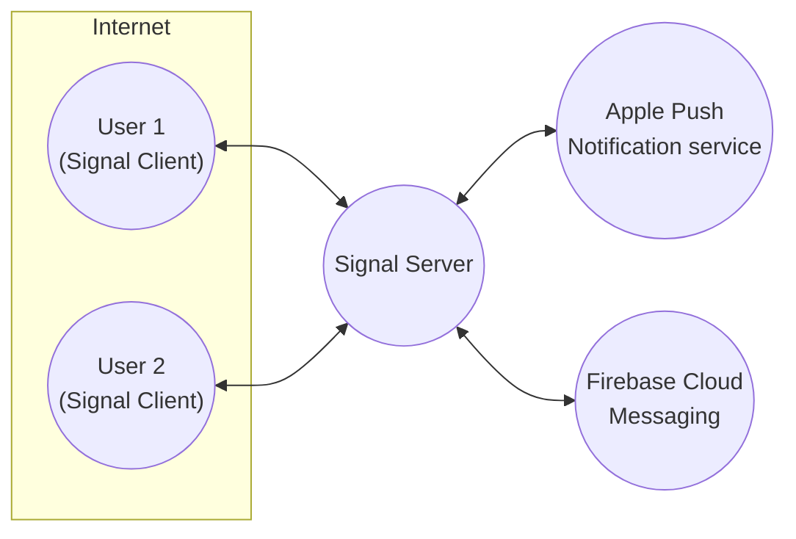
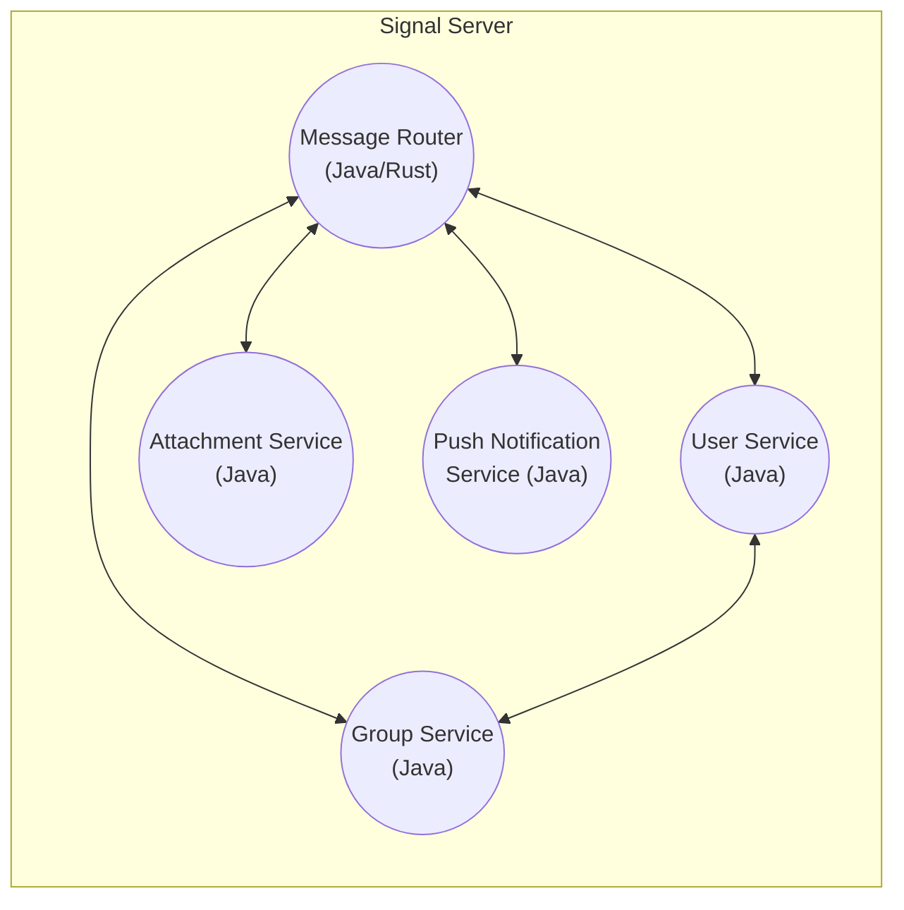
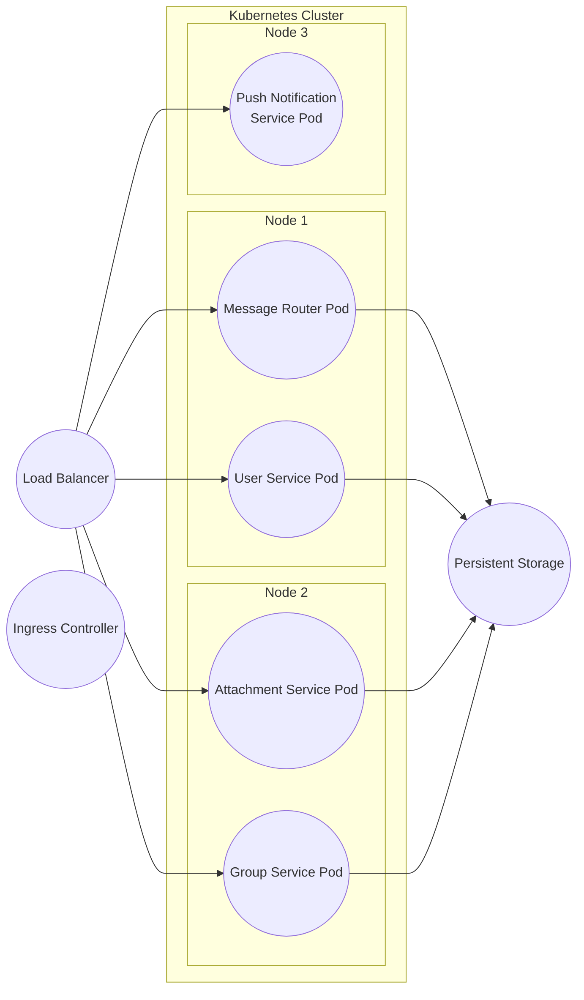
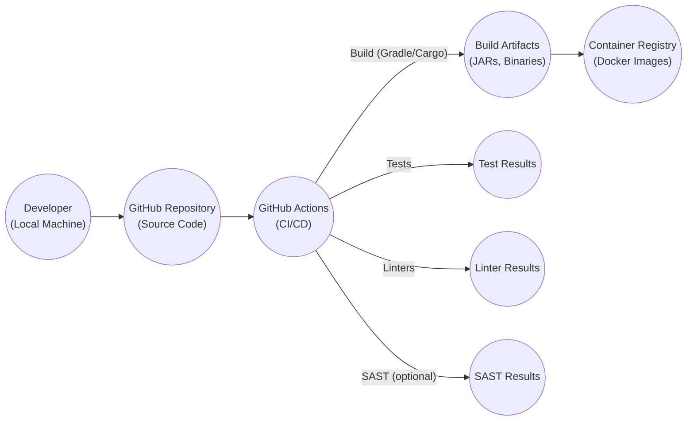

Okay, let's create a design document for the Signal Server, focusing on aspects relevant for threat modeling.

# BUSINESS POSTURE

Signal is a privacy-focused messaging service. Its primary business goal is to provide secure and private communication for its users.  The core value proposition is end-to-end encryption, ensuring that only the communicating users can read the messages.  Any compromise of this core principle would severely damage Signal's reputation and user trust.  Given Signal's user base and mission, the business posture leans towards a very low risk appetite, particularly concerning user data privacy and confidentiality.

Business Priorities:

*   Maintain user privacy and data confidentiality.
*   Ensure the integrity and availability of the messaging service.
*   Maintain user trust and a strong reputation for security.
*   Resist censorship and government surveillance.
*   Provide a reliable and scalable service.

Business Goals:

*   Provide end-to-end encrypted messaging.
*   Minimize data collection and retention.
*   Protect against unauthorized access and data breaches.
*   Ensure service availability and resilience.
*   Maintain transparency and open-source development.

Most Important Business Risks:

*   Compromise of encryption keys or algorithms, leading to mass decryption of messages.
*   Server compromise leading to access to user metadata (even if message content is protected).
*   Denial-of-service attacks disrupting the service.
*   Reputational damage due to security vulnerabilities or privacy breaches.
*   Legal or regulatory challenges that threaten Signal's ability to operate.
*   Supply chain attacks that compromise the integrity of the server software.

# SECURITY POSTURE

Signal employs a variety of security controls, many of which are inherent in its design and protocol. The following are based on the provided GitHub repository and general knowledge of Signal's architecture.

Existing Security Controls:

*   security control: End-to-end encryption (Signal Protocol) for all messages. This is implemented in the client applications and the server facilitates key exchange.
*   security control: Cryptographic deniability.
*   security control: Limited server-side data retention. The server aims to store as little user data as possible.
*   security control: Open-source codebase, allowing for public scrutiny and auditing.
*   security control: Regular security audits and penetration testing (though details are not fully public).
*   security control: Use of memory-safe languages (Rust) for some components to reduce memory corruption vulnerabilities.
*   security control: Certificate Pinning (mentioned in issues and discussions, not explicitly in code).
*   security control: Content Security Policy (CSP) and other web security headers (implied, but best practice).
*   security control: Rate limiting to mitigate abuse and denial-of-service attacks.
*   security control: Input validation to prevent injection attacks.

Accepted Risks:

*   accepted risk: The server temporarily stores encrypted messages until they are delivered to the recipient. This is necessary for asynchronous communication.
*   accepted risk: The server handles user registration and contact discovery, which requires storing some user identifiers (e.g., phone numbers, usernames).
*   accepted risk: Metadata about communication (e.g., sender and recipient, timestamps) is inherently visible to the server, although Signal minimizes this.
*   accepted risk: Reliance on third-party services (e.g., push notification services like APNs and FCM) for message delivery notifications.

Recommended Security Controls:

*   High priority: Implement a robust Software Bill of Materials (SBOM) management system to track all dependencies and their vulnerabilities.
*   High priority: Formalize and document the security audit process, including frequency, scope, and remediation procedures.
*   High priority: Enhance supply chain security measures, including code signing and verification of all build artifacts.
*   High priority: Implement a bug bounty program to incentivize external security researchers to find and report vulnerabilities.

Security Requirements:

*   Authentication:
    *   Users must be authenticated before accessing any server resources.
    *   Authentication mechanisms must be resistant to common attacks (e.g., brute-force, replay).
    *   Support for multi-factor authentication (MFA) should be considered.
*   Authorization:
    *   Access control must be enforced based on the principle of least privilege.
    *   Users should only be able to access their own data and authorized resources.
    *   The server should not have access to the plaintext content of messages.
*   Input Validation:
    *   All input from clients must be strictly validated to prevent injection attacks (e.g., SQL injection, cross-site scripting).
    *   Input validation should be performed on the server-side, even if client-side validation is also implemented.
*   Cryptography:
    *   Strong, well-vetted cryptographic algorithms and protocols must be used for all security-critical operations.
    *   Key management must be secure and follow best practices.
    *   Cryptographic operations should be performed using secure libraries and hardware modules where available.
    *   Regularly review and update cryptographic algorithms and key lengths to stay ahead of evolving threats.

# DESIGN

## C4 CONTEXT

Context Diagram Element Descriptions:

*   Element:
    *   Name: User 1
    *   Type: Person
    *   Description: A user of the Signal messaging service.
    *   Responsibilities: Sending and receiving messages, managing contacts, managing their account.
    *   Security controls: End-to-end encryption, device verification, safety number checks.

*   Element:
    *   Name: User 2
    *   Type: Person
    *   Description: Another user of the Signal messaging service.
    *   Responsibilities: Sending and receiving messages, managing contacts, managing their account.
    *   Security controls: End-to-end encryption, device verification, safety number checks.

*   Element:
    *   Name: Signal Server
    *   Type: Software System
    *   Description: The server infrastructure that facilitates communication between Signal clients.
    *   Responsibilities: User registration, contact discovery, message routing, group management, push notification relay.
    *   Security controls: Rate limiting, input validation, limited data retention, access controls.

*   Element:
    *   Name: APNs
    *   Type: External System
    *   Description: Apple Push Notification service, used to deliver notifications to iOS devices.
    *   Responsibilities: Delivering push notifications to iOS devices.
    *   Security controls: TLS encryption, authentication with Apple's servers.

*   Element:
    *   Name: FCM
    *   Type: External System
    *   Description: Firebase Cloud Messaging, used to deliver notifications to Android and other devices.
    *   Responsibilities: Delivering push notifications to Android and other devices.
    *   Security controls: TLS encryption, authentication with Google's servers.

## C4 CONTAINER

Container Diagram Element Descriptions:

*   Element:
    *   Name: Message Router
    *   Type: Container (Application)
    *   Description: Handles the routing of encrypted messages between users.
    *   Responsibilities: Receiving messages from senders, determining recipients, forwarding messages, handling undelivered messages.
    *   Security controls: Input validation, rate limiting, access controls.

*   Element:
    *   Name: User Service
    *   Type: Container (Application)
    *   Description: Manages user accounts, registration, and contact discovery.
    *   Responsibilities: User registration, profile management, contact synchronization, authentication.
    *   Security controls: Password hashing, input validation, rate limiting, access controls.

*   Element:
    *   Name: Attachment Service
    *   Type: Container (Application)
    *   Description: Handles the storage and retrieval of encrypted attachments.
    *   Responsibilities: Storing encrypted attachments, providing access to authorized users, managing storage quotas.
    *   Security controls: Access controls, encryption key management, input validation.

*   Element:
    *   Name: Group Service
    *   Type: Container (Application)
    *   Description: Manages group messaging functionality.
    *   Responsibilities: Creating and managing groups, adding and removing members, distributing group messages.
    *   Security controls: Access controls, input validation, rate limiting.

*   Element:
    *   Name: Push Notification Service
    *   Type: Container (Application)
    *   Description: Interfaces with APNs and FCM to send push notifications.
    *   Responsibilities: Receiving notification requests, formatting notifications, sending notifications to APNs and FCM.
    *   Security controls: API key management, rate limiting, input validation.

## DEPLOYMENT

Possible Deployment Solutions:

1.  Kubernetes: Deploying the Signal Server components as containers within a Kubernetes cluster. This provides scalability, resilience, and automated deployment.
2.  Traditional VMs: Deploying the components on virtual machines, managed by a configuration management system like Ansible or Chef.
3.  Bare Metal: Deploying directly on physical servers, offering maximum control but requiring more manual management.

Chosen Solution (Kubernetes):

Deployment Diagram Element Descriptions:

*   Element:
    *   Name: Message Router Pod
    *   Type: Kubernetes Pod
    *   Description: An instance of the Message Router container.
    *   Responsibilities: See Message Router container description.
    *   Security controls: Network policies, resource limits, security context.

*   Element:
    *   Name: User Service Pod
    *   Type: Kubernetes Pod
    *   Description: An instance of the User Service container.
    *   Responsibilities: See User Service container description.
    *   Security controls: Network policies, resource limits, security context.

*   Element:
    *   Name: Attachment Service Pod
    *   Type: Kubernetes Pod
    *   Description: An instance of the Attachment Service container.
    *   Responsibilities: See Attachment Service container description.
    *   Security controls: Network policies, resource limits, security context.

*   Element:
    *   Name: Group Service Pod
    *   Type: Kubernetes Pod
    *   Description: An instance of the Group Service container.
    *   Responsibilities: See Group Service container description.
    *   Security controls: Network policies, resource limits, security context.

*   Element:
    *   Name: Push Notification Service Pod
    *   Type: Kubernetes Pod
    *   Description: An instance of the Push Notification Service container.
    *   Responsibilities: See Push Notification Service container description.
    *   Security controls: Network policies, resource limits, security context.

*   Element:
    *   Name: Load Balancer
    *   Type: Load Balancer
    *   Description: Distributes incoming traffic across multiple pods.
    *   Responsibilities: Load balancing, health checks.
    *   Security controls: TLS termination, DDoS protection.

*   Element:
    *   Name: Ingress Controller
    *   Type: Kubernetes Ingress Controller
    *   Description: Manages external access to the services.
    *   Responsibilities: Routing traffic based on hostnames and paths, TLS termination.
    *   Security controls: TLS configuration, access controls.

*   Element:
    *   Name: Persistent Storage
    *   Type: Persistent Volume
    *   Description: Provides persistent storage for data that needs to survive pod restarts.
    *   Responsibilities: Data persistence.
    *   Security controls: Encryption at rest, access controls.

## BUILD

The Signal Server build process appears to be primarily based on Gradle (for Java components) and Cargo (for Rust components). There's evidence of continuous integration (CI) using GitHub Actions, but the specifics are scattered across multiple workflow files.

Build Process Description:

1.  Developers commit code to the GitHub repository.
2.  GitHub Actions triggers a workflow based on the commit or pull request.
3.  The workflow checks out the code.
4.  Gradle (for Java) and/or Cargo (for Rust) builds the project.
5.  Unit tests and integration tests are executed.
6.  Linters (e.g., Checkstyle, Clippy) are run to enforce code style and identify potential issues.
7.  Optionally, Static Application Security Testing (SAST) tools could be integrated to scan for vulnerabilities.
8.  If all checks pass, build artifacts (JAR files, binaries, Docker images) are created.
9.  Docker images are pushed to a container registry.

Security Controls in Build Process:

*   security control: Automated builds ensure consistency and reproducibility.
*   security control: Unit and integration tests help catch bugs early.
*   security control: Linters enforce code style and identify potential issues.
*   security control: (Recommended) Integrate SAST tools to scan for vulnerabilities.
*   security control: (Recommended) Implement Software Bill of Materials (SBOM) generation to track dependencies.
*   security control: (Recommended) Implement code signing of build artifacts.
*   security control: (Recommended) Use a secure container registry with access controls and vulnerability scanning.

# RISK ASSESSMENT

Critical Business Processes to Protect:

*   End-to-end encrypted message delivery.
*   User registration and authentication.
*   Contact discovery.
*   Group messaging.
*   Service availability.

Data to Protect and Sensitivity:

*   User identifiers (phone numbers, usernames): Sensitive, but necessary for service functionality. Must be protected from unauthorized access.
*   Encrypted messages: Highly sensitive, but protected by end-to-end encryption. The server should never have access to the plaintext.
*   Message metadata (sender, recipient, timestamp): Sensitive, but inherently visible to the server. Should be minimized and protected.
*   Attachments: Highly sensitive, but protected by end-to-end encryption.
*   Group membership information: Sensitive, should be protected from unauthorized access.
*   Server configuration and credentials: Highly sensitive, must be protected from unauthorized access.

# QUESTIONS & ASSUMPTIONS

Questions:

*   What are the specific SAST tools used, if any?
*   What is the exact process for handling security vulnerabilities discovered through audits or reports?
*   What are the specific details of the rate limiting implementation?
*   What are the disaster recovery and business continuity plans?
*   What are the specific procedures for key management (e.g., key rotation, backup)?
*   What is the process for managing and rotating TLS certificates?
*   What are the specific details of the persistent storage solution used in the Kubernetes deployment?
*   How are database connections secured and managed?
*   Are there any specific compliance requirements (e.g., GDPR, HIPAA) that need to be considered?

Assumptions:

*   BUSINESS POSTURE: Signal prioritizes user privacy and security above all else.
*   BUSINESS POSTURE: Signal operates in a high-threat environment, facing potential attacks from nation-states and sophisticated adversaries.
*   SECURITY POSTURE: The Signal Protocol is implemented correctly and securely in both the client and server components.
*   SECURITY POSTURE: The server infrastructure is regularly patched and updated to address security vulnerabilities.
*   SECURITY POSTURE: Access to the server infrastructure is strictly controlled and monitored.
*   DESIGN: The provided GitHub repository represents the core components of the Signal Server.
*   DESIGN: The deployment environment is a Kubernetes cluster.
*   DESIGN: The build process is automated using GitHub Actions.
*   DESIGN: Secure coding practices are followed throughout the development lifecycle.