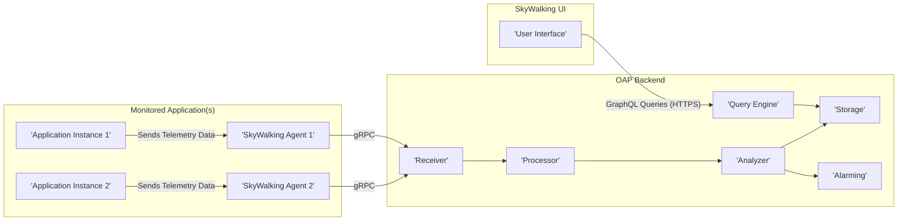
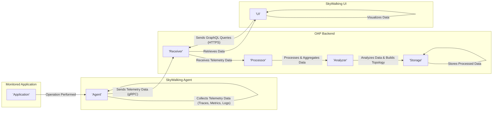

## Project Design Document: Apache SkyWalking (Improved)

**1. Introduction**

This document provides an enhanced design overview of the Apache SkyWalking project, focusing on its architecture, components, data flow, and key functionalities. It serves as a foundation for subsequent threat modeling activities, enabling a deeper understanding of potential security vulnerabilities and attack vectors. This improved version aims for greater clarity and detail.

**2. Purpose**

The purpose of this document is to:

*   Provide a clear and comprehensive description of the Apache SkyWalking architecture, with added detail.
*   Identify the key components and their specific interactions within the system.
*   Outline the data flow and processing mechanisms with protocol specifics.
*   Serve as a robust basis for conducting thorough threat modeling exercises.
*   Facilitate more informed communication and understanding among stakeholders.

**3. Scope**

This document covers the core architecture and functionalities of Apache SkyWalking, with a more granular focus on the following aspects:

*   The different types of agents used to collect telemetry data and their communication protocols.
*   The OpenTelemetry Collector (OAP) backend and its key internal modules, including their specific responsibilities.
*   The user interface (UI) for visualizing and analyzing data and its interaction with the backend.
*   The detailed data flow paths within the system, specifying protocols and data formats.
*   Common deployment scenarios and their security implications.

This document still avoids delving into the specifics of individual agent implementations or highly granular configuration options, but provides more context for these areas.

**4. Target Audience**

This document is intended for:

*   Security engineers and architects responsible for detailed threat modeling and security assessments.
*   Software developers working on or deeply integrating with Apache SkyWalking components.
*   Operations engineers deploying and managing SkyWalking instances in production environments.
*   Anyone requiring a thorough and technically detailed understanding of the SkyWalking architecture for security analysis.

**5. System Overview**

Apache SkyWalking is an open-source Application Performance Monitoring (APM) system, observability analysis platform, and application tracing system designed for distributed systems. It excels in monitoring microservices, cloud-native, and container-based architectures, providing capabilities for tracing, metrics, and logging analysis. The core components collaboratively collect, analyze, and visualize telemetry data from monitored applications.

**6. Component Details**

*   **SkyWalking Agents:**
    *   **Purpose:** To collect telemetry data (traces, metrics, logs) from instrumented applications with minimal overhead.
    *   **Functionality:**
        *   Intercept application requests and responses using bytecode manipulation or SDK integration.
        *   Generate and propagate distributed tracing context using headers or context propagation mechanisms.
        *   Collect performance metrics (e.g., response time, error rate, CPU/memory usage).
        *   Optionally collect application logs and correlate them with traces.
        *   Transmit collected data to the OAP backend, typically using gRPC.
    *   **Types:**
        *   Language-specific agents (Java, .NET, Node.js, Python, Go, etc.).
        *   Service Mesh agents (integrated with service mesh control planes like Istio).
        *   Browser agents (for frontend monitoring).
    *   **Key Interactions:**
        *   Communicates with the instrumented application via in-process mechanisms or sidecar proxies.
        *   Communicates with the OAP backend using gRPC, potentially secured with TLS.
    *   **Data Handled:** Trace segments (containing spans), metrics, logs, service instance metadata.
    *   **Security Considerations:** Agent vulnerabilities can directly impact the monitored application. Secure configuration and updates are critical.

*   **OpenTelemetry Collector (OAP) Backend:**
    *   **Purpose:** To receive, process, analyze, and store telemetry data from agents and other sources.
    *   **Functionality (Internal Modules):**
        *   **Receiver:** Accepts data from various agents and sources using protocols like gRPC (SkyWalking native), gRPC (OpenTelemetry Protocol - OTLP), and HTTP (various formats).
        *   **Processor:** Performs data transformation, aggregation (e.g., calculating service-level metrics), filtering, and sampling.
        *   **Analyzer:** Analyzes trace data to build service topology, identify performance bottlenecks, detect anomalies, and infer dependencies.
        *   **Storage:** Persists processed data in a configurable storage backend. Supports various options like Elasticsearch, Apache Cassandra, TiDB, BanyanDB, and others, each with different consistency and performance characteristics.
        *   **Query Engine:** Provides an interface (typically GraphQL) for querying and retrieving stored data for the UI and other consumers.
        *   **Alarming:** Evaluates incoming metrics and trace data against predefined rules to trigger alerts and notifications.
    *   **Key Interactions:**
        *   Receives data from agents via gRPC or other configured protocols.
        *   Internal communication between modules often uses in-memory queues or internal APIs.
        *   Interacts with the storage backend using its specific client libraries or APIs.
        *   Provides data to the UI via GraphQL over HTTP(S).
    *   **Data Handled:** Raw trace segments, processed traces, aggregated metrics, logs, service topology information, alarms.
    *   **Security Considerations:**  The OAP backend is a central component and a prime target for attacks. Secure configuration, authentication, authorization, and input validation are crucial.

*   **SkyWalking UI:**
    *   **Purpose:** To provide a user-friendly web interface for visualizing and analyzing the collected telemetry data.
    *   **Functionality:**
        *   Displays interactive service topology maps and dependency graphs.
        *   Visualizes detailed trace timelines and span information.
        *   Presents performance metrics in customizable dashboards and graphs.
        *   Allows users to search and filter data based on various criteria (e.g., service, operation, time range).
        *   Displays alarms and notifications with details and context.
        *   Provides functionalities for log exploration and correlation with traces.
    *   **Key Interactions:**
        *   Queries the OAP backend's GraphQL endpoint over HTTP(S) to retrieve data.
        *   User interaction via a web browser.
    *   **Data Handled:** Processed traces, metrics, logs, and alarms retrieved from the OAP backend for display. User credentials for authentication.
    *   **Security Considerations:**  The UI needs protection against common web application vulnerabilities. Secure authentication and authorization are essential to prevent unauthorized access to sensitive data.

**7. Data Flow**

The typical data flow within Apache SkyWalking involves these detailed steps:

1. A monitored application executes an operation (e.g., receives an HTTP request, processes a message).
2. The SkyWalking agent, integrated into the application, intercepts the operation.
3. The agent generates trace segments (spans) detailing the operation's execution, including timestamps, involved components, and any errors. For distributed tracing, it adds context information (trace ID, span ID) to the outgoing request headers or context propagation mechanisms.
4. For downstream services, the receiving SkyWalking agent extracts the tracing context from the incoming request.
5. The agent collects performance metrics related to the operation, such as response time, error counts, and resource utilization.
6. Optionally, the agent collects application logs and associates them with the current trace context.
7. The agent batches the collected telemetry data and transmits it to the OAP backend, typically using gRPC with a defined schema. This communication can be secured with TLS.
8. The OAP backend's **Receiver** component accepts the data via the gRPC endpoint.
9. The **Processor** component transforms and aggregates the incoming data. This might involve calculating service-level metrics or filtering out irrelevant data.
10. The **Analyzer** component analyzes the trace data to build the service topology, identify performance bottlenecks, and detect anomalies. It infers service dependencies based on the trace data.
11. The **Storage** component persists the processed data in the configured backend (e.g., Elasticsearch) using its specific client API.
12. A user accesses the SkyWalking UI through a web browser, establishing an HTTPS connection.
13. The UI sends GraphQL queries over HTTPS to the OAP backend's **Query Engine**. These queries request specific telemetry data based on user actions.
14. The **Query Engine** retrieves the requested data from the **Storage** backend.
15. The OAP backend sends the queried data back to the UI over HTTPS in JSON format.
16. The UI processes the received data and visualizes it for the user in dashboards, trace views, and topology maps.

**8. Deployment Architecture**

Apache SkyWalking offers flexible deployment options:

*   **Standalone Deployment:** A single OAP backend instance and a single UI instance. This is suitable for development, testing, or small-scale environments. All components run in a single process or set of processes on one machine.
*   **Clustered Deployment:** Multiple OAP backend instances are deployed for high availability, fault tolerance, and increased processing capacity. This requires a distributed storage backend like Elasticsearch or Cassandra. Load balancers are used to distribute traffic across the OAP backend instances. The UI can also be deployed in a clustered manner for high availability.
*   **Containerized Deployment (e.g., Kubernetes):**  All components (agents, OAP backend, UI) are deployed as containers within a container orchestration platform like Kubernetes. This allows for easy scaling, management, and resource utilization. Service discovery mechanisms within Kubernetes can be leveraged.
*   **Agent Deployment:** Agents are typically deployed as libraries within the application process (in-process) or as sidecar containers alongside the application containers in containerized environments. Service mesh integrations often involve agents deployed as part of the mesh infrastructure.

**9. Security Considerations (Detailed)**

This section provides a more detailed overview of security considerations for threat modeling:

*   **Agent Security Threats:**
    *   **Compromised Agent:** A malicious actor could exploit vulnerabilities in the agent code to gain control of the monitored application.
    *   **Data Interception:** If communication between the agent and the OAP backend is not encrypted (e.g., using TLS), sensitive telemetry data could be intercepted.
    *   **Tampering:**  An attacker could modify the agent's configuration or code to send false or misleading data to the OAP backend, leading to incorrect analysis and potentially masking malicious activity.
    *   **Unauthorized Access:**  Improperly secured agent configurations could allow unauthorized access or modification.
*   **OAP Backend Security Threats:**
    *   **Unauthorized Access:** Without proper authentication and authorization, attackers could gain access to the OAP backend, potentially viewing sensitive data or manipulating configurations.
    *   **Data Breach:**  If the storage backend is compromised or access controls are weak, sensitive telemetry data could be exposed.
    *   **Injection Attacks:**  Lack of input validation in the receiver or query engine could lead to injection attacks (e.g., SQL injection against the storage backend).
    *   **Denial of Service (DoS):**  Attackers could flood the OAP backend with malicious or excessive data, causing it to become unavailable.
    *   **Internal Communication Security:**  Lack of secure communication between internal OAP modules could expose data in transit.
*   **UI Security Threats:**
    *   **Authentication and Authorization Bypass:** Vulnerabilities in the UI's authentication or authorization mechanisms could allow unauthorized access.
    *   **Cross-Site Scripting (XSS):**  Attackers could inject malicious scripts into the UI, potentially stealing user credentials or performing actions on their behalf.
    *   **Cross-Site Request Forgery (CSRF):**  Attackers could trick authenticated users into performing unintended actions on the SkyWalking UI.
    *   **Data Exposure:**  Improperly secured UI endpoints could expose sensitive telemetry data.
*   **Data Security Threats:**
    *   **Confidentiality Breach:**  Telemetry data might contain sensitive information (e.g., API keys, user IDs). Lack of encryption at rest and in transit could lead to data breaches.
    *   **Integrity Violation:**  Tampering with telemetry data could lead to incorrect analysis and decision-making.
    *   **Availability Disruption:**  Attacks targeting the storage backend or OAP backend could make telemetry data unavailable.

**10. Technologies Used**

*   **Programming Languages:** Java (primarily for OAP backend and some agents), Go (some agents and components), JavaScript (UI).
*   **Communication Protocols:** gRPC (primary for agent-to-backend communication), HTTP/HTTPS (for UI and some data ingestion), GraphQL (for UI data queries).
*   **Storage Backends:** Elasticsearch, Apache Cassandra, TiDB, BanyanDB, Apache IoTDB, InfluxDB (various options with different characteristics).
*   **Message Queues (Optional):** Apache Kafka, Apache RocketMQ (for buffering or asynchronous processing).
*   **Web Framework (UI):**  Primarily JavaScript frameworks like Vue.js or React.

**11. Diagrams**

*   **High-Level Architecture Diagram:**

*   **Detailed Data Flow Diagram:**

**12. Future Considerations**

This design document will be continuously reviewed and updated to reflect the evolving architecture of Apache SkyWalking. Future updates may include more detailed information on specific plugin architectures, advanced security features implementation details, integration with other observability platforms, and considerations for edge deployments.