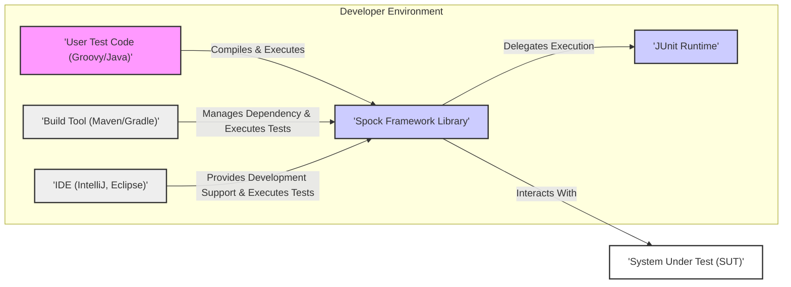
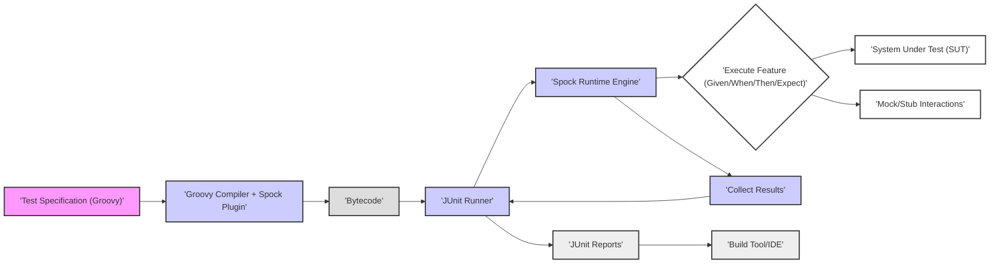

## Project Design Document: Spock Framework

**Version:** 1.1
**Date:** October 26, 2023
**Author:** AI Software Architect

### 1. Project Overview

This document provides a detailed design of the Spock Framework, a powerful testing and specification framework for Java and Groovy applications. Spock is renowned for its expressive and highly readable specification language, built upon the foundation of JUnit. This document aims to offer a comprehensive understanding of Spock's architecture, its constituent components, and the flow of data during test execution. This detailed design will serve as a crucial foundation for subsequent threat modeling activities.

### 2. Goals and Objectives

* **To provide a clear and granular architectural overview of the Spock Framework.** This includes a detailed breakdown of key components, their specific responsibilities, and the nature of their interactions.
* **To meticulously describe the data flow within the framework during the execution of test specifications.** This aims to clarify how test specifications are processed, the transformations applied to data, and how results are ultimately generated.
* **To explicitly identify potential areas of interest from a security perspective, specifically to facilitate thorough threat modeling.** This involves highlighting potential vulnerabilities and attack surfaces within the framework and its integration points.
* **To serve as a reliable and comprehensive reference document for future development, maintenance, and security analysis efforts related to the Spock Framework.**

### 3. Target Audience

This document is primarily intended for:

* Security engineers and architects responsible for conducting threat modeling and security assessments.
* Developers actively contributing to the development and maintenance of the Spock Framework.
* DevOps engineers involved in the integration of Spock into continuous integration and continuous delivery (CI/CD) pipelines.
* Anyone seeking an in-depth understanding of the internal workings and architecture of the Spock Framework.

### 4. System Architecture

Spock is architected as a library that seamlessly integrates within the Java Virtual Machine (JVM) environment and interacts closely with build automation tools. It leverages the dynamic capabilities of the Groovy language to provide its distinctive expressive syntax for writing tests. The core architectural structure can be visualized as follows:

**Key Architectural Characteristics:**

* **Library-Based Integration:** Spock functions primarily as a library that is incorporated as a dependency within a project. It is not designed to operate as a standalone service or application.
* **Foundation on JUnit:** Spock is built upon the established JUnit framework. The actual execution of Spock specifications is ultimately handled by the JUnit runtime environment.
* **Groovy Language Utilization:** Spock specifications are predominantly written using the Groovy programming language, leveraging its features to enable the creation of concise and highly readable test code.
* **Build Tool Integration for Lifecycle Management:** Build tools such as Maven and Gradle play a crucial role in managing Spock as a project dependency and orchestrating the execution of Spock tests as part of the build process.
* **Integrated Development Environment (IDE) Support:** Popular IDEs offer specific features and plugins that enhance the experience of writing, running, and debugging Spock specifications directly within the development environment.

### 5. Components

The Spock Framework can be further dissected into the following essential components, each with distinct responsibilities:

* **Spock Core Library:**
    * Contains the fundamental classes and interfaces necessary for defining test specifications, features (test methods), and the structured blocks within features (e.g., `given`, `when`, `then`, `expect`).
    * Houses the Spock runtime engine, which is responsible for orchestrating the execution of test specifications and managing the test lifecycle.
    * Provides built-in support for key testing paradigms such as data-driven testing (parameterized tests), mocking of dependencies, and stubbing of external interactions.
    * Manages the generation and reporting of test execution results, including successes, failures, and error details.
* **Spock Extensions:**
    * Offers a powerful mechanism for extending the core functionality of Spock and tailoring it to specific needs.
    * Examples of common extensions include integrations with frameworks like Spring (for dependency injection and testing of Spring components) and REST Assured (for testing RESTful APIs).
    * Extensions can intercept and modify the test lifecycle at various points, allowing for custom behavior and integrations.
* **Spock Compiler Plugin:**
    * Integrates seamlessly with the Groovy compiler to enable the processing of Spock specification files.
    * Performs static analysis on Spock specifications, ensuring adherence to the framework's syntax and rules.
    * Transforms the expressive Spock syntax into standard Java bytecode that can be executed by the JVM.
* **JUnit Runner Integration:**
    * Spock specifications are ultimately executed by a JUnit-compatible runner.
    * This ensures seamless integration with existing JUnit infrastructure, reporting tools, and build processes that rely on JUnit.
* **Build Tool Plugins (Maven/Gradle):**
    * Dedicated plugins for build tools like Maven and Gradle simplify the integration of Spock into the project's build process.
    * These plugins handle the management of Spock as a dependency, automatically compile Spock specifications, and execute tests as part of the build lifecycle.
* **IDE Integration Plugins:**
    * IDE-specific plugins enhance the developer experience by providing features such as syntax highlighting for Spock specifications, intelligent code completion, and the ability to execute and debug Spock tests directly within the IDE.

### 6. Data Flow

The typical flow of data during the execution of a Spock specification can be broken down into the following steps:

1. **Test Specification Authoring:** Developers create test specifications using the Groovy language (or, in some cases, Java with certain limitations). These specifications define the expected behavior of the System Under Test (SUT). The specification code itself represents data defining the test scenario.
2. **Compilation Phase:** The Groovy compiler, augmented by the Spock compiler plugin, processes the specification files. This involves parsing the Spock syntax, performing static analysis, and transforming the specifications into executable bytecode. The specification code is effectively transformed into executable instructions.
3. **Test Execution Initiation:** The developer or the build tool triggers the test execution process. This can be done through the IDE's testing interface or by invoking a test execution command within the build tool (e.g., `mvn test` or `gradle test`). The request to execute the tests acts as an initial data point.
4. **JUnit Runner Invocation:** The build tool or IDE invokes the configured JUnit runner, which is responsible for discovering and executing tests. In the case of Spock, the runner is configured to handle Spock specifications. The list of specifications to execute is passed as data to the runner.
5. **Spock Runtime Engine Initialization:** The Spock runtime engine is initialized by the JUnit runner. This engine is responsible for managing the lifecycle of the Spock specifications and features. Configuration data and metadata about the specifications are loaded into the runtime engine.
6. **Specification Discovery and Loading:** The JUnit runner and the Spock runtime engine collaborate to identify and load the available Spock specifications. The file paths and class names of the specifications are processed.
7. **Feature Execution Loop:** For each feature (test method) within a specification:
    * **Setup Block Execution (`given`):** Code within the `given` block is executed to set up the necessary test context and prepare any required data or dependencies. Data is initialized and prepared for the test.
    * **Stimulus Block Execution (`when`):** The code within the `when` block is executed, representing the action or event being tested on the SUT. Data is passed to the SUT.
    * **Outcome Block Evaluation (`then`):** Assertions within the `then` block are evaluated to verify that the actual outcome matches the expected outcome. Data from the SUT is compared against expected values.
    * **Exception Block Handling (`expect`):** (Alternative to `then`) Verifies that a specific exception is thrown during the execution of the `when` block. The type and message of the exception are evaluated.
    * **Cleanup Block Execution (`cleanup` / `finally`):** Code within the `cleanup` or `finally` blocks is executed to release resources, reset the system state, or perform any necessary post-test actions. Data related to the test context is potentially modified or discarded.
8. **Data-Driven Testing (Optional):** If the specification utilizes data tables, the feature is executed multiple times, each time with a different set of data from the table. The data table itself acts as input data for the test.
9. **Mock and Stub Interactions:** During test execution, Spock's mocking and stubbing capabilities intercept interactions with dependencies, allowing for controlled behavior and isolation of the SUT. Data is exchanged with mock objects instead of real dependencies.
10. **Result Collection and Reporting:** The Spock runtime engine gathers the results of each feature execution, including pass/fail status, any error messages, and captured output. This test result data is aggregated.
11. **JUnit Reporting Integration:** The collected test results are passed back to the JUnit runner, which formats them into standard JUnit reports (e.g., XML reports). The structured test result data is outputted.
12. **Build Tool and IDE Reporting:** The build tool or IDE consumes the JUnit reports and presents the test results to the developer in a user-friendly format. The formatted test results are displayed.

### 7. Security Considerations

While Spock is primarily a development-time tool, several security considerations are relevant for threat modeling:

* **Dependency Vulnerabilities:** Spock relies on external libraries such as Groovy and JUnit. Known vulnerabilities in these dependencies could be exploited if not properly managed.
    * **Threat:** An attacker could leverage a vulnerability in a Spock dependency to compromise the build environment or developer machines.
    * **Mitigation:** Regularly update Spock and all its dependencies to the latest stable versions. Employ dependency scanning tools to identify and address known vulnerabilities.
* **Malicious Test Code Injection:** Developers have the ability to write arbitrary code within Spock specifications. This opens the possibility of malicious code being introduced into the test suite.
    * **Threat:** A malicious developer could write test code that attempts to access sensitive data, modify system configurations, or introduce backdoors during the test execution phase.
    * **Mitigation:** Implement strict code review processes for all test code. Enforce access controls to limit who can modify test specifications. Consider static analysis tools to detect potentially malicious patterns in test code.
* **Vulnerabilities within the Spock Framework:** Although less common, vulnerabilities could potentially exist within the Spock framework's codebase itself.
    * **Threat:** A vulnerability in Spock could be exploited to bypass security controls or gain unauthorized access during test execution.
    * **Mitigation:** Stay informed about the latest Spock releases and security advisories. Report any discovered vulnerabilities to the Spock project maintainers. Encourage community security audits.
* **Information Disclosure in Test Reports:** Test reports might inadvertently contain sensitive information if not handled carefully during test setup or assertions.
    * **Threat:** Sensitive data like API keys, database credentials, or personal information could be exposed in test reports, potentially accessible to unauthorized individuals.
    * **Mitigation:** Avoid hardcoding sensitive information directly in test code. Utilize secure methods for managing and accessing sensitive data during tests (e.g., environment variables, secrets management). Sanitize test reports to remove any sensitive information before sharing.
* **Build Tool Security Risks:** The security of the build tools (Maven, Gradle) used to execute Spock tests is critical. Vulnerabilities in these tools could be exploited during the test execution process.
    * **Threat:** An attacker could exploit a vulnerability in the build tool to compromise the build environment, potentially leading to the injection of malicious code into the final application.
    * **Mitigation:** Keep build tools updated to the latest secure versions. Follow security best practices for build tool configuration and plugin management. Restrict access to build tool configurations.
* **IDE Security Posture:** The security of the IDE used for developing and running Spock tests can also be a potential concern.
    * **Threat:** A compromised IDE could allow an attacker to inject malicious code into test specifications or gain access to sensitive project information.
    * **Mitigation:** Use reputable IDEs and keep them updated with the latest security patches. Be cautious about installing untrusted IDE plugins. Enforce security policies for developer workstations.

### 8. Deployment

Spock itself is not deployed as a standalone application. Instead, its "deployment" refers to its integration into the software development lifecycle of a project. This involves:

* **Dependency Declaration:** Adding the Spock framework as a dependency within the project's build configuration file (e.g., `pom.xml` for Maven, `build.gradle` for Gradle).
* **Build Tool Plugin Configuration:** Ensuring that the appropriate build tool plugins for Spock are correctly configured within the build file.
* **Developer Environment Setup:** Developers utilizing IDEs with Spock support to author, execute, and debug test specifications.
* **CI/CD Pipeline Integration:** Incorporating Spock test execution as a crucial step within the Continuous Integration and Continuous Delivery (CI/CD) pipeline, typically managed by the build tool.

### 9. Technologies Used

* **Groovy:** The primary dynamic language used for writing Spock test specifications.
* **Java:** Spock runs on the Java Virtual Machine (JVM) and interacts seamlessly with Java code.
* **JUnit:** The foundational testing framework upon which Spock is built.
* **Maven and Gradle:** Widely used build automation tools for managing Spock dependencies and executing tests.
* **Integrated Development Environments (IDEs):** Popular IDEs such as IntelliJ IDEA and Eclipse provide dedicated support for Spock development.

### 10. Future Considerations

* **Ongoing development and enhancement of Spock's extension model to facilitate new integrations and expand its functionality.**
* **Potential improvements to test reporting capabilities, offering more detailed and customizable reports.**
* **Focus on optimizing the performance and efficiency of Spock test execution, especially for large test suites.**
* **Maintaining compatibility and alignment with the latest versions of Groovy, Java, and JUnit.**

This revised document provides a more detailed and comprehensive design overview of the Spock Framework, specifically tailored to support thorough threat modeling activities. The enhanced descriptions of components, data flow, and security considerations aim to provide a deeper understanding of potential security risks and inform effective mitigation strategies.