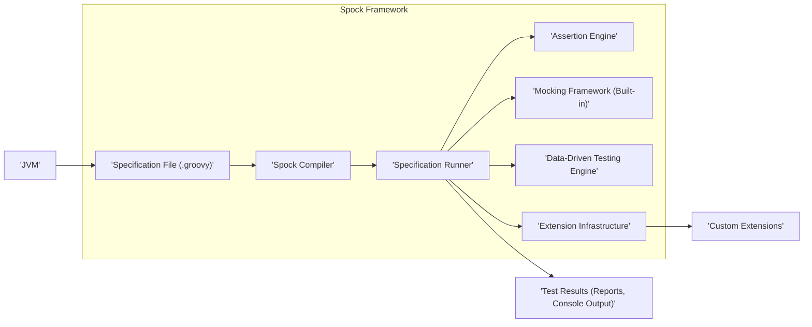
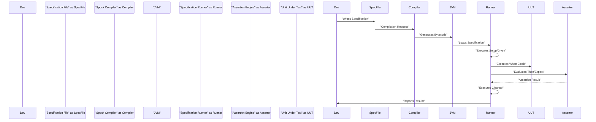
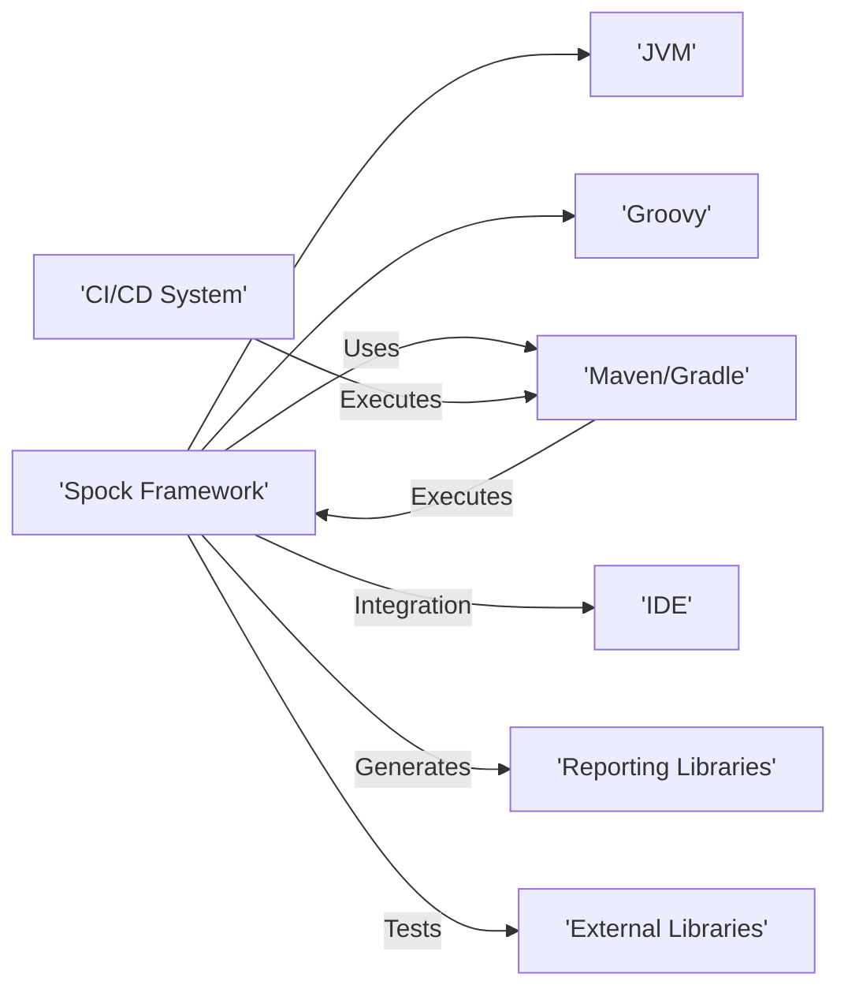

# Project Design Document: Spock Framework

**Version:** 1.1
**Date:** October 26, 2023
**Prepared By:** Gemini (AI Language Model)

## 1. Introduction

This document provides an enhanced design overview of the Spock Framework, a powerful testing and specification framework for Java and Groovy applications. This detailed design is specifically crafted to serve as a strong foundation for subsequent threat modeling activities. It meticulously outlines the key architectural components, data flows, and external interactions of the Spock Framework, providing a comprehensive understanding of its structure and behavior.

## 2. Project Overview

Spock is a behavior-driven development (BDD) testing framework elegantly written in Groovy. It empowers developers to create highly expressive and easily readable specifications that clearly articulate the expected behavior of their software components. Spock boasts seamless integration within the vibrant Java and Groovy ecosystems, offering robust support for a diverse range of testing paradigms, encompassing unit, integration, and even end-to-end testing scenarios.

**Key Goals:**

* To deliver a testing framework that is not only powerful but also exceptionally expressive, enabling clear communication of system behavior.
* To facilitate the creation of living documentation through the use of executable specifications, ensuring documentation remains accurate and up-to-date.
* To offer a clean, concise, and intuitive syntax for writing tests, reducing boilerplate and improving readability.
* To integrate smoothly and effectively with existing Java and Groovy development tools and workflows, minimizing friction for developers.

## 3. Architectural Overview

Spock's architecture is thoughtfully organized into several key areas, each contributing to its overall functionality and effectiveness:

* **Core Engine:**  This is the heart of the framework, responsible for orchestrating the execution of specifications and meticulously managing the entire test lifecycle, from setup to teardown.
* **Specification Language:**  Spock leverages a Groovy-based Domain Specific Language (DSL), providing a natural and expressive way to define test specifications.
* **Extension Model:**  A flexible and extensible mechanism allowing developers to augment Spock's capabilities with custom behaviors, integrations with other systems, and specialized reporting.
* **Integration Points:** Well-defined interfaces and APIs that enable Spock to interact seamlessly with a wide array of external tools and libraries, enhancing its versatility.

## 4. Component Details

This section delves deeper into the key components identified in the architectural overview, providing a more granular understanding of their roles and responsibilities.

### 4.1. Specification File (.groovy)

* **Description:** A standard Groovy file that serves as the container for one or more specifications. Each specification meticulously defines the expected behavior of a specific unit of code through a series of well-structured feature methods.
* **Functionality:**  Defines precise test scenarios using a clear and structured syntax, employing blocks such as `given` (for setup), `when` (for action), `then` or `expect` (for verification), and `cleanup` (for teardown).
* **Data Handling:**  Encapsulates the core test logic, including input data for data-driven tests, and the crucial assertions that validate the expected outcomes.

### 4.2. Spock Compiler

* **Description:**  A critical component responsible for the transformation of human-readable Groovy specification files into executable bytecode that the JVM can understand and run.
* **Functionality:**  Performs the essential tasks of parsing the specification file, rigorously validating its syntax to ensure correctness, and generating optimized Java bytecode ready for execution.
* **Data Handling:**  Takes the `.groovy` specification file as input and produces compiled `.class` files as output, the building blocks for test execution.

### 4.3. Specification Runner

* **Description:**  The central orchestrator of the framework, responsible for managing the entire lifecycle of test execution.
* **Functionality:**  Dynamically loads the compiled specification classes, meticulously manages the lifecycle of each individual feature method (including setup, execution, and cleanup phases), and seamlessly interacts with the assertion engine and the built-in mocking framework.
* **Data Handling:**  Receives the compiled specification as input, maintains the test context throughout the execution, and strategically passes relevant data to the assertion engine and mocking framework as needed.

### 4.4. Assertion Engine

* **Description:**  The component dedicated to the crucial task of evaluating the truthiness of conditions specified within the `then` or `expect` blocks of a specification.
* **Functionality:**  Provides a rich and expressive set of assertion methods and operators, allowing developers to precisely verify expected outcomes. Crucially, it generates informative and helpful error messages when assertions fail, aiding in debugging.
* **Data Handling:**  Receives the actual and expected values from the specification runner and performs the core logic of determining whether the assertion passes or fails based on the comparison.

### 4.5. Mocking Framework (Built-in)

* **Description:**  Spock includes a first-class, powerful, and integrated mocking and stubbing framework, eliminating the need for external libraries in many cases.
* **Functionality:**  Empowers developers to easily create mock objects and stubs, enabling the isolation of the unit under test from its potentially complex dependencies. Supports interaction-based testing, allowing verification of specific method calls and their parameters.
* **Data Handling:**  Creates mock objects that simulate the behavior of real dependencies, allowing the test to precisely control the data returned by these simulated components, ensuring predictable test execution.

### 4.6. Data-Driven Testing Engine

* **Description:**  A valuable feature that enables the execution of the same test logic with a variety of different input data sets, promoting thorough testing with minimal code duplication.
* **Functionality:**  Reads data from various sources (including tables directly within the specification, external files, or programmatically generated data) and intelligently executes the feature method multiple times, once for each distinct data set.
* **Data Handling:**  Responsible for reading and managing the input data, providing it to the specification runner for each individual iteration of the data-driven test, ensuring each execution uses the correct data context.

### 4.7. Extension Infrastructure

* **Description:**  A well-defined mechanism that allows developers to extend Spock's core functionality, tailoring it to specific project needs and integrating with other tools.
* **Functionality:**  Provides interception points within the test execution lifecycle, enabling the addition of custom reporting mechanisms, seamless integration with external tools and services, and even modifications to Spock's default behavior.
* **Data Handling:**  Extensions have the capability to access and manipulate test context data, allowing them to interact with various aspects of the Spock framework and potentially influence test execution or reporting.

## 5. Data Flow

Understanding the flow of data during the execution of a Spock specification is crucial for threat modeling. The typical data flow is as follows:

1. **Specification Loading:** The Java Virtual Machine (JVM) begins by loading the compiled specification class (`.class` file) into memory.
2. **Test Execution Initiation:** The Specification Runner takes control and initiates the execution of a specific feature method within the loaded specification.
3. **Setup Phase Execution:** Code within the `setup` or `given` blocks is executed first, responsible for preparing the necessary test environment and setting up preconditions.
4. **Stimulus Phase Execution:**  The code within the `when` block is then executed, typically representing the invocation of the unit of code being tested.
5. **Verification Phase Execution:**
    * The code within the `then` or `expect` blocks is executed to verify the outcomes of the stimulus phase.
    * The Assertion Engine plays a key role here, evaluating the conditions specified within these blocks to determine if the expected behavior occurred.
    * If mocking is used, the Mocking Framework verifies that the expected interactions with mock objects took place.
6. **Data-Driven Iteration (Conditional):** If the feature method is part of a data-driven test, the Data-Driven Testing Engine provides the next set of input data, and steps 3-5 are repeated with the new data.
7. **Cleanup Phase Execution:** Finally, the code within the `cleanup` or `finally` blocks is executed to release resources, reset the environment, and ensure a clean state after the test.
8. **Result Reporting:** Throughout the execution, test results (including successes and failures) are meticulously collected and ultimately reported to the developer or CI/CD system.

## 6. External Interactions

Spock interacts with a range of external components and systems, making these interaction points potential areas of interest for threat modeling:

* **Java Virtual Machine (JVM):** Spock is fundamentally built upon and runs within the JVM, relying on its core functionalities for execution and resource management.
* **Groovy Language:**  As Spock is written in Groovy, it inherently interacts with the Groovy language runtime and libraries, leveraging its dynamic features and syntax.
* **Build Tools (Maven, Gradle):**  Spock is commonly integrated into the software build process using popular build tools like Maven or Gradle. Plugins for these tools manage Spock's dependencies and orchestrate the execution of Spock tests.
* **Integrated Development Environments (IDEs):**  IDEs such as IntelliJ IDEA and Eclipse offer dedicated support for running and debugging Spock specifications, providing a more integrated development experience.
* **Reporting Libraries:** Spock can be configured to generate comprehensive test reports in various formats (e.g., HTML, XML) by integrating with reporting libraries like Surefire or Failsafe, facilitating analysis of test results.
* **Continuous Integration/Continuous Delivery (CI/CD) Systems:**  Spock tests are frequently executed as an integral part of CI/CD pipelines, ensuring code quality and preventing regressions as code changes are introduced.
* **External Libraries (Dependencies):** Projects utilizing Spock may also depend on other external libraries. Spock tests will interact with these dependencies when testing code that uses them (e.g., database drivers, web service clients).

## 7. Deployment Model

Spock itself is not a standalone application that requires separate deployment. Instead, it functions as a library that is included as a dependency within a Java or Groovy project.

**Typical Usage Scenario:**

* Developers create Spock specifications as `.groovy` files within their project's test source directories.
* The project's build tool (typically Maven or Gradle) compiles these specifications alongside the main application code.
* During the test phase of the build lifecycle, the Spock runner is invoked by the build tool to execute the defined specifications.
* The Spock runner executes the tests, and the results are aggregated and reported, often integrated into the build tool's output or separate reporting files.

## 8. Security Considerations (Preliminary)

This section outlines preliminary security considerations relevant to the Spock Framework, providing a starting point for more in-depth threat modeling.

* **Dependency Vulnerabilities:** Spock relies on a set of its own dependencies. Security vulnerabilities discovered in these transitive dependencies could potentially introduce risks to projects using Spock if not managed and updated promptly.
* **Malicious Extensions:**  The extension model, while powerful, introduces a potential attack surface. Malicious or poorly written custom extensions could potentially compromise the test environment or introduce vulnerabilities if they are not developed with security in mind.
* **Embedded Malicious Code in Tests:** While less common in typical development workflows with code review, it's theoretically possible to embed malicious code within test specifications. This code could potentially be executed during the test phase, although the scope and impact would typically be limited to the testing environment.
* **Exposure of Sensitive Information in Reports:** Test reports generated by Spock or integrated reporting libraries might inadvertently contain sensitive information (e.g., API keys, database credentials) if not configured carefully. Secure storage and access control for these reports are important.
* **Security of Integration Points:** The security of the external systems that Spock integrates with (e.g., CI/CD systems, artifact repositories, databases) is paramount. Vulnerabilities in these systems could potentially be exploited through the integration with Spock. For instance, if the CI/CD system is compromised, an attacker might be able to manipulate test execution or access test results.

## 9. Diagrams

The architectural and data flow diagrams presented earlier in this document provide a visual representation of the Spock Framework's key components and their interactions, aiding in understanding the system's structure and behavior.

This enhanced design document provides a more comprehensive and detailed understanding of the Spock Framework, specifically tailored to facilitate effective threat modeling. By clearly outlining the components, data flows, and external interactions, this document serves as a valuable resource for identifying and mitigating potential security vulnerabilities.