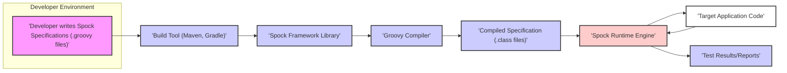
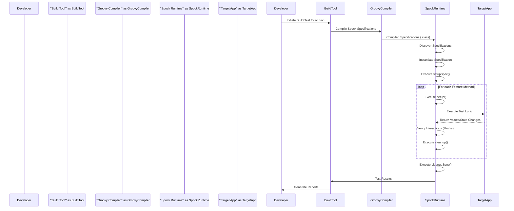

# Project Design Document: Spock Framework

**Version:** 1.1
**Date:** October 26, 2023
**Author:** AI Software Architect

## 1. Introduction

This document provides an enhanced design overview of the Spock Framework, a powerful testing and specification framework for Java and Groovy applications. This revised document aims to provide a more granular understanding of Spock's architecture, components, and data flow, specifically tailored for effective threat modeling and security analysis.

## 2. Goals and Objectives

The primary goals of this design document are to:

*   Provide a detailed and precise understanding of the Spock Framework's architecture and internal workings.
*   Clearly identify key components, their responsibilities, and their interactions with each other and the external environment.
*   Thoroughly describe the data flow during test execution, highlighting potential points of interest for security analysis.
*   Serve as a robust and informative foundation for subsequent threat modeling activities, enabling the identification of potential vulnerabilities and attack vectors.

## 3. High-Level Architecture

The Spock Framework operates within the context of a Java Virtual Machine (JVM) and is typically integrated into a software development project through build tools like Maven or Gradle. The core function is to execute specifications written in the Groovy language against a target application.

**Key Components:**

*   **Developer:** Creates Spock specifications using Groovy's expressive syntax. These specifications define the behavior to be tested.
*   **Build Tool (Maven, Gradle):**  Manages project dependencies, including the Spock Framework library. It orchestrates the compilation process and test execution.
*   **Spock Framework Library:** The core set of classes and interfaces that constitute the Spock testing engine. This library provides the DSL and runtime environment for executing specifications.
*   **Groovy Compiler:** Translates the human-readable Groovy specification files into JVM bytecode (`.class` files) that can be executed by the JVM.
*   **Compiled Specification (.class files):** The output of the Groovy compilation process. These files contain the executable code representing the test logic defined in the specifications.
*   **Spock Runtime Engine:** The heart of the framework, responsible for loading, interpreting, and executing the compiled specifications. It manages the lifecycle of tests and interacts with the target application.
*   **Target Application Code:** The Java or Groovy code that is being tested by the Spock specifications.
*   **Test Results/Reports:**  The output generated by the Spock framework, indicating the success or failure of individual tests and providing summary information.

## 4. Component Details

This section provides a more in-depth look at the key components of the Spock Framework, highlighting aspects relevant to security considerations.

*   **Spock Core Engine:**
    *   Manages the overall execution flow of a Spock specification, including the execution of feature methods and lifecycle methods (`setup`, `cleanup`, `setupSpec`, `cleanupSpec`).
    *   Provides the core Domain Specific Language (DSL) used for writing specifications (e.g., `given`, `when`, `then`, `expect`).
    *   Handles the interpretation and execution of the specification structure.
    *   *Security Relevance:*  Potential vulnerabilities could arise from flaws in the core engine's logic, leading to unexpected behavior or allowing malicious specifications to interfere with the testing process.
*   **Data Provider Mechanism:**
    *   Enables data-driven testing through annotations like `@Unroll` and data tables.
    *   Manages the iteration over provided data sets, executing the same test logic with different inputs.
    *   *Security Relevance:* If test data is sourced from untrusted sources or contains malicious payloads, vulnerabilities in the data provider mechanism could be exploited to inject malicious data into the target application during testing.
*   **Mocking and Stubbing Framework:**
    *   Provides built-in capabilities for creating mock objects and stubs to isolate the unit under test.
    *   Allows for defining expected interactions with dependencies and specifying return values.
    *   Uses an interaction-based verification system to ensure expected calls were made.
    *   *Security Relevance:*  While primarily for testing, vulnerabilities in the mocking framework could potentially be exploited to bypass security checks or simulate unexpected behavior in dependencies.
*   **Extension Framework:**
    *   Allows developers to extend Spock's functionality by creating custom extensions that hook into the test execution lifecycle.
    *   Provides access to internal Spock state and allows for modifying test behavior.
    *   *Security Relevance:*  Malicious or poorly written extensions could introduce significant security risks by manipulating the test environment, accessing sensitive information, or interfering with the execution of other tests.
*   **Report Generation Module:**
    *   Integrates with build tools to generate test reports in various formats (e.g., JUnit XML).
    *   Collects and formats information about test execution status, failures, and timings.
    *   *Security Relevance:*  Test reports might inadvertently expose sensitive information or internal details of the application under test if not configured carefully.
*   **Groovy Integration Layer:**
    *   Leverages the dynamic nature of the Groovy language for writing expressive and concise specifications.
    *   Relies on the Groovy runtime environment for executing specification code.
    *   *Security Relevance:*  Security vulnerabilities in the Groovy runtime itself could potentially impact the security of Spock specifications. The dynamic nature of Groovy also introduces potential risks if specification code is generated or manipulated based on untrusted input.

## 5. Data Flow

The execution of a Spock specification involves a distinct flow of data and control:

1. **Specification Definition:** The developer creates Spock specifications as `.groovy` files, defining the test scenarios and expected outcomes.
    *   *Security Note:* Malicious code could be embedded within these specification files if the development environment is compromised.
2. **Compilation:** The build tool invokes the Groovy compiler to translate the `.groovy` files into JVM bytecode (`.class` files).
    *   *Security Note:*  A compromised Groovy compiler could potentially inject malicious code into the compiled class files.
3. **Test Discovery and Loading:** The Spock runtime engine identifies and loads the compiled specification classes.
    *   *Security Note:* If the classpath is not properly managed, malicious or unintended classes could be loaded and executed.
4. **Specification Instantiation:** An instance of the specification class is created by the Spock runtime.
5. **Lifecycle Method Execution (Setup):**
    *   The `setupSpec()` method (if present) is executed once before all feature methods in the specification.
    *   The `setup()` method (if present) is executed before each individual feature method.
    *   *Security Note:*  Code within these setup methods could potentially perform actions that have security implications, such as accessing external resources or modifying system state.
6. **Feature Method Execution:**
    *   The selected feature method (e.g., a method annotated with `@Specification`) is executed.
    *   The execution proceeds through the structured blocks (`given`, `when`, `then`, `expect`).
    *   Data providers (if used) supply input data for the test.
    *   Interactions with mocked objects are recorded and verified.
    *   *Security Note:*  The core test logic within the feature method interacts directly with the target application. Vulnerabilities in the target application could be exposed or even exploited during testing. Malicious test data could also be injected at this stage.
7. **Lifecycle Method Execution (Cleanup):**
    *   The `cleanup()` method (if present) is executed after each feature method.
    *   The `cleanupSpec()` method (if present) is executed once after all feature methods in the specification.
    *   *Security Note:*  Similar to setup methods, cleanup methods could also perform actions with security implications.
8. **Result Collection:** The Spock runtime engine gathers the results of each feature method execution (success or failure).
9. **Report Generation:** The build tool utilizes Spock's reporting capabilities to generate test reports.
    *   *Security Note:*  Test results might contain sensitive information or details about the application's behavior that could be valuable to attackers.

## 6. Security Considerations

This section outlines potential security considerations related to the Spock Framework, focusing on areas that could be targets for malicious activity or unintentional vulnerabilities.

*   **Dependency Vulnerabilities:** Spock relies on external libraries like Groovy and potentially others (e.g., JUnit).
    *   *Threat:* Known vulnerabilities in these dependencies could be exploited if not patched.
    *   *Mitigation:* Regularly update dependencies and use dependency scanning tools to identify and address vulnerabilities.
*   **Malicious Specification Code:** Developers might inadvertently or intentionally introduce malicious code within Spock specifications.
    *   *Threat:*  Specifications could perform actions like accessing sensitive data, modifying system configurations, or launching denial-of-service attacks during test execution.
    *   *Mitigation:* Implement code review processes for specifications, enforce secure coding practices, and potentially sandbox test execution environments.
*   **Insecure Test Data:** Test data used in specifications might contain sensitive information or malicious payloads.
    *   *Threat:* Exposure of sensitive test data or injection of malicious data into the target application during testing.
    *   *Mitigation:* Avoid hardcoding sensitive data, use secure methods for managing test data (e.g., encrypted stores), and sanitize test data where appropriate.
*   **Compromised Build Environment:** If the build environment is compromised, attackers could manipulate the compilation process or inject malicious code into the compiled specifications.
    *   *Threat:*  Introduction of backdoors or vulnerabilities into the application through compromised tests.
    *   *Mitigation:* Secure the build environment, implement access controls, and use integrity checks for build artifacts.
*   **Vulnerable Custom Extensions:**  Custom Spock extensions, if not developed securely, can introduce vulnerabilities.
    *   *Threat:*  Extensions could bypass security checks, expose sensitive information, or disrupt the testing process.
    *   *Mitigation:*  Thoroughly review and audit custom extensions, enforce secure coding practices for extension development, and potentially restrict the use of extensions from untrusted sources.
*   **Exposure of Sensitive Information in Reports:** Test reports might inadvertently reveal sensitive information about the application's internal workings or vulnerabilities.
    *   *Threat:*  Attackers could use information in test reports to gain insights into potential attack vectors.
    *   *Mitigation:*  Carefully configure report generation to avoid including sensitive details and restrict access to test reports.
*   **Groovy Metaprogramming Risks:** Groovy's dynamic metaprogramming capabilities, while powerful, can also introduce security risks if used carelessly.
    *   *Threat:*  Unexpected behavior or security vulnerabilities arising from dynamic code manipulation.
    *   *Mitigation:*  Exercise caution when using metaprogramming features in specifications and adhere to secure coding practices.
*   **Insufficient Input Validation in Specifications:** Specifications that interact with external systems or data sources should validate inputs to prevent injection attacks.
    *   *Threat:*  Specifications could inadvertently pass malicious input to the target application or external systems.
    *   *Mitigation:*  Implement proper input validation within specifications when interacting with external resources.

## 7. Deployment

The Spock Framework is deployed as a library dependency within a Java or Groovy project. Developers add the Spock dependency to their project's build configuration file (e.g., `pom.xml` for Maven, `build.gradle` for Gradle). The framework becomes available during the test execution phase of the build lifecycle. No separate deployment of Spock itself is required.

## 8. Future Considerations

*   **Enhanced Security Auditing Features:**  Potentially adding features to help audit specifications and extensions for potential security issues.
*   **Improved Sandboxing Capabilities:** Exploring options for more robustly sandboxing the execution of Spock specifications to limit the impact of malicious code.
*   **Integration with Security Testing Tools:**  Developing tighter integration with security testing tools to facilitate automated security testing within the Spock framework.

This enhanced design document provides a more detailed and security-focused overview of the Spock Framework. It serves as a valuable resource for threat modeling and security analysis, enabling a deeper understanding of potential risks and informing mitigation strategies.