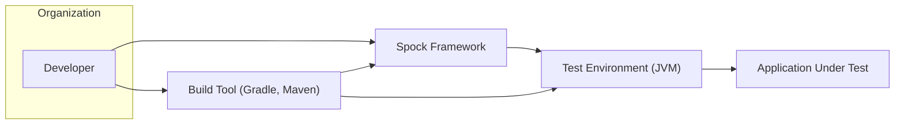
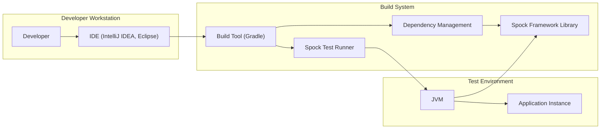

# BUSINESS POSTURE

The Spock Framework is a testing and specification framework for Java and Groovy applications. Its primary business goal is to enhance software quality and reliability by providing developers with a powerful and expressive tool for writing comprehensive and maintainable tests.

Business Priorities and Goals:
- Improve software quality: Spock aims to make testing more efficient and effective, leading to higher quality software.
- Enhance developer productivity: Spock's expressive syntax and features are designed to make test writing faster and more enjoyable for developers.
- Reduce software defects: By facilitating thorough testing, Spock helps identify and prevent defects early in the development lifecycle.
- Support agile development: Spock's focus on specification and collaboration aligns well with agile methodologies.
- Community growth and adoption: Increasing the user base and community contributions to ensure the framework's long-term viability and improvement.

Business Risks:
- Reduced developer adoption: If developers find the framework difficult to learn or use, adoption may be limited, hindering its impact on software quality.
- Lack of community support: A small or inactive community could lead to slower bug fixes, feature development, and limited support for users.
- Compatibility issues:  Changes in Java, Groovy, or related ecosystems could introduce compatibility issues, requiring ongoing maintenance and updates.
- Security vulnerabilities in the framework itself: Although primarily a testing tool, vulnerabilities in Spock could potentially impact the security of projects using it, especially during build and test processes.
- Integration challenges: Difficulties integrating Spock with existing build tools, IDEs, or testing infrastructure could impede adoption.

# SECURITY POSTURE

Security Controls:
- security control: GitHub repository with version control (git) - Implemented in GitHub.
- security control: Open source project with community review - Implemented through public access to the repository and contribution process.
- security control: Build automation using Gradle and GitHub Actions - Described in repository's `build.gradle.kts` and `.github/workflows` directory.
- security control: Code quality checks (e.g., static analysis, linters) - Likely integrated within the Gradle build process, although specific tools are not explicitly documented in this overview.
- security control: Dependency management using Gradle - Described in `build.gradle.kts`.

Accepted Risks:
- accepted risk: Reliance on open-source dependencies - The project depends on various open-source libraries, inheriting their potential vulnerabilities.
- accepted risk: Community-driven security - Security vulnerabilities are primarily identified and addressed by the open-source community.
- accepted risk: Potential vulnerabilities in example code and documentation - Example code and documentation might contain insecure practices if not carefully reviewed from a security perspective.

Recommended Security Controls:
- security control: Dependency vulnerability scanning: Implement automated scanning of dependencies for known vulnerabilities as part of the build process.
- security control: Static Application Security Testing (SAST): Integrate SAST tools into the build pipeline to automatically analyze the Spock codebase for potential security flaws.
- security control: Software Composition Analysis (SCA): Implement SCA to gain visibility into the open source components used and manage associated risks.
- security control: Security awareness training for contributors: Provide guidelines and training to contributors on secure coding practices and common vulnerabilities.
- security control: Regular security audits: Conduct periodic security audits of the Spock codebase and infrastructure, potentially involving external security experts.

Security Requirements:
- Authentication: Not directly applicable to the Spock framework itself as it's a library. Authentication is relevant for the infrastructure used to build and distribute Spock (e.g., GitHub, Maven Central).
- Authorization: Not directly applicable to the Spock framework itself. Authorization is relevant for access control to the Spock repository and build infrastructure.
- Input Validation: Relevant for Spock framework's parsing of specification code and handling of user-provided data within tests. Ensure robust input validation to prevent injection vulnerabilities or unexpected behavior.
- Cryptography: Cryptography is not a core requirement for the Spock framework itself. However, if Spock were to handle sensitive data in the future (e.g., in test fixtures or extensions), appropriate cryptographic measures would be necessary. For now, focus on secure handling of dependencies and build process.

# DESIGN

## C4 CONTEXT



Context Diagram Elements:

- Element:
    - Name: Developer
    - Type: Person
    - Description: Software developers who use the Spock Framework to write and execute tests for their Java and Groovy applications.
    - Responsibilities: Writes specifications using Spock, executes tests, integrates Spock into build processes.
    - Security controls: Code review of test specifications, secure coding practices when writing tests.

- Element:
    - Name: Spock Framework
    - Type: Software System
    - Description: A testing and specification framework for Java and Groovy. Provides a DSL for writing expressive tests and integrates with build tools and testing environments.
    - Responsibilities: Provides testing DSL, test execution engine, reporting capabilities, integration with build tools.
    - Security controls: Input validation within the framework, secure handling of dependencies, secure build process.

- Element:
    - Name: Build Tool (Gradle, Maven)
    - Type: Software System
    - Description: Build automation tools used to compile code, manage dependencies, and execute tests, including Spock specifications.
    - Responsibilities: Compiles code, manages dependencies (including Spock), executes tests, packages applications.
    - Security controls: Dependency management, build script security, secure plugin management, access control to build configurations.

- Element:
    - Name: Test Environment (JVM)
    - Type: Environment
    - Description: The Java Virtual Machine (JVM) or other runtime environment where Spock tests are executed.
    - Responsibilities: Provides runtime environment for test execution, isolates test execution from production environments.
    - Security controls: Secure JVM configuration, isolation from production systems, access control to test environments.

- Element:
    - Name: Application Under Test
    - Type: Software System
    - Description: The Java or Groovy application being tested using the Spock Framework.
    - Responsibilities: Provides functionality to be tested, interacts with the test environment during test execution.
    - Security controls: Security controls of the application itself are tested by Spock, input validation, authorization, authentication, etc.

## C4 CONTAINER



Container Diagram Elements:

- Element:
    - Name: IDE (IntelliJ IDEA, Eclipse)
    - Type: Application
    - Description: Integrated Development Environment used by developers to write code, including Spock specifications, and interact with build tools.
    - Responsibilities: Code editing, test execution initiation, integration with build tools, debugging.
    - Security controls: IDE security features (plugin security, secure code editing practices), access control to developer workstations.

- Element:
    - Name: Build Tool (Gradle)
    - Type: Application
    - Description: Build automation tool (example: Gradle) responsible for compiling code, managing dependencies, and executing tests.
    - Responsibilities: Build automation, dependency resolution, test execution, plugin management.
    - Security controls: Build script security, dependency vulnerability scanning (recommended), secure plugin management, access control to build configurations.

- Element:
    - Name: Spock Framework Library
    - Type: Library
    - Description: The core Spock Framework library, providing the testing DSL and runtime components.
    - Responsibilities: Provides testing DSL, test execution logic, reporting features.
    - Security controls: Input validation within the framework, secure coding practices, dependency management within the framework.

- Element:
    - Name: Test Runner
    - Type: Application Component
    - Description: Component within Spock responsible for executing tests and reporting results.
    - Responsibilities: Test discovery, test execution, result aggregation, reporting.
    - Security controls: Secure test execution environment, isolation of tests, handling of test data.

- Element:
    - Name: Dependency Management
    - Type: Application Component
    - Description: Component within the build tool responsible for managing project dependencies, including Spock and its dependencies.
    - Responsibilities: Dependency resolution, dependency downloading, dependency version management.
    - Security controls: Dependency vulnerability scanning (recommended), secure repository access, dependency integrity checks.

- Element:
    - Name: JVM
    - Type: Infrastructure Component
    - Description: Java Virtual Machine, the runtime environment for executing Spock tests and the Application Under Test.
    - Responsibilities: Provides runtime environment, executes bytecode, manages memory.
    - Security controls: Secure JVM configuration, access control to JVM processes, resource limits.

- Element:
    - Name: Application Instance
    - Type: Application
    - Description: Instance of the Application Under Test running within the test environment.
    - Responsibilities: Provides functionality to be tested, interacts with the test environment.
    - Security controls: Security controls of the application itself, isolation within the test environment.

## DEPLOYMENT

Deployment Architecture: Library Distribution

Spock Framework is deployed as a library that developers include in their projects. It is distributed through Maven Central and other package repositories. There isn't a standalone deployment of Spock as a service or application.

```mermaid
graph LR
    DeveloperMachine["Developer Machine"]
    MavenCentral["Maven Central Repository"]
    ProjectRepository["Project Repository (e.g., GitHub)"]

    DeveloperMachine --> ProjectRepository: Include Spock Dependency
    ProjectRepository --> BuildTool: Gradle/Maven Configuration
    BuildTool --> MavenCentral: Download Spock Library
    MavenCentral --> BuildTool: Spock Library Artifact
    BuildTool --> DeveloperMachine: Spock Library in Project
```

Deployment Diagram Elements:

- Element:
    - Name: Developer Machine
    - Type: Environment
    - Description: Developer's local workstation where they develop applications and write Spock tests.
    - Responsibilities: Code development, test execution, project management.
    - Security controls: Workstation security policies, endpoint protection, access control.

- Element:
    - Name: Maven Central Repository
    - Type: Infrastructure
    - Description: Public repository for Java libraries, including Spock Framework.
    - Responsibilities: Hosting and distributing Java libraries, providing access to library artifacts.
    - Security controls: Repository security measures, artifact signing, vulnerability scanning of hosted libraries.

- Element:
    - Name: Project Repository (e.g., GitHub)
    - Type: Infrastructure
    - Description: Version control repository hosting the application project that uses Spock.
    - Responsibilities: Source code management, version control, collaboration.
    - Security controls: Access control to repository, branch protection, code review processes.

- Element:
    - Name: Build Tool (Gradle/Maven)
    - Type: Application
    - Description: Build automation tool used to manage project dependencies and build the application.
    - Responsibilities: Dependency management, build process execution, artifact packaging.
    - Security controls: Secure build scripts, dependency vulnerability scanning, secure plugin management.

## BUILD

Build Process:

```mermaid
flowchart LR
    A[Developer] --> B{Code Changes (Git Commit/Push)};
    B --> C[GitHub Repository];
    C --> D[GitHub Actions Workflow (CI)];
    D --> E[Build Environment (Gradle Build)];
    E --> F{Dependency Resolution & Download};
    F --> G[Dependency Repositories (Maven Central)];
    G --> E;
    E --> H[Compilation & Testing];
    H --> I[SAST & Security Checks (Recommended)];
    I --> J{Artifact Packaging (JAR)};
    J --> K[Artifact Signing (Recommended)];
    K --> L[Artifact Publishing (Maven Central Staging/Release)];
    L --> M[Maven Central Repository];
    M --> N[Users/Developers (Dependency Download)];
```

Build Diagram Elements:

- Element:
    - Name: Developer
    - Type: Person
    - Description: Software developer contributing to the Spock Framework project.
    - Responsibilities: Code development, bug fixes, feature implementation, code review.
    - Security controls: Secure coding practices, code review, access control to development environment.

- Element:
    - Name: Code Changes (Git Commit/Push)
    - Type: Process
    - Description: Developer commits and pushes code changes to the GitHub repository.
    - Responsibilities: Version control, code contribution.
    - Security controls: Commit signing, branch protection, access control to repository.

- Element:
    - Name: GitHub Repository
    - Type: Infrastructure
    - Description: GitHub repository hosting the Spock Framework source code.
    - Responsibilities: Source code management, version control, collaboration, CI/CD integration.
    - Security controls: Access control, branch protection, audit logging, vulnerability scanning of repository infrastructure.

- Element:
    - Name: GitHub Actions Workflow (CI)
    - Type: Application
    - Description: Automated CI/CD pipeline defined using GitHub Actions, triggered by code changes.
    - Responsibilities: Automated build, test execution, artifact packaging, publishing.
    - Security controls: Secure workflow configuration, secret management, access control to workflow definitions, audit logging.

- Element:
    - Name: Build Environment (Gradle Build)
    - Type: Environment
    - Description: Environment where the Gradle build process is executed, typically within GitHub Actions.
    - Responsibilities: Code compilation, dependency management, test execution, artifact creation.
    - Security controls: Secure build environment configuration, isolation, access control, resource limits.

- Element:
    - Name: Dependency Resolution & Download
    - Type: Process
    - Description: Gradle resolves and downloads project dependencies from dependency repositories.
    - Responsibilities: Dependency management, artifact retrieval.
    - Security controls: Dependency vulnerability scanning (recommended), secure repository access, dependency integrity checks (e.g., checksum verification).

- Element:
    - Name: Dependency Repositories (Maven Central)
    - Type: Infrastructure
    - Description: Public repositories like Maven Central hosting project dependencies.
    - Responsibilities: Hosting and distributing Java libraries.
    - Security controls: Repository security measures, artifact signing, vulnerability scanning of hosted libraries.

- Element:
    - Name: Compilation & Testing
    - Type: Process
    - Description: Source code compilation and execution of unit and integration tests.
    - Responsibilities: Code verification, quality assurance.
    - Security controls: Secure compilation process, test isolation, secure test data management.

- Element:
    - Name: SAST & Security Checks (Recommended)
    - Type: Process
    - Description: Static Application Security Testing and other security checks integrated into the build pipeline (recommended).
    - Responsibilities: Automated security vulnerability detection.
    - Security controls: SAST tool configuration, vulnerability reporting, integration with build pipeline.

- Element:
    - Name: Artifact Packaging (JAR)
    - Type: Process
    - Description: Packaging the compiled code and resources into JAR (Java Archive) files.
    - Responsibilities: Artifact creation for distribution.
    - Security controls: Secure packaging process, integrity checks of artifacts.

- Element:
    - Name: Artifact Signing (Recommended)
    - Type: Process
    - Description: Signing the JAR artifacts with a digital signature to ensure integrity and authenticity (recommended).
    - Responsibilities: Artifact integrity and authenticity verification.
    - Security controls: Secure key management, secure signing process, signature verification mechanisms.

- Element:
    - Name: Artifact Publishing (Maven Central Staging/Release)
    - Type: Process
    - Description: Publishing the signed JAR artifacts to Maven Central (or staging repository before release).
    - Responsibilities: Artifact distribution to public repository.
    - Security controls: Secure publishing process, access control to publishing credentials, repository security policies.

- Element:
    - Name: Maven Central Repository
    - Type: Infrastructure
    - Description: Public repository where Spock Framework artifacts are published and made available for download.
    - Responsibilities: Hosting and distributing Spock Framework artifacts.
    - Security controls: Repository security measures, artifact signing verification, vulnerability scanning.

- Element:
    - Name: Users/Developers (Dependency Download)
    - Type: Person/System
    - Description: Developers and build systems that download Spock Framework artifacts from Maven Central to use in their projects.
    - Responsibilities: Consuming Spock Framework library.
    - Security controls: Dependency integrity verification (e.g., checksum or signature verification), secure dependency management practices.

# RISK ASSESSMENT

Critical Business Processes:
- Software Development Lifecycle: Spock is integral to the testing phase of the SDLC, ensuring software quality and reliability.
- Release Management: Reliable testing provided by Spock contributes to confident and stable software releases.
- Developer Productivity: Spock's usability and expressiveness impact developer efficiency in writing and maintaining tests.

Data Sensitivity:
- Test Code: Spock specifications themselves are code and should be treated as intellectual property. Exposure could reveal testing strategies and potentially application logic. Sensitivity: Medium.
- Application Data during Testing: Tests might interact with or generate sensitive application data. The sensitivity depends on the nature of the Application Under Test. Sensitivity: Low to High (context-dependent).
- Build Process Artifacts: Build artifacts (JAR files) contain compiled code and should be protected from unauthorized modification. Sensitivity: Medium.
- Dependency Information: Information about project dependencies is publicly available but could be used for targeted attacks if vulnerabilities are identified. Sensitivity: Low.

# QUESTIONS & ASSUMPTIONS

Questions:
- What specific SAST and dependency scanning tools are currently used or planned to be used in the Spock Framework build process?
- Are there any specific security guidelines or training provided to contributors regarding secure coding practices?
- What is the process for handling reported security vulnerabilities in Spock Framework?
- Are there any plans for formal security audits or penetration testing of the Spock Framework codebase or build infrastructure?
- What are the criteria for accepting or rejecting external contributions, especially from a security perspective?

Assumptions:
- BUSINESS POSTURE: The primary business goal is to provide a high-quality testing framework to improve software quality and developer productivity.
- SECURITY POSTURE: Security is considered important, but the project relies heavily on community contributions and standard open-source security practices. There is room for improvement in proactive security measures like SAST and dependency scanning.
- DESIGN: The design is based on a library distribution model, with build and distribution through standard Java/Groovy ecosystem tools like Gradle and Maven Central. The build process is automated using GitHub Actions.