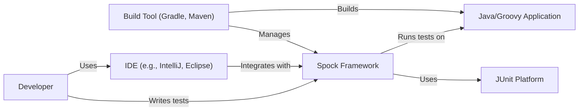
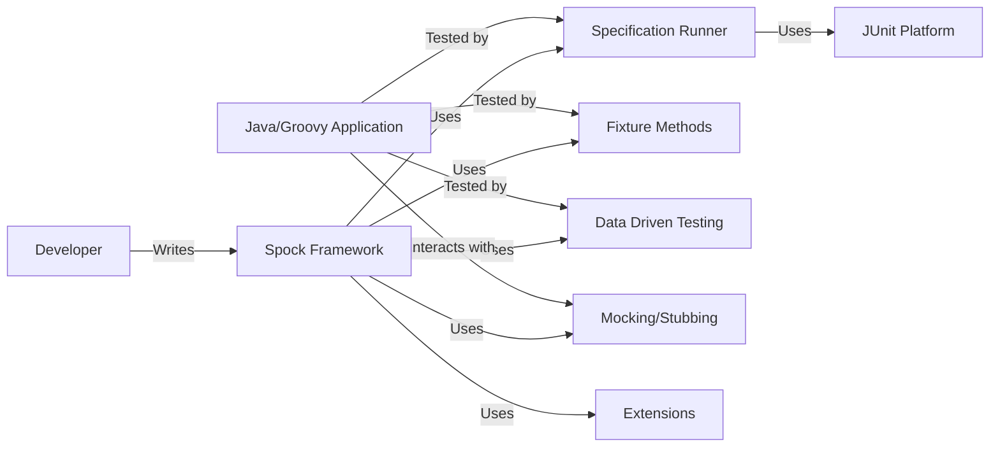
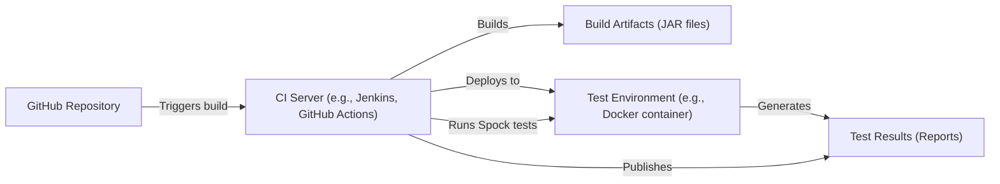
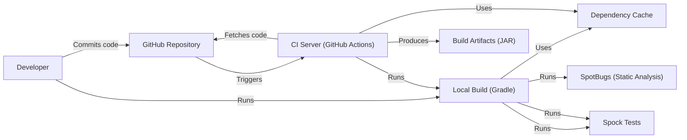

Okay, let's create a design document for the Spock Framework, focusing on aspects relevant to threat modeling.

# BUSINESS POSTURE

Spock is a testing and specification framework for Java and Groovy applications.  It's an open-source project, aiming to provide a more expressive and readable way to write tests compared to traditional JUnit.

Priorities and Goals:

*   Enable developers to write clear, concise, and maintainable tests.
*   Improve the overall quality and reliability of software projects.
*   Provide a powerful and flexible testing framework that can be easily adopted.
*   Foster a strong community around the framework.
*   Reduce the effort and time required for testing.

Business Risks:

*   Vulnerabilities within Spock itself could lead to incorrect test results, masking real bugs in the applications being tested. This is a *critical* risk.  False negatives (tests passing when they should fail) are particularly dangerous.
*   Compatibility issues with different Java/Groovy versions or build tools could hinder adoption and create frustration for users.
*   Lack of maintenance or slow response to reported issues could damage the project's reputation and lead to users switching to alternatives.
*   Security vulnerabilities in Spock's dependencies could be inherited, potentially impacting the security of build processes.
*   If Spock is used to test security-sensitive features (e.g., authentication, authorization), flaws in Spock could lead to inadequate testing of those critical components.

# SECURITY POSTURE

Existing Security Controls:

*   security control: Code Reviews: The GitHub repository shows evidence of a pull request-based workflow, suggesting that code reviews are likely part of the development process. (Implicit in the GitHub workflow).
*   security control: Issue Tracking:  The project uses GitHub Issues for tracking bugs and feature requests, which includes security vulnerabilities. (Visible on the GitHub repository).
*   security control: Testing: Spock is, by its nature, a testing framework.  It's highly likely that Spock itself is extensively tested using Spock (self-testing). This helps ensure the framework's own reliability. (Inherent to the project's purpose).
*   security control: Dependency Management: The project uses Gradle for dependency management (build.gradle file).
*   security control: Static Analysis: The project uses SpotBugs for static analysis (build.gradle file).

Accepted Risks:

*   accepted risk: Reliance on community contributions for security fixes. While beneficial, this can introduce delays and inconsistencies in addressing vulnerabilities.
*   accepted risk: Potential for undiscovered vulnerabilities in Spock's core logic, leading to false negatives in tests.
*   accepted risk: The framework's expressive power, if misused, could lead to overly complex or brittle tests that are difficult to maintain and understand.

Recommended Security Controls:

*   security control: Regular Security Audits: Conduct periodic security audits of the Spock codebase, focusing on areas that could impact test reliability and security.
*   security control: Fuzz Testing: Implement fuzz testing to identify unexpected behavior and potential vulnerabilities in Spock's parsing and execution of test specifications.
*   security control: Dependency Scanning: Integrate automated dependency scanning tools (e.g., Dependabot, Snyk) to identify and address known vulnerabilities in Spock's dependencies.
*   security control: Security Training: Provide security training to core contributors, emphasizing secure coding practices and the importance of test reliability.
*   security control: SBOM: Create and maintain a Software Bill of Materials (SBOM) to track all components and dependencies.

Security Requirements:

*   Authentication: Not directly applicable to Spock itself, as it's a testing framework, not an application with user accounts. However, Spock might be used to *test* authentication mechanisms in other applications.
*   Authorization:  Similar to authentication, Spock itself doesn't have authorization requirements.  It's used to *test* authorization logic in other systems.
*   Input Validation: Spock needs to handle various inputs (test specifications, data tables, mock configurations) correctly.  Robust input validation is crucial to prevent unexpected behavior and potential vulnerabilities within the framework itself.  This includes handling malformed or malicious test inputs.
*   Cryptography: Spock doesn't directly handle cryptographic operations itself. However, it should be able to test applications that *do* use cryptography, and those tests should be reliable.

# DESIGN

## C4 CONTEXT

Element Descriptions:

*   Element:
    *   Name: Developer
    *   Type: Person
    *   Description: A software developer who writes and runs tests using the Spock Framework.
    *   Responsibilities: Writing Spock specifications, configuring the build system, running tests, and analyzing results.
    *   Security controls: N/A (External to Spock)

*   Element:
    *   Name: Spock Framework
    *   Type: Software System
    *   Description: The core testing and specification framework.
    *   Responsibilities: Parsing Spock specifications, executing tests, reporting results, managing mocks and stubs.
    *   Security controls: Input validation, dependency management, static analysis.

*   Element:
    *   Name: Java/Groovy Application
    *   Type: Software System
    *   Description: The application being tested using Spock.
    *   Responsibilities: The business logic of the application.
    *   Security controls: Dependent on the specific application.

*   Element:
    *   Name: JUnit Platform
    *   Type: Software System
    *   Description: The underlying platform that Spock uses for test execution.
    *   Responsibilities: Providing the basic infrastructure for running tests.
    *   Security controls: Managed by the JUnit project.

*   Element:
    *   Name: IDE (e.g., IntelliJ, Eclipse)
    *   Type: Software System
    *   Description: Integrated Development Environment used by the developer.
    *   Responsibilities: Providing a user interface for writing, running, and debugging tests.
    *   Security controls: Managed by the IDE vendor.

*   Element:
    *   Name: Build Tool (Gradle, Maven)
    *   Type: Software System
    *   Description: Tool used to manage dependencies, build the project, and run tests.
    *   Responsibilities: Compiling code, resolving dependencies, executing tests.
    *   Security controls: Managed by the build tool project (and user configuration).

## C4 CONTAINER

Element Descriptions:

*   Element:
    *   Name: Developer
    *   Type: Person
    *   Description: A software developer.
    *   Responsibilities: Writing Spock specifications.
    *   Security controls: N/A

*   Element:
    *   Name: Spock Framework
    *   Type: Software System
    *   Description: The overall Spock framework.
    *   Responsibilities: Providing the testing DSL and infrastructure.
    *   Security controls: Input validation, dependency management.

*   Element:
    *   Name: Specification Runner
    *   Type: Container
    *   Description: The core component that parses and executes Spock specifications.
    *   Responsibilities: Parsing specifications, managing the test lifecycle, reporting results.
    *   Security controls: Input validation (of specification syntax).

*   Element:
    *   Name: Fixture Methods
    *   Type: Container
    *   Description: Handles setup, cleanup, and helper methods within tests.
    *   Responsibilities: Executing code before/after tests or test blocks.
    *   Security controls: Relies on secure coding practices within the fixture methods themselves.

*   Element:
    *   Name: Data Driven Testing
    *   Type: Container
    *   Description: Supports data-driven testing features (e.g., data tables, data pipes).
    *   Responsibilities: Handling data inputs for parameterized tests.
    *   Security controls: Input validation of data values.

*   Element:
    *   Name: Mocking/Stubbing
    *   Type: Container
    *   Description: Provides functionality for creating and managing mocks and stubs.
    *   Responsibilities: Intercepting calls to dependencies, providing controlled responses.
    *   Security controls: Ensuring mock configurations are correctly applied.

*   Element:
    *   Name: Extensions
    *   Type: Container
    *   Description: Allows extending Spock's functionality with custom logic.
    *   Responsibilities: Providing hooks for custom behavior.
    *   Security controls: Relies on the security of the individual extensions.

*   Element:
    *   Name: JUnit Platform
    *   Type: Software System
    *   Description: Underlying test execution platform.
    *   Responsibilities: Test execution.
    *   Security controls: Managed by JUnit.

*   Element:
    *   Name: Java/Groovy Application
    *   Type: Software System
    *   Description: Application under test.
    *   Responsibilities: Business logic.
    *   Security controls: Application-specific.

## DEPLOYMENT

Possible Deployment Solutions:

1.  **Local Development:** Developers typically use Spock locally within their development environment.
2.  **CI/CD Pipeline:** Spock is integrated into CI/CD pipelines to automatically run tests as part of the build process.
3.  **Testing Environments:** Spock can be used in various testing environments (e.g., staging, pre-production) to validate deployments.

Chosen Solution (CI/CD Pipeline):

Element Descriptions:

*   Element:
    *   Name: GitHub Repository
    *   Type: Infrastructure Node
    *   Description: Source code repository.
    *   Responsibilities: Storing code, triggering builds.
    *   Security controls: Access controls, branch protection rules.

*   Element:
    *   Name: CI Server (e.g., Jenkins, GitHub Actions)
    *   Type: Infrastructure Node
    *   Description: Continuous Integration server.
    *   Responsibilities: Building the application, running tests, deploying artifacts.
    *   Security controls: Authentication, authorization, secure configuration.

*   Element:
    *   Name: Build Artifacts (JAR files)
    *   Type: Artifact
    *   Description: The compiled application code.
    *   Responsibilities: N/A
    *   Security controls: Integrity checks (e.g., checksums).

*   Element:
    *   Name: Test Environment (e.g., Docker container)
    *   Type: Infrastructure Node
    *   Description: The environment where tests are executed.
    *   Responsibilities: Providing a clean and isolated environment for testing.
    *   Security controls: Isolation, network security, resource limits.

*   Element:
    *   Name: Test Results (Reports)
    *   Type: Artifact
    *   Description: The output of the test execution.
    *   Responsibilities: N/A
    *   Security controls: Access controls (if stored).

## BUILD

Build Process Description:

1.  **Local Development:** Developers use Gradle locally to build the project, run tests, and manage dependencies.
2.  **Continuous Integration:**  The Spock project uses GitHub Actions as its CI server.
    *   When code is pushed to the GitHub repository, GitHub Actions triggers a workflow.
    *   The workflow checks out the code, sets up the Java environment, and resolves dependencies (using Gradle and a dependency cache).
    *   Gradle is used to build the project.
    *   SpotBugs is executed to perform static analysis.
    *   Spock tests are executed as part of the Gradle build.
    *   If all steps are successful, build artifacts (JAR files) are produced.

Security Controls:

*   security control: Dependency Management: Gradle is used to manage dependencies, ensuring that specific versions are used.
*   security control: Dependency Caching: A dependency cache is used to speed up builds and reduce reliance on external repositories.
*   security control: Static Analysis: SpotBugs is integrated into the build process to identify potential code quality and security issues.
*   security control: Automated Testing: Spock tests are run automatically as part of the build, ensuring that changes don't introduce regressions.
*   security control: CI/CD Pipeline: GitHub Actions provides a secure and automated build environment.

# RISK ASSESSMENT

Critical Business Processes:

*   **Software Testing:** The primary business process is providing a reliable and accurate testing framework.  Failures in Spock directly impact the ability to effectively test software.
*   **Software Development:** Spock is a tool used within the software development lifecycle.  Its reliability is crucial for the overall quality of software projects.

Data:

*   **Test Specifications (Source Code):**  These are written by developers and are not inherently sensitive. However, they *could* contain sensitive information (e.g., hardcoded credentials, API keys) if developers make mistakes. This is a risk related to the *use* of Spock, not Spock itself.
*   **Test Data:**  Similar to test specifications, test data is provided by developers.  It *could* be sensitive, depending on the application being tested.
*   **Test Results:**  Test results themselves are generally not sensitive, but they could reveal information about vulnerabilities in the application being tested.
*   **Spock Framework Code:** The source code of Spock itself is not sensitive (it's open source), but its integrity is *critical*.

Data Sensitivity:

*   Test specifications and data:  Variable, depending on the application.  Potentially high if misused.
*   Test results:  Low to medium, depending on the application and the nature of the tests.
*   Spock framework code:  Critical (integrity).

# QUESTIONS & ASSUMPTIONS

Questions:

*   Are there any specific compliance requirements (e.g., industry regulations) that Spock needs to be aware of, even indirectly?
*   What is the process for handling security vulnerability reports from external researchers?
*   Are there any plans to add features that might introduce new security considerations (e.g., remote test execution)?
*   What level of support is provided for older versions of Java and Groovy?
*   How are extensions to Spock vetted for security?

Assumptions:

*   BUSINESS POSTURE: The Spock project prioritizes the correctness and reliability of test results above all else.
*   BUSINESS POSTURE: The project relies heavily on community contributions and open-source principles.
*   SECURITY POSTURE: Developers using Spock are responsible for the security of their own applications and test data.
*   SECURITY POSTURE: The JUnit Platform, which Spock relies on, is considered secure.
*   DESIGN: The build process is automated and consistent across different environments.
*   DESIGN: The core contributors to Spock have a good understanding of secure coding practices.
*   DESIGN: The project will continue to evolve and adapt to new versions of Java, Groovy, and related tools.