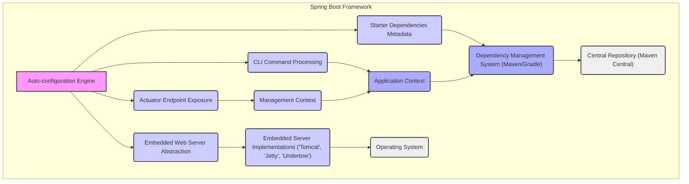
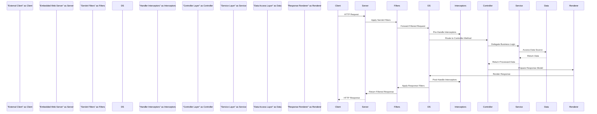

# Project Design Document: Spring Boot Framework

**Version:** 1.1
**Date:** October 26, 2023
**Author:** AI Software Architect

## 1. Introduction

This document provides a detailed architectural design of the Spring Boot framework, focusing on aspects relevant to security considerations and threat modeling. It outlines the key components, their interactions, and the overall structure of the project. This document serves as a foundation for identifying potential security vulnerabilities within the framework itself. It concentrates on the core framework and its inherent functionalities, not on specific applications built using Spring Boot.

## 2. Goals and Objectives

The primary goals of the Spring Boot project are:

*   To significantly simplify the initial setup and ongoing development of standalone, production-ready Spring-based applications.
*   To enforce sensible default configurations and promote convention over configuration, accelerating the development process.
*   To seamlessly integrate and manage embedded web servers (primarily Tomcat, Jetty, and Undertow), removing the need for separate server deployments and configurations.
*   To offer curated and opinionated "Starter" dependencies, streamlining project setup and ensuring compatibility between related libraries.
*   To provide built-in production-ready features, such as comprehensive health checks, detailed metrics, and robust externalized configuration management.

This design document aims to meticulously capture the architectural elements that contribute to these goals, with a strong emphasis on aspects that have implications for security.

## 3. Scope

This document comprehensively covers the core architectural components and functionalities of the Spring Boot framework as represented in the provided GitHub repository. It includes:

*   The intelligent auto-configuration mechanism and its decision-making processes.
*   The structure and purpose of starter dependencies and their impact on the application classpath.
*   The integration and management of embedded web servers, including their lifecycle and configuration.
*   The architecture and functionality of the Spring Boot Actuator endpoints and their security implications.
*   The purpose and capabilities of the Spring Boot Command Line Interface (CLI).
*   The underlying structure and key abstractions of the core Spring Framework as they are utilized by Spring Boot.

This document explicitly excludes:

*   The design and architecture of specific applications built utilizing the Spring Boot framework.
*   The detailed implementation of third-party libraries and frameworks integrated by applications (unless they are integral parts of core Spring Boot starters).
*   The intricate internal implementation details of the underlying Spring Framework, unless directly relevant to understanding Spring Boot's architecture and security boundaries.

## 4. Detailed Architecture and Components

The Spring Boot framework employs a layered architecture, extending and simplifying the core Spring Framework. Key components work together to provide its core functionalities.

### 4.1. Component Breakdown

*   **Auto-configuration Engine:** The core of Spring Boot's ease of use. It inspects the classpath, available beans, and various configuration properties to automatically configure the Spring Application Context. This includes setting up data sources, message brokers, web servers, and more. *Security Relevance:* Incorrect or unintended auto-configuration can lead to security vulnerabilities by exposing sensitive endpoints or misconfiguring security features.
*   **Starter Dependencies Metadata:**  Spring Boot Starters are essentially curated lists of dependencies. The metadata associated with these starters guides the auto-configuration engine. *Security Relevance:* Vulnerabilities in dependencies brought in by starters can directly impact the security of applications.
*   **Embedded Web Server Abstraction:** Spring Boot provides an abstraction layer over embedded web servers. This allows developers to switch between Tomcat, Jetty, or Undertow with minimal code changes. *Security Relevance:* The security of the chosen embedded server is paramount. Default configurations and update mechanisms are critical.
*   **Embedded Server Implementations ('Tomcat', 'Jetty', 'Undertow'):** These are the actual web server implementations bundled within the Spring Boot application. *Security Relevance:* Each server has its own set of potential vulnerabilities and configuration options that need careful consideration.
*   **Actuator Endpoint Exposure:** Spring Boot Actuator exposes operational information about the running application through HTTP endpoints or JMX. This includes health checks, metrics, environment details, and more. *Security Relevance:* These endpoints can reveal sensitive information and provide attack vectors if not properly secured with authentication and authorization.
*   **Management Context:**  A specialized Spring context that manages the Actuator endpoints and related management functionalities. *Security Relevance:* The security of the management context directly impacts the security of the exposed Actuator endpoints.
*   **CLI Command Processing:** The Spring Boot CLI allows developers to quickly bootstrap and prototype Spring Boot applications. It processes commands and interacts with the underlying framework. *Security Relevance:* If used in production or with untrusted input, the CLI could pose security risks.
*   **Application Context:** The core Spring Framework's `ApplicationContext`, managed and configured by Spring Boot. It contains all the application's beans and their dependencies. *Security Relevance:* The security of the application context relies on proper configuration and secure coding practices within the application.
*   **Dependency Management System (Maven/Gradle):** Spring Boot relies on build tools like Maven or Gradle to manage dependencies, including the starter dependencies. *Security Relevance:* The integrity of the dependency management process is crucial to prevent the introduction of malicious dependencies.
*   **Central Repository (Maven Central):** The primary repository from which Maven and Gradle download dependencies. *Security Relevance:*  Compromise of central repositories could lead to supply chain attacks.
*   **Operating System:** The underlying operating system on which the Spring Boot application runs. *Security Relevance:* The security of the OS directly impacts the security of the application.

## 5. Detailed Data Flow

The data flow within a Spring Boot application, while adhering to the Spring MVC pattern, is streamlined by Spring Boot's auto-configuration.

*   An **External Client** initiates an interaction by sending an HTTP request.
*   The **Embedded Web Server** receives the incoming request.
*   **Servlet Filters** (configured by Spring Boot or the application) process the request, potentially performing actions like authentication, authorization, or logging. *Security Relevance:* Properly configured filters are crucial for enforcing security policies.
*   The **DispatcherServlet**, the front controller in Spring MVC, receives the filtered request.
*   **Handler Interceptors** (configured by the application) can intercept the request before and after it reaches the controller. *Security Relevance:* Interceptors can be used for security checks, logging, and modifying requests/responses.
*   The **Controller Layer** handles the request based on the defined routes. *Security Relevance:* Input validation and proper handling of user input are critical in the controller layer to prevent vulnerabilities.
*   The **Service Layer** encapsulates the application's business logic. *Security Relevance:* Secure coding practices within the service layer are essential to prevent logical flaws and data manipulation vulnerabilities.
*   The **Data Access Layer** interacts with data sources (databases, APIs, etc.). *Security Relevance:* Secure database access practices, such as parameterized queries, are crucial to prevent SQL injection and other data-related vulnerabilities.
*   The **Response Renderer** (e.g., ViewResolver) prepares the response to be sent back to the client. *Security Relevance:* Proper encoding of output is necessary to prevent cross-site scripting (XSS) vulnerabilities.
*   The **DispatcherServlet** renders the response.
*   **Servlet Filters** can also process the outgoing response. *Security Relevance:* Response filters can add security headers or perform other post-processing tasks.
*   The **Embedded Web Server** sends the HTTP response back to the **External Client**.

## 6. External Interactions (Detailed)

Spring Boot applications interact with a variety of external systems, each presenting potential security considerations.

*   **Databases (e.g., PostgreSQL, MySQL, MongoDB):** Spring Data JPA or other data access technologies facilitate interaction. *Security Relevance:* Connection string management, authentication, authorization, and protection against SQL/NoSQL injection are critical.
*   **Message Queues (e.g., RabbitMQ, Kafka):** Spring AMQP or Spring for Apache Kafka enable asynchronous communication. *Security Relevance:* Secure connection configuration, message encryption, and access control to queues are important.
*   **External APIs (REST, SOAP):**  `RestTemplate` or `WebClient` are used for consuming external services. *Security Relevance:* Secure communication protocols (HTTPS), API key management, and validation of external responses are necessary.
*   **Identity Providers (IdPs) (e.g., OAuth 2.0 providers, SAML providers):** Spring Security often integrates with IdPs for authentication and authorization. *Security Relevance:* Secure configuration of authentication flows, token validation, and protection against common authentication vulnerabilities are crucial.
*   **Cloud Platforms (e.g., AWS, Azure, GCP):** Spring Cloud provides integrations for cloud services. *Security Relevance:* Secure management of cloud credentials, proper IAM configurations, and understanding the security models of cloud services are essential.
*   **Monitoring and Logging Systems (e.g., Prometheus, Grafana, ELK stack):** Actuator and other logging frameworks send data to these systems. *Security Relevance:* Secure transmission of sensitive data (metrics, logs), access control to monitoring dashboards, and prevention of log injection attacks are important.
*   **Configuration Servers (e.g., Spring Cloud Config Server):** Externalized configuration can be fetched from these servers. *Security Relevance:* Secure communication with the configuration server and protection of sensitive configuration data are vital.

## 7. Security Considerations (In-Depth)

This section provides a more detailed look at potential security concerns within the Spring Boot framework itself.

*   **Dependency Management and Supply Chain Security:**
    *   **Risk:** Vulnerabilities in transitive dependencies introduced by starter dependencies. Malicious dependencies could be introduced if the build process is compromised.
    *   **Mitigation:** Employ dependency scanning tools, regularly update dependencies, use dependency management features to restrict versions, and consider using a private artifact repository.
*   **Auto-configuration Security Implications:**
    *   **Risk:** Unintended or overly permissive auto-configuration can expose sensitive endpoints or disable security features by default.
    *   **Mitigation:** Thoroughly understand the default auto-configurations, use Spring Boot's configuration properties to override defaults securely, and regularly review the application's effective configuration.
*   **Embedded Web Server Security:**
    *   **Risk:** Default configurations of embedded servers might not be secure. Outdated server versions can contain known vulnerabilities.
    *   **Mitigation:** Keep embedded server dependencies updated, configure security-related settings (e.g., HTTPS, security headers), and consider using a reverse proxy for enhanced security.
*   **Spring Boot Actuator Security:**
    *   **Risk:** Actuator endpoints expose sensitive information and management capabilities if not properly secured.
    *   **Mitigation:** Implement authentication and authorization for Actuator endpoints using Spring Security. Consider network segmentation to restrict access. Disable or remap sensitive endpoints in production.
*   **Spring Boot CLI Security:**
    *   **Risk:** If used in production environments or with untrusted input, the CLI could be exploited.
    *   **Mitigation:** Avoid using the CLI in production. If necessary, restrict access and carefully sanitize any input.
*   **Externalized Configuration Security:**
    *   **Risk:** Sensitive configuration data (e.g., database credentials, API keys) could be exposed if not handled securely.
    *   **Mitigation:** Use secure methods for storing and retrieving externalized configuration (e.g., encrypted configuration files, secrets management services). Avoid storing sensitive information in plain text in environment variables.
*   **Logging Security:**
    *   **Risk:** Default logging configurations might inadvertently log sensitive information. Log injection attacks are possible if user input is directly included in logs.
    *   **Mitigation:** Review logging configurations to ensure sensitive data is not logged. Sanitize user input before logging. Implement proper log rotation and access controls.
*   **Security Defaults and Best Practices:**
    *   **Risk:** Developers might rely on default settings without fully understanding their security implications.
    *   **Mitigation:** Promote awareness of Spring Boot's security features and best practices. Encourage the use of Spring Security for authentication and authorization.

## 8. Future Considerations

This design document will be continuously updated to reflect changes and enhancements in the Spring Boot framework. Future iterations may include:

*   More detailed sequence diagrams for specific use cases, highlighting security checkpoints.
*   Inclusion of diagrams illustrating the internal architecture of key components like the Auto-configuration engine and Actuator.
*   A more detailed analysis of the build and release pipeline from a security perspective, including signing and verification of artifacts.
*   Mapping of potential threats to specific components and data flows to facilitate targeted threat modeling exercises.

This document provides a comprehensive foundation for understanding the architecture of the Spring Boot framework and identifying potential security considerations. It serves as a crucial input for subsequent threat modeling activities.
